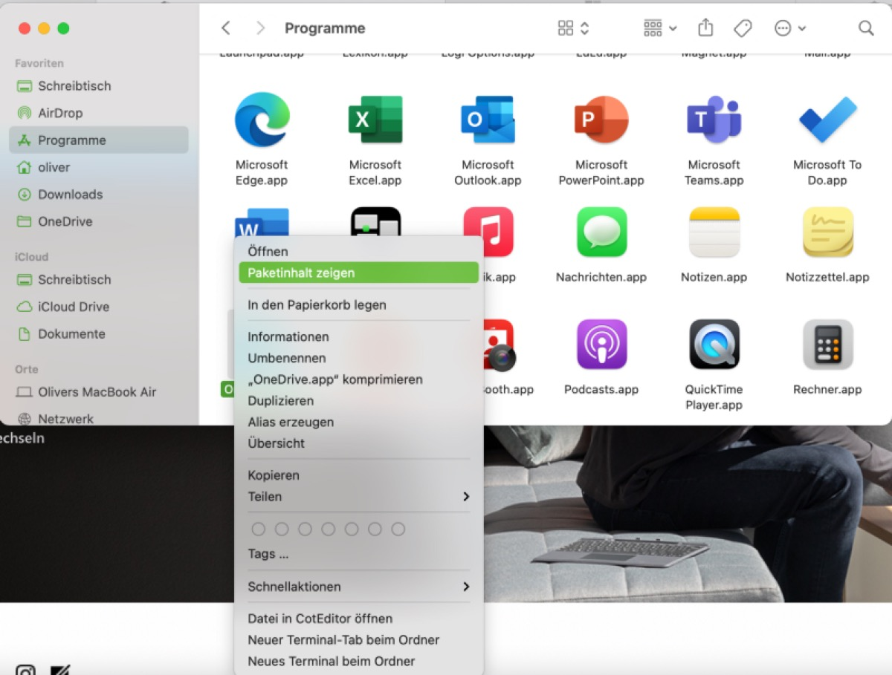
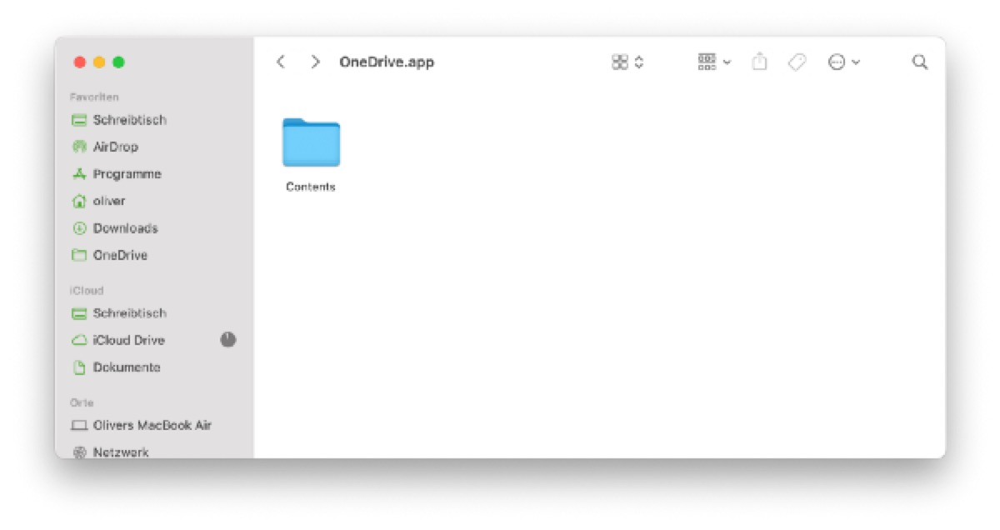
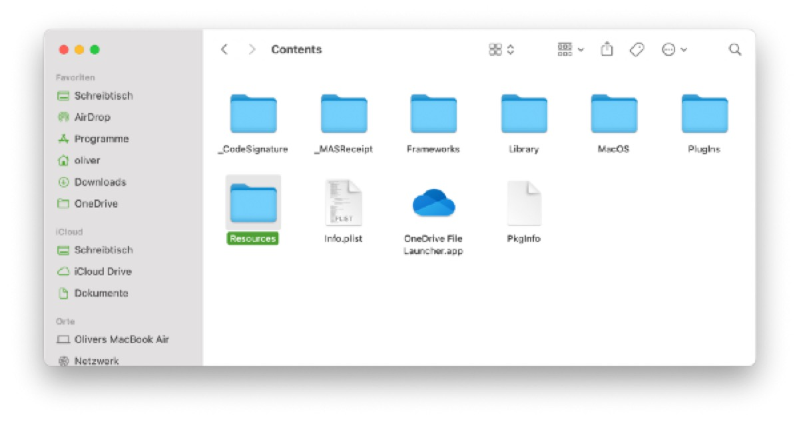
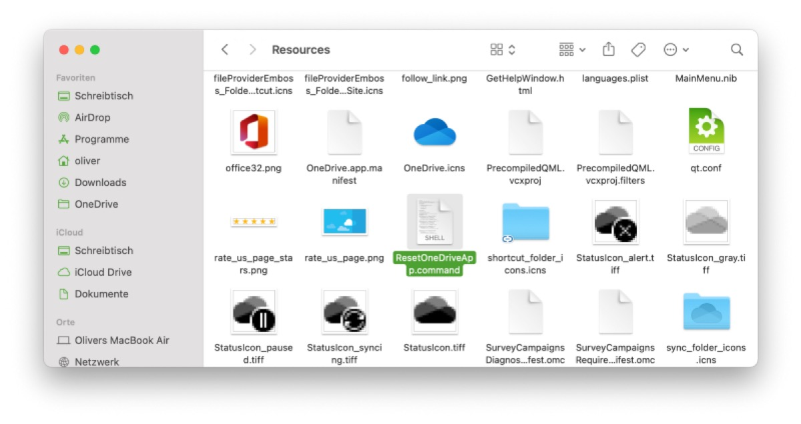
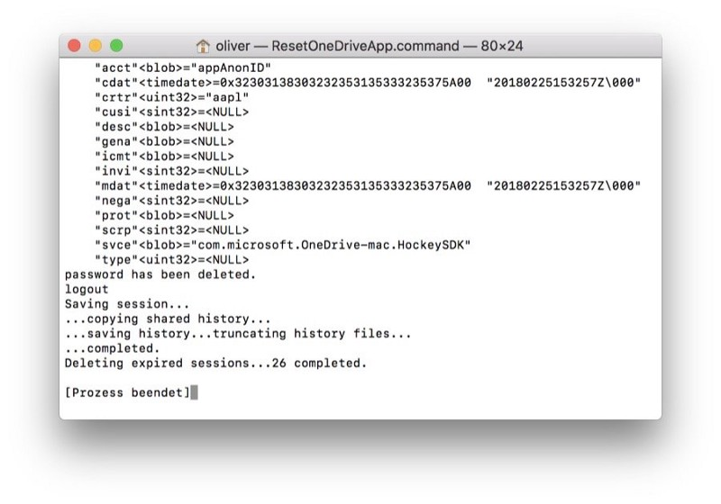

## Microsoft’s OneDrive-client for macOS has matured over time and although it’s quite stable at the moment (even if still missing native Apple Silicon-support) you might run into synchronization issues.

Let me make the statement that using OneDrive on macOS has been a journey so far. Although it never felt that much integrated into macOS like into Windows (neither does iCloud on Windows 10 by the way!), the client’s stability has risen over time while the problems with synchronization issues decreased simultaneously. Currently, I enjoy using it either with a Microsoft 365 Family- or my current Microsoft 365 Business Premium-plan, but there were times where syncing with macOS just stopped working.

No workarounds helped — signing off the account, re-connecting it again, deleting the OneDrive-app and even searching for specific .plist-settings or using apps like [AppCleaner](https://freemacsoft.net/appcleaner) to get this done for you: Once OneDrive decided to stop working for whatever reason, the delight on using one of the best Cloud-services is definitely tempered without a glimpse of hope — embodied with a gray OneDrive-symbol in macOS’ menu bar.

### A solution

While there is not much evidence how this may happen (and even using the same address for a private and business Microsoft 365-account was no indicator), venturing through the [German FAQ](https://support.microsoft.com/de-de/office/onedrive-f%C3%BCr-mac-%E2%80%93-h%C3%A4ufig-gestellte-fragen-faq-3fc4062c-8051-4392-bff1-551e32840cd0?ui=de-de&rs=de-de&ad=de&ref=pifferi.synology.me) finally showed a solution attempt how to completely and (!) officially (!!) reset the OneDrive-app. Once you know how to achieve this, it’s as simple as that — first of all, close the Mal-functioning OneDrive-app:

Then, navigate to your „Applications“-folder where the app resides, right-click it and choose „Show Package Contents“ (don’t let me confuse you by showing my German macOS-screenshots here):

Afterwards, enter the folder „Contents“ and into the subfolder „Resources“ residing therein.

You will find a file entitled „ResetOneDriveApp.command“ there once you have installed OneDrive via Apple’s App Store. Otherwise — and if you have grabbed the OneDrive-client from Microsoft’s [official download location](https://www.microsoft.com/en-us/microsoft-365/onedrive/download), the file you need will be named „ResetOneDriveAppStandalone.command“.

You may guess what comes next now — double-clicking the specific file, a shell script will be visible, running in a terminal window. Shortly afterwards, the last line being showed should tell you that the process has been ended — you may exit the terminal window now. That’s it!

After re-opening the OneDrive-app (and possibly deleting or renaming your existing OneDrive-folder, depending on your specific situation) you may start over and do the initial configuration of your OneDrive-client on macOS without any hassle — enjoy!