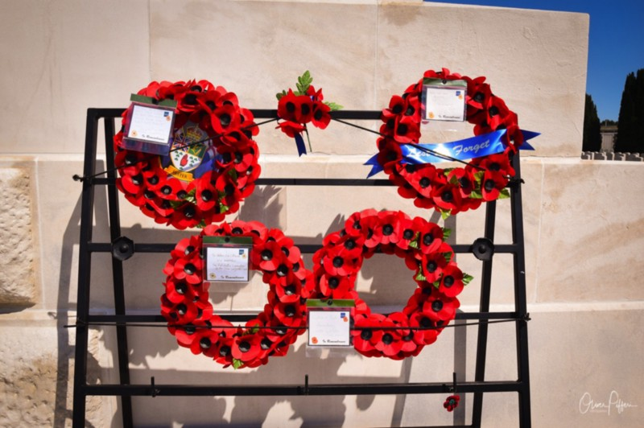

## As I ventured to West-Flanders in Belgium this year - just as we did in the last years - I hadn’t anything specific in mind regarding any historical topic.

But as the master of your puppet-life is pulling strings, coincidence struck hard: First, the Swedish band Sabaton released their new album „The Great War“ on July 19th dealing with - you may have guessed it - World War I. Second, I saw a parade of a local Harley Davidson-MC which was named „Flanders Fields“.

As we were spending our family holiday in Flanders, I researched a bit and was rather attracted into the world of The Great War than into facts about the MC I usually searched for. So the idea of pursuing facts and sites related to The Great War in Flanders was born by pure coincidence: In fact I was always interested in the events and atrocities of both World Wars. Anyway, I never thought that some free time in these holidays would be used to follow the path of many brave men that used to pay the highest price ever: Their lifes.

So it came that I stumbled on John Mc Rae’s famous poem „In Flanders Fields“ which has been written on May 3rd, 1915. The piece of  is probably the best description of the disastrous events in Flanders. Lieutenant Colonel John Alexander McCrae wrote it as he was touched by the death of one of his friends which fell in the Great War. Shortly after the funeral which was held my McCrae himself he spotted red poppies blossoming on the new grave and so the story of the „Flanders Poppy“ was born.

> „In Flanders fields the poppies blow
>
> Between the crosses, row on row,
>
> That mark our place; and in the sky
>
> The larks, still bravely singing, fly
>
> Scarce heard amid the guns below.

> We are the dead. Short days ago
>
> We lived, felt dawn, saw sunset glow,
>
> Loved, and were loved, and now we lie
>
> In Flanders fields.

> Take up our quarrel with the foe:
>
> To you from failing hands we throw
>
> The torch; be yours to hold it high.
>
> If ye break faith with us who die
>
> We shall not sleep, though poppies grow
>
> In Flanders fields.“

It is told that no description has fitted better on the situation in these days - days without hope, accompanied by steady gunfire, explosions and death. Each line of the poem reminds us on the courage and deprivations those brave men once endured. So my story of „Flanders Fields“ began thanks to a music album and a motorcycle club I was both interested in - and helped me to open yet another door in my hobby-historian and freetime-photographer mind.

I hereby invite you to join this blog which will always try to mix up history and the touch of a travel-blog paired with photography like many others do all over the World Wide Web. This is my contribution to photographical art and history as we still should try to learn especially from the second of both aspects - although mankind often seem to forget that history is not gone yet. Time has passed, but still history repeats itself and its events re-occur again - we just have to open our eyes to understand this… !