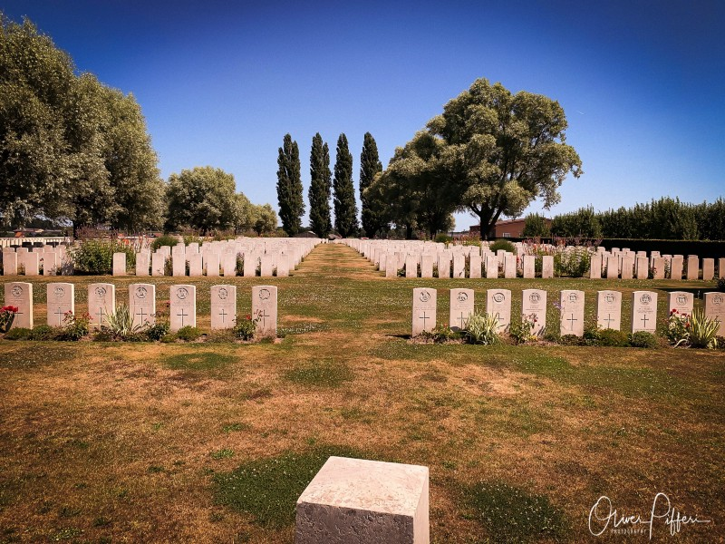
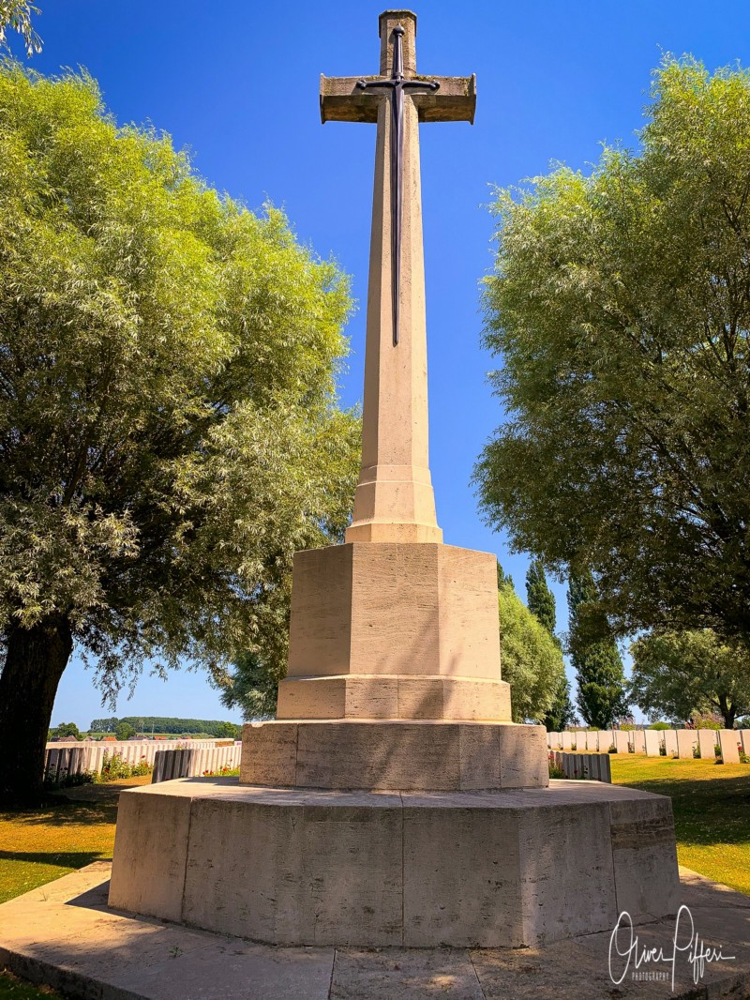
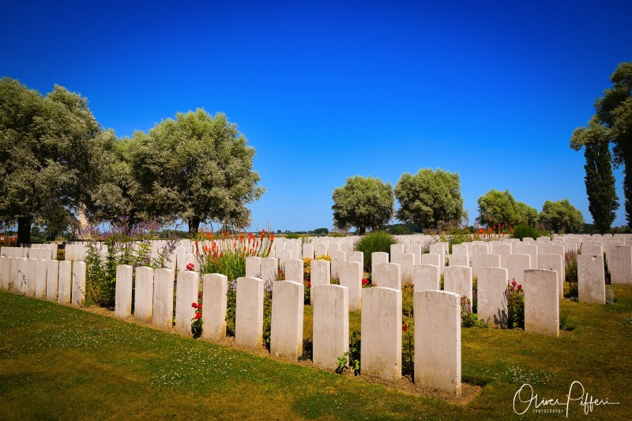

## The first part of my trip in pursue of WW1-heritage sites lead me to Ypres (French version) or Ieper in local tongue in West-Flanders.

Besides itself, Ieper is also comprising the villages of Boezinge, Brielen, Dikkebus, Elverdinge, Hollebeke, Sint-Jan, Vlamertinge, Voormezele, Zillebeke, and Zuidschote. Many of those places are home for memorial sites remaining on the „The Battle of Ypres“. This battle was a series of five engagements during the First World War with hundreds of thousands of casualties. One of those memorial sites is Perth Commonwealth War Graves Commission Cemetery.

The cemetery was begun in 1914 by French troops and adopted by the 2nd Scottish Rifles in June 1917. Being a front line cemetery, it was called Perth (as the predecessors of the 2nd Scottish Rifles were raised in Perth), China Wall (from the communication trench known as the Great Wall of China), or Halfway House Cemetery and was in use until October 1917.

At the time of the armistice, it was a small cemetery of about 130 graves and was expanded dramatically by concentration of graves from smaller cemeteries. The French element was also expanded, although these 158 graves have been removed entirely in the meantime.

The cemetery was designed by Sir Edwin Lutyens and is one of the many sites maintained by the The Commonwealth War Graves Commission (CWGC). This organization honours the 1,7 million men and women of the Commonwealth forces who died in the First and Second World Wars and ensures they will never be forgotten. On Perth Commonwealth War Graves Commission Cemetery, the number of total burials is classified as 2791, most of them were soldiers from the United Kingdom.

Perth Commonwealth War Graves Commission Cemetery was the first chapter of my trip throughout Flanders Fields in the summer holidays of July 2019. It opened my personal door to the research of some events of The Great War and all of its atrocities. I came unprepared and wasn't ready for the impressions I saw there and I am sure you will share this experience once you make your way to one of the War Graves Commission-sites.