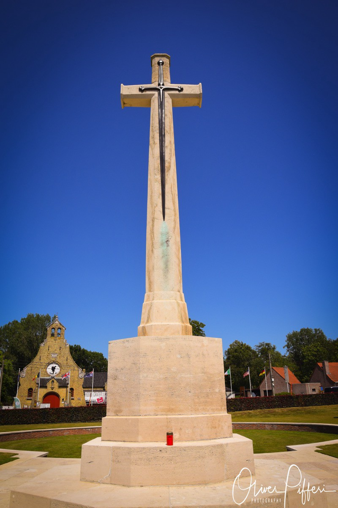
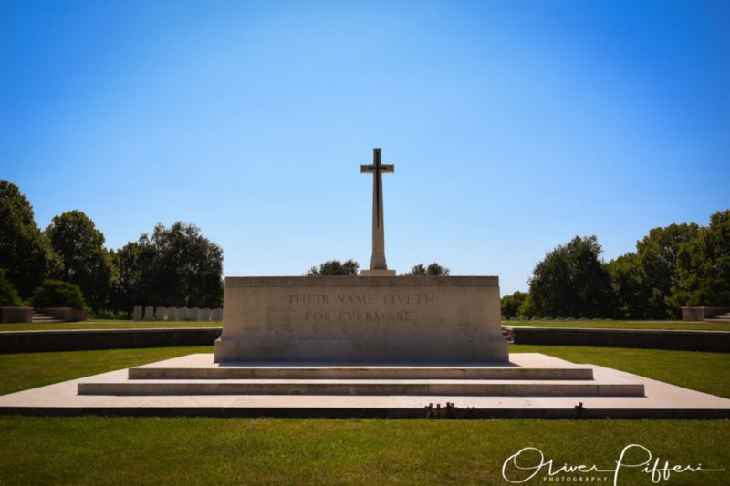
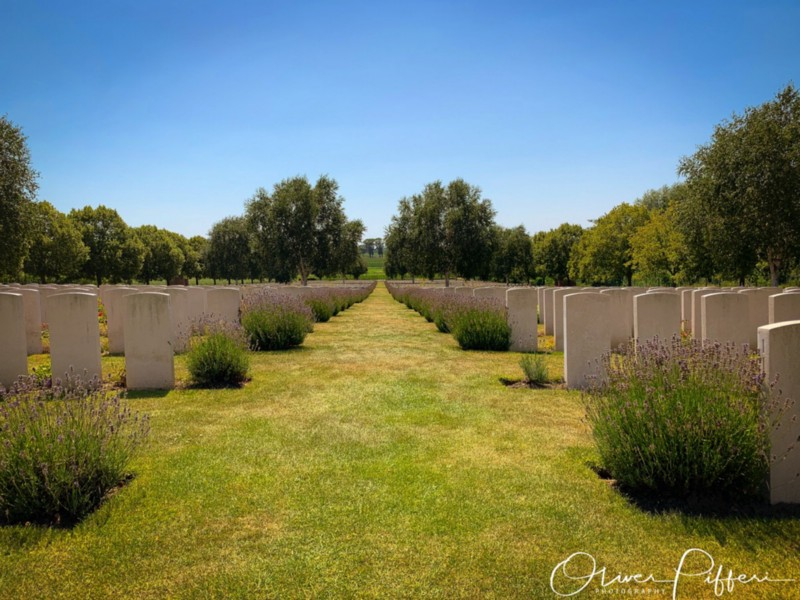
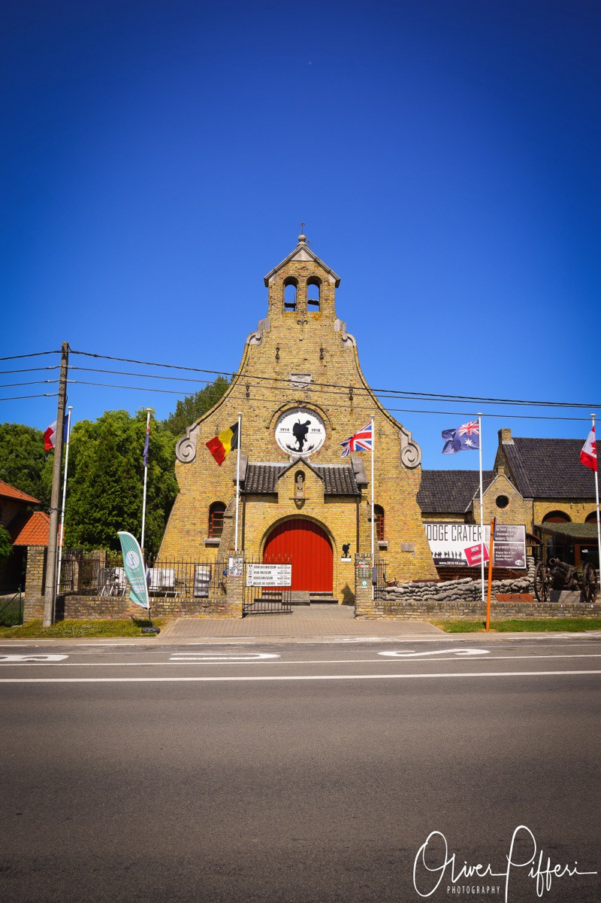

## There are better ideas than making a tour to some sites located outside with four children in the car. Fortunately, our Mercedes had good air conditioning which we excessively used during the one-hour drive to the area of Ieper.

Mentioning that girls at the age of twelve, nine, six and nearly three years aren’t that much interested in historical sightseeing, let me tell you that I lured them with a simple trick: As my wife was having a „bad-hair“-day (aka. headache) I decided to lure the kids with a pool afternoon after we have seen „some things“. They agreed but - except of our oldest daughter - preferred to stay in the car as long as the air condition was working. We already went to Perth Cemetery before so Hooge Crater Cemetery was next.

Worth mentioning is - by all means - that all those cemeterys and memorial sites in Belgium are located within areas of everyday’s life. What once was a devastated and destroyed territory is today the home for private houses and companies: Between them are those signs of remembrance that warn visitors and locals of the events once happened, a silent warning that peace is neither enduring nor natural. It’s quite hard to imagine what atrocities took place a century ago and although we all know the photos of those times, no one can prepare you for the impact these memorials and gravesites have on your soul.

Hooge Crater Cemetery is located four kilometers east of Ieper town centre on the Meenseweg (N8), connecting Ieper to Menen. From Ieper town centre, the Meenseweg is located via Torhoutstraat and right onto Basculestraat. Basculestraat ends at a main crossroads, directly over which begins the Meenseweg. The cemetery itself is located 3,5 kilometers along the Meenseweg on the right hand side of the road and while it already catches your eye, also the Hooge Crater Museum on the left side may do so as well. While I was already touched by the first impressions on Perth Cemetery before, this place intensified this cognition.

Hooge was the site of a château which was used by the British Army as the divisional headquarters for the area. Several senior British officers from the 1st and 2nd Divisions were killed when the Château de Hooge was shelled by German units on 31 October 1914. German forces attacked the château from 24 May 1915, and, despite the detonation of a mine by the 175th Tunnelling Company (operating with the 3rd Division) on 19 July 1915, leaving a massive crater, took control of the château and the surrounding area on 30 July.

This mine was only the second British offensive underground attack in the Ypres Salient; 173rd Tunnelling Company had blown five mines at Hill 60 on 17 April 1915, but none of these mines were even half as powerful as the Hooge charge. Following the detonation of the mine on 19 July 1915, the Château de Hooge and the craters (being strategically important in relatively flat countryside) were taken by the British 6th Division on 9 August. Later on, the Château de Hooge was completely destroyed along with the entire village (Source: Wikipedia).

Once you enter the front gate you are instantly caught by the clean and straight architecture flagged by the well-known Cross of Sacrifice which watches over the burial ground. Walking by, you have the chance of walking a straight way which is accompanied by thousands of graves on the left and right side. Seeing it from a specific point of view I had the impression that a single life, a walking person, between those brave men laid to rest here appears quite unfamiliar. Maybe this appeals because of the 1:X-ratio - one living among the dead - but trust me: Once you walk this line, it is hard to control your feelings and emotions. One single man which has just the chance to live amongst all those who paid the highest price for the freedom of their country, Belgium and finally the world. Hard to believe for the simple human brain - and there is no pity when you realize that tears are making its way, running down your cheeks…

This cemetery was designed by Sir Edwin Lutyens as well and is one of the many sites maintained by the The Commonwealth War Graves Commission (CWGC). This organization honours the 1,7 million men and women of the Commonwealth forces who died in the First and Second World Wars and ensures they will never be forgotten. On Hooge Crater Commonwealth War Graves Commission Cemetery Hooge Crater Commonwealth War Graves Commission Cemetery, the number of total burials is classified as 5924, among those are 3578 unknown burials - yet too many unknown soldiers of The Great War.

Hooge Crater Commonwealth War Graves Commission Cemetery was the second chapter of my trip throughout Flanders Fields in the summer holidays of July 2019. It fortified the touching impressions I already had from my first visit on Perth Cemetery and amplified those thoughts. While weather conditions were great, the sunny weather without any clouds and about 30 degrees Celsius unfortunately prevented my from staying longer but I am sure I will once return to this site - especially for a visit in the museum!