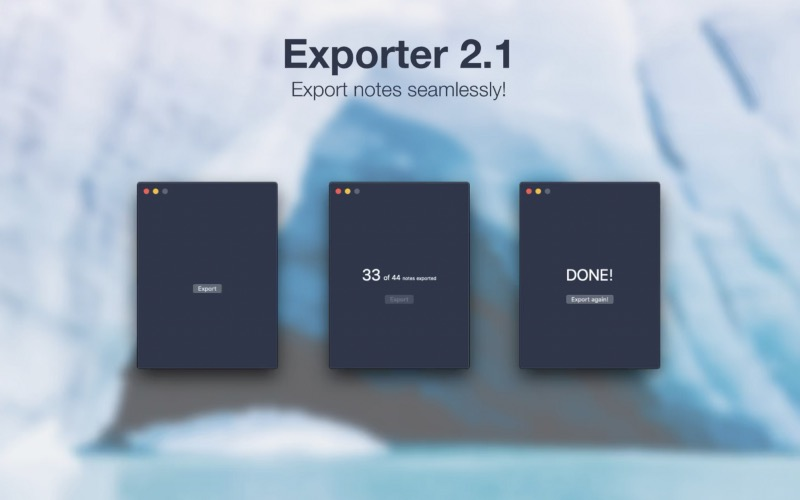

## There are plenty of useful tools around, helping to suit anyone’s needs. Over the time I discovered that — very often — the rather small apps have a big impact and can cover all the requirements.

One of those tools for Mac-users is Exporter by developer Chintan Ghate which does — you may have guessed it — an export. An export of your Apple Notes to straight Markdown-style for use with different tools supporting Markdown, to be more specific. The way to achieve this is quite easy — let me show you how!

First of all there is the — free! — app in Apple’s App Store you may need to [download](https://apps.apple.com/de/app/exporter/id1099120373?mt=12&). After installing and opening it for the first time, there aren’t much options to choose from.

Just click „Export“ and the app does its job, asking you where to save the notes and the attachments first.

Once this is done, Exporter will tell you that the job is done and you are ready to go with the saved contents, putting the .md-files into other solutions or doing whatever you want with them!

Sometimes it doesn’t need any kinds of big apps to accomplish quite a simple task many users may stumble upon. Of course you may do some Drag ´n Drop to get all your notes away from Apple Notes — or even Copy and Paste — but this way seems to be a lot more comfortable, so let’s give Exporter a chance!