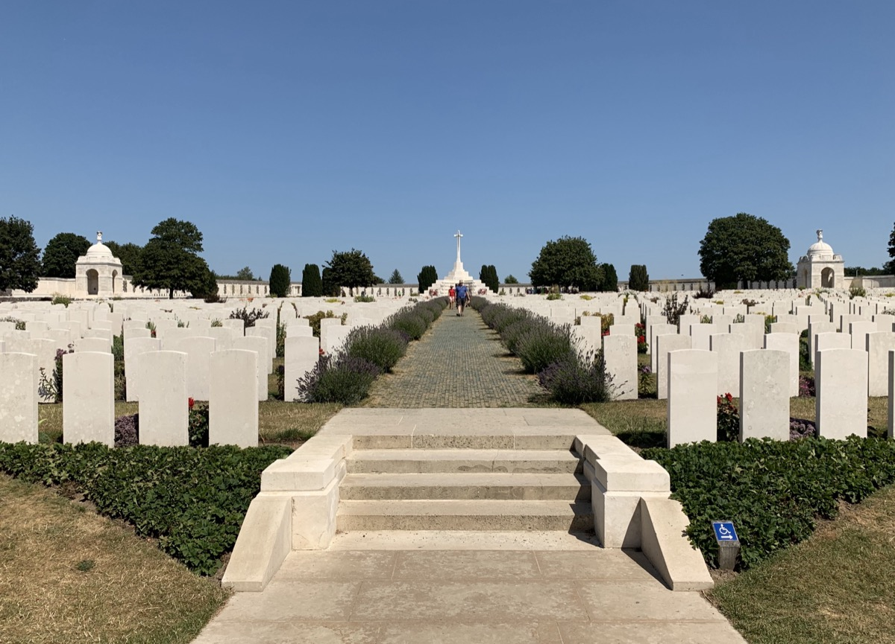

## On July 31st, 1917 - nearly 103 years ago - the Third Battle of Ypres, also known as the Battle of Passchendaele - took place on the Western Front.

It lasted three months, one week and three days and ended on November 10th, 1917 with the Canadian Corps capturing Passchendaele.⁣

⁣The number of casualties is named with 400.000 to 800.000 and still today, Paschendale (as the English version is pronounced) is a synonym for yet another senseless waste of lifes and resources without any markable wins on territory, the so-called "Verdun of Belgium".

The English poet-soldier Siegfried Sassoon wrote once: „I died in hell (They called it Passchendaele)” and so we can just assume what horrors happened there once.⁣

⁣Today we remember especially this battle and honour all those who paid the highest price for their country.⁣⁣ Let us learn from history and perpetuate the memory of all brave men who fought in this senseless war.

Lest we forget.

> ⁣⁣⁣⁣
> ⁣⁣„… Blood is falling like the rain⁣
>
> ⁣⁣⁣Its crimson cloak unveils again⁣
>
> ⁣⁣The sound of guns can’t hide their shame⁣
>
> ⁣⁣And so we die on Paschendale⁣
> ⁣⁣⁣
>
> ⁣⁣Dodging shrapnel and barbed wire⁣
>
> ⁣⁣Running straight at cannon fire⁣
>
> Running blind as I hold my breath⁣
>
> ⁣⁣Say a prayer symphony of death⁣
> ⁣⁣⁣
>
> ⁣As we charge the enemy lines⁣
>
> ⁣⁣A burst of fire and we go down⁣
>
> ⁣⁣I choke a cry but no-one hears⁣
>
> ⁣⁣Feel the blood go down my throat…“⁣⁣
> ⁣⁣⁣⁣
>

**⁣⁣(Iron Maiden, „Paschendale“) ⁣⁣**