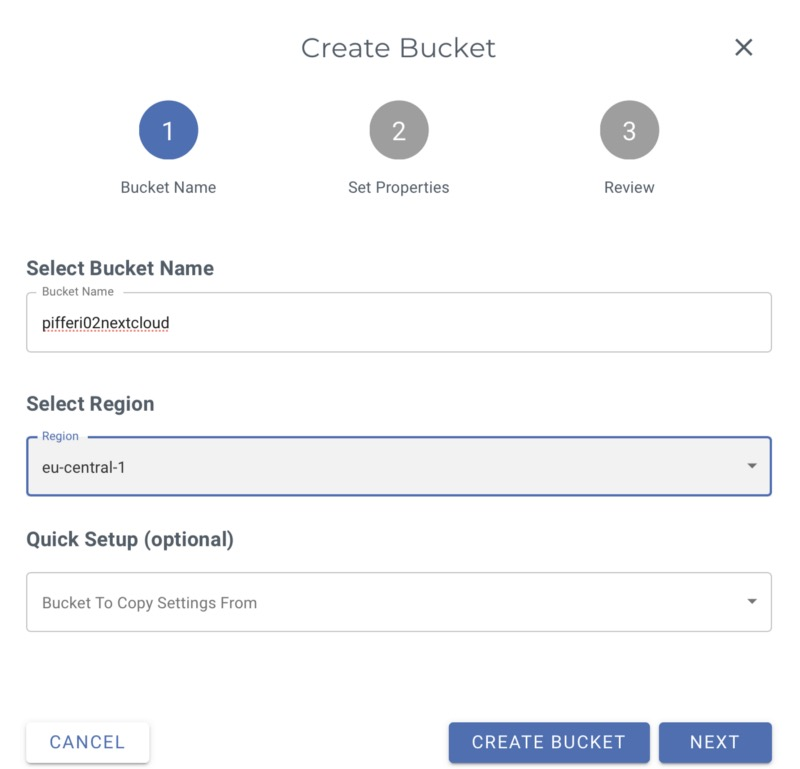
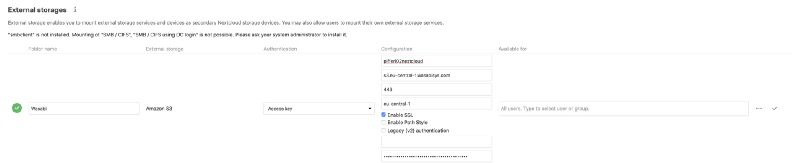
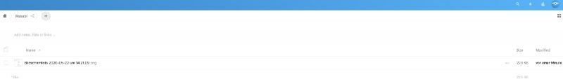
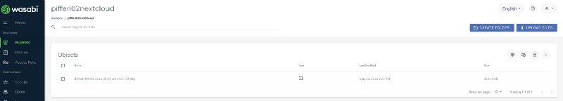
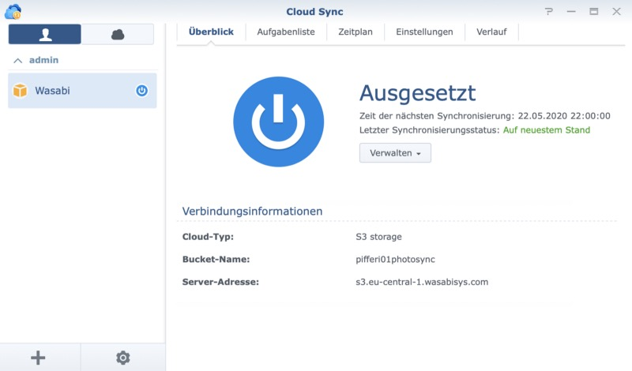
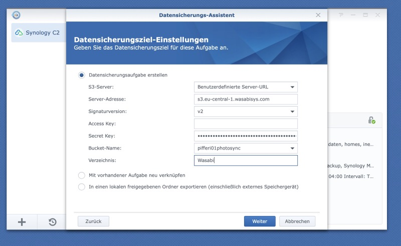
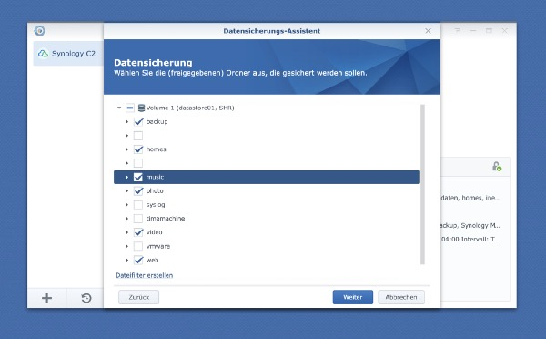
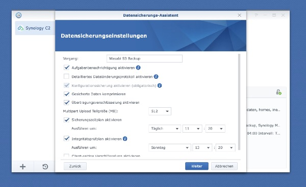

## Lately I have been testing the Cloud Object Storage made available by Wasabi. While I have always tried to get familiar with Amazon’s S3 I always stopped walking the way when it came to the pricing for me as a private person.

In today’s IT world, S3-storage is surely one synonym for cheap and fast storage we may use to deposit data and backups so somehow Wasabi came in my view. In addition, some weeks ago, a sales person contacted one of our company’s prior datacenter experts to partner with the Wasabi because of our connection to Veeam.

While Wasabi and especially Veeam is yet another story to be told (I am the product manager for Veeam in our company), my gaze focused on Wasabi and its benefits that are basically one fifth of the Amazon S3-pricing, a free egress option, „faster than the competition“ (this always depends on your point of view though) and an enterprise-class security. This all sounded yet too great so I went for a test drive — and (just to anticipate it) stayed there as one TB of storage (the smallest amount you may book) comes just US$ 5.99. But it was not also the price aspect that made me to choose Wasabi, it was the simplicity I encountered when creating my first buckets and used the API to store data therein.

Wasabi and Nextcloud
--------------------

The sign-up is made on Wasabi’s [homepage](https://wasabi.com/sign-up) and you can start shortly afterwards. First of all don’t make this mistake and change the backend language to „German“, even if you are a native German speaker like I am. „Eimer“ instead of „bucket“ just sounds stupid but it will (of course) work nevertheless. I stayed with the English tongue and after creating the first bucket named „pifferi02nextcloud“ here I was able to manually upload files. Nice try, but I wanted more — to be specific, I wanted to attach this buckets as a file repository for my own Nextcloud-instance.

Before I could achieve this, I somehow needed to get an API-access which is done in your profile settings at (you will have guessed it) the option „API Access“: Here, a new (or additional) API key can be created as I have done it for my Nextcloud-instance for example. The result you will get is an user name and a secret access key that can now be used for your third-party application or tool to put files in this specific Wasabi S3-bucket. Check!

After taking care of this part (and coming back to Nextcloud), you will have to download and / or active the „External Storage“-plugin in your Nextcloud-installation. Once done so, you may choose wether your Nextcloud-administrator only handles this plugin (and therefore defines the external S3-connection for all users) or if each user may integrate this plugin (and the storage behind it) on behalf of his own. This may differ depending on your users and security, in my lab-Nextcloud my user was allowed to do so.

Now give your S3-connection a name which stands for the folder-name appearing in the root of the user’s home directory. Now enter the name of the bucket you have configured on Wasabi’s backend before, the type of external storage (Amazon S3 of course), the S3-URL and the name of the region and authenticate yourself with the user name and the secret access key.

That’s it, after checking and simultaneously testing the credentials (the green check shows that everything is fine by now) you have just entered your Nextcloud is able to use your S3-compatible storage space at Wasabi!

Wasabi as Synology backup-target
--------------------------------

On the other hand many of us are using NAS-systems at home. In my case, a Synology DS-916+ is part of my infrastructure, serving as a permanent storage for music I have bought, photos of all kind, videos and stuff like that. While Synology already has a very good backup service named C2 Backup, there is no reason NOT to use the good old 3–2–1-rule (three backups, two locations, one outsourced) in even better ways — S3 is the key here as well.

The Wasabi-part before is quite similar: Just create your own bucket, get the credentials you need (either as the main- or a sub-user) and get it going via Synology’s „Hyper Backup“- or “Cloud Sync”-module where you just add a task and use the specified credentials to backup specific shares and settings of Synology-tools.

I still need to have a closer look on Wasabi’s offers when there is more time, but for the moment the service is quite a fast and pricey alternative to Amazon’s S3-product. Coming back to the fact that I learned from Wasabi by mail just because the new version of Veeam Backup for Office 365 v4 now directly supports object storage I need to focus on this special cooperation later as well.

At the moment, Wasabi made some big points just by its speed and simplicity, garnished by the fine pricing as well when it comes to my daily use cases. A closer look on the backend and the possibilities of Wasabi’s S3-storage will follow though but this will be a part of another post covering just Wasabi’s offer. For now I hope to have shown you two possibilities of connecting and using quite cheap S3-compatible storage to common applications and use cases so should you have liked these thoughts, please drop a comment— I do really appreciate them!