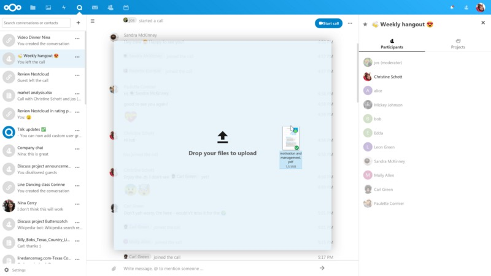
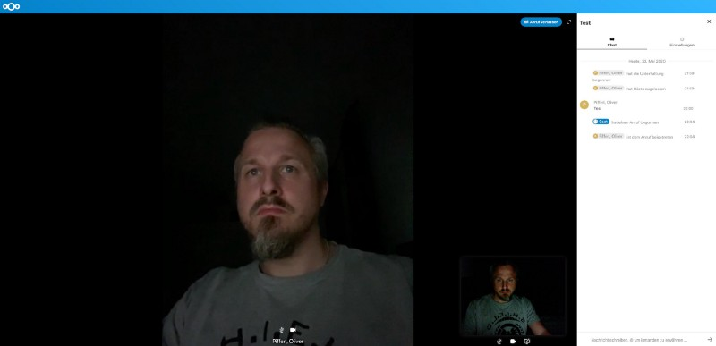
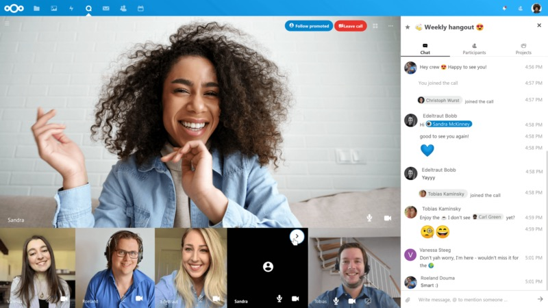
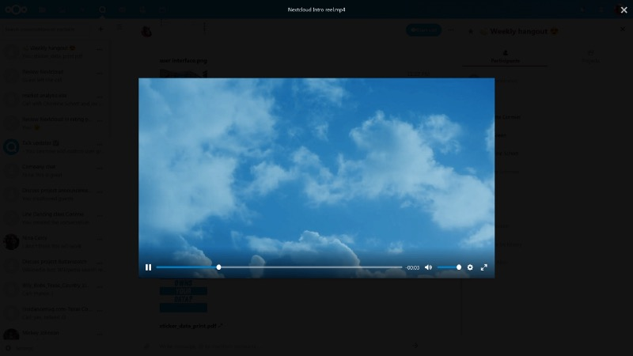

## Nextcloud’s [Talk](https://nextcloud.com/talk/) is one of the elementary apps that comes along with the private cloud solution. Now the company based in Stuttgart, Germany, announced the next major release with version 9 which will contain significant improvements for teams collaborating remotely.

Being placed as a competitor for solutions like Microsoft Teams or Zoom, privacy is still the term in the focus of [Nextcloud](https://nextcloud.com/) and so is Talk.

With the solution given so far, it was quite difficult to put more than five people together in a conference meeting. But Nextcloud wouldn’t be Nextcloud if the people around founder Frank Karlitschek wouldn’t listen to the users which are often private people who haven’t subscribed to a support plan like the enterprise customers do. Anyway, the refinements of Talk 9 are obvious: Drag ’n Drop document sharing will be part of the solutions as well as vaporizing the user limit as the high-performance backend has been made Open Source by Nextcloud’s partner Struktur AG and is now available unter the AGPL license.

A first release candidate of Talk 9 has been made available on May 20th and the final release is expected in about two weeks, according to sources at Nextcloud. Most of the improvements in the area of performance and scalability have already been backported to the stable Talk 8 series, making them available to users right now.

Joas Schilling, team lead of Nextcloud Talk, notes

> Talk 9 represents a huge leap forward, allowing larger teams to work together more efficiently. The availability of the high performance back-end under an open source license will help hundreds of organizations to quickly get a secure, on-premises communication platform up and running!

Of course, the actual COVID-19-crisis created a high demand at schools, government and businesses for remote communication solutions, but hastily introduced public cloud technologies have resulted in a surge in news about data leaks and security issues. As a logical conclusion, Nextcloud is positioning the lever as a secure, on-premises open source collaboration platform. Nextcloud Talk can deliver communication at enterprise scale by default, now this is enabled by its high-performance back-end developed in collaboration with leading video conferencing solution provider Struktur AG.

To support organizations in difficult times, Nextcloud has worked with Struktur AG to make the high-performance back-end freely available under the AGPL license. For any organization which does not have the resources to host the HPB themselves, Struktur AG will be offering a hosted solution with a 30 days free trial but there are already tutorials online how to build your own solution online to enhance your (or your organizations) Nextcloud-instance.  
 Frank Karlitschek, founder and CEO of Nextcloud, adds:

> Modern organizations need seamless collaboration and communication integrated in a secure, easy to deploy package. With Nextcloud Talk, organizations can protect the confidentiality of their conversations internally as well as with partners, customers and suppliers.

Other improvements include back-end clustering to improve the scalability of server setup, improved connection management and error handling, improved handling of adding participants, the ability for moderators to turn off microphones of participants and the ability to limit creating conversations to a specific group so all the needs we are currently experiencing at schools or customers should be satisfied by Nextcloud Talk 9.

> We have been impressed by the quick turn-around and fast improvements possible in tight collaboration between the Nextcloud engineers, our team and our customers in the public sector; and we’re excited to see the performance improvements that came out of that collaboration reach the wider open source community!

Peer Heinlein of German company [Heinlein Support](https://www.heinlein-support.de/), generally known for its great and private [mailbox.org](https://mailbox.org/)\-service, adds. Most of the performance improvements and video quality selection capabilities that were developed together with Heinlein technicians have also been made available to Nextcloud Talk 8, giving users of current Nextcloud Hub 18-releases also access to a smoother Talk experience. The feature enhancements will be a final part of Nextcloud Talk 9 which will depend on the upcoming 19 release of Nextcloud Hub.

As Nextcloud Hub 19 is already on the horizon, currently showing the third release candidate of v19 at the time of writing, we should very soon have the chance to update our Nextcloud-instances to the next level. Since the split from ownCloud and forking as Nextcloud 9 just nearly four years ago, the solution has become a synonym for a private, self-hosted and secure cloud solution offering file services, calendars, contacts, notes and many other useful extensions which may be found in the [Nextcloud App Store](https://apps.nextcloud.com/) to scale the private cloud suite even more.