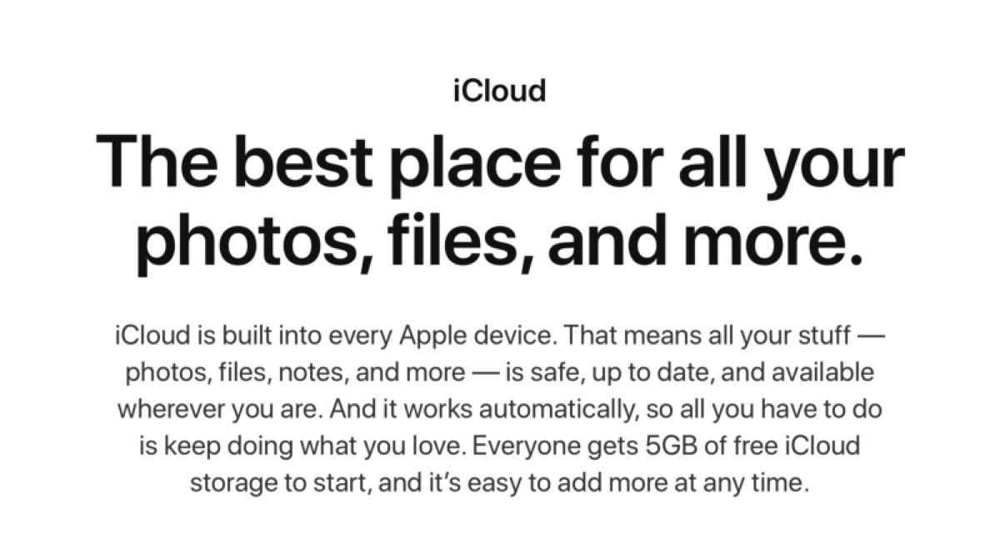
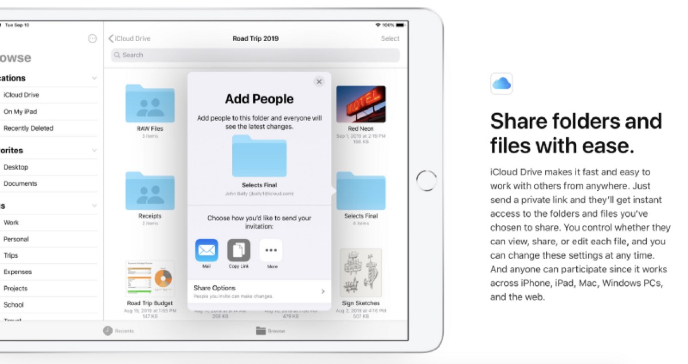
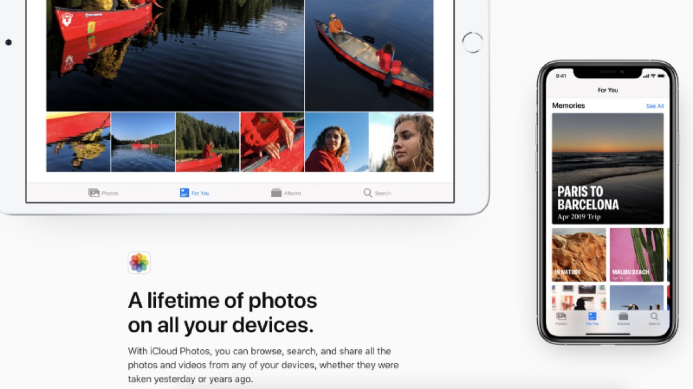
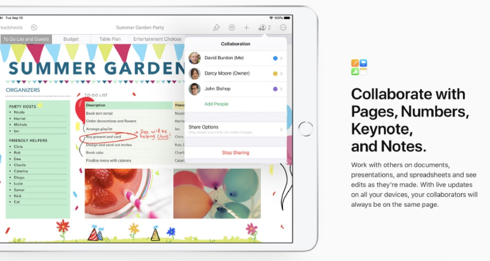

## I got infected with the Apple-virus twenty years ago when I fell in love with the look of Mac OS 9. After trying to use a certain theme at my Windows 98, I bought my first iMac shortly afterwards and my journey into Apple’s microcosm began.

Since these days, a .Mac-E-Mail address was my primary Apple ID. The service disappeared and was replaced my the more or less successful MobileMe which turned into iCloud later in 2012. After many years using Apple’s online services followed my some discussions why I still proudly stick to my old @mac.com-address, I think Apple should revamp iCloud to match the customer needs of today.

Although the services like E-Mail, Contacts and Calendar work well in a pure Mac-environment, I consider the cross-platform compatibility as rather unfinished and the web interface still as colorful, but stayed in bed some years ago. In a time where services are the plus for each company and Apple’s balances show this each quarter, I’m quite keen when someone tries to do some remodeling on iCloud. As a subscriber to the 2 TB iCloud-plan (thanks to my wife’s extensive photo-usage and the family share-option) I just would like to use just „more“ than the storage which is — by the way — by far not that versatile to use like you may do with Google Drive or Microsoft OneDrive.

Don’t get me wrong, if you are focused on Apple only, iCloud and its main services will work great for you. If I compare the scope of features with Google and especially Microsoft’s Outlook.com, it seems as if the iCloud of today is just a relict of the past. Especially Microsofts service, which I do use as a second account, has done so much over the past years in the business and the consumer genre that we have the ideal proof how iCloud could (and should!) look like.

Over the time, I began to mainly purchase apps from the App Store and went with its subscriptions like Ulysses, Apple TV+ or Adobe Lightroom. I spend a lot of money for good services straight over the App Store but while I think the focus lies here first, it seems as if iCloud is just running alongside like a unwanted stepchild.

Why isn’t it possible to use personal domains in iCloud? At Outlook.com, the possibility is connected to the subscriptions and a domain hosted at GoDaddy — but it is possible and works great. Why is there no synchronization-/ import-option for other mail accounts once I want to beam my Google Mail-contents to my iCloud-mailbox? Why is there no visual overview what iCloud Drive does at the moment and which files are synchronized in macOS?

Why does the free plan for interested users still start with 5 GB which is — especially when you work with Photos — quite nothing while the prices for the paid storage plans are really okay? Why can’t I just dump my old E-Mail-alias with a @me.com-address? Why is the E-Mail-interface in the browser slow (not mentioning the IMAP-access!), lacks different viewing options and has a non-customizable spam-protection that is just maintained by Apple?

There are many questions (and I still have some spare ones left) that personally lead me to the conclusion that Apple is quite okay with the status quo of iCloud and (obviously) sees no reason to change anything. The latest addition to iCloud’s features was — believe it or not! — the long-expected folder sharing in iCloud Drive and this was finally implemented in iOS 13.4 and macOS Catalina after users complained about the missing feature for a very long time.

As I consider myself to my a loyal Apple-user for nearly two decades now, I must admit that I am (seen from a critical point of view) less a fanboy than some may imagine because there are things which I — of course — dislike within the Apple-microcosm. The method that Apple is seemingly NOT focusing on developing iCloud for the future is one of those.

As these are just my thoughts above all, they must — of course — not match with your impressions and expectations with iCloud. Apple has done a great job over the years by building its ecosystem around the hardware and although I know am (willingly!) tied to this construct I’d wish that Apple shows that it is still interested in pursuing the story of iCloud.com for good.

My fear is that Cupertino is definitely dropping the mic here like they did with other products in the past, slowly putting the services like E-Mail-, Contacts and Calendars to a its grave while focusing on (other) paid services only.

Only time will tell (as it always does) but I am sure that a revamped iCloud.com could meet the users demands and could advance to a real match if being compared to the high standard I have experienced with the progress of Outlook.com over the years. While I pay some bucks each month for subscriptions and my 2 TB iCloud-plan I am sure that paying some more for a real great collaboration platform would be a no-brainer!

What do you think? Is the overhaul and renewal of iCloud long overdue? Should Apple still focus on iCloud and try to catch up with Microsoft or Google when it comes to the offer of its own solution? Feel free to drop your comment and share your thoughts but I think there are plenty of reasons why Apple needs to strengthen and upgrade iCloud!