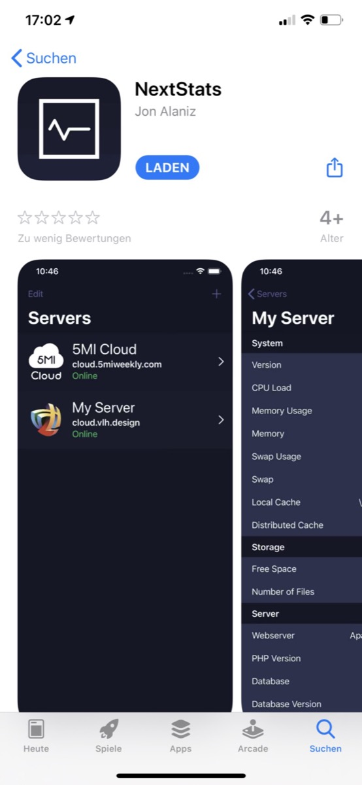
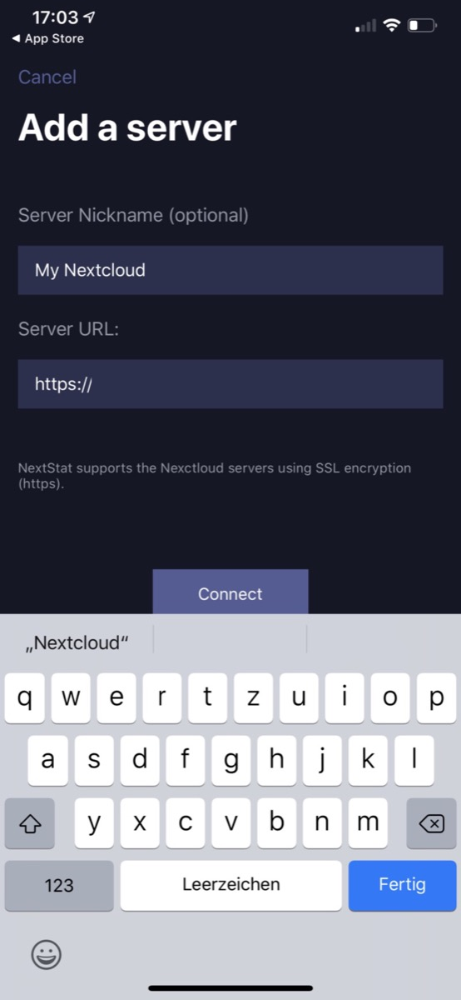
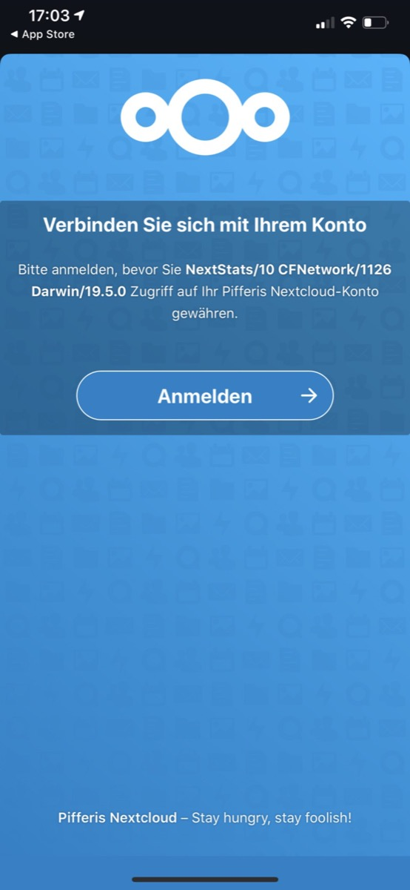
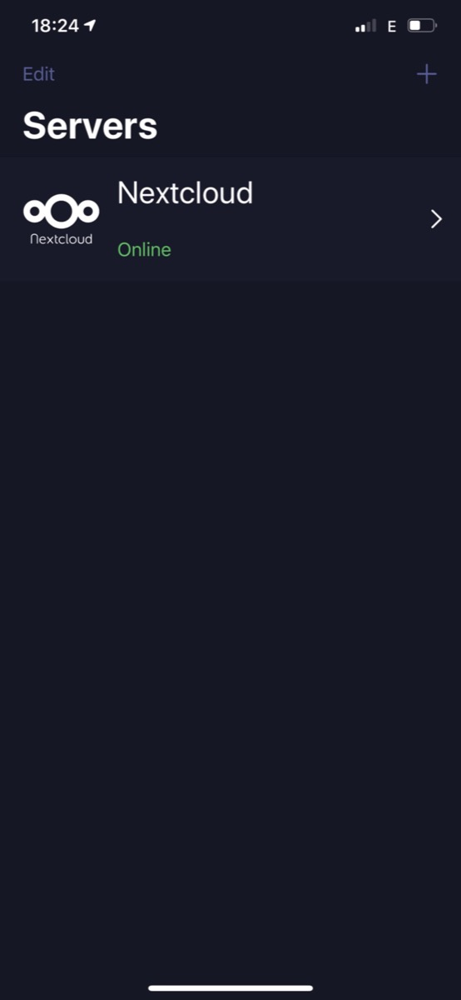
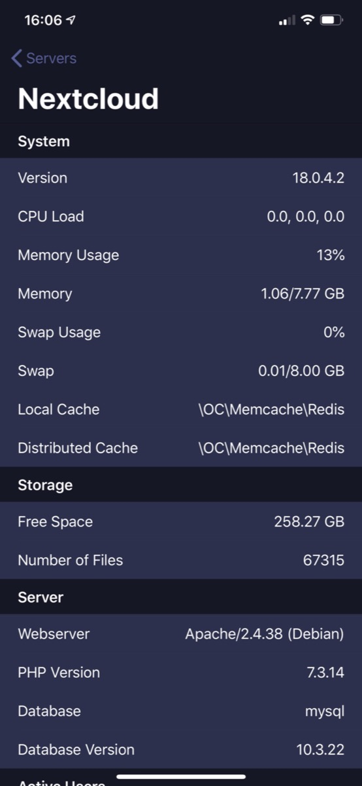

## „There’s an app for that“ is one of the famous slogans we know in this age of apps. Sometimes it just needs a good idea (and the skill of coding though!) to build an application for a mobile device.

One of those examples Is „Nextstats“ which simply beams the essential information on your Nextcloud’s system environment on your iOS device. That is quite easy to accomplish — thanks to developer Jon Alanis — so let me show you how!

First of all there is the download in Apple’s App Store. After the first start you’ll find an empty screen so feel free to add your Nextcloud-server to the dashboard by using the „+“-button.

The process is self-explaining: Give your server an optional nickname, add the server URL (currently only SSL-encrypted installations from v15 on) and you may connect.

Now you need to grant the app access to your Nextcloud. A standard user won’t work and doesn’t seem to redeem the token so you need to connect your Nextcloud with admin-credentials.

Once this has happened, you will the the dashboard with your recently-added instance which should show up with the „online“-status.

A click on it will reveal the system stats and other useful information about your storage, your Webserver and PHP-version as well as the database backing your instance. Other pieces of information join so there are plenty of entries for you to see which seem to have been pulled from Nextcloud’s „System“-pane.

I found myself searching for a way to monitor my Nextcloud instance as well as my customer’s installations so this app surely fills up a gap. It is quite new but exactly does what it promises and works without any hassle once you use administrative credentials during the setup. As I wrote at the beginning it sometimes just needs a good idea to come up with an app many people may strive for — Nextstats is one among those so feel free to try it!