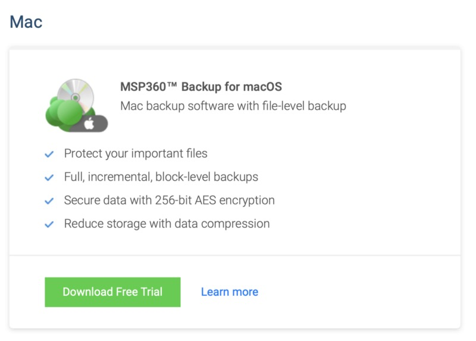
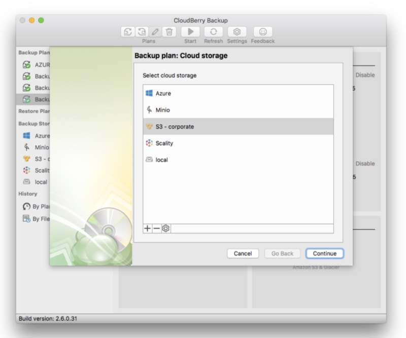
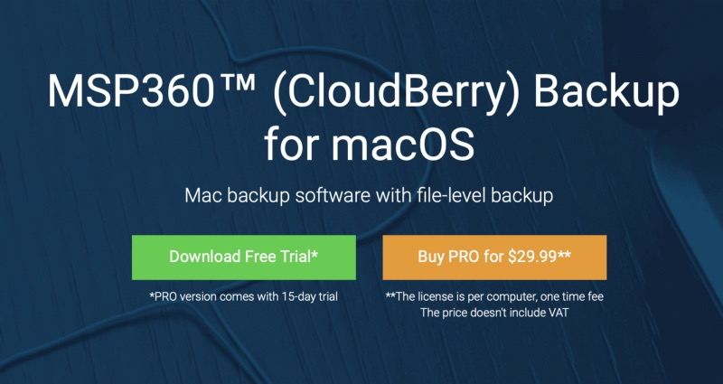
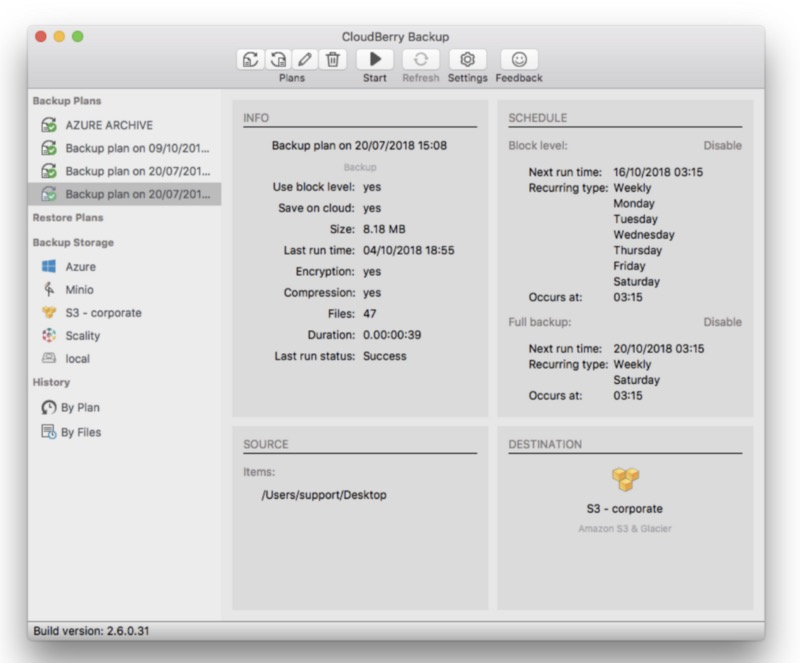

## „Backup early, backup often“ is probably the most-commonly used term when it comes to the question of data security.

This counts for corporate data as well as personal backups: Files you haven’t backuped can’t be recovered if you need them again, it’s as simple as that. There are plenty of tools doing this on different operating systems — on Windows, I prefer to use Veeam while TimeMachine on the Mac is the material on board for Mac users. In this article I want to have a closer look on MSP360 (CloudBerry) Backup for macOS which completes my personal task of backing up my data without using the Synology that is the first target of my TimeMachine-backup at home.

My Use Case
-----------

First of all, this scenario does not need to fit into your demand of getting your backups done but maybe it it some kind of initiator thinking about extending your backup. At home, my Macs are backed up via TimeMachine by default, an older Synology DS-916+ is the main target and does well. In case something happens or I need to change Macs, I can use the enabled TimeMachine-feature on the Synology to get my data back or from one device to the other. But what if this is just not enough and I want to scale out my backups? To be more specific, this use case won’t be a scale-out as I am not going to additionally outhouse my recently made backups but save them directly to a Cloud storage instead.

Scenario and Editions
---------------------

As for an scale-out scenario, I may use the Synology C2-feature which takes care of putting the contents of the Synology-shares and some app settings to Synology’s own cloud backup service via HyperBackup. Putting the whole TimeMachine-backups up there doesn’t make sense for me due to growth and as I use to work mostly locally on my iMac or my MacBook Air, there must be another solution. When being around or just having altered some files, I need another safe and secure backup solution and once stumbled upon MSP360, a software most users possibly still know as CloudBerry Backup. It is available in a free and Pro version (while the free one should work for many users out there) and supports direct backups to Amazon S3, Amazon Glacier, Microsoft Azure, Google Cloud and other cloud storage providers.

Using S3-storage here
---------------------

THE key feature justifying $29.99 for the Pro version is definitely the ability of doing a certain compression and encrypting your files. While I love the flexibility of Cloud-solutions nowadays, my main work is done within my Nextcloud-instance (which is another topic) but scaling out and backing up files to an external S3-compatible storage provider should at least come a along with a certain degree of encryption.

As I am currently exploring the pros of S3-storage, my focus is currently based upon Wasabi and its killer pricing of $5.99 per Terabyte — which is, obviously, now the key setup of my backup scenario paired with MSP360 (CloudBerry) Backup for macOS. Other S3-compatible storage will work as well, but I will stick to this combination (let’s assume you have already booked your S3-space) and the main target of putting the backup straight into an online repository.

Installation and first start
----------------------------

To start, just [download](https://www.msp360.com/download.aspx?prod=cbbmac) the app from the official site of MSP360 and install the package. Due to the missing signature, the file needs to be opened with a right click to bypass macOS’ security feature for packaged apps. CloudBerry backup will then install in your applications-folder by default and with first opening it, there are still some hurdles to master: Once you use tools like LittleSnitch and activate the software, they may complain about the missing code signature of the app. Second you need to grant full disk access to the tool which sounds strange first, but still make sense for an overall backup solution targeting all possible files in your HDD/SSD. With the first start, the choice wether to use the free version or the 15-day trial of the Pro-version is up to yours, the third option stands for activating the commercial version which — by the way — is a perpetual license per machine.

Looking at the options of the Pro-version we see that there are plenty of switches to deal with: The use of a HTTP web proxy is supported as well as throttling speed in cloud or local backup scenarios, the behavior of backing up symlinks, number of file-versions to keep, enabling of the web interface or preventing sleep mode. In addition, also logging behavior or thread switches can be used to suit the backup performance to match with your needs.

Creating a S3-bucket in Wasabi
------------------------------

As I have told you before, the service of my personal choice at the moment is Wasabi. The price per TB is hard to beat and the experiences I have made so far (not only in the private use sector) are telling me that this is okay that way. Once you aren’t familiar with Wasabi so far, just try the service for 30 days which was once my way of pairing CloudBerry and my backup storage in the cloud. As we don’t want all those data stored together with other files, we create an own bucket just for backup purposes — you’ll find the fitting screenshots here. What we finally need is an access key and a secret key to have the permission of putting some (or even more!) files into the desired S3-bucket.

Create your bucket, give it a fitting name (I didn’t), select the region where your files are going to be stored and decide wether you want versioning or logging. After a brief summary, the bucket is ready and you can download your access and secret key afterwards in your account. Note: Save these data snippets either in a password manager or as .CSV-file in case you need them again. Beware that anyone knowing this credentials may misuse your Wasabi-storage so take care of them!

Configuring the Backup-target in CloudBerry Backup
--------------------------------------------------

You may configure the target wether in the settings or when trying to create a new backup job. In our scenario we need the information acquired above to connect to our repository (aka. bucket) for the first time. Enter a prefix so that you know from which machine the backup is and don’t forget to check wether SSL is activated or not — nobody needs a backup being transferred without SSL nowadays!

Things to backup
----------------

Now as the cloud target has been configured, it’s up to you to configure which files you want so put in your S3-bucket. In my case, my whole profile „oliver“ is the preferred source. Having a look on the advanced settings, I did not exclude any files except the hidden ones and chose to backup empty folders as well. When using the Pro-version, you may enable compression and encryption (which justifies the decent price of $29.99 by all means!) with an algorithm and password of your choice.

Don’t forget you are putting personal files on someone else’s computers aka. a public data center so you should not backup without a decent encryption! As already done with the Wasabi-credentials, please put your encryption key somewhere you may find it as all files in the backup are lost once you should forget it! Last but not least you may choose how many version of each file you want to keep during the backups and take care of scheduling your new backup job. A pre- and post-script-configuration can also be added just like the E-Mail-notification and, after all, you’re ready to go and (as we got used to) finally run the plan for the first time.

Final Conclusion and verdict
----------------------------

The learning curve with MSP360 (CloudBerry) Backup for macOS isn’t steep. Not caring which cloud provider you want to use, the software instantly helps you to create a first cloud backup within minutes after installation. Although the software looks quite old-fashioned and reminds on older OS X Aqua-days while grabbing quite a lot of CPU-power when doing its work, the result is great. A little bit polished optics here, a little bit of optimization there — MSP360 has surely some work to do when it comes to the fine-tuning of the software. Especially the package signing is another fact that may prevent the one or other user from using this powerful piece of code.

Configuration, transparency, supported cloud providers and statistics are well done and even the configurable web interface (enable it in the settings with http- and https-support) is yet another great feature you may use when the oldfashioned-looking app isn’t your personal choice. Maybe MSP360 will focus on the web interface instead of the app in the future, but who knows? Putting some efforts in the optics could finally make CloudBerry Backup the ideal and native addition to macOS’ standards.

The software could add what TimeMachine is missing (or not intended to do anyway), but everyone who is at least a little bit thinking of backing up parts of his Mac-data to the cloud should have a closer look on MSP360 (CloudBerry) Backup for macOS. It’s worth the time and the amortization for the fair price of the Pro-version will be done the first time you restore an important file from your cloud-based backup!