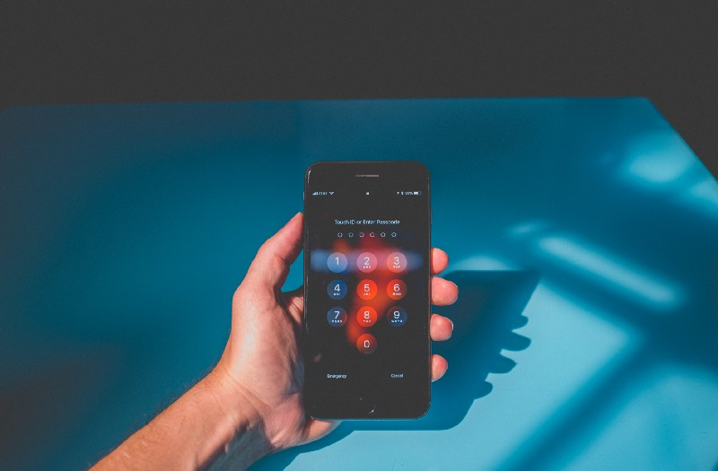
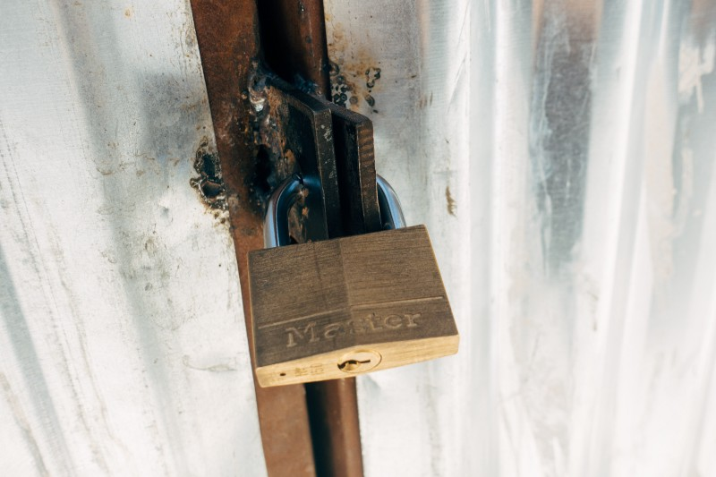
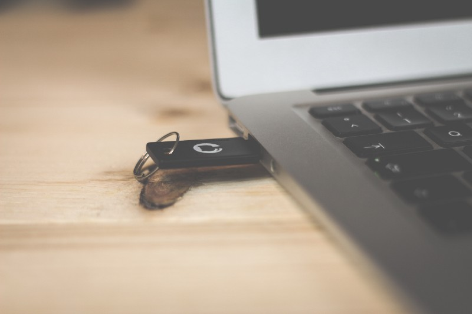
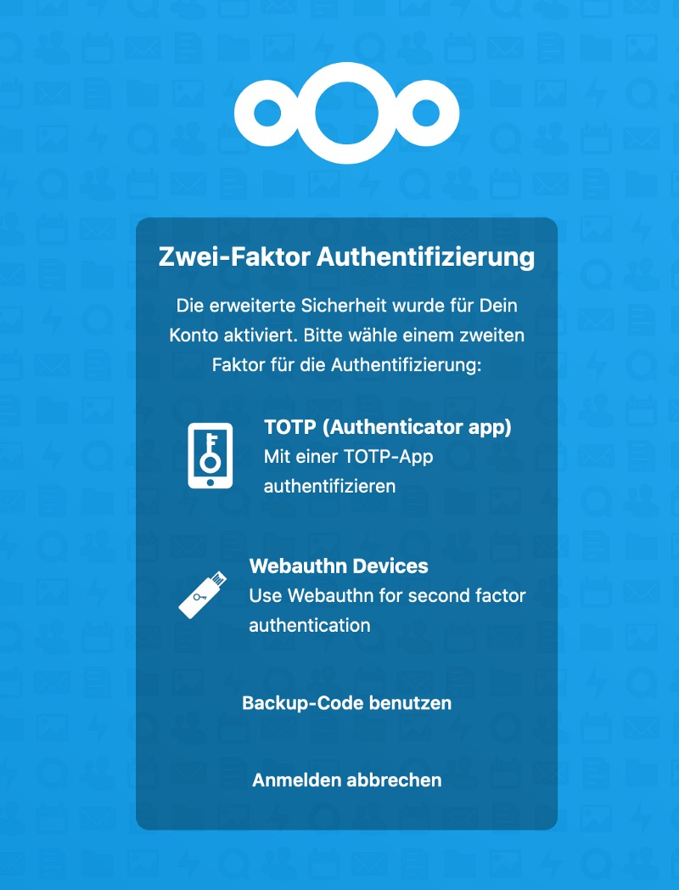
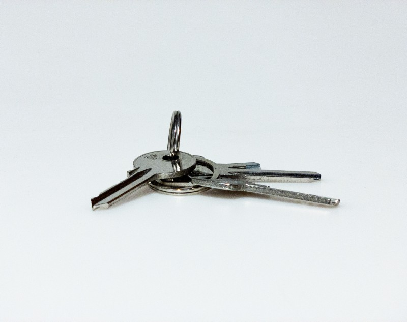
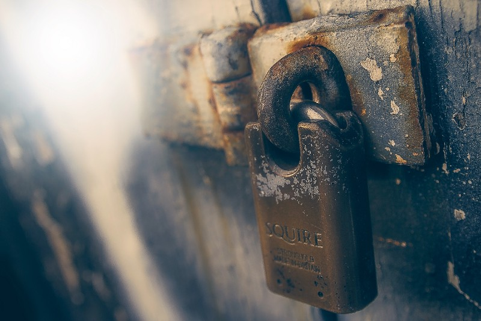

## As of today, people are more concerned about privacy than years before.

The times of classic passwords are gone and users begin to understand that the password policy they use at home or the enterprise has to be more than just a few letters. But not only complexity counts — indeed, password managers are on the run, ensuring users have just to remind the master password while the “password-per-login”-rule is paired with a certain complexity. Over time, the digital world has shown that even this is not enough and so the Two-Factor-Authentication (2FA) is yet another helpful tool to make your digital life safer. But did you know that this factor can also be reinforced by a hardware token which costs just a few bucks?

I always have the same discussions among customers and friends — handling passwords is an uncomfortable burden. Most know that is needs to be done, even more really don’t care about it. And some very few understand that using the same password with different services (not caring how complex it is) is yet another no-go. On average, three out of ten use a password manager which handles all generated passwords and just one of those fortifies their accounts by an additional 2FA and using Authy, Enpass or Google Authenticator. The stats here are bad as security never comes with convenience and even if people manage their passwords by another software, an additional six-digit code seems to be the ultimate load no standard user wants to carry.

At this point of view there may be the chance for hardware keys put into the shape of a standard USB-stick. In this scenario, the user needs to insert a hardware device after entering the service’s password, shifting the second factor not to an insecure SMS or a 2FA-app but to an encrypted hardware device instead. While venturing through the web there will be two vendors you may stumble over: YubiKey by Swedish/American company Yubico and the Germany- and Open Source based Nitrokey. My demand for a hardware device was quite straightforward as it should support 2FA and FIDO2 for a possible, passwordless login. After comparing for quite some time, my choice was clear and I bought the Nitrokey FIDO2 which satisfies exactly this demand and while lacking USB-C factor, I preferred it due to the Open Source-based firmware and its better reputation in the Open Source-community.

Once you manage to live in Germany, an order on Nitrokey’s website takes approximately three days until the security reaches your home. My order — the [Nitrokey FIDO2](https://shop.nitrokey.com/de_DE/shop/product/nk-u2f-nitrokey-fido-u2f-20) — was shipped very fast. With the stick (which was safely packed in a cushioned envelope) you will also get a nice sticker stating your support for „Security through Open Source“. This piece of USB-A hardware is quite small and even the small cap protecting the contacts is quite tightened to the casing and should not get lost easily — alas, you will lose that cap anyway (at least this is what I do all the time). Fix it to your key chain, wear it with a ribbon around your neck — a small opening in the casing like in most of the mass storage USB-sticks makes it possible to have this piece of security hardware with you all the time.

With this hardware token, you do not need to configure anything before. It is told to work with Windows, macOS, Linux and BSD and supports browser like Mozilla Firefox, Google Chrome, Safari, Chromium and Opera. To check wether your preferred service supports 2FA and/or FIDO2/WebAuthn, you may check [dongleauth.info](https://www.dongleauth.info/) before you try to configure it. In my use case with macOS Catalina 10.15.3 and Safari Version 13.0.5 (15608.5.11) I discovered that Safari couldn’t get connected with some services at all. While Twitter works, Facebook doesn’t so it seems that the standards of Webauthn seem to differ from browser to browser — a big „hello“ to the modern and standardized web of 2020 (or to Apple as Safari seems to be different somehow, even with changing the user agent in Safari’s developer options)! Anyway, currently working with Catalina 10.15.5 and Safari 13.1.1 (15609.2.9.1.2) this problem seem to have been solved in the meantime so Safari-user won’t be locked out!

Having a look at Firefox 72 at the time of first writing, the Nitrokey worked like a charm after configuring it as a hardware-based security device. Either in Facebook or the admin-panel of my Mailcow-installation no problems appeared: Choose the specific option of a hardware token, insert the Nitrokey when prompted and (with a touch) you are ready to go after the device has been recognized and touched. Today, with Firefox 76.0.1 being the latest version of Mozilla’s browser, there is no change at all and I am able to use the Webauthn-feature with the Nitrokey FIDO U2F without any limitations so far!

Turning to my Nextcloud-installation for example, I had to install and enable the U2F-app in the „Security“-section of Nextcloud’s App Store before the device could be configured. The process itself was easy again here, too — in the Nextcloud-settings under the „Security“-option, check the U2F-device in the „Two-Factor Authentication“-section, insert the device, name it — that’s it! After logging out, the next login will request the Nitrokey to fulfill the login — and inserting the device plus touching it is all you have to take care of!

Whatever you do, not caring which service you secure with your hardware token, never forget to use the option of generating and downloading/printing backup codes! Just in case you lose the physical hardware key (USB-sticks tend to get lost all the time!), be sure that the protection of your online accounts is not too strict by locking you out without any second option to regain access! In the worst case, a SMS will do the trick but after we have learned that SMS is insecure by design (and could be intercepted!) this is not the way we want it after having dealt with better security in the meantime!

Closing my thoughts on that topic and getting back to the users I think that there is rarely a way to get around a password manager if you own a lot of passwords. They take care of generating passwords (you don’t need to do that, just keep the master password in mind!) and help users with the first step of online security. Paired with an 2FA-app like the one I have mentioned above, users may strengthen their kind of web security by some levels. If people don’t want to use yet another app (although [Enpass](https://www.enpass.io/) for example takes care of this with an integrated TOTP-feature), a hardware key like the Nitrokey is a good and affordable option. In case you want more, there are many other keys available, taking even care of hard disk- or E-Mail-encryption.

This topic is not trivial, but neither the security for your online life is. And although the variations of hardware keys and vendors are factual, there is a key to suit your needs — whether you are using Windows and Office 365, macOS or a Linux-system. Focusing on that and once dealing with that topic, even securing your accounts may be more convenient than you may have expected — just give it a try!