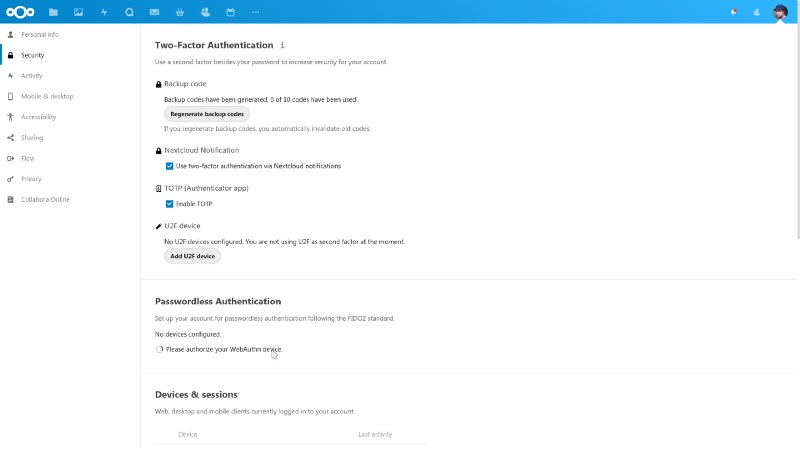
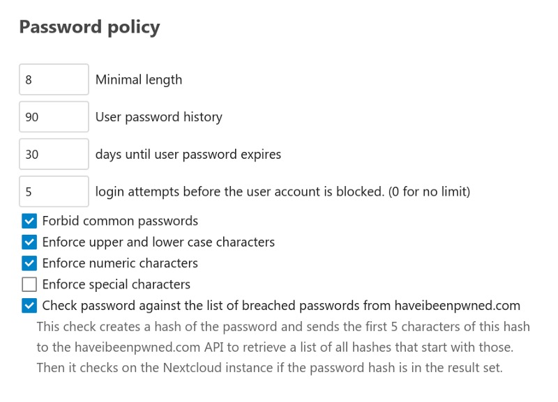
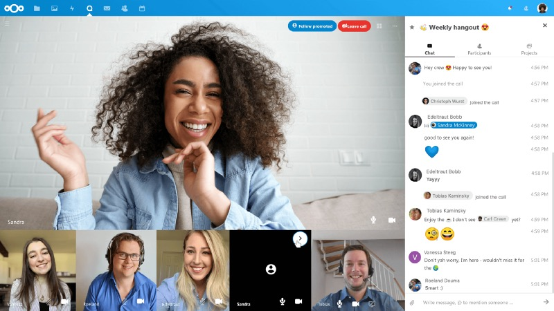
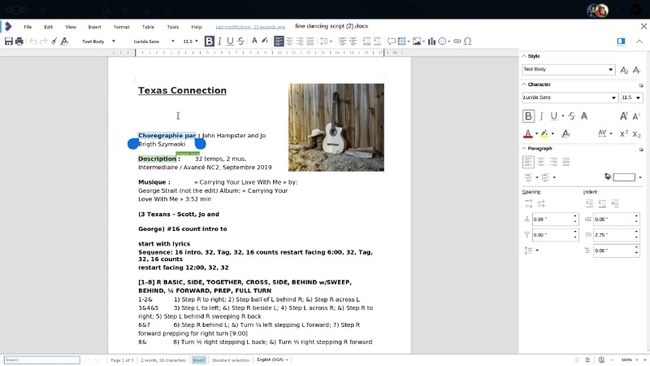
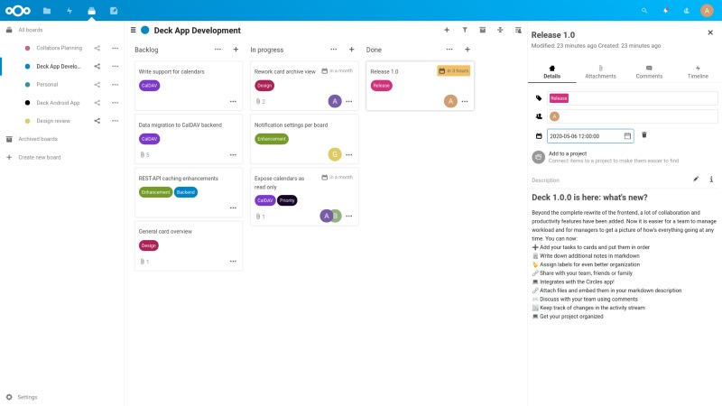

## A good wine needs some time to age but what Nextcloud has already achieved over the last four years after appearing on the stage for the first time is quite flashing.

Now, just one day after celebrating its fourth birthday, Nextcloud, which is told to be the market leader in on-premises collaboration solutions in the meantime, releases its latest version of Nextcloud Hub: v19 is here and aiming to support all the users around the globe that are still bound to the home office due to COVID-19. The goal: Closing the circle with embedded solutions out-of-the-box, no matter if it needs file sharing, video conferencing, collaboration on documents or just the best private cloud you can get.

When [Nextcloud](https://nextcloud.com/) was first released in 2016, it was a fork of CEO Frank Karlitschek’s ownCloud-project. Today, the pace Nextcloud runs with has made Nextcloud Server / Hub to become indeed this kind of new industry standard it was intended to, even more focusing on the numerous new home offices. The need to work remotely has taken the nations by storm and although digitalization is still a word many organization consider to be of a foreign language, there are tools to handle this even with the focus on privacy. COVID-19 has even accelerated this trend already visible in many businesses so Nextcloud Hub 19 enters at the proper time.

So what’s new with Nextcloud Hub in this version which takes over from v18 that was released this January? There are many improvements — some may have a heavier impact on your work, some may not but it is more than obvious that Nextcloud is focusing the big picture to suit all demands with one collaboration suite:

The thing about security
------------------------

First of all, you should use more than just your (complex!) password. Nextcloud supports many authentication mechanisms by additional apps from the store: Until the release of this version I have used the 2FA- and WebAuthn-app for the second factor, supported by a either a 2FA-generator or a hardware security token like the Nitrokey FIDO2 I recently blogged about.

Now, as everything of your digital life concentrates on one platform — one hub — the level of security can’t be high enough. Following the trend that passwords are rather old-fashioned, Nextcloud enables the WebAuthn-support straight from the scratch as the first authentication mechanism.

WebAuthn is quite a new W3C global standard for secure authentication on the WWW supported by all leading browsers and platforms including Windows Hello and many hardware keys. It offers a choice of authentication options and stronger account security than the usual combination of username and passwords. Developed in collaboration with Open Source hardware security key manufacturer Nitrokey, the implementation in Nextcloud makes it the first on-premises collaboration platform to provide support for this new standard out-of-the-box.

> „Having employees in home office means a strong security standard is required to protect data. As most attacks target users as weakest link, the combination of easy to use hardware keys with WebAuthn provides employers with a huge security advantage for remote workers. Nextcloud’s impressive latest release works perfect with Nitrokey hardware, giving administrators a fully open, verifiable security stack they can trust.“

(Jan Suhr, Nitrokey)

In addition to the simplified authentication, additional new measures have been implemented to further secure the remote worker and his/her access to the platform. Nextcloud Hub 19 now adds the features of optional automatic logout, password reuse limitations, automatic account locking in response to failed login attempts and password expiration features. Many of those were quite standard so it is great to see these features have now made their way into Nextcloud Hub.

> „As a fully open source, European business, Nextcloud has always put the security and privacy of its customers first. Being first to market with support for WebAuthn and offering the most extensive compliance capabilities in the on-premises market enables businesses to introduce home office work using Nextcloud Hub with confidence.“ 

(Roeland Douma, security lead at Nextcloud GmbH)

Further collaboration, new kinds of coffee talks and focused work
-----------------------------------------------------------------

The world is separated an COVID-19 was one of the factors, shaping a new kind of living and working since the end of February when the pandemic began to spread throughout Europe. None of us will know if this is about to happen again, but the home office — or teleworking — is straight in the focus now. The way how we work with each other and how we get along with each other these times is different and will remain this way, so we need new and better tools. Gathering people by a platform, together with all their ideas and integrated collaboration-, chat- and videotalk-features is on the rise and so Nextcloud keeps doing what the company once started with and what now shows to be a valid and secure platform from the start.

While the high-performance backend for Nextcloud Talk has been open-sourced some days ago, it is the ideal base for talking with more than four people in a room. Designed for 10–50 participants, these technical base is yet another proof for the power of the community Nextcloud relies on: Together with technology partners like Struktur AG and Heinlein Support GmbH, the foundation is built to access one of the most-growing markets which have — unfortunately — been neglected over all the years: The public sector. Away from proprietary solutions controlling the market, Nextcloud’s mighty package could be a great opt-in for public authorities or especially schools. Partnered with the new grid view, meetings in Nextcloud 19 look slightly different than before and helps even more to keep the different participants at view.

„Together“ is more than just a term
-----------------------------------

The new Nextcloud Talk (grown to version 9 in the meantime) introduces the possibility of directly editing office documents like presentations and spreadsheets during video calls or from within a chat room. In addition, note taking during regular meetings or focused polishing of a slide deck a routine task is possible as well. To facilitate seamless in-call and in-chat document editing, the enterprise-ready office document solution from Nextcloud’s partner, Collabora Productivity, has been deeply integrated in Talk.

Mentioning Collabora Online, let me tell you that this is the online office being shipped out of the box with Nextcloud Hub in version 19. Just like the implementation of ONLYOFFICE in Nextcloud Hub 18, a special community server has been developed which is told to dramatically ease the work required for installation, avoiding the need for web server configuration, docker containers and more. As you may already have guessed, this version however sacrifices scalability for this ease of installation and is not suitable beyond private use.

Just like with ONLYOFFICE, Nextcloud recommends the existing Collabora Office solutions for that, with docker images for small offices and more scalable solutions available for enterprises through Nextcloud GmbH. By the way, I was quite astonished to see ONLYOFFICE being replaced by Collabora Online as integrated version shipping with Nextcloud as I still use and like this one a little bit more personally. So far, no further reason was given why this change has been made but afar from a new installation which may install everything by default, the users have — of course — still the choice which kind of online office they want for their installation — if they decide to use one at all.

> „Most home office work centers around documents, spreadsheets and presentations. The integration of Collabora Online into Talk gives teams a breakthrough in collaboration and productivity.“

(Michael Meeks, CEO at Collabora Productivity)

Speeding up everything
----------------------

When working remotely, communication and organization both become harder than in an office — many of us have experienced this during the last weeks and months. Nextcloud Hub features many little, helpful elements to keep data organized. Users can tag and comment on files and to let their colleagues know what they can find where, users can add context to folders, adding a description or even a todo list on top. Tagging files is — of course — a new way of working but once you got used to it, it indeed saves some time. In the Nextcloud Hub user interface, users can expect quick ways to find their files, with recently used, modified and shared files on top, people you frequently share with in the file share dialog and favorites, recently used and shared files in the side bar.

Seeing these changes at a technical level, devices and network connections at home are frequently at a disadvantage compared to the office infrastructure, making performance a critical factor for home office workers. Under the hood, this release introduces a number of significant improvements like an up to 5x reading improvement for integrated external FTP storage, an up to 2.5x faster file scanning, 25–50% faster generation of image thumbnails and use of embedded thumbnail images in OpenDocument files and Krita files. Additionally an ability to use „fseek“ was added in S3-storage: This allows to, for example, start playing a video file without first downloading the entire file.

For all us NFS-fans out there, NFS file-storage now reads data in larger chunks, improving bandwidth and performance significantly. On the other hand, SMB storage was enhanced with better ACL support, hiding folders that users have no access too, reducing both the browser load and the number of folders users might have to search through to find their files. Fancy Kanban boards, where team members write their tasks on cards and put them on “TODO”, “IN PROGRESS” and “DONE” stacks during their collaboration, are often used in teams to coordinate work.

To help team members in home office, Nextcloud now also includes a digital kanban app named Deck which many of you will already know as a part of the App Store so far. With this release Nextcloud makes it possible for apps to provide a calendar or address book which then allows Deck to provide calendars with todo’s and deadlines from its boards, making it easier for all team members to keep track of their progress.

The past, the present and the future
------------------------------------

It is just great to see how Nextcloud has evolved in the four years. I once used the predecessor but changed to Nextcloud with the initial release and did never regret this journey. Of course not every release is free of errors and I did also found two in my instance, but the great around Nextcloud is still — and always will — the power of the community. The solution is just four years old running under the blue label but it is great to see the ideas and thoughts, the consistency and the open-minded attitude towards the users. Technically, Nextcloud is an ideal and stable foundation for hosting your private cloud either at home or in the data centre of a trusted provider, not caring if you need it for your enterprise or for putting together a platform for your family and your secure, digital life while maintaining control over your data!

Nextcloud 19 just brightens this conclusion and shows that the aspiring start-up of 2016 is now one of the players that define the private cloud sector with a broad and stable solution. This is the story of the last four years so we all may be interested in Nextcloud’s way towards the next. I hope the people behind and around Frank Karlitschek as well as the wonderful community will keep this pace up as there are competitive solutions to the big players on the market — you just have to deal with them and Nextcloud is the ideal proof that you should do so!