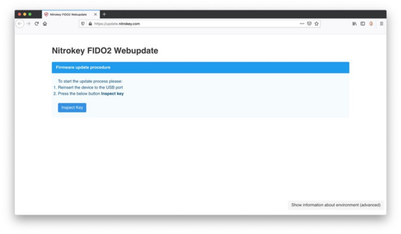
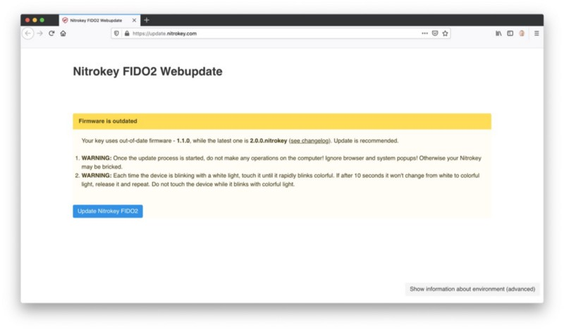
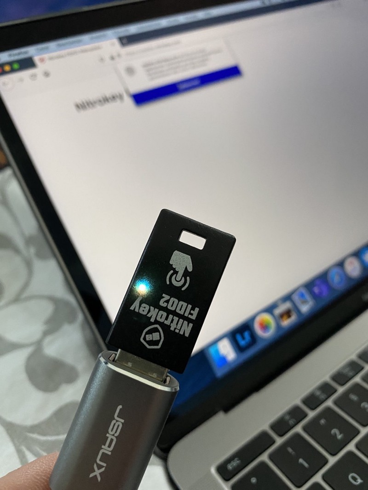
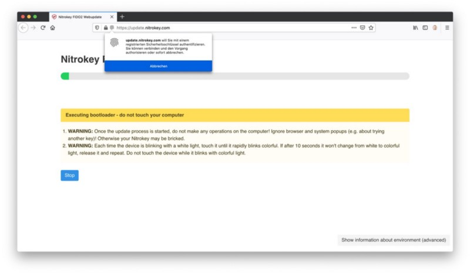
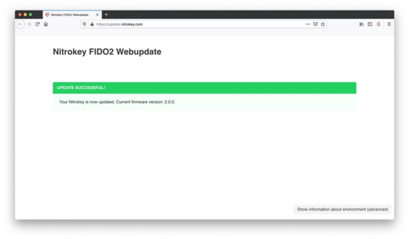
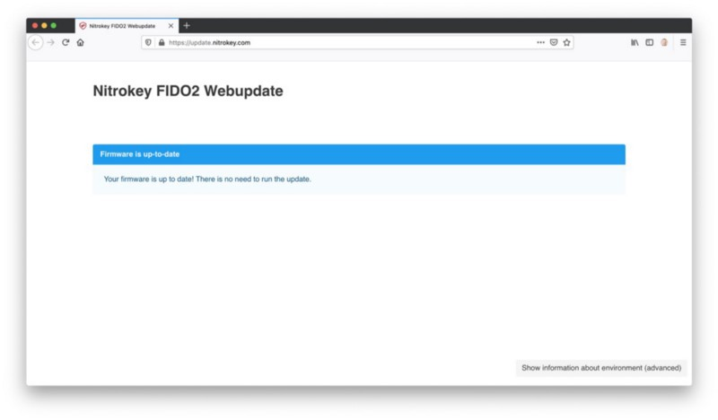

## Some time ago I blogged about the option to increase the security of your online accounts by adding a hardware-based token as second factor.

The Nitrokey FIDO2 was in my focus and has been my company in the office and on the road since using it for the first time. Yesterday, Nitrokey announced a firmware update for this neat little device and while the changes are quite interesting, updating your FIDO2 is the only option to use the new features.

First of all, there is a new and better integration with Microsoft Azure Active Directory, using AAGUID in the device certificate. Second, support for OpenSSH (from version 8.3 on) for the administration of Linux servers has been added. Third, management of PIN and keys via Google Chromes Security Manager is possible now. Finally, there are three reasons to upgrade and while flashing your FIDO2 wasn’t on your bucket list so far, you should try the update which is made possible not by a proprietary software, but through accessing the URL [https://update.nitrokey.com](https://update.nitrokey.com/)!

In my case, I visited the site with Firefox 77.0.1 and was presented with the instructions how to flash.

Just a short note: This update is about to clear all the resident keys saved on the device. While FIDO U2F and FIDO2 registrations were tested to work after the update according to Nitrokey, you should make sure that you’ll have an alternative way of confirming identity on all registered services before making the update — otherwise you may be locked out! Also please do remember that each flash process is based upon your own risk and you may brick your device in the worst case! If you want to head on, reinsert your FIDO2-stick in an USB-port (or the adapter like I did) and click on „Inspect Key“.

Once the key was recognized, the site will present some information and warnings as well as your current firmware.

You should not intervene any browser-flickering or popups that appear once you clicked on „Update Nitrokey FIDO2“ and every time the white light shows up on the device, you need to touch it until it rapidly blinks colorful, purple on my device.

Especially the popups may be annoying, but leave them alone until the progress bar has reached its end.

Once this is happened, a (hopefully) green screen should inform you that the new firmware on your FIDO2-key is 2.0.0 now.

You may want to check the current status of the device by reloading or visiting the update site once again in case you didn’t trust the update procedure but the result should show the proof for the successful flash.

Your Nitrokey FIDO2 is updated now and you should benefit of the three new major features that came with the update. Further information on the changes including documentation, firmware and source code files (never forget that Nitrokey-devices are based on Open Source code) are available on [GitHub](https://github.com/Nitrokey/nitrokey-fido2-firmware/releases/tag/2.0.0.nitrokey).