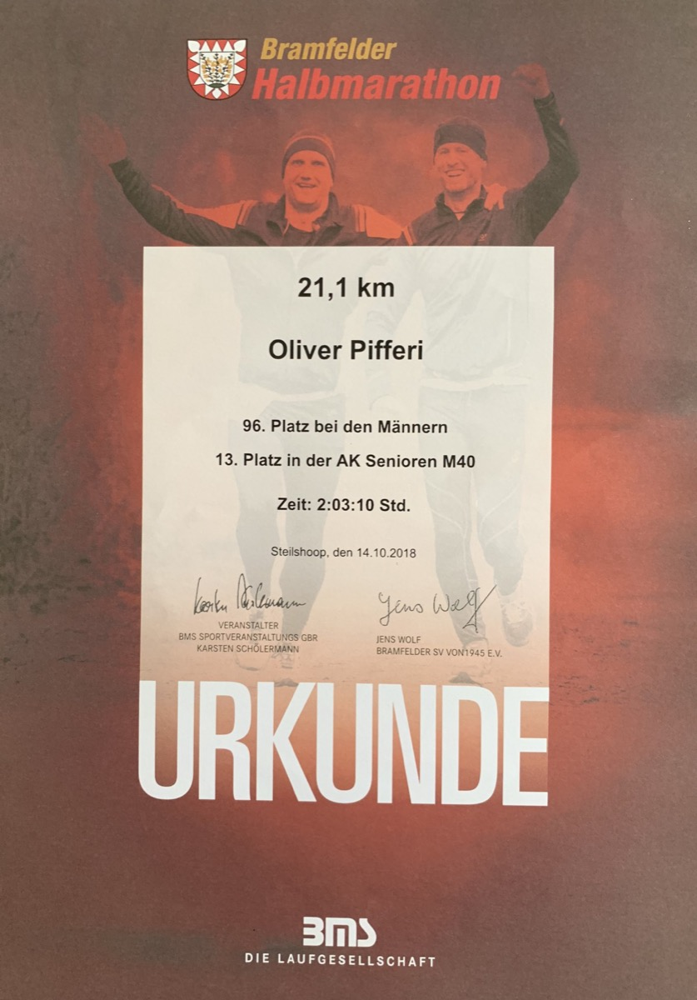
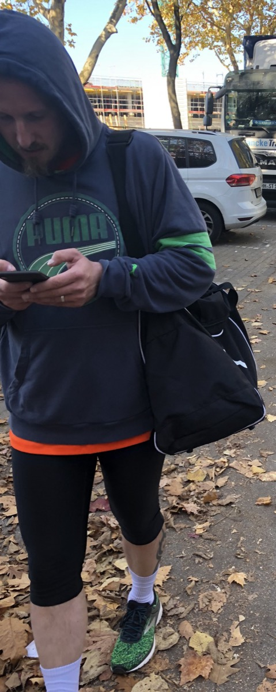

## I have always been this soccer guy. Medium-talented, but with the ability to take the ball and deal with it until I needed to get home as a child.

I played from six to sixteen years and today, with 42, I am still regretting giving up team-based soccer. Anyway, over the years I have tried a lots of sports to get a balance for my everyday life as an IT-Consultant and a dad of four wonderful daughters. Which kind of sports is the right one if you meet these conditions? Some brief thoughts on that…

My general problem is that I am quite able to focus on a sport, pursue this way and leave it alone once I dug myself deep enough into it. This happened with Basketball, this happened with Biking, this even did happen with two motorcycles at the age of 36 (it just took three months for the driving license!) and it did happen with Krav Maga until I got injured at the training. Mentioning Krav Maga I had an intense year from a starter up to two trainings a week and an eight-hour seminar leeching any energy from me and pushing to the borders of my physical abilities: I will never forget the signs on my body after this course and who knows if I wouldn’t still do it if I hadn’t injured my foot one day - and (visually) never stepped back in?

Anyway, in late 2017 I began Jogging just to collect my thoughts and handle the daily routine. Over the winter with minus 6° Celsius, I began to jog two kilometers without stopping (a definite challenge then), turned to five in two weeks until the next goal were ten and finally 15 kilometers. I was in a good shape, taking care of my weight and nutrition and finally made my first half-marathon in a training. The second - and last - one was an official competition in Hamburg, Germany, reaching the finishing line in a time of 2:03:10 hours. Nothing special for a good runner, but for a guy with approximately 180 centimeters of size and an average weight of 90 kilograms quite a good result. Afterwards, everything stopped - a business trip to San Francisco (still one of THE events in my life) cut the red thread of physical activity and somehow I lost the focus.

I don’t know why I haven’t picked up the task of running after this trip again. Fact is that I tried to begin once again in early 2019, but while I managed to completely focus on running in 2018, my thoughts swirled about everything - including work - in 2019 - which finally lead to a complete choke-off. In early 2020 I began to work out with a punching ball but while training your upper body parts there are not that many options do deal with your stamina. A combination of everything is quite fine but I finally thought that there is something that should be changed - 180 cm with 95 kg of weight is not the ideal I have been searching for - not at all!

At June 27th I made the decision to start with running once again. An impulsively decision - no doubt about that - but after driving our second daughter to her rhythm gymnastics-training I decided to start with a run around a local lake. Just for fun, just for orientation and - ideally - without stopping. To make it short: I made it with an average time of 6:25 minutes per kilometer and although the time was quite bad (my best time under best conditions and fully-trained was 5:12/km) I had the feeling to have opened an abandoned old door once again. It was no fun - not at all - but the mandatory first step to catch the idea what has to improve for the second half of this year.

As you are now reading this (and I thank you for doing so), you made it possibly far enough to give me any hint how I may catch up with running once again. Today, one day later, my upper legs are burning from muscle aches but I went for another run today. Not the best idea - 1,5 kilometers running, 500 meters walking, 500 meters running and - finally - 500 meter walking once again. Too much for two days of course but I hope that these first steps may help me to strive for more again: I have no build like an athlete, but I hope to push my body to its natural limits once again just by wanting - and (like I did in 2018) just leaving the house no matter if its snowing, raining or just damn cold.

What do you think? Is running your way of dealing with everyday’s life and even working up daily experiences? Did you choose the same way and how did you manage to stick to your aims? Did running help you to drop the amount of everyday burden that everyone of us is carrying? I once failed and lost the will to continue and still don’t know if the re-start with new motivation, new ideas and maybe even changed nutrition in the days after the first COVID-19-wave is the right thing to do. Unless I manage to switch off the thoughts that accompany me the whole day, a concentration on running is hardly possible and I hope to get this ability of 2018 back again. Yet I don’t know if  running is the final equalizer I am searching for or if it is just another kind of activity I got bored with…

Feel free to share your thoughts and experiences with me - they are greatly appreciated!