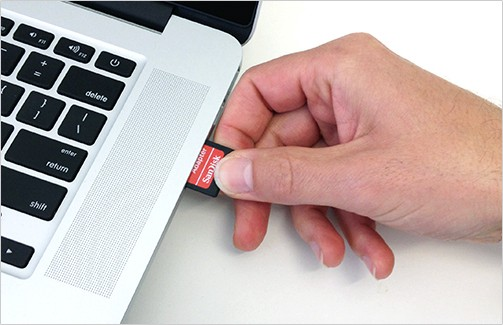
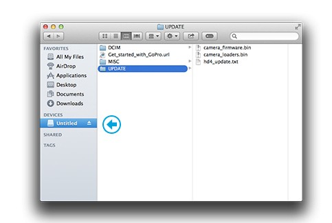
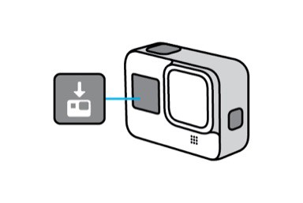
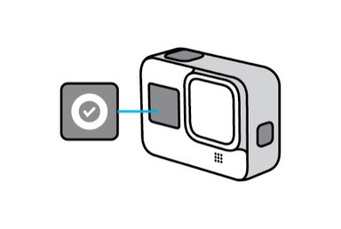
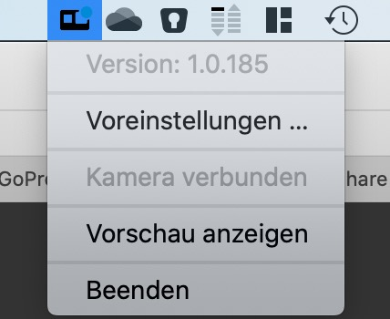
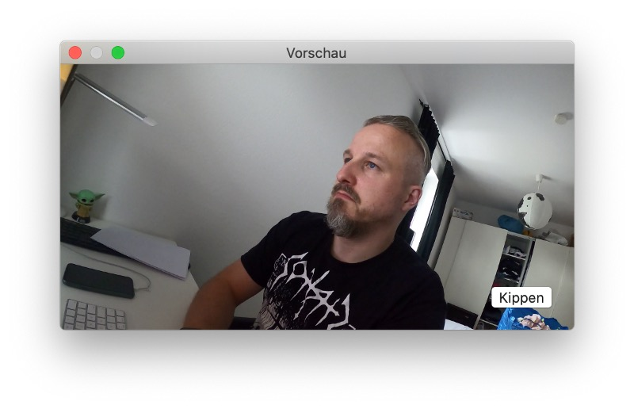
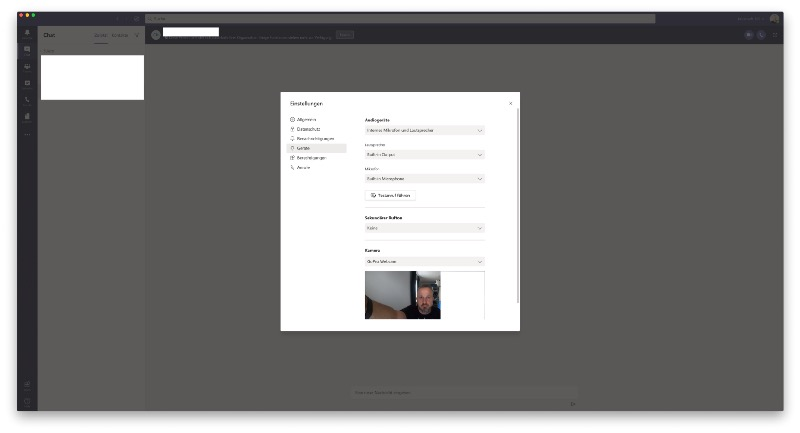

## COVID-19 has changed a lot, especially the worldwide demand for webcams and audio-/video conferencing hardware.

While the pandemic seemed to calm down in some parts of the world (and unfortunately rises once again), prices for webcams and additional stuff stayed in rather higher pricing regions. Supply is still limited and you can still expect widespread shortage. Anyway, While we all learned that working from home doesn’t mean not working at all, a certain degree of flexibility is needed if you want more than just your integrated and quite limited FaceTime-webcam in your Mac. Today, GoPro has joined the growing number of camera makers allowing their hardware to be used as webcams so let’s see how HERO8-users might use their cameras to enhance their meeting experience on macOS!

First of all, make sure that you install the latest beta firmware on your HERO8’s MicroSD-card. To get it, have a look at the [official download site](https://community.gopro.com/t5/en/Introducing-GoPro-Webcam-Beta/ta-p/633649) and fetch the corresponding [archive](https://software.gopro.com/FirmwareBeta/HD8.01.01.90.10.zip) containing the beta-ZIP-file.

After the download, remove the MicroSD-card from your HERO8 and put it in a reader so that the volume appears on your Mac.

Move the ZIP-archive to the card and extract it so that an „UPDATE“-folder will remain — you may delete the ZIP-file afterwards.

Don’t forget to safely eject the MicroSD-card after doing so and put it into the HERO8 once again. Once you power on the HERO8 again, it will automatically start the update during which it will it will beep and turn itself off and on several times.

A check mark on the front screen will let you know when it’s done and you may proceed to use the HERO8 as your Mac’s new webcam.

Now you need to install the new GoPro Webcam-app on your Mac. Fetch it at the official [download site](https://software.gopro.com/PC/GoPro-Webcam-Beta-1.0.185.pkg) and install the package, your Mac will reboot afterwards. After this has been done, a new logo should appear in your Mac’s status bar. Now connect the camera with an USB C-cable to your Mac, turn it on, wait a few seconds and you should be able to see the a connected camera.

Click on „Show Preview“ to check wether all your efforts have worked or not — usually, the Mac has fetched the camera’s output and your new webcam is ready.

Besides, you may have a look at the (yet overseeable) preferences where you may choose between a resolution of 1080 or 720p.

To use the GoPro in your favorite video conference solution, just choose „GoPro Webcam“ as the source like you see here in Microsoft Teams. According to GoPro, other solutions like Zoom, Google Meet, Discord, and Bluejeans will work. The company also notes that it works with Webex, Skype, Facebook Rooms, Messenger, and Slack, but you have to access those through Chrome yet. Also beware that the GoPro-app needs to remain started as it serves as a bridge to all supported video chat services, so remember to leave it active in the background!

With GoPro making it possible to use the HERO8 as a Mac’s main webcam, a gap is closed in a time where the one or other may need a webcam but doesn’t want to pay extra bucks for it while already being an owner of an HERO8. So far, this tool just works under macOS while, according to GoPro, a Windows-version is mentioned to as „work in progress“ so let’s hope that the Windows-app follows soon! Additionally, the quality of the 1080p-wide angle-view of the HERO8 may not compete with the latest solutions of Fujifilm or Canon’s DSLR-webcam-integration but is a good deal for HERO8-users nevertheless. Enjoy!