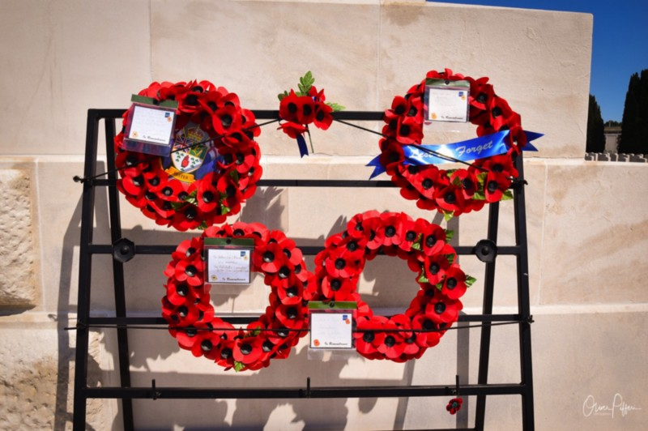

## It was still hot and the cloudless 32° Celsius usually were the proper reason not to exit the car without the need of doing so. Anyway, Tyne Cot Cemetery near Zonnebeke within the area of Paschendale / Passchendaele was next on our map.

As I wrote in one of my last posts there is no change of preparing for the mental impact of those WW1-burial grounds, but Tyne Cot sets a new mark and even raises the bar simply because of its dimensions: 11965 burials from which 8369 are unnamed and a huge memorial for the missing - the walls surrounding the back part of the site - will make you shudder.

Some days after the moving visit to Tyne Cot Cemetery I got company from my father-in-law on a second tour, moving in to Tyne Cot (and its visitor centre this time) again. The weather was hot again, but quite muggy as some rain came with last night. The air condition at the visitor centre did its work and cooled down our organisms although the collected belongings of soldiers who never made it back home already put a decent shudder in our necks. While the first visit to Tyne Cot some days ago was probably the hottest day of the month and I was escorted by hungry and thirsty kids, wehad some more time to focus on the place and everything around it this time before venturing to the gravesite once again. While we walked there, we heard many names coming straight from the nowhere. To be more precise, camouflaged speakers reading the names of the fallen (and buried) soldiers accompanied our way straight to the visitor center where those were supported by showing the photos associated to the names on different screens.

The air condition did its best to separate the hot outside world from the coolness of the centre. A needed and obvious metaphor as your soul will cool down as well when you venture through this place, having a look on the personal belongings of the brave men that fight (and mostly died!) in this region. Once again, seeing the remains of weapons, shells or condolence letters, tears open a part of your soul that was never destined to meet those insights. Today, in a world that is rudimentary limited by COVID-19 which is probably the first restriction of personal freedom we have discovered so far, it is difficult to catch what has driven those men to sacrifice their lives in a war that was so senseless at all.

Focusing on the experience there, the visitor center helps you somehow to merely grab history - tools, ammunition, personal belongings, letters and condolence notes witnesses the life and death within The Great War. It‘s a strange and quite eerie aura while you see those personal stuff which nowadays is a relict of a time where mankind finally stepped into the great darkness. While we made our way round within the centre, I felt that I was deeply moved step by step, artifact by artifact, name by name. It‘s difficult to really understand all this with the simple, human mind and even if I though to have grasped some aspects, I am sure that no one who hasn‘t participated in the madness that once took place here can feel, imagine and understand the atrocities which happened during these times.

Seen from their point of view, they must have fought for something bigger but their sacrifice was the ultimate thing they gave for a freedom that was far away. Today, most of us were born in freedom and never faced the fears of war - this piece of knowledge alone makes you shudder before the facts of history. When we left the visitor centre to once again walk around the walls of Tyne Cot, the new impressions we just gathered deeply moved us, forcing my father-in-law and me to remain silent while everyone of us was dealing with his own thoughts.

While we continued our way, we just saw golden Flanders Fields everywhere. Also here the human mind begins to understand that everything that is located around this place is a peaceful part of the landscape now, being used for farming nowadays. Turning the wheel of time back slightly more than a century, this landscape was a synonym for a bombed wasteland with thousands and thousands of deads. Quite hard to grasp, too.

As we ended this temporary path of memories, we finally stood in front of the cemetery’s entrance, not mentioning that the dimensions of this burial ground are indeed as impressive as horrible. Walking around the cemetery from the visitor center on shows you how big this site really is. Besides, the complexity of its architecture as well as the numerous tombstones may push a human mind to all of it extents. Once you stand at the main gate and have surrounded half of the site, this impression is just fortified - nothing can prepare you for this view. I even had the chance to use a drone to shoot some pictures from Tyne Cot from up above, seeing the whole complex from aerial view - something that makes you shudder once again.

Tyne Cot is by far no place of horrors but the whole compound, the whole area, the walls with the names of missing and fallen without a grave, are witnesses for mankind’s demise. Not mentioning which way you walk first there, if you are instantly heading to the central Cross of Sacrifice or venturing through the rows of the fallen which had the luck to find their resting place, Tyne Cot is overwhelming. There are plenty of sites like these in Belgium but if you let me choose one of three most-tremendous places there that hit my soul, this is one of them. For whatever reasons you visit this site, try to walk humbly through the rows of the brave men that were united in „The War To End All Wars“ - Flanders was the proof how the human mind can be mistaken.

Tyne Cot Commonwealth War Graves Commission Cemetery was the third chapter of my trip throughout Flanders Fields in the summer holidays of July 2019. According to my opinion, it is the ultimate proof for the human demise and fail that is found in Belgium and a place where the usual life we all live day by day takes a respectful rest. Besides, it is a place where everyone of us should pay respect to the people and soldiers who fought in a war that is so distant and still so near nowadays. Hold your breath, take off your cap or hat and pay respect to the heroes of The Great War, even if the fortune of war prevented them from being buried besides their comrades. History is never gone, history will never be „just“ the past: Tyne Cot is the ideal but also touching memorial for that.