## Although we love our Macs, there is still one thing lacking after all those years: The integrated webcam.

## The webcam-issue

The picture might be okay, but neither the resolution nor the standards delivered meet the current expectations, especially in times where COVID-19 has put remote workforces and video conferencing solutions in the focus. While Apple has — unfortunately — struggled to embed at least a 1080p webcam: Even the latest 16“ and 13“ MacBook Pro-models finally make it to a 720p-camera while the current MacBook Air also got in that line. As we still discuss when Apple is going to get really „pro“ with the integrated webcams as well, there might be another solution.

## A new alternative

Lately, I blogged about using your GoPro HERO8 as a webcam alternative. This works quite well although not everyone likes to have a rather bulky GoPro attached to the top of the display. Anyway, London-based developers Reincubate (which you may know from its „iPhone Backup Extractor“) now deliver a solution that is based upon a Mac-app and its derivative on iOS to use the excellent quality of your daily driver or your iPad (Pro) / iPod Touch as your Mac’s main webcam. While this idea alone is good already, the visual options you have with the software named „Camo“ are quite impressive: The use of Microsoft Teams, Zoom, Meet, Skype, Slack, Google Chrome or WebEx Teams is possible from the scratch while there are plenty of tuning options for your image, being directly controlled from the „Camo Studio“-app from your Mac.

## What do we need?

As all this sounded quite amazing, I was — of course — quite eager to go for a test drive. As mentioned above, Camo consists of two components: The Mac-App which you may currently [download](https://reincubate.com/camo/#downloads) from the developer’s website only and the iOS-app which is available through the [App Store](https://apps.apple.com/app/reincubate-camo/id1514199064).

Once I fetched both versions, I was ready to rock so head on to be my company of how we may get rid of Apple’s poor webcam quality in 2020. The iOS-app works from iOS 12 and later while Camo Studio for macOS needs at least a 10.13 High Sierra to work — most of our setups should meet those minimum system requirements!

## Installation procedure

The first step on iOS is to give Camo access to the camera of the iPhone.

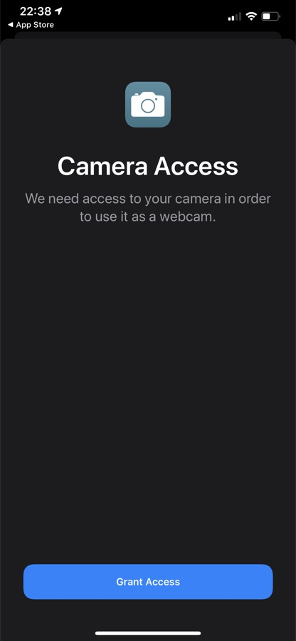

After this has been done, you will see a short overview how to get started after you have met the first prerequisite — no further work on the iPhone is needed at this point so maybe you may already consider how your iPhone will be mounted to be a (possible) fixed part of your desktop once you decide to continue your journey with Camo.

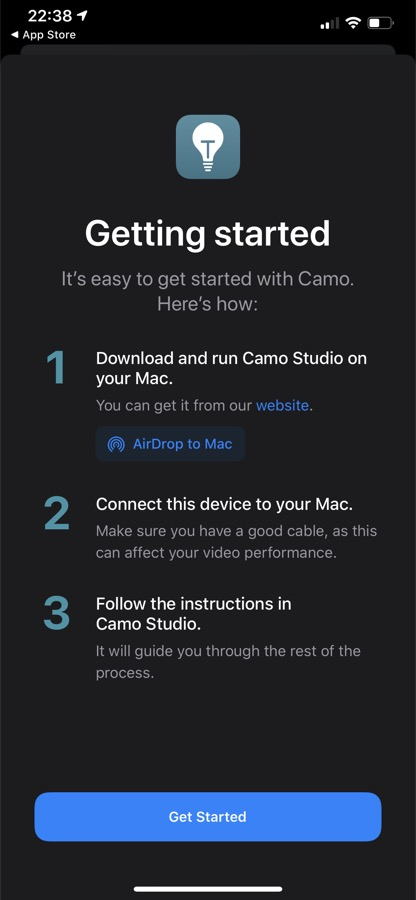

For my cause [the gooseneck mount with wireless charger](https://www.amazon.de/gp/product/B08CGNP7VP/ref=as_li_tl?ie=UTF8&camp=1638&creative=6742&creativeASIN=B08CGNP7VP&linkCode=as2&tag=olipifeinmend-21&linkId=df93bc71352d7c47e8442eda7c86f7b4) from CHOETECH has been quite useful here (and is about to stay my office). 23 EUR here in Germany (meaning US$ 27.99 at the time of writing) aren’t that much of an invest so this gooseneck mount MIGHT be an option!

On your Mac, just download the installation package, unzip it and drag the „Camo Studio“-application to your desired target folder — „Applications“ in my use case.

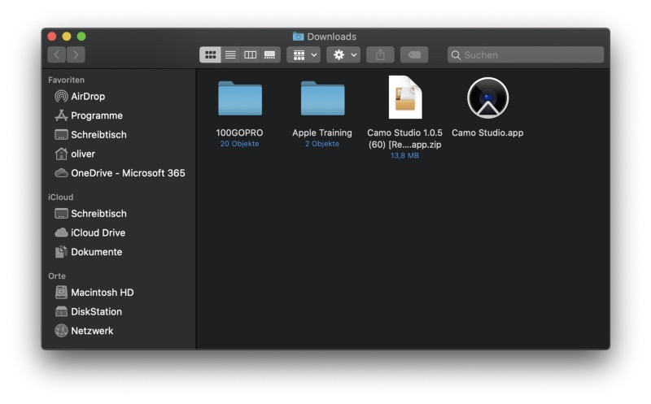

Upon the first start, the app is prompting that it needs to install the Camo video plugin which will need administrative permissions.

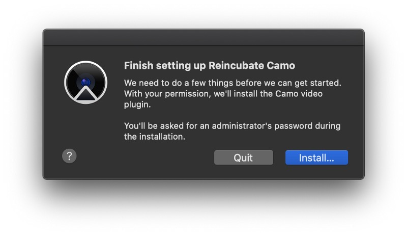

After heading on, you will receive a warm welcome with possible tips and further information on Camo. Although there is a „forever free“-version, you might also consider to upgrade to the full version once you like the software.

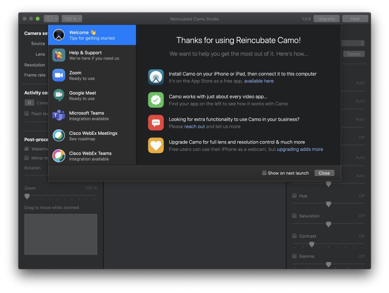

This 12-month-subscription will not only remove the watermark of the free version, but also stream videos in extra high solution, zoom and pan your video even better, switch between your iPhone’s lenses or provide support to the developer’s expert support team.

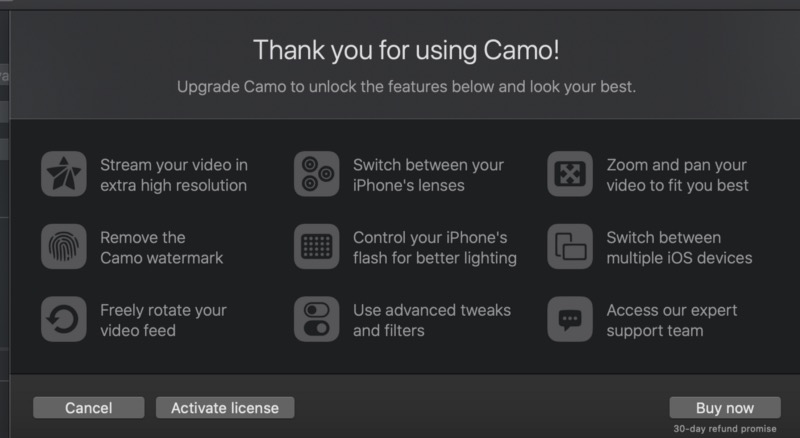

Nearly 40 EUR including VAT here in Germany need to be put in the balance once you consider this so once you like this software after your testing procedure, the price is fair in my eyes although I don’t like the constant-increasing subscription model of nearly every (!) app on the market. Recurring sales are okay to strengthen a company, the jobs and the constant development of the software, but I am spacing out at this point. Nearly 3,33 EUR a month is cheaper than a Grande Caramel Macchiato so I could live with the print of a software I use on a daily basis. Valuable software needs a reasonable pricing but let’s stick to Camo itself before we are getting lost in this vivid „Subscription-or-not“-discussion and sorry for the digression regarding this topic!

## Pairing the devices

All prerequisites have been made, so we are ready to go with Camo at last. Now you need to attach your iPhone to your Mac which is done by the lightning-connection only. Reincubate recommends to use a stable Lightning-cable as the quality of the cable can have an impact on the video quality. Once the app is started on the iPhone and Camo Studio on the Mac as well, you should directly see the output of the iPhone’s camera but the options in the free version are quite limited — so is the video quality as well as 720p is the maximum here. The option itself reveal the early stage of the software which is currently available in v1.05 and changed from beta-state just two months ago.

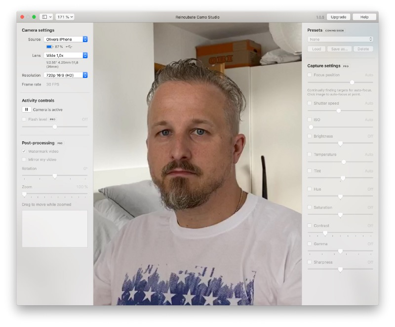

On my iPhone Pro 11 Max I was just able to two camera options — the front (1x) and selfie (1x)-ones while wide angle (0,5x) and telephoto (2x) are a reserved feature for the pro-version. So are Full HD-resolution (1080p) as well as 1440x1080 and 1024x768 — the bucks unlock those features as well as every other feature grayed out in the main screen which, by the way, can be completely closed as Camo Studio directly integrates into your Finder’s menu bar — of course the application must be running in one way or the other, the same counts for the app on your iOS/iPadOS-device to keep the connection alive.

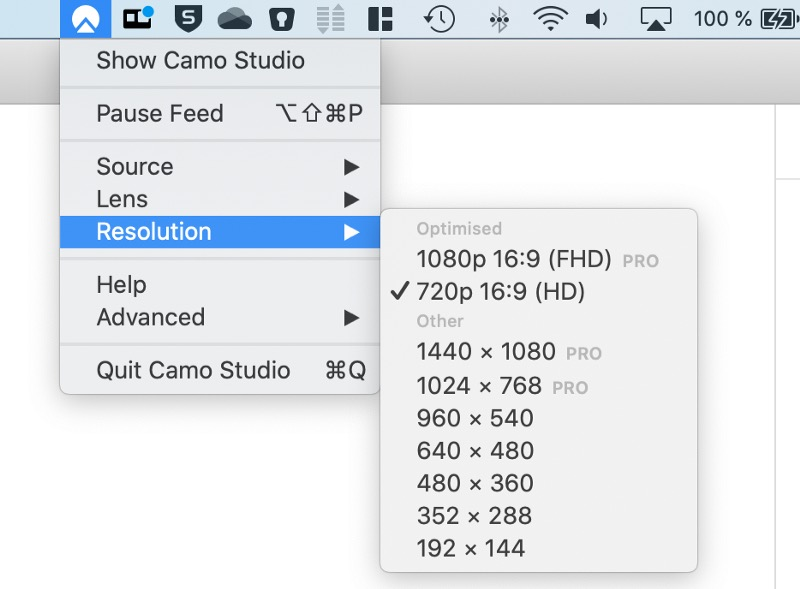

## Supported Apps

While the integration in Microsoft Teams was replicable straight from the beginning (just choose your desired video source) I didn’t found Camo in Skype for Mac 8.62.0.85 (neither did I found my GoPro HERO8) so there seems to be a difference how Skype integrates other webcam drivers which is — apparently — no problem of Camo Studio.

A Jitsi-Session with Safari version 13.1.2 (15609.3.5.1.3) on macOS Catalina 10.15.6 ended up with Safari using the FaceTime HD-camera nevertheless with no other options displayed while the same session with Firefox 78.0.2 gave me the choice wether I want to choose the FaceTime HD, Reincubate Camo or my GoPro HERO8.

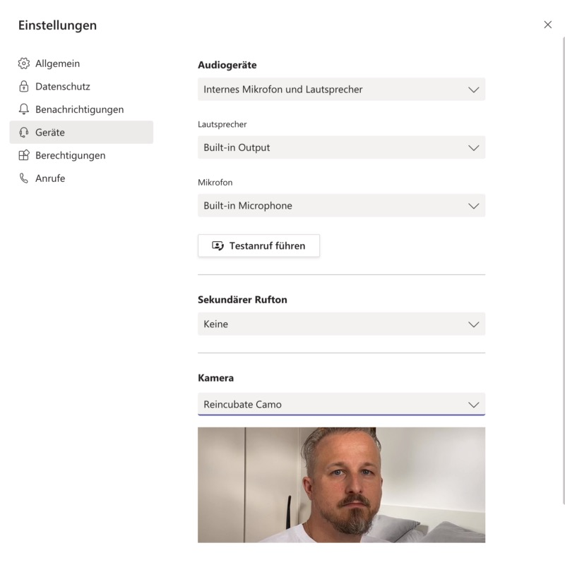

After having a look on the „Help“-section of Camo Studio, there are lots of integration available, even for Skype. Some are supported straight from the scratch (Google or Zoom), some need to be integrated per click.

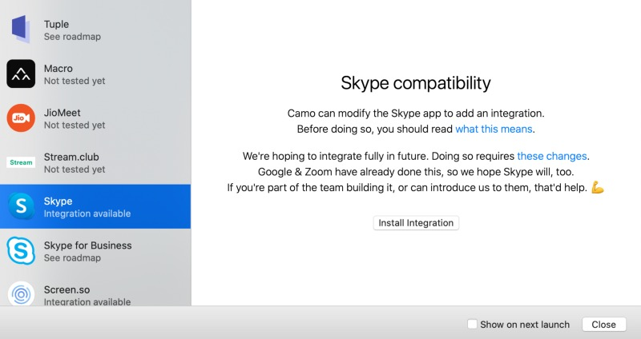

The process itself is a way of cutting down the signature of the desired solution as a security setting is stripped from the app. To be even more specific, Camo has to remove the app’s signature designed to let macOS know if the app has been modified or not. Once you grant your permission and enter your administrative credentials, Camo makes a modification in how the app handles video that allows the use of its virtual camera. Third-party-apps like LittleSnitch may recognize a change of the code signature upon the next start by the way.

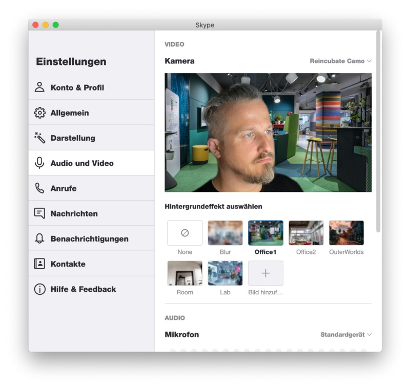

Unfortunately, this is rather a problem of the different software vendor than an issue of Camo itself so, with growing reputation, I am sure that there will be a native Camo-integration in the specific conferencing applications very soon!

After trying it with Skype, I could finally integrate the Camo Webcam and everything was running as expected. So that’s it so far for the software environments I could test Camo with which is — of you have a look on all possible integrations — still an impressive amount of apps that may work with Reincubate’s solution. FaceTime — you may have guessed it — is (unfortunately) not one of those! An always updated list with supported apps may be found at [https://reincubate.com/support/camo/camo-faq/#compatibility](https://reincubate.com/support/camo/camo-faq/#compatibility)!

## Unlocking to Pro

As the free version is quite limited if being compared with the features of Camo, I took a test drive after unlocking the full version — my utter thanks and regards at this time must be shouted at Aidan Fitzpatrick, CEO of Reincubate, who was willing to help in no time so that I was able to write a complete review on Camo. Like every time I need to address that the support of the vendor had no influence on the result of this review but was very welcome to embrace Camo in its whole.

After unlocking, Camo presents its features in complete beauty, all options grayed out before were now accessible so I think the first instinct of every „unlocker“ will have the consequence of playing around with all options at last. So did I and you should also know that each license activated can be tied to a maximum of three Macs which is quite useful in a household — putting the 40 bucks against three installations, the value-for-money-turnaround per year is definitely in reach if you ask me!

First of all it is interesting that you now can take control of your iPhone’s flash which is especially great in darker environments were a certain portion of additional light is welcome. Based on the left pane as well are the basic camera settings (note: Of course those were available within the free version as well but with unlocking all options can now be used!) consisting of the source (my iPhone) and its battery level, the lens settings (just choose your desired setting) and the video’s resolution (now with all available sizes). Below there is the flash level (Pro-version as well), the post-processing (pro) where you may disable the watermark of the free version, mirror the video, rotate and zoom it. Playing around with these features alone show how much more capable the Pro-version is compared to the free version.

On the right pane you will first find presets which are also part of the Pro-plan and about to come soon (quite curious on that as you may load AND save presets of course). Image auto-focusing and all elements that helps you to deal with the image quality and output like shutter speed, ISO-level, brightness, temperature, hue, saturation, contrast, gamma-level or sharpness are your tools for your new webcam. Wether you want to make the picture look cold or warm or yourself looking like a wannabe-Hulk: These are your options to fine-tune your image to present yourself in the best-possible (or worst, depends on your point of view) way and I must admit that I didn’t miss any image-related option here.

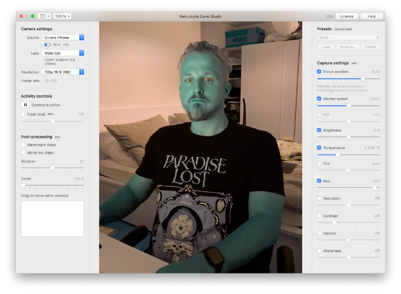

## Final Verdict

Camo (Studio) contains a lot of potential in times where the webcam has a new and more important role than in the age before the mobile workforce appeared on its desks at home, thanks to the pandemic. While Apple is somehow not willing to implement at least a 1080p-webcam in its devices of 2020 (and is seemingly struggling to do so for many years now), solutions like Camo may have good chanced to fill the gap with the gear you already own. Everyone who is not willing to put your DSLR into webcam mode or buy competing Apps like EpocCam might find a great alternative in Camo.

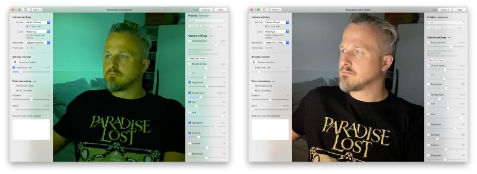

Alas, you can’t have anything and taking care of a solid mount before using your daily driver as your webcam is surely one of the obstacles you may encounter. Take a classical webcam which is a one-timer after buying, mount it on top of your desktop monitor and you are ready to go as well — without a subscription or third-party-apps. On the other hand: What prevents you from using the best camera you already own and which is already your daily driver in the life outside from your desk?

Although Camo is quite a young software, the roadmap already lets expect a certain growth — WiFi-support as well as a Windows-version is already on the list, 4K should be one, too and if there would be any change to blur the background (or implement a specific one) I think most of the wishlist-elements for my personal use case would be checked. While the free version offers fairly little, I rather see this one as an appetizer and door-opener what users may be accomplish with Camo.

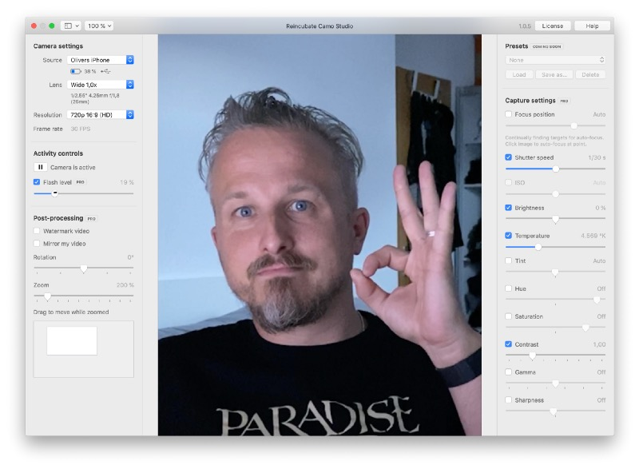

In today’s times of still-rising demand for webcams and a constantly growing need for video conferencing solutions, Camo might be a small cog in the machine with an impressive and big impact. Having already a certain grade of maturity in version 1.05, we surely may expect a lot from Reincubate and Camo in the near future. So far, Camo may be my daily driver instead of the FaceTime HD camera in my MacBook Pro which now looks — unfortunately — even worse than before. While the future is still indefinite and most meetings still take place on a remote basis, Camo can be your tool to manage these tasks with existing resources!