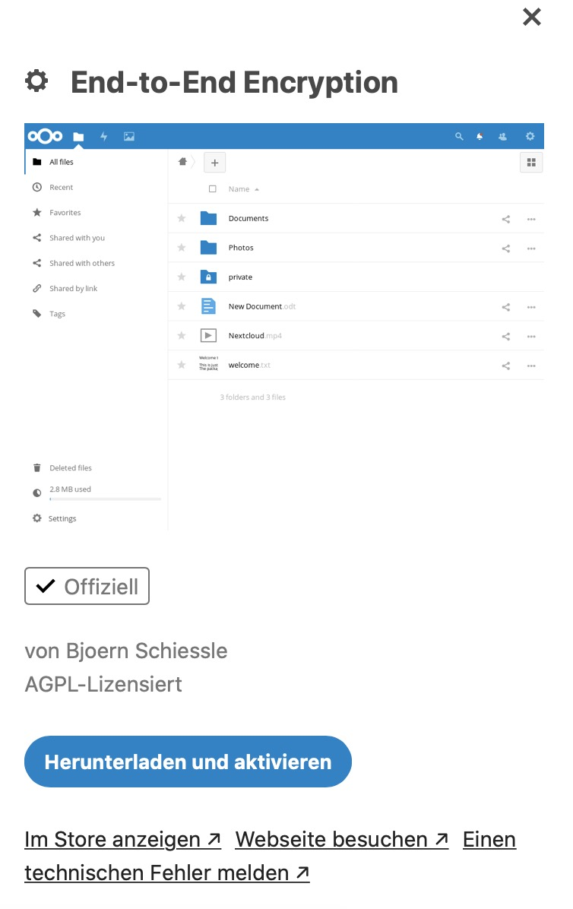

## With the release of the latest Nextcloud-clients in the 3.x-branch, the (formerly) experimental End-to-End-Encryption was finally welcomed. This is a brief tutorial showing you how to implement it!

The feature itself has been there for quite some time now but was always considered as experimental. Now, combining the 3.x-clients and Nextcloud Hub 19, you are finally able to make data and files accessible from your desktops or mobile apps only. Technically, it is encrypted on the one side, being put on your Nextcloud storage (aka. the server) and from this stage on made available to the other side, meaning each supported client can gain access to this data. The storage on the server is used to contain the files nevertheless but being locked out „in the middle“ so you should consider which data needs to be encrypted from end-to-end as using your Nextcloud-instance from the web only won’t help you here.

Enabling the End-to-End-Encryption
----------------------------------

You may have stumbled on this app before but as it was flagged as „experimental“ there was the advice not to use it in production environments simultaneously. Now just head to your Nextcloud App-area while being logged in as an administrative user, download and enable the app. Don’t mix this app up with the server-side-encryption which does exactly this, encrypting your whole Nextcloud-storage on a per-server-basis without the End-to-End-features. That’s it from the server-side.

Taking care of the clients
--------------------------

In my daily usage scenario in the team of Cupertino, I updated my apps on macOS 10.15 „Catalina“ and iOS 13.7 to the latest release which officially supports the now polished end-to-end-encryption. Once the apps have discovered we have activated the feature in Nextcloud’s backend, it will tell us that End-to-End-encryption is supported here.

We may now activate the feature on the specific client which will lead us to an appearing, individual passphrase („mnemonic“). This passphrase is used once we tell another client to activate the encryption feature so write it down, copy it to your own password manager — but remember it!

The iOS-app doesn’t differ that much although a specific prerequisite must be met: The app-lock, either by a PIN or Face/Touch-ID, needs to be activated first. Then, the encryption (here still flagged as „experimental“) can be activated as well. Once this is done, the „mnemonic“ the first client issued us when activating the E2E-feature for the first time needs to be entered and — et voilà — the mobile client participates from the encrypted files as well!

Encrypting folders and files
----------------------------

While I haven’t figured out how to encrypt existing folders (the client shows neither a reaction nor an error) the best-practice seems indeed to create a new folder, leave it empty as it is and right-click from within the Nextcloud-client on this folder. The option to „Encrypt“ will appear and once clicked, a green lock should appear after a few seconds showing that the encryption is done.

Once this step has been accomplished, you may now put your desired files into the folder, build your specific folder tree and store all related files in it — the encryption will do the rest.

When venturing to this folder from Nextcloud’s web interface, the folder will be marked with a lock as well and the contents are — you may have guessed it — not readable.

The verdict
-----------

The implementation of the End-to-End-Encryption within Nextcloud as been an experimental feature for quite some time and still today, it’s not as trivial as it should be — enabling the app is just barely the half of the job. With the clients on macOS, Windows and Linux and iOS as well as Android, Nextcloud closed the circle and made this feature available in its (stable) whole. As always, it should be considered which stuff really needs to be encrypted, especially if you use Nextcloud on a web basis mostly once your classic clients aren’t at hand.

In the end, you have successfully made use of Nextcloud’s End-to-End-encryption feature and your working device equipped with the Nextcloud 3.x-app! While this tutorial is focused on the Apple-environment, you won’t encounter much differences when venturing through the client-worlds of Windows, Linux and Android!