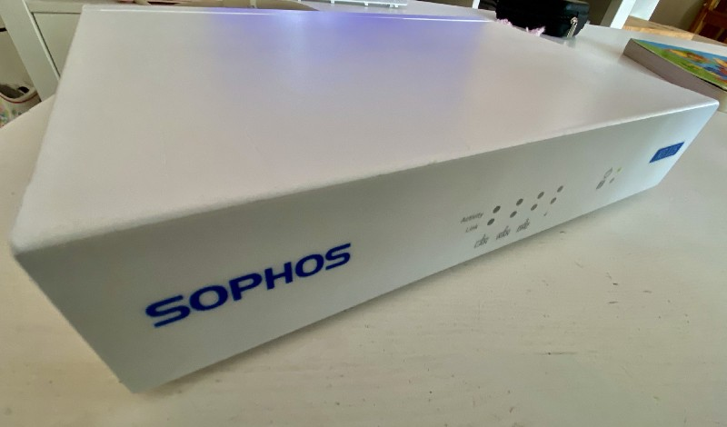
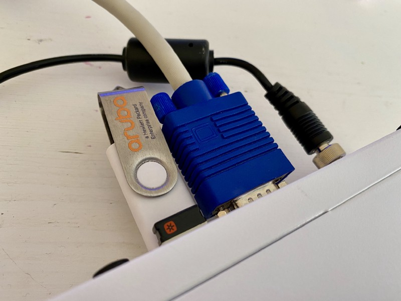
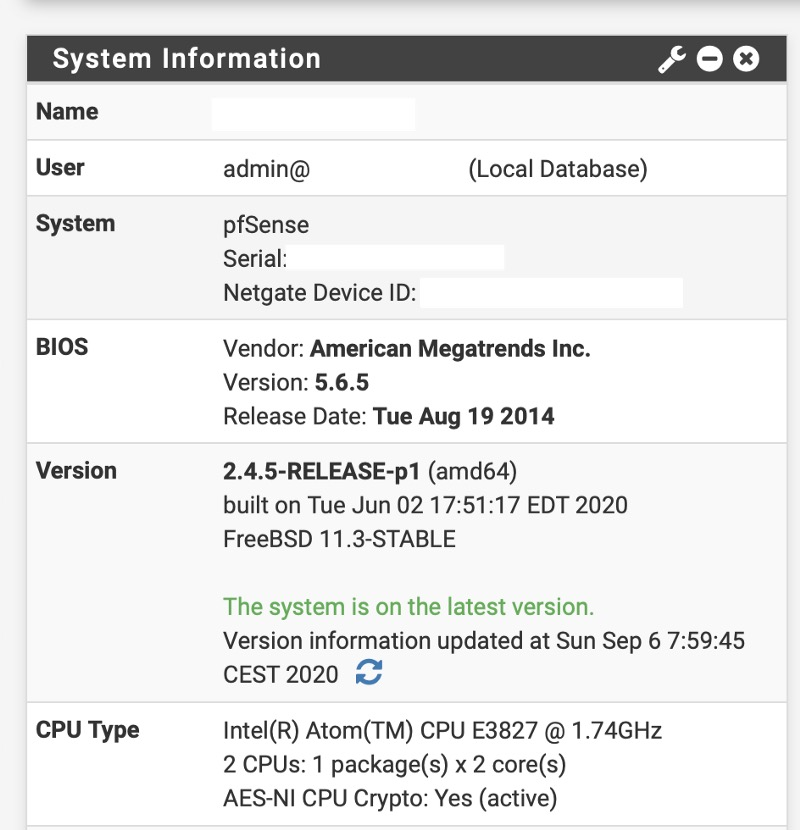

## After accompanying Sophos for quite a long time, the security vendor seems to be stuck between two worlds lately when it comes to its two firewall-editions. There is space for alternatives anyway!

Besides of that, getting hold of an outdated XG-appliance is still a great deal to build another firewall upon a solid and tested hardware. Putting the common SG/XG-discussion away, deploying an open source-based solution like pfSense or OPNsense could be a no-brainer — if there weren’t some obstacles. Let me show you how to build a firewall on your own on solid hardware nevertheless — it’s not that difficult!

I got hold of a worn-out Sophos XG 115 (rev.2) which is basically still a great piece of hardware: Rack-mountable, fueled by a two-core Atom-CPU, 4 GB RAM, 64 GB of SSD-storage and four Gigabit-LAN-Ports are the key facts this device comes along with. On older SG-devices, it was no problem to boot from an external medium to install the firewall of your choice. Here, the installation of both OPNsense and pfSense freezes while booting from the medium, making it (seemingly) impossible to equip the XG-appliance with non-Sophos software.

First of all, enter the BIOS and factory-reset the device to prevent any additional problems caused by specific settings. After a rebooot, navigate to Advanced > USB Configuration > Port 60/64 Emulation and disable the feature. Somehow all other operating systems except the BSD-system pfSense / OPNsense is based upon seem to have a certain tolerance for the 60h/64h-feature. Wiping away the first obstacle (not further caring if its hardware- or BIOS-related here), the installation can proceed but the installer still stucks at booting.

Next step is to reboot and choose option 3 in BSD’s start menu before booting — you may enter a shell to alter the loader config here. Once this is done, a combination of three commands helps to bypass the boot-loop. While some users say that the last command is the key to the final boot, a combination of the following three, directly typed into the console line by line, shouldn’t harm anyone or anything at all:

> **set hint.atkbd.0.disabled=1**  
> **set hint.atkbdc.0.disabled=1**  
> **set kern.vty=”sc”**

After typing these, the command „**boo**t“ followed by a stroke of the Enter-key finally leads us to the installation of pfSense or OPNsense. You may now install the firewall software like there were no boundaries at all and once this is done, don’t reboot (yet) as the boot-loop will return unless you don’t alter the boot-config.

When asked for a reboot or the chance of entering the shell to customize some aspects of your firewall, vote for the second choice. A BSD-/Linux-like shell will appear and by typing

> **vi /boot/loader.conf**

you now have the chance to permanently alter the loader config. Type „i“ to insert a line, navigate (for example) at the top of the file and insert

> **kern.vty=”sc”**

there. Afterwards, hit the „ESC“-key and type „**:wq**“ to write this altered file.

The command „reboot“ then fires up your freshly-installed pfSense/OPNsense-firewall so that you may make the basic configuration on the appliance which is cloaked as Sophos XG-hardware: Assigning interfaces, changing your root-password, entering the desired IPs and stuff like that — after the initial configuration, the rest is done via the web interface and your new firewall appliance is ready to go!