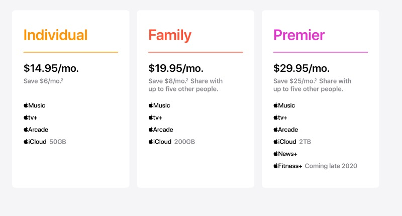
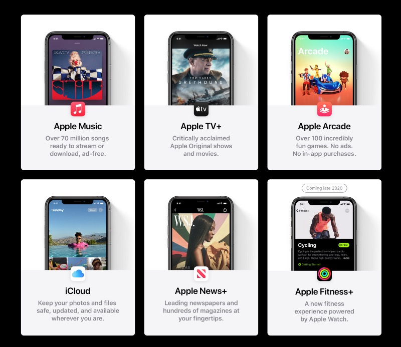
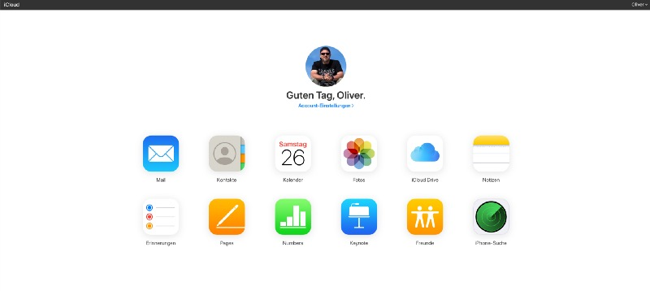

## Last Thursday, Apple announced details of upcoming features designed to detect CSAM - and the world reacted.

On September 15th, Apple has not just released a new iPad Air or the Apple Watch 6 and SE. The expected bundle of Apple Services has shown up as well and is destined to complete your journey into Cupertino’s microcosm, putting all the stuff you monthly pay for anyway into a lovely bundle. This all sounds just to great and if you ask me, there is still room for more which may be the reason Apple One hasn’t absolutely convinced me… yet!

Some months ago I reflected on the [importance of services](https://medium.com/@OliverPifferi/services-its-all-about-them-now-b7146e55a1b1) and — in another article — on the [long-overdue overhaul of iCloud](https://medium.com/macoclock/why-apple-needs-to-strengthen-and-upgrade-icloud-6d775fa275d5). While I love being completely captured in Apple’s world (call it „locked up“ or not), there are still aspects I rather dislike. Apple One, which rumored throughout the web some days ahead of the event, could have implemented some stepping stones towards a freshened iCloud but — as you may have guessed and already know — it is „just“ a bundle of services that existed anyway. Unfortunately, without the requested overhaul which I was desirous of over the last months and years.

Apple has turned into a service provider, focusing on its future in this genre. Hardware and software are still there, but more or less a platform and foundation for these services. While macOS and iOS/iPadOS still fuel the hardware specs, the transition to services (and managed services, MSP, in the whole genre) is a fact that is already turning over the IT genre. Recurring services are on the rise (and still were when we once decided to subscribe to any streaming service) and while there is no better way to put loyal customers in an enclave of your own services, the danger of somehow missing any aspect is always present.

While I already am an Apple Music-subscriber and bound to the 2 TB iCloud Drive-plan (thanks to my wife for heavily exceeding the 200 GB-limit just by her iPhoto-library!), Apple TV+ is a nice and free addition that once came with an iPad. I tried Apple Arcade but with less time for mobile gaming (and even gaming at all, if you look at my Xbox One X at home), the five additional bucks didn’t work out for me. With the announcement of Apple One I did not only hope for a ideal mixture of Apple services for me but also for a certain flexibility like „put that service away, take this instead“.

Apple One’s family plan seemed interesting for saving 5 EUR at the first view but while I could relinquish Apple Arcade, I definitely need the 2 TB iCloud Drive-option which seems to have been placed into the „Premier“-plan which is — and I stop wondering about these decisions — not going to reach Germany for now. Simultaneously I still not know if I am going to renew Apple TV+ or see Fitness+ as such a killer feature that five additional EUR (if this plan ever hits German ground) would be a perfect bargain for me. Wiping Apple Arcade off the Family Plan, offering 2 TB of iCloud Drive instead and I would have been on board, further embracing the infrastructure of Apple’s services than ever before — and believe me, I still know the good, old .Mac.com-times!

Putting these thoughts away and hoping that Apple may consider a „Pick and Mix“-strategy for parts of Apple One, I still think that it is about time to put iCloud.com either to a new level or to its grave. I once wrote about the status of iCloud and while the basic services encapsulating us in Apple’s microcosm are still E-Mail, Contacts and Calendars, the service is just slow and the web interface hasn’t changed for quite a long time now. Compare it with the monoliths of Google or my favorite Outlook.com by Microsoft and iCloud looks like a relict from the past. IMAP-handling is still strange compared to all other solutions I know of and while the integration in and on Apple’s devices is unbeaten (I’d love to have everything out of the hand that feeds my IT), the frontend just looks and feels outdated — and look what Microsoft has learned over the years and how Outlook.com looks nowadays — did I mention the possibility of integrating your custom E-Mail domain by the way?

Summing everything up, there are plenty of reasons while Apple One isn’t the product I hoped for. I miss the flexibility I need in a six-person household especially when it comes to the iCloud Drive-storage. And I see the missed chance to overhaul iCloud.com, giving the service a new, modern, fresh and also flexible face — guess how great it would be to use your iCloud.com-mail with your own E-Mail-domain after all the years, especially in times where Apple is seemingly trying to get rid of the old .mac.com and .me.com suffixes?

Don’t get me wrong, these are just my two cents and Apple One will surely hit the market as it’s supposed to do, but it is — like many other products — not something for the broad masses, not THE service package for just everyone. It’s missing the flexibility user strive for nowadays and even if I generally have no problem to combine my expenses and focusing them towards Apple even more, I am claiming for service-orientated approach outside the well-known and famous Apple-services. Cupertino should not forget about the basics of iCloud.com which are still more than „just“ storage place in the cloud and while Apple’s hardware is nearly divine for me, the E-Mail-thing still feels like an unwanted stepchild in late 2020.

Is this a sign of resignation or the calm before the storm that overhauls this service as well? Only time will tell, until then Apple One needs to come to maturity…