## It has been a tremendous ride with Nextcloud for the last four years after the company appeared on the stage for the first time.

Anyone who thought Nextcloud that kept a fast pace so far may have been surprised this weekend as the Conference 2020 brought up a lot of interesting news, showing that the top hasn’t been reached at all. Nextcloud is expanding from a file-sharing solution to a complete and even more versatile collaboration suite trying to reach all extents. The kind of convention was different this time as the shadows of COVID-19 still prevented gatherings like we know them in „good old times“, but thanks to Nextcloud Talk on the official Convention-site and a livestream on YouTube, the good word could be spread anyway.

## The debut of Nextcloud Hub 20 as an integration platform

When founder and CEO Frank Karlitschek hit the stage with the first keynote at 10 am, it was already clear that version 20 of Nextcloud (Hub) was due to release. Frank didn’t disappoint the digital crowd here and with the immediate release of Nextcloud Hub 20, there were plenty of changes coming through the thirsting users. Starting with a modern and customizable dashboard pulling strings for the single users over an universal search, Nextcloud is now an official integration platform. Reaching out across own boundaries by embracing services like Gitlab, Jira, Moodle and even Slack and Microsoft Teams, Nextcloud Talk gets a broader base of users to talk to while the universal search supports not only the own instance but — partly — also the other service’s contents.

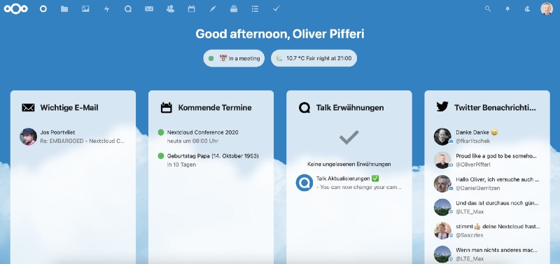

Nextcloud Hub 20 — Dashboard

> Nextcloud Hub 20 is a dramatic step for users, bringing the different platforms they use during the day into an integrated experience. This can reduce friction, improve reaction times, avoid context switching and ultimately bring greater productivity to our tens of millions of users across the globe — all the while protecting data security and digital sovereignty of private and enterprise users.

(Frank Karlitschek, CEO and Founder of Nextcloud)

As the pandemic has changed the way we work, live and communicate with each other, there is a need for solutions to handle all this. While many solutions were springing up like mushrooms during the beginning of COVID-19, the idea of data protection was often left behind, depending on how the single services were deployed. With the focus on becoming an integration platform furthermore, Nextcloud and especially Nextcloud Talk in the new version 10 open yet another door to tie different services together, building bridges between foreign worlds.

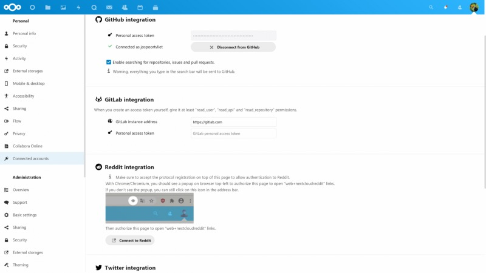

## Nextcloud Talk hits version 10

Talk 10 brings performance and call reliability improvements, introduces the well-known emoji picker and upload view, a new camera and microphone settings, certain mute abilities for moderators and even more. The Deck-app now introduces a modal view for card editing and Calendar integration, while the Calendar itself introduces a list view and design improvements. Also Nextcloud Mail got some overhauls with the new and extensive mailbox management features, threaded email views and other interface updates.

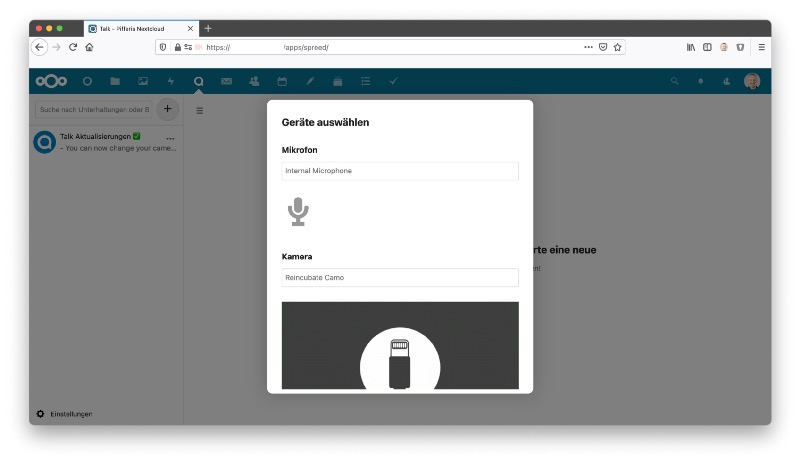

Nextcloud Flow is extended with push notifications and webhooks so other applications can more easily be integrated with Nextcloud work flows. In the Nextcloud backend, several performance and security improvements were integrated to enhance responsivity to user activity. Moreover, LDAP backends are now told to provide address books and a wide range of design, usability and accessibility improvements was made to Nextcloud.

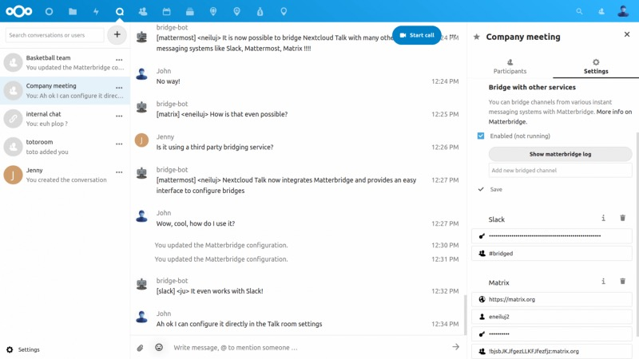

Whoever needs the HPB (High-Performance-Backend) for using Talk with more than four to ten participants (usually with a larger number of 30–50) may now not only build his own solution on a powerful machine but also rent it directly from technological partner Struktur AG. Nextcloud and Struktur AG have announced a „HPB-as-a-service“ with a 30-day trial and integrated signup in Nextcloud Talk.

> There continues to be a great demand for secure video conferencing, and with an easy, integrated registration process in Nextcloud Talk, we are able to provide a privacy-compliant, unified communications platform that is 100% compliant with regional general data protection regulations.

(Niels Mache, CEO Struktur AG)

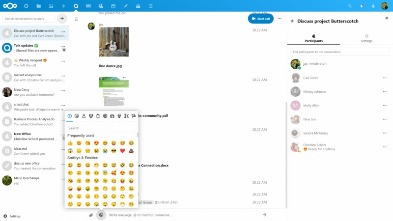

The integrated signup means that implementing the rented HPB just needs one click from with Nextcloud’s backend to get the local Talk-installation and the HPB-service merged. After the 30 days, users can join in for a subscription or just end the trial.

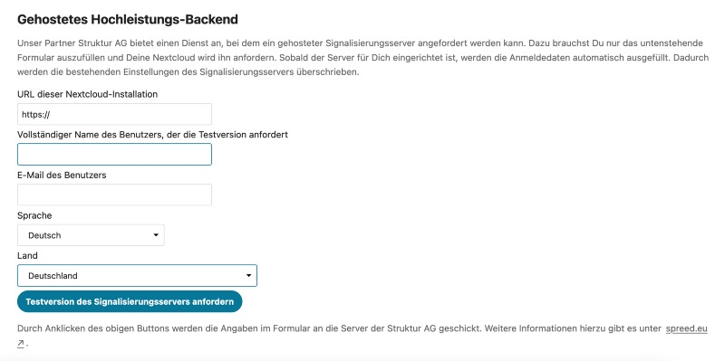

## The Hub becomes a real hub

„Integration“ is one of the keywords of this year’s Nextcloud Conference. While the term „hub“ was introduced with v19 as a collaboration platform, it becomes even more clear that this was just the beginning. Pairing with dominant solutions like Microsoft Office Online Server or Slack and other well-known services like Jira and Github, Nextcloud embraces other services even more in and on its home base.

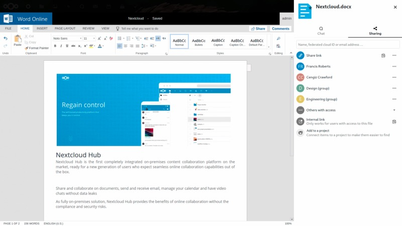

> Nextcloud has become the central communication and document exchange hub for many organizations. Integration with third party solutions deployed at our customers or their partners, suppliers and customers will further improve their productivity and facilitate collaboration within and across organizational boundaries.

(Frank Karlitschek, CEO and Founder of Nextcloud)

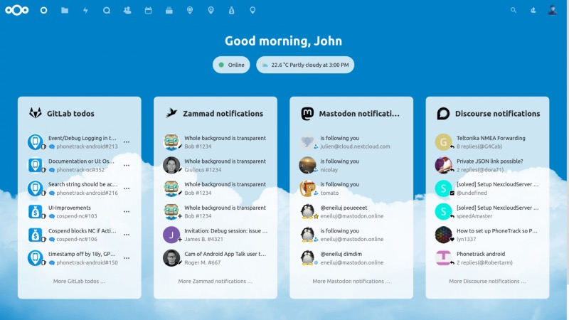

## Building bridges instead of burning them

There are many storage silos that Nextcloud could connect for quite some time now: Just take Dropbox, OneDrive or S3-storage for example. In today’s steady-growing storage world, the real task is not to get lost with your data over various service providers. Nextcloud enters the stage here once again, building on an open API entitled „Open Collaboration Services“, trying to deliver a better overall experience to the users. The aim here as well: Concentrating on one solution, one environment and one single interface without the feeling of spreading many information on even more platforms.

Literally and technically, bridges are built — one of them is between the Nextcloud Talk chat service with Microsoft Teams, Slack, Matrix, IRC, XMPP, Steam and many more. Second there is the unified search gathering result from connected services like Jira, Github, the learning platforms Moodle and HPI School Cloud, Discourse and Reddit or Mastodon and Twitter.

> The crisis has increased the need for online collaboration solutions and Nextcloud and Moodle are extremely popular in the educational space. An expansion of our integration as initially developed in 2017 is set to benefit millions of students and teachers.

(Martin Dougiamas, Founder/CEO at Moodle Pty Ltd.)

## Back to School — in one way or the other

Being a father of four and looking back to the beginning of the pandemic, the biggest task was surely the one to see how schools were (not) prepared for the lockdown. Four schools, more than four ways of dealing with homeschooling and one of those even with the basic thought of putting scanned paper to Google Drive: This time in general has shown that we have not a lot to learn in general as it comes to the field of digitalization but especially when we are putting the focus on the learning efforts of our children.

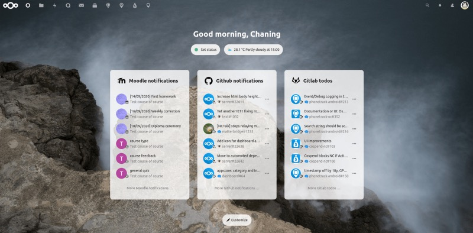

In 2017 already, the Nextcloud Education Edition debuted support for file handling integration in Moodle (which was used at the school of our eldest daughter). In collaboration with Moodle, Nextcloud has extended the integration with the solution, implementing a Moodle “mobile web service” authentication flow, integrated a Nextcloud Dashboard widget showing upcoming events and recently accessed courses from Moodle and developed a search integration that can search for courses and other content in Moodle.

> Together, Moodle and Nextcloud offer educators a complete platform for remote learning and connecting to students. The new integration capabilities create a more integrated experience for users, bringing the two platforms closer together.

(Frank Karlitschek, Founder and CEO at Nextcloud GmbH)

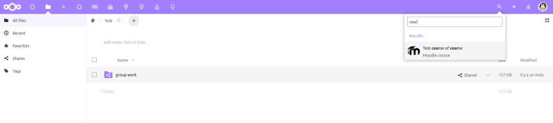

The new integration capabilities are available from the Nextcloud app store for the recently released Nextcloud Hub 20 right now. Customers settled in an integrated learning management and content collaboration platform may directly contact Moodle Pty Ltd. or Nextcloud GmbH. A roadmap for further integration between Moodle and Nextcloud has been defined and upcoming Moodle and Nextcloud releases will deliver a further improved user experience so that schools may be prepared in the future for whatever may come.

## The Verdict

Nextcloud 20 has landed with some really heavy news. Although rumors already told of quite a big event, the first conference day was equal to a firework of features coming with version 20. While the solution itself just gets better release by release, the buzzword „integration“ must be put in capital letters here, Nextcloud is trying to embrace other worlds and services even more, trying to put them all into one (blue) hood.

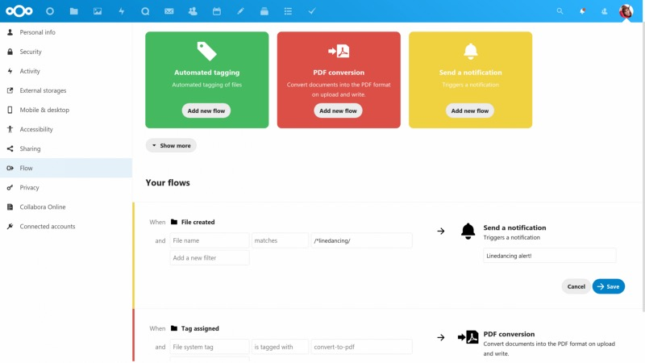

There are boundaries between services — services that never were destined to work together. Nextcloud is reaching out for those, wanting to build bridges to deliver one final platform. No matter which services you use, your Nextcloud-environment could be the one specific entry point while the original idea behind it — the file-hosting- and collaboration-aspect — is fueling everything by the well-known, solid base. An interruption of learning and education could be a relict of the past once the people in charge manage to build one common platform for their tools.

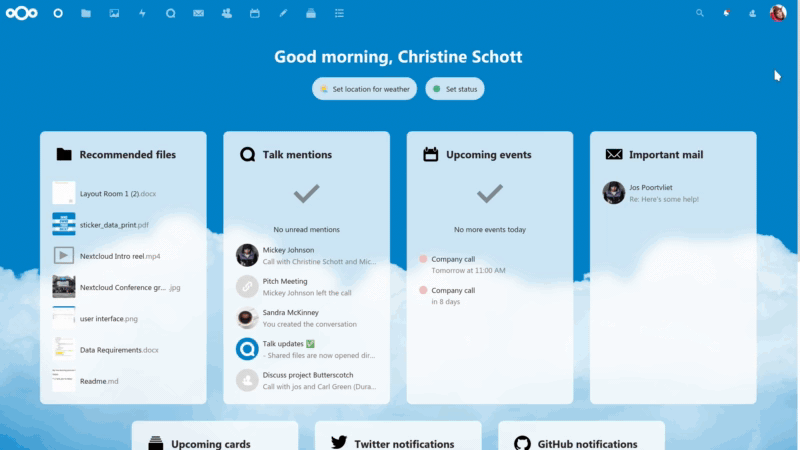

Nextcloud is trying (and seemingly solving) to be the key so it’s up to users, schools and administrators to use this key to unlock a door to a modern kind of collaboration in 2020 — surely one of the better aspects in this strange year!