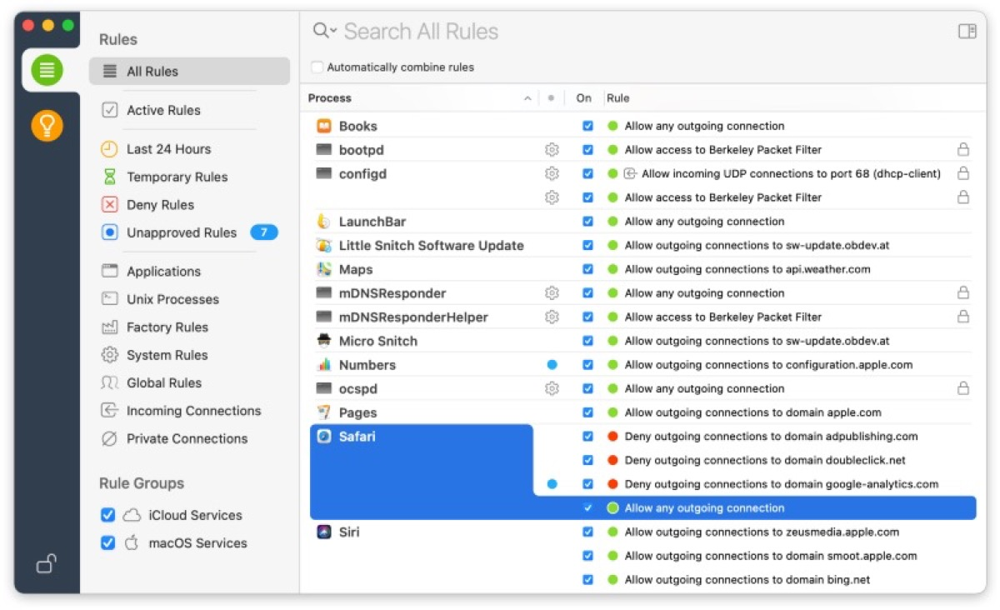
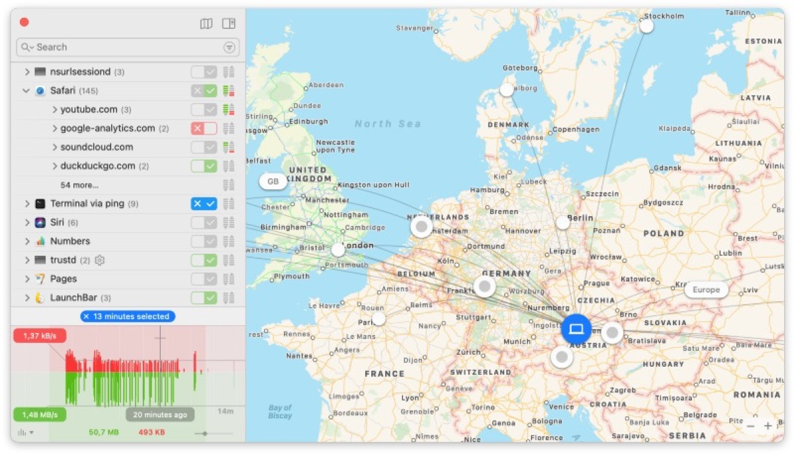

## A firewall is a nice and essential security building block. While it is mainly used as the perimeter to and of your network, dividing the Internet from your intranet, there are also software firewalls which can be installed on Macs and PCs.

While using different types of firewalls often depends on the personal use case and/or the customer’s needs, it may be doubted if a hardware-firewall should be combined with a software-derivate. Anyway, while the hardware-version is mainly used to stop the malicious traffic before it reaches your network, a software-firewall may serve yet another need: The goal to make visible what tries to send data from your computer into the World Wide Web. One of the software components accompanying my Macs for many years is Little Snitch by Austrian developers Objective Development.

So far, Little Snitch 4 was not able to work in the new macOS 11 Big Sur-beta due to the way Apple now handles some extensions, but just before Big Sur may see the light of the day sometimes in the near future, Little Snitch 5 is being crowned to be fully-compatible with macOS 11.

Everyone of you who tried the beta of Big Sur may already have experienced the issues with Little Snitch 4. These were caused by the way the new filter technologies Apple used with Big Sur and made the adoption quite a challenging task. To match these new conditions, Little Snitch was re-designed from the scratch and forced to drop the old way of using kernel extensions for the filtering mechanism. Besides this, the well-known outfit of Little Snitch has been put into new clothes to visually match Big Sur, too. The latest macOS-version takes a completely new approach for the whole look, catching up to the style we already know from iOS and iPadOS.

Besides the technical base which gots the needed, complete overhaul, the installation procedure is now the well-known Drag n’ Drop-method, turning the reboot of previous versions to a relict of the past. Objective Development also took care of an improved traffic monitoring as it no longer requires the „Network Monitor“-application running in the background just to gather this information. Besides of the optimized structure, this new process leads to a reduced memory and CPU-consumption. In addition, the improved monitoring system is now able to hold traffic information from up to a whole year which is yet another improvement from the „last hour“-option of the previous releases. Last but not least, Little Snitch also got a command-line interface making scripting options possible for the very first time.

If you have purchased Little Snitch 4 after November 1, 2019, you can upgrade to Little Snitch 5 for free — just use your existing license key. If you purchased Little Snitch 4 before that period, you can get the upgrade at a reduced price, a single license is — for example — reduced to 25 EUR from 45 EUR. The software is being distributed in version 4.6 which runs on Mac OS Catalina and version 5 which is designed to work on macOS Big Sur only. Once you own the desired license key, it will work on both versions of the software.

After ten years serving for our personal privacy, Little Snitch makes its successful transition to Apple’s upcoming new macOS 11 Big Sur just in time. I did not hesitate to invest the 25 bucks for the update as — just as I have stated before — Little Snitch is an essential part of my Mac-setup and takes over at a stage where the integrated macOS-firewall (which just locks up towards incoming connections) reaches its natural limit. If you want to see what kind of traffic is leaving your Mac or which application phones home, Little Snitch is the ideal addendum for a software-based security setup, not mentioning that you may (and probably will) still need a hardware firewall serving as your internet gateway. Anyway, this software completes the whole set and additionally secures your Mac.

You may [download](https://www.obdev.at/products/littlesnitch/download.html) and test Little Snitch [here](https://www.obdev.at/products/littlesnitch/download.html) while you may purchase the full version which then unlocks your demo at [https://www.obdev.at/products/littlesnitch/order.html](https://www.obdev.at/products/littlesnitch/order.html) !