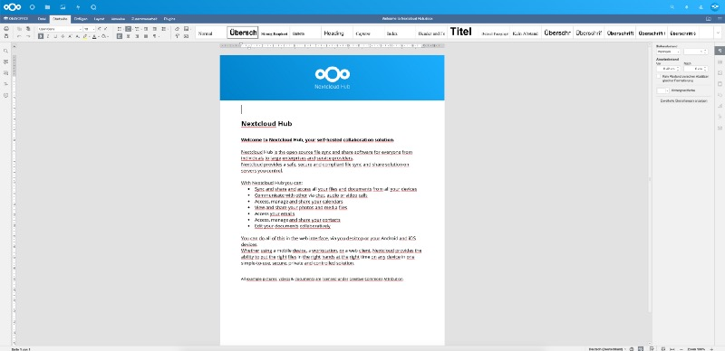
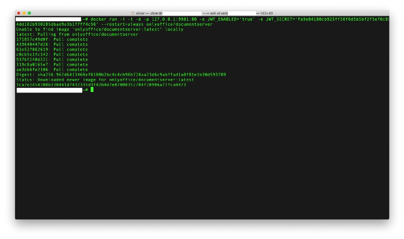
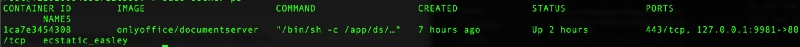
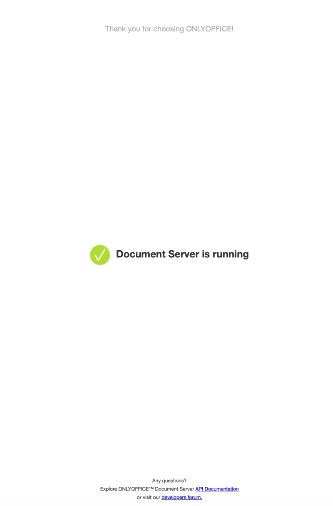
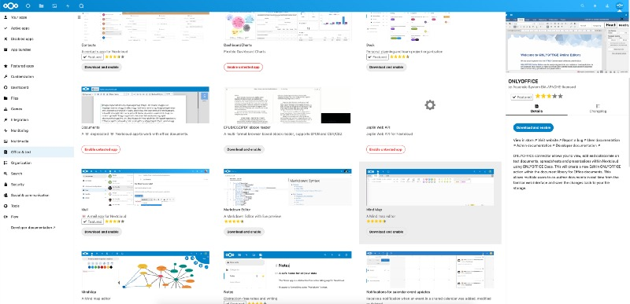
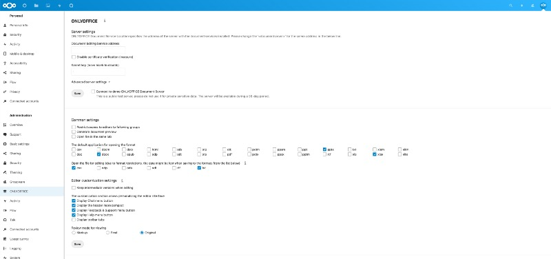
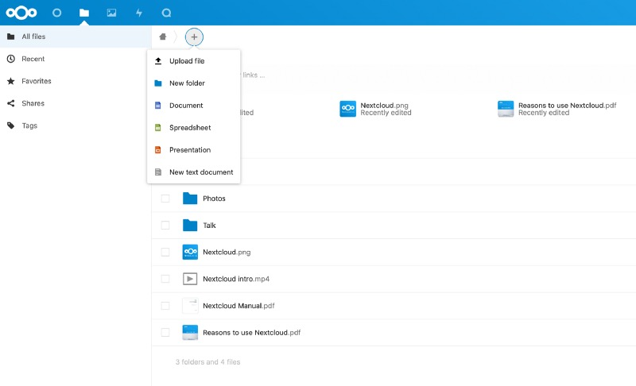
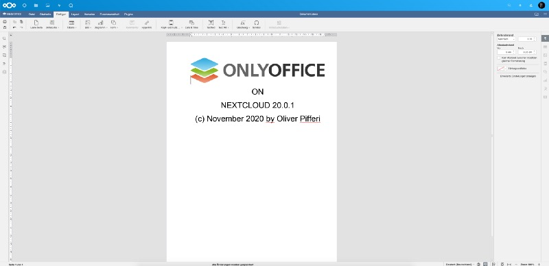

## The choice of a proper Office-suite is a difficult one and needs to fit to the personal needs which are, as we know, often different. While Microsoft Office is surely THE standard for many, there are good alternatives around and especially when you are working with Nextcloud, two Office-solutions may be the ideal fit for you.

First of all: Everything depends on your needs and — also — on your personal taste. If you don’t like the Microsoft-way or don’t want to pay for a subscription, Nextcloud fortunately offers two famous Office-distributions: First, Collabora Online with its Libre Office-background, strictly tied as the „out-of-the-box“-Office from Nextcloud 19 on. My preferred alternative is ONLYOFFICE which made it to a Nextcloud-standard installation in Nextcloud 18 — both have their pros and cons but personally I managed to get better along with ONLYOFFICE.

Anyway, while you may activate the desired solution and its integrated Document Server in the „Apps“-section of Nextcloud, my preferred choice always was to use a Docker-ized version of the desired Office-suite so let me show you how you may integrate ONLYOFFICE founding in a Docker-image in the late Nextcloud Hub 20.0.1!



Let’s go!
---------

The prerequisites met so far are an updated and therefore actual Ubuntu 20.04/Debian 10-Linux system with an installed Apache Webserver. In my case, Debian is the preferred distribution and Apache already serves my Nextcloud-environment. Certbot for fetching the Let’s Encrypt-certificates is installed as well so we are ready to go. First of all, the Docker-environment needs to be downloaded to build the base of the ONLYOFFICE-Document Server in its Docker-ized state. The following commands should do this:

```
sudo apt-get install docker.io
sudo systemctl start docker
sudo systemctl enable docker
```


The first command installs the Docker-environment while the second starts it and — you may have guessed it — the third enables it to start at boot time. Just in case Certbot is not yet installed, also fetch it by typing

```
sudo apt-get install python-certbot-apache
```


and you may head to the configuration of the webserver which will also play the role of a reverse-proxy serving the contents of you Docker-container.

The Reverse Proxy
-----------------

Create a new virtual host configuration, for example by typing (I prefer to use vi though!)

sudo vi /etc/apache2/sites-available/001-office.domain.tld.conf

where „office.domain.tld“ needs — of course — to be replaced with the desired hostname for your environment. In my example, my Nextcloud and my ONLYOFFICE-instance are on the same machine so you will need an additional A-entry in your domain’s DNS-settings pointing to the IP of your Nextcloud. The file itself should be empty and you may fill in the following, basic content:

```
<VirtualHost *:80>
ServerName office.domain.tld
</VirtualHost>
```


Save the file and activate the new site in your webserver’s environment as well as the modules needed to get ONLYOFFICE working:

```
sudo a2ensite 001-office.domain.tld.conf
sudo a2enmod proxy proxy_http
sudo systemctl restart apache2
```


SSL-Security

As the new host is now known to Apache, we need to fetch our Let’s Encrypt-certificate to make the SSL-encryption working for our container. Let Certbot do its work by typing

```
sudo certbot --apache
```


and head through the process. Usually, you may just choose to redirect all http-requests to the https-site for the desired (sub-) domain. Afterwards, Certbot should tell you about the successful fetching of the certificate so let’s have a look on the newly-generated Apache-SSL-site:

sudo vi /etc/apache2/sites-available/001-office.domain.tld-le-ssl.conf

enters the configuration file where you now need to change the file according to the following sample:

```
<IfModule mod_ssl.c>
<VirtualHost *:443>
ServerName office.domain.tld

SSLProxyEngine on
SSLProtocol             all +TLSv1.3 -TLSv1 -TLSv1.1 -SSLv2 -SSLv3
SSLCipherSuite          ECDHE-ECDSA-CHACHA20-POLY1305:ECDHE-RSA-CHACHA20-POLY1305:ECDHE-ECDSA-AES128-GCM-SHA256:ECDHE-RSA-AES128-GCM-SHA256:ECDHE-ECDSA-AES256-GCM-SHA384:ECDHE-RSA-AES256-GCM-SHA384:DHE-RSA-AES128-GCM-SHA256:DHE-RSA-AES256-GCM-SHA384:ECDHE-ECDSA-AES128-SHA256:ECDHE-RSA-AES128-SHA256:ECDHE-ECDSA-AES128-SHA:ECDHE-RSA-AES256-SHA384:ECDHE-RSA-AES128-SHA:ECDHE-ECDSA-AES256-SHA384:ECDHE-ECDSA-AES256-SHA:ECDHE-RSA-AES256-SHA:DHE-RSA-AES128-SHA256:DHE-RSA-AES128-SHA:DHE-RSA-AES256-SHA256:DHE-RSA-AES256-SHA:ECDHE-ECDSA-DES-CBC3-SHA:ECDHE-RSA-DES-CBC3-SHA:EDH-RSA-DES-CBC3-SHA:AES128-GCM-SHA256:AES256-GCM-SHA384:AES128-SHA256:AES256-SHA256:AES128-SHA:AES256-SHA:DES-CBC3-SHA:!DSS
SSLHonorCipherOrder     on
SSLCompression          off
SSLCipherSuite HIGH:!aNULL:!MD5:!3DES

SetEnvIf Host "^(.*)$" THE_HOST=$1
RequestHeader setifempty X-Forwarded-Proto https
RequestHeader setifempty X-Forwarded-Host %{THE_HOST}e
ProxyAddHeaders Off

ProxyPassMatch (.*)(\/websocket)$ "ws://127.0.0.1:9981/$1$2"
ProxyPass / "http://127.0.0.1:9981/"
ProxyPassReverse / "http://127.0.0.1:9981/"

Include /etc/letsencrypt/options-ssl-apache.conf
SSLCertificateFile /etc/letsencrypt/live/office.domain.tld/fullchain.pem
SSLCertificateKeyFile /etc/letsencrypt/live/office.domain.tld/privkey.pem
</VirtualHost>
</IfModule>
```


Here, the handling of the reverse proxy is being defined so that the port 9981 the Docker-container runs at will be directed to our new SSL-enabled website. Save the file and restart Apache once again by typing

```
sudo systemctl restart apache2
```


Now the ONLYOFFICE-container must be fetched and started. To further secure the connection between this container and our Nextcloud-instance, we need a secret key which needs to be entered in our Nextcloud-options a little bit later. You may generate this secret, for example, by typing

```
openssl rand -hex 32
```


and writing down the output which will serve as your secret key. Now Docker needs to fetch the container and all contents — with one command, we accomplish this, deliver all information to Docker and force the container to always restart even after your system has been rebooted. The newly-generated secret key is in the focus here as well:

```
docker run -i -t -d -p 127.0.0.1:9981:80 -e JWT_ENABLED='true' -e JWT_SECRET='your-freshly-generated-secret-key' --restart=always onlyoffice/documentserver
```




All data is now being fetched and the container is created from the scratch. After the process is done, typing

```
sudo docker ps
```




does the trick of checking wether your freshly-pulled container is up or not!

Up, up and away!
----------------

As the container will be up and running unless you encountered any error message while fetching it, you use your browser to browse to the new site now, an ONLYOFFICE-message should appear and you have just finished the first part of the trip in the shell. Now let’s head to your Nextcloud and log in as an user with administrative rights as we need to fetch the desired ONLYOFFICE-app.



A little work is left…
----------------------

Go the „App“-section of your Nextcloud, download and active the ONLYOFFICE and visit your Nextcloud’s setting afterwards where an ONLYOFFICE-pane should appear in the menu on the left.



Now enter your full ONLYOFFICE-hostname without any additions (just the https-URL) in the „Document Editing Service address“-field and enter the secret key just one scope below. Once you save these entries, a message should appear at the upper right corner of the screen, showing the success or an error if something went wrong. As long as URL and secret key fit, everything should be fine and you may deal with the optional settings

Among them is — for example — the possibility of restricting access to ONLYOFFICE on specific groups of users, setting ONLYOFFICE as the standard application for various file types and some visual tweaks like wether you want to display a chat button, a help menu or change your header to a more compact style. You may also activate the „Watermark“-mode so that restrictive documents are — yes — watermarked in a certain way.



A final click on „Save“ now finishes the whole setup and ONLYOFFICE is fully integrated into your Nextcloud Hub 20! You may now open the file types associated with ONLYOFFICE before or click on the „Plus“ in the file browser to create a new spreadsheet, keynote or text-document. Everything fits perfectly into the existing Nextcloud-solution and is yet another way of implementing an office in your virtual workplace.



Enjoy!
------

We finally managed to purify an existing Nextcloud-installation with a performant and independent online Office-solution which can handle Microsoft- as well as Open Document-files!



If you have enjoyed this tutorial and considered it at least a little bit useful for your private or business needs, please drop me a comment! Just in case you need a good Copy n’ Paste-version of the Apache configuration-files and the Docker-command to start everything up, please have a look at the specific [GitHub-page](https://github.com/OliverPifferi/samples/tree/main/ONLYOFFICE) where I have deployed these files:

[https://github.com/OliverPifferi/samples/tree/main/ONLYOFFICE](https://github.com/OliverPifferi/samples/tree/main/ONLYOFFICE)