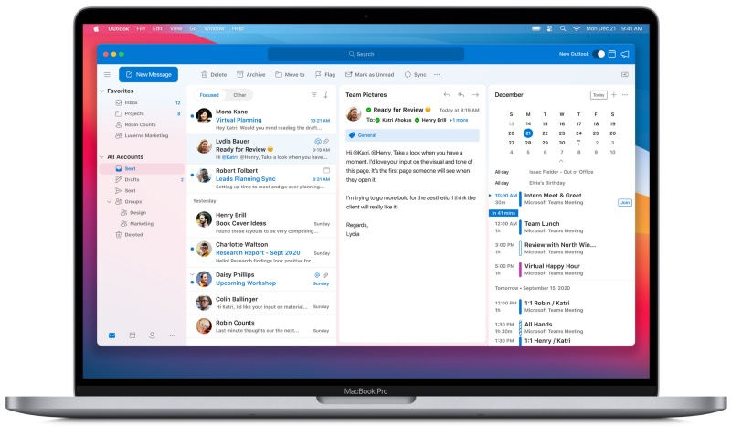
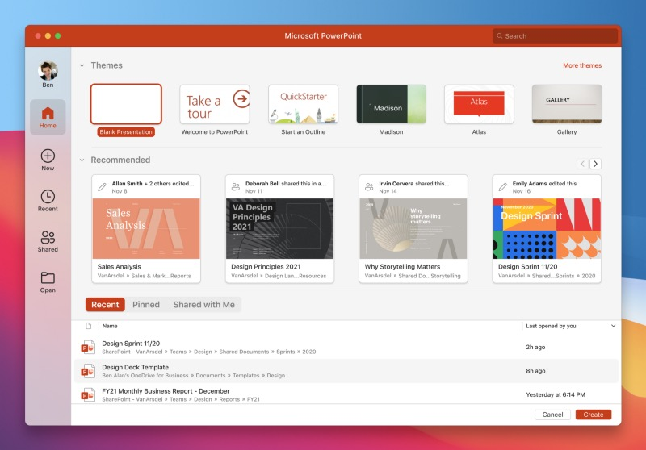
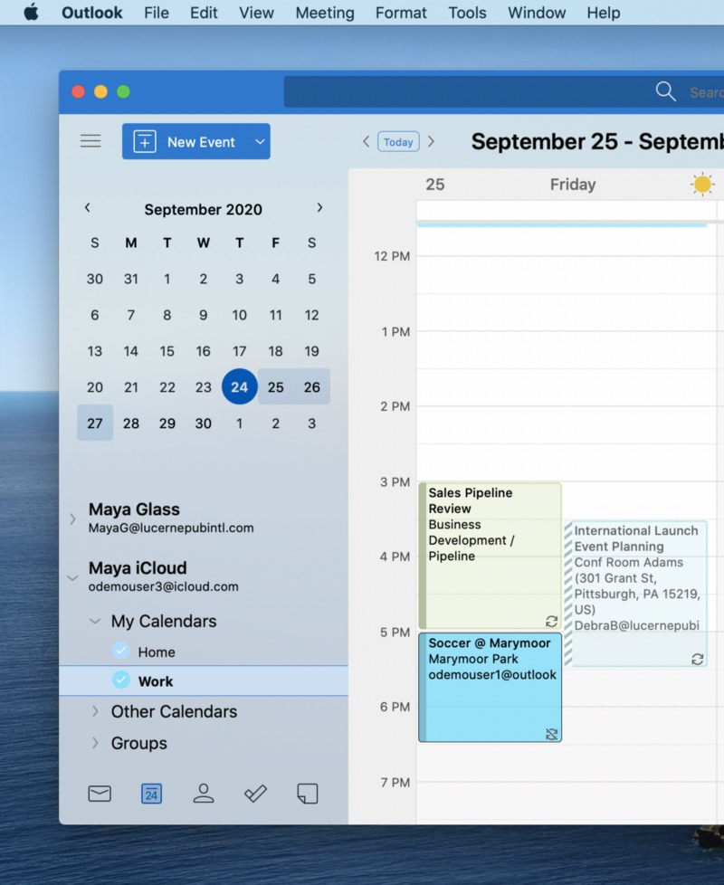

## While many of you already enjoy your M1-based new Macs powered by Apple Silicon SoCs, my BTO-MacBook Air still needs to make its way to me. For everyone who is luckier than I was so far and is using the well-known Microsoft 365-apps, native M1-support is now for real as Microsoft has just released the specific app-updates.

The core-Office-apps like Excel, Word, PowerPoint and OneNote [are now cloaked](https://www.microsoft.com/en-us/microsoft-365/blog/2020/12/15/4-ways-microsoft-365-is-improving-the-experience-for-mac-users/) under the “Universal”-label, combining the Intel- and Apple Silicon-based version in one binary so that the “new” Macs now have no need for using Rosetta 2 to emulate Intel-based versions anymore.

Additionally, the updated Outlook for Mac-app has been released as well and while earlier versions lacked the support for iCloud-accounts this feature has now been baked into the final version and will be rolled out through the new Outlook over the coming weeks.

While the “usual suspects” of Microsoft-apps are up-to-date now, the Teams-app, based on the Electron Framework, still needs its overhaul for the M1. While this is still work in progress, Microsoft is still redesigning some of its Office-apps for the Mac-platform with an updated Office Start-experience, a change that is told to reach the users with some new updates starting next month.

For all of you who are still waiting for an updated and M1-optimized version of VisualStudio Code, don’t forget to head over to [https://code.visualstudio.com/insiders/](https://code.visualstudio.com/insiders/) as this version is currently available as well on a daily-release-basis.

The updates for the “classic” Office-programs have already been rolled out and should have hit your Mac by either Microsoft’s AutoUpdate Daemon or the App Store, according on the way you have installed them.