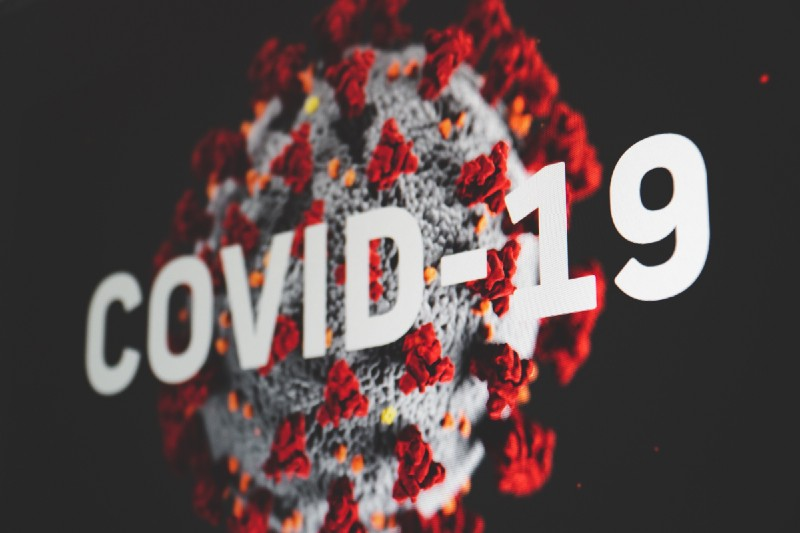
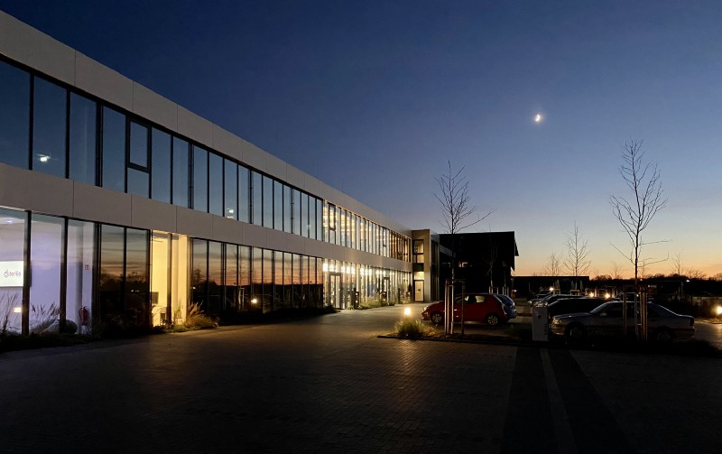
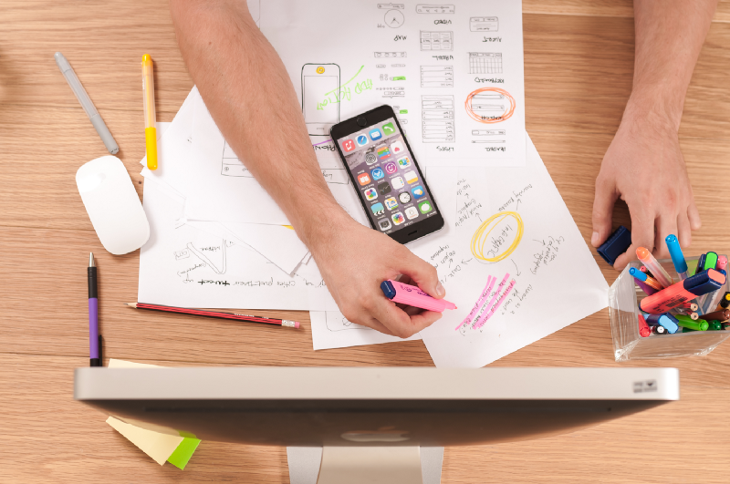
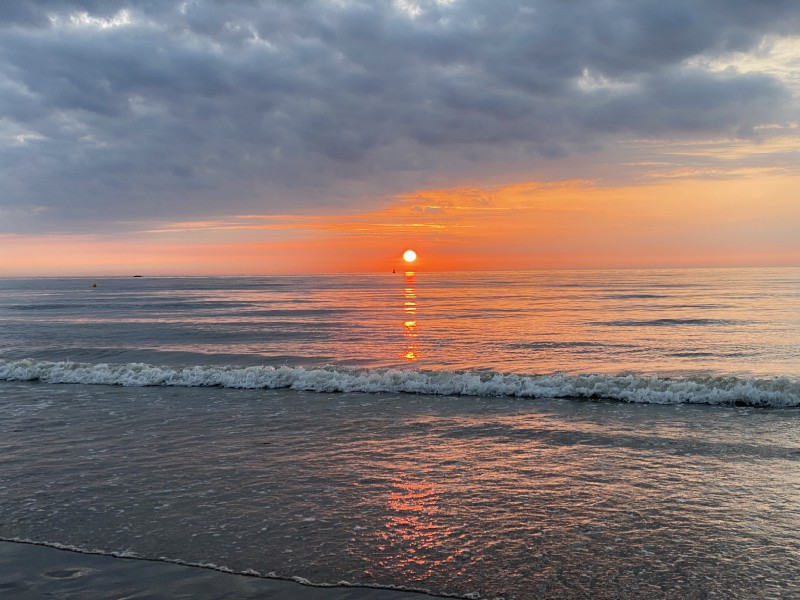
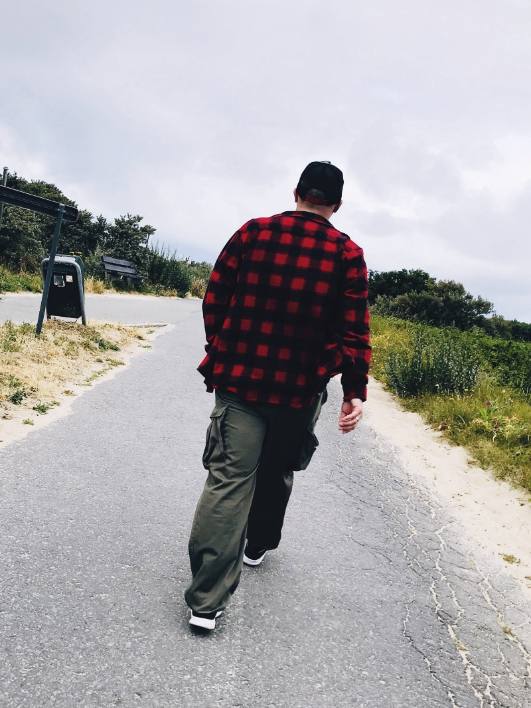
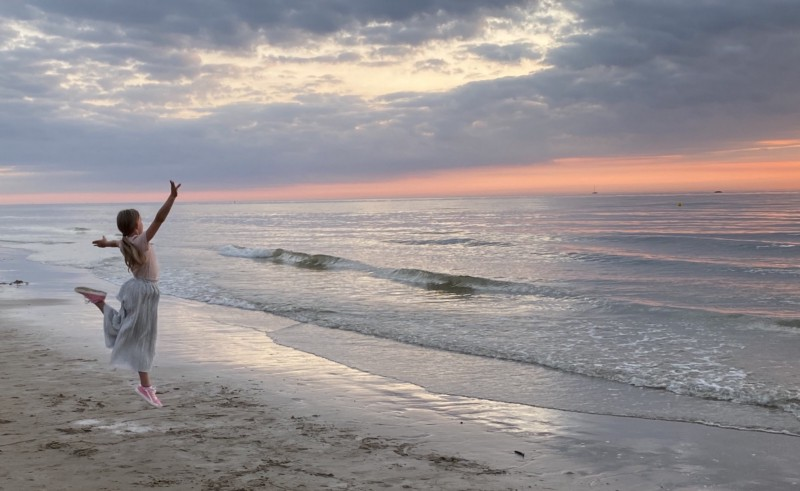

## In the meantime, the year with the probably biggest impact on the post-World War-generations is finally over. The new decade has just begun but definitely nobody will shed any tear anyway: Too many bad experiences have been manifested into everybody’s life in 2020.

 This personal review of the year’s events is therefore crowded with many aspects in the focus of the COVID-19-pandemic and even with a little distance, it doesn’t look better during the first week of 2021!

## A small virus…

… was the statement many had in mind until the topic gathered speed in the early spring. Precautional measures, personal restrictions, home office-work, dwelling on thoughts regarding the state of digitalization (especially in schools), worries on economy, family, togetherness of society and limitations on the freedom of travel: I personally think there is no single topic you could get around when it came to dealing with the single issues one by one. Quite fast it turned out that mankind is less civilized than many thought so far: Demonstrations against life-saving face masks, 5G or Bill Gates striving for forced vaccinations to implement chips into everyone’s bodies were just some aspects for many people scenting an overall world conspiracy. Despite those fears of limiting everyone’s personal rights, we somehow made it through 2020 anyway.

No matter if the virus is malevolent creation of nature (as many diseases are) or if it is a synthetical product in a Wuhan-based laboratory: The impact on mankind is severe and a „better flu“ (as many state) is possibly the worst threat for wannabe-civilized and technology-savvy mankind. Between all the organisms in this ecosystem, the human being proves to be just a part-time co-driver consisting of cells and fluids and shows that the time for our species on this planet may finally be — indeed! — limited.

Mentioning this „Wuhan“-factor let me tell you that my own opinion is that I neither do believe in this „artificial virus“-thing thing nor on conspirative voices search for any connection to Dean R. Koontz „The Eyes Of Darkness“ from the 80’s. Koontz does sketch a similar scenario and what doesn’t fit for specific people is being put into a frame so that it seems that Koontz has predicted exactly this scenario. It always depends on what you want to believe (and what not) of course. Anyway, the book is a good read to gather common aspects as well as differences between the virus of 1981 and 2020 before (!) naming the word „conspiracy“!

### Work, work, work

Being an employee in an IT-company, home office (or remote work as others prefer to call it) is no exotically condition of doing your work. The chance for home office has always been present but as everything started in COVID-wave Number 1, approximately 300 employees went home section by section, team by team. Being compared with the situation at many customer sites, everything turned out to work quite well and from the scratch indeed. The luxury of doing your work from everywhere (depending on an internet connection of course) was put in the focus even more. Microsofts CEO Satya Nadella already described this state as of „the digitalization of two years realized within just two months“: Solutions like Microsoft Teams, Zoom and some other got their well-deserved attention, being the collaboration tool people needed to stay in touch.

End of Patrol in late December, 2020 — that was my working year! (Photo courtesy of author)

This was a trend for quite some time but especially in Germany we now need to further continue to pursue this trend. Between both COVID-waves was a timescale of approximately six months and seen from my point of view, we could have done better. This first demand in Spring of 2020 was a sudden need and implemented in no time while — often — factors like security or structure in general were neglected or customers didn’t see the must of closing the circuit in all mandatory ways. Home office is no alien kind of working anymore and having a look on Silicon Valley monoliths like Apple or Google the trend has been transformed to a new kind of work: Both companies will allow their workers to come back sometimes in the mid of 2021 at the earliest. For me, this is the most-positive experience as you can do your work from everywhere and once there is the demand for it, you are able to serve this — onsite or remote. Many companies especially here in Germany (and surely somewhere else, too) had their prejudices on remote work but this state has hopefully changed for good in the meantime!

### Digitalization?

Mentioning the term „digitalization“ in specific the positive aspect is that many customers and users see the demand to change their working stiles away from on-premises only. The cloud and cloud solutions are more and more adopted and embraced and less „evil“ and „alien“ than it was before. Of course there is still a lot to catch up, especially in the educational sector.

I learned by myself that each federate state, each district and even each school has its own (more or less developed) vision of digitalization and home schooling — if there is any at all! On the one hand, we got the top dogs like Microsoft Teams and Microsoft 365 and Open Source-based solutions like Nextcloud, Collabora Online, ONLYOFFICE and similar vendors. The big thing here in Germany besides building a reliable and safe technical platform: Data protection and there is by far any unifying base that, for example, all schools of a specific district may adopt — each school seems (unfortunately) to be a lone ranger on its own.

The reasons for that status quo are versatile — either the administrative efforts, lack of experience or missing user adoption paired with a strict vision, how this process of digitalization may be pursued at all are just some aspects: There is a lot of potential in this topic but especially in Germany, the funding processes for either business customers or educational institutions are too complex or lengthy. The madness of bureaucracy reigns here over reason and digital structure. When I have a look at three schools three of my four daughters attend, I find three completely different approaches of trying to work remotely — with a different output as well.

There is still a lot of work to do and it won’t be done unless we try to tackle the challenges on the way of digitalization. Anyway, neither our children nor the world around them do excuse the six months between both COVID-waves here in Germany in which just elementary changes to infrastructure and E-Learning have been made — it’s time to act, now!

### No more traveling around

I love to travel and even if we „just“ made it to Belgium this summer „only“, the time was right and I’m sad and glad simultaneously for these free days with my family. Sad because Belgium, The Netherlands or my beloved UK (to which I embarked from Dunkerque, France whenever I visited the Belgian coast in Bredene) is now far more away than they ever were before. Never before I did photograph, travel or blog as little as in 2020. Seeing another country, feeling another mentalities and seeing other cultures (even if they are just 350 Kilometers away) just clears my mind. Participating in a country’s history, its mindset or just taking photographs of areas, buildings and landscapes that just can’t flee is something that gives me my inner peace. Although this might sound quite boring to some of you, is my valve to let the daily life pass for a new view, new experiences and new places.

Sundown at Bredene Beach, Belgium in 2020 (Photo courtesy of author)

These eight days in Belgium were quite close to normalcy, but — on the other hand — quite remote from normalcy, too. Some cubic meters of sand, a lot of water and the sound of seagulls and the surge of waves is something I would die for. I am thankful for these „just“ eight days anyway as many people haven’t had that luck in 2020 but I am sad as my wanderlust is always sprouting (we had two attempts to make it to Norway but both fell in COVID-19-waves one and two) and growing steady. I miss other parts of the world which help me to get down and broaden my own mental horizon.

### What does remain?

Quite a lot. Some good insights, many bad ones — the fact that our children are the main victims of 2020 is more than apparent: Private contacts were limited (and still are, even more), schools are closed and, being a parent, you cannot change anything except to grow together even more to help your kids (and your family!) to get through this whole mess altogether.

„Protect others“. „Take care for others“ — altruism in everyday’s life, just another experience I have made. „Front-Line-Workers“, people who are entitled to be system-relevant and who often do their work in an unremarkable way, keep everything going — and just a few people are grateful for these everyday-heroes. Many things we have considered to be self-evident turn out to be dispensable once you really think about your own demand. Yet another lesson we may have learned while the running gag in Germany was that toilet paper was short of stock, just like yeast — as if everyone suddenly opens up his own bakery (or restroom!)…

I’m out, 2020 — Picture taken at Bredene Beach, Belgium in a worry-free 2019 (Photo courtesy of author)

Together, with one another, the social interaction with people being cashiers at the local supermarket, caring for our elderly, driving the garbage truck or carrying our Amazon-packages straight to our front doors, is my utter personal verdict. Don’t ignore those people in everyday’s life, don’t judge them by the job they do — just learn to pay respect to them as not everyone has the chance to work from home remotely. We should think about these little insights once everything turns out to become „normal“ again: A smile, a „Thank you“ is not only benefiting those people, it’s always a way to achieve true greatness regarding your personal karma. Having this in mind, 2020 was my personal lesson in humility and — even if I always try to cloak this — empathy for fellow human beings.

### … and finally?

A year’s number will change, the second lockdown in Germany was recently extended to end of January. It’s still a mystery how schools will handle all this as nobody here expects them to open next Monday, so social distancing and remote learning will still be one of the biggest challenges in 2021.

While the technical base at home was quite perfect, the reasons for malfunctions were mostly on the opposite site: This needs to be fixed so that our children can really learn, even if being locked up at home — just getting some tasks, writing them down, scanning and uploading them is a first fix but by far not a concept for true remote learning. The kids need to get back to school, see their friends again and try to catch up with everything they missed in this somehow lost year.

My second daughter learning to fly at Bredene Beach, Belgium, 2020 — one of the few wonderful moments in this sad year (Photo courtesy of author)

During the first wave we had the luck that 14 weeks of home schooling were accompanied by great spring and summer weather with just one rainy week. The kids concentrated on their siblings mainly and, regarding this relationship, they girls forged their alliance to a new, beloved level: Surely and — according to the circumstances — a fortunate time and one of the better aspects of 2020!

As it concerns myself, I’d really like to shake off all those bad memories of the last twelve months. There is not much good left of the year and we already carried some bad parts into the new year — consciously or not. I hope that we can turn those bad aspects to something new again and — at least — try to get some positive aspect for this new year. Looking at the media, the old doubts just come up again but I try to push them into the background — hello, 2021!