## In my post  on Little Snitch 5 some time ago, I already stated that „a firewall is a nice and essential security building block. While it is mainly used as the perimeter to and of your network, dividing the Internet from your intranet, there are also software firewalls which can be installed on Macs and PCs.

This is still the status quo but there might be some users among you who just don’t want to pay for yet another firewall for your Mac. Using the internal firewall of macOS could be an alternative to the one-time-fee each major update of Little Snitch costs, but just doesn’t serve the big whole: Just incoming connections to your Mac are blocked and there is no option to see what kind of services are trying to phone home. Yet another great alternative (which I am also currently using by the way) is LuLu by Objective-See and driven by Patrick Wardle, known for his security-related work with Macs. Let’s see how the app can be downloaded and installed to protect your Mac from the in- and outside, whatsoever kind of service is trying to send or receive data packets.

Installing LuLu
---------------

First of all, head to Objective-See’s official website and [fetch](https://objective-see.com/products/lulu.html) LuLu from there. After you have downloaded the disk archive containing the application in .DMG-style, drag and drop LuLu.app into your applications-folder. By the way, just one week ago, LuLu was finally made available with native support of the new M1-Macs running on Apple Silicon: No Rosetta 2-emulation here anymore with version 2.1.0! Once you run with an user without administrative access (and basically you should do so!), the installation of LuLu via drag and drop needs to be certified by entering some administrative credentials.

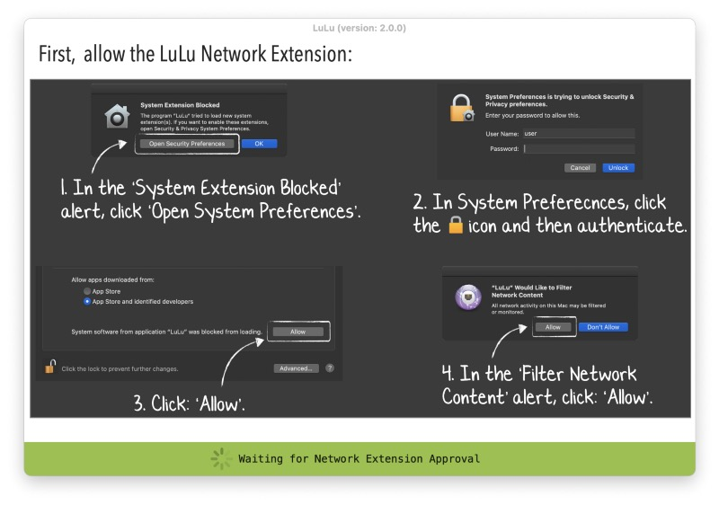

The First Launch
----------------

Launch it for the first time by double-clicking it and you will need to give certain permissions to the app — the first step is to allow the system extension which is naturally blocked, second you will have to give LuLu the ability to filter network content. This is the new way such apps work with macOS Big Sur as the OS has ditched the old way of Kernel Extensions in the meantime.

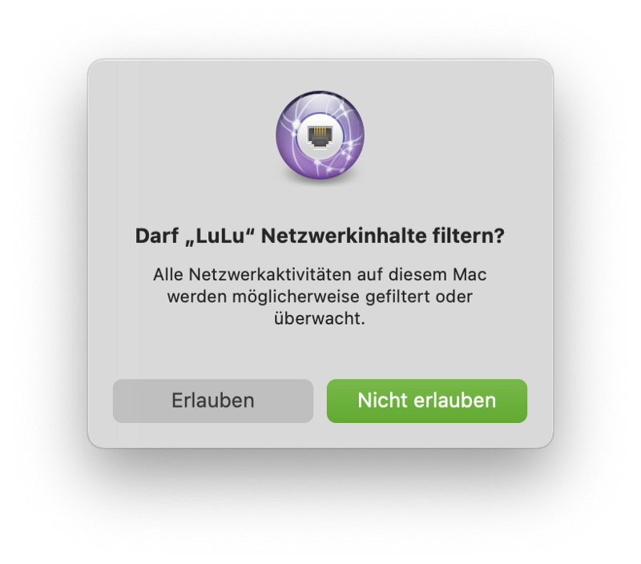

Mentioning macOS, Patrick Wardle and his team (featuring the negative press on that one) achieved that Apple-internal apps won’t further bypass software-firewalls like LuLu or Little Snitch from macOS 11.2 on: Apple is [told](https://www.patreon.com/posts/46179028) to have removed this „feature“ in the current beta of the latest „Big Sur“-build so we may be sure that apps like LuLu will indeed block anything you want including Apples built-in apps from the next OS-update on!

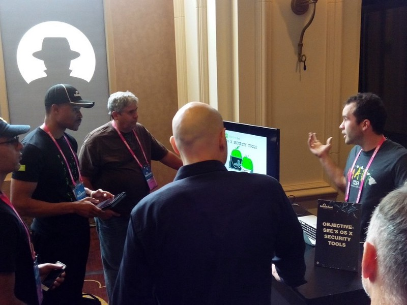

Getting Started With LuLu
-------------------------

After these steps, LuLu will run in macOS’ menu bar automatically, even if you restart your Mac unless configured otherwise. The menu cloaked by the apps’ icon shows the current state of LuLu and bears the option to disable the network filter, show/edit the rules, deal with general preferences, show the network monitor or — for whatever reason — quit the apps. The options are quite easy to understand and after going with LuLu for the first time after the initial install, there is not much you must care about — except choosing wether you generally want to allow Apple-programs or applications that are already installed: That’s it!

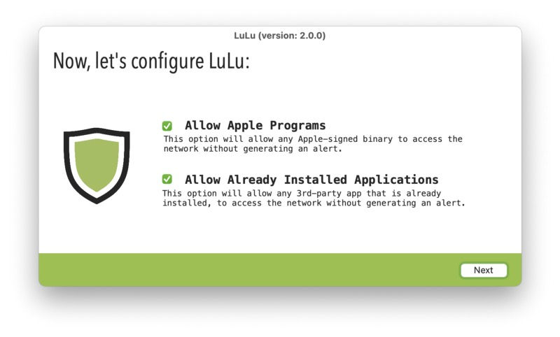

Mumble, mumble
--------------

After having done so, you will notice that — instantly — some warnings of processing trying to establish an outbound connection will appear. Besides process ID, arguments, the process’ full path, IP-address and port which serve as basic information you now have the chance wether to accept or block this connection. Besides, you may tailor the rule scope to either the process itself or the endpoint it tries to reach. A link to “Virus Total” or looking at the ancestry of the specific process completes the sum of information you can gather here!

Additionally, you may define this rule as „temporary“ which serves well if you want, for example, block a whole app except of the usual update checks. It will take some time for LuLu to learn all the rules depending on your installation and daily routine (there will be a lot of notifications, believe me!) but after a while, a basic ruleset is your foundation for a successful work with LuLu.

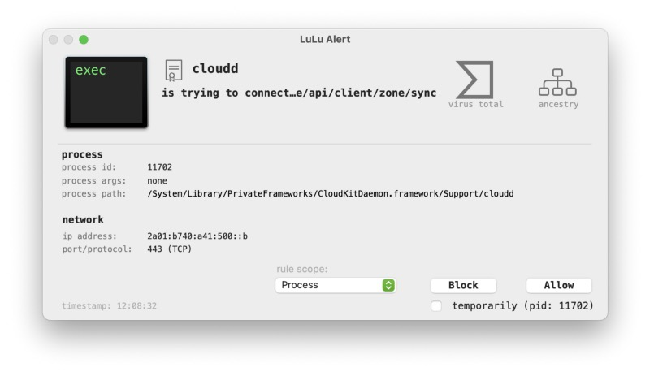

Dealing With The Options
------------------------

Besides the ideal firewall approach of locking everything down at first and then permitting app by app, port by port, connection by connection, LuLu will now do its work in the background. Looking at the rules-option, you will see all rules that LuLu has set so far and may review those, labeled under „All“, „Apple“-specific rules or 3rd Party- or User-rules. Deleting the rules or removing the checkbox for „Allowed“ is possible here as well and you can also manually add a rule.

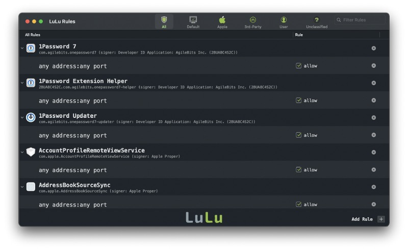

A double-click on the „any address:any port“-section of a specific rule helps you to refine the single entry straight from within: Entering the exact remote address or port as well as a regex?-option are yet more options to further fortify your installation and ruleset.

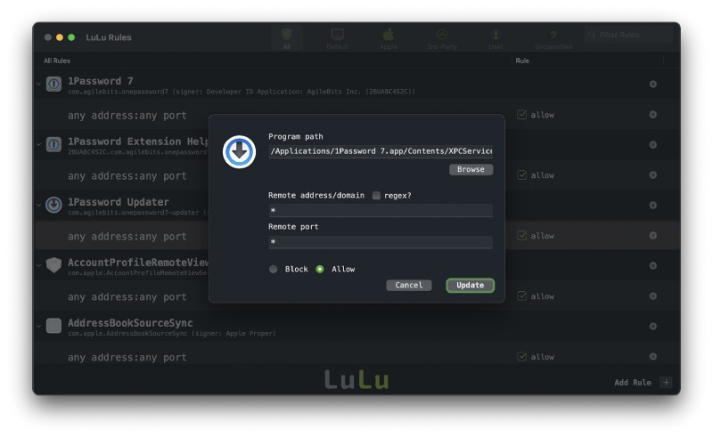

The preferences bear some more options where you may decide wether to generally allow Apple-specific apps or generally allow apps already installed. You may also add hosts/ip-addresses you always want to block, set the modes LuLu runs at (blocking every traffic routed through LuLu for example is a good chance of locking down simply everything) or decide wether LuLu should automatically search for updates or not.

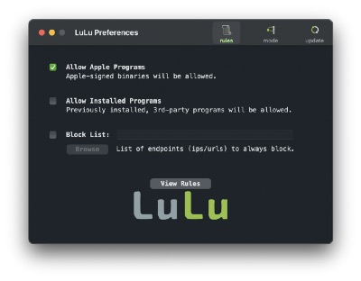

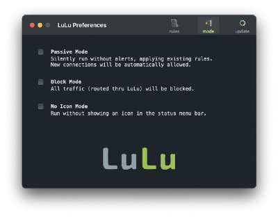

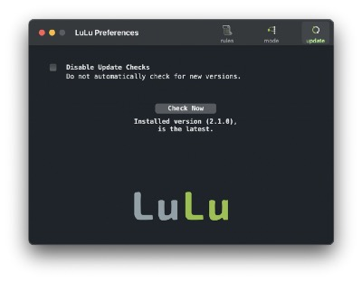

NetIQette — Seeing What’s Going On Live
---------------------------------------

Last but not least, LuLu comes with NetIQuette, which is not the way how you should generally behave online but an online monitor which shows live-statistics on current connections. While NetIQette is a visual implementation of a „net stat“-command, it is also a tool which can be [downloaded](https://objective-see.com/products/netiquette.html) separately but is also bundled within LuLu to make the circle of security go round.

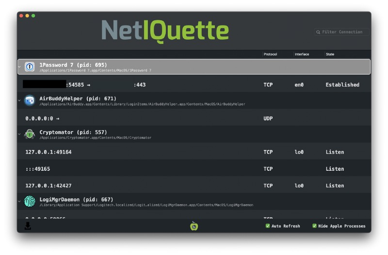

Final Conclusion
----------------

LuLu is a pleasant surprise. First of all it’s free but the quality of the tool is something I’d always pay for — just as I did with Little Snitch, the big competitor here, over the years. Everyone of you who is searching for a great software-based firewall in addition to the (hopefully existing and well-configured) hardware version on your perimeter should definitely have a look at LuLu. I was a faithful user of Little Snitch for all the years and did also upgrade to V5 — no complaints about this piece of software so far.

Anyway, as I like the work Patrick Wardle does with his team and also follow his thoughts and discussions on [Twitter](https://twitter.com/patrickwardle), I tried to give LuLu a chance. Visually, LuLu has still some aspects it lacks of if being compared with Little Snitch — especially visually. Putting these aspects aside (I like the map-feature of Little Snitch) and once again reminding that this software is for free (although you should donate if you use it on a daily basis — your karma will be grateful for that!), you have the choice between to great software firewalls for your Mac.

As for me, I really laid Little Snitch 5 to rest for the moment as LuLu offers everything I need from a software firewall. As I longtime-user of Little Snitch I never thought I’d switch once but the functionality and reliability LuLu has offered so far is just outstanding. There are some visual aspects which should be considered in future updates, but as the firewall does exactly what it is intended to do (and keeps you informed on this no matter what), it is my current first choice and you should look if it matches your demands, too!