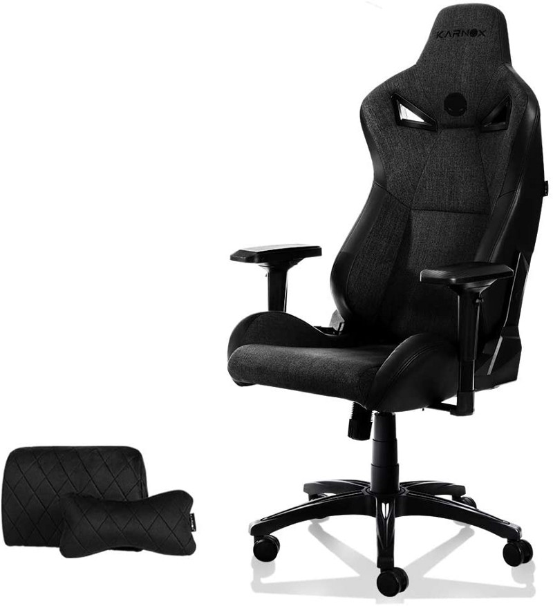
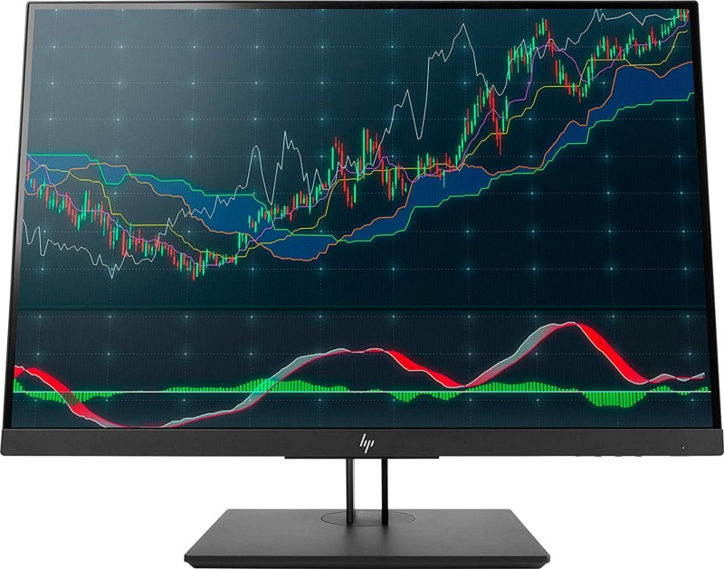
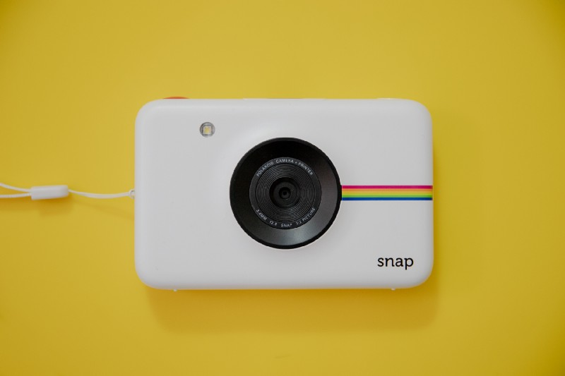
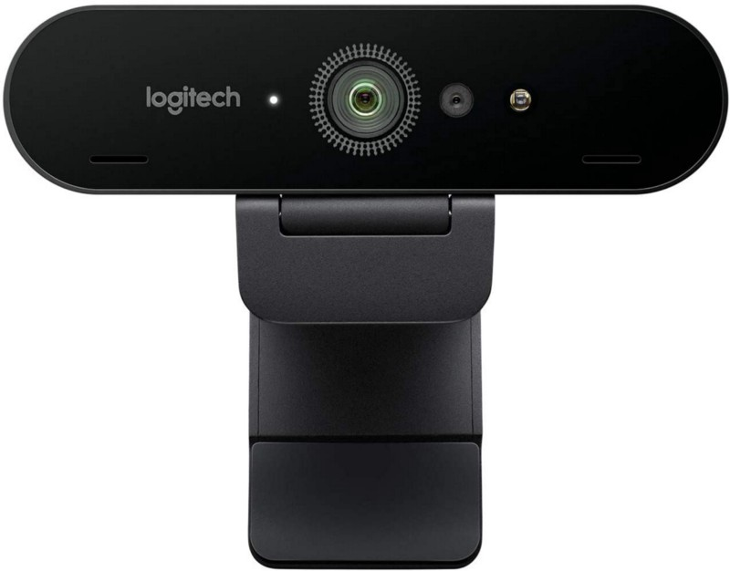
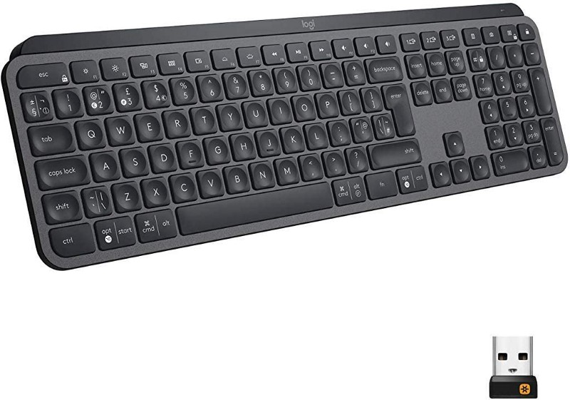
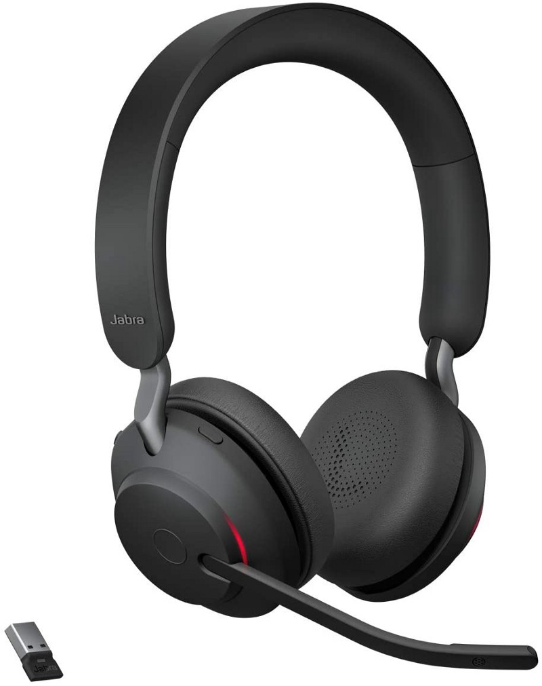
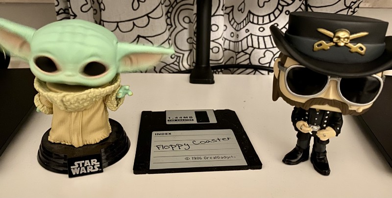
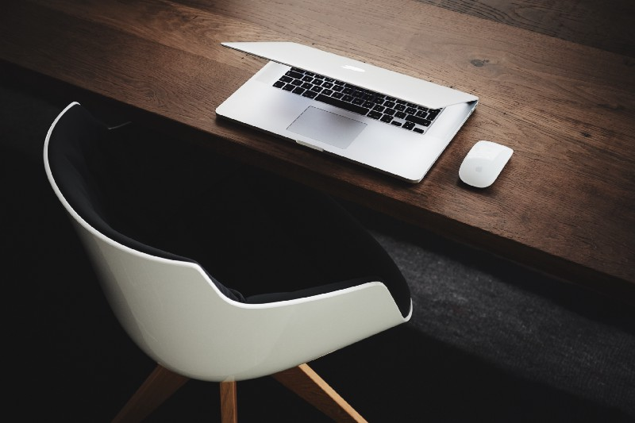

## Working from home is no kind of extravagance nowadays: The COVID-19 pandemic has shown us that, once work must or should be done remotely, it CAN be done from wherever you are.

While I hope that employers will stick to this — often — new-discovered flexibility, trying to match your private workspace at home with the one in the office can be some kind of special task. After spending 14 weeks in the home office during wave one and some more weeks in wave two here in Germany, I discovered myself building a nest at home that doesn’t differ that much from my workspace at the company. Let me share my thoughts with you!

Desk
----

I really hate small desks and with each child (I am father of four) the space for my personal desk at home got smaller and, finally, I just inhabit some free square meters in our bedroom. While the kids consume the space and free rooms I once used to occupy as office space at home, I need to use the free space in the best-possible ways for me in 2021.

As I don’t need a height-adjustable desk like I have one in the office (would be pure luxury at home although it is definitely a good aspect for desk workers), my choice was a convenient one — three table legs, a drawer cabinet and a two-meter desk slab made it for me. Powered by the lovely Swedish vendor IKEA (whichs products are a solid base for many rooms here), I just went with the easiest option to use as much a space as possible.

Personally, I don’t like small desks as I tend to spread all elements in a certain way and hate it when there are more objects, stored densely, on the desk than the desk is intended to store. I need space, I need a certain room and place for everything and once you compare it with a bird spreading its wings — this is the kind of working space I need. The drawer cabinet is used to store all loose objects, papers and similar stuff and finishes the desk slab on the right side while two table legs are its foundation on the left while a single one supports this construction quite in the middle.

This scenario is enough for me if it comes to the desk itself — there are plenty of other options, but it’s quite cheap and once you don’t have that much demands for a working space at home, this could be your fit — [LINNMONN](https://www.ikea.com/de/de/search/products/?q=linnmon) is the key here!

Chair
-----

It’s quite some kind of progress from the 50 EUR-IKEA chair with just suits basic needs to another, more valuable option. Before the times of frequent home office, I didn’t spend that much time at my desk at home — now, eight hours a day are the minimum and so the demand for a better chair has risen over the time.

Although I am a rather spontaneous shopper, this was something that nearly drove me mad: I had no intention of spending 800 EUR plus for a new, really, really good office chair. Neither I wanted to go with a gaming chair (I am a console gamer, but this doesn’t affect my office) turned into my daily driver: Especially the look here is something that I dislike, functionality comes over optics if you ask me. So before going with the chair, I read a lot and searched for a sweet spot in terms of comfort and price.

This was a long journey as well but many official office chairs on Amazon for around 200 bucks were rather average rated, most of them already lacked some aspects after using them for some time. Although I am a casual (Xbox) gamer, my desk is free of gaming hardware but I had a look on the different chairs there as well and finally found my sweet spot with a [model](https://amzn.to/3bMr68y) of KARNOX: Great look, the perfect balance between functionality and optics, a backrest and ratings that seemed to justify my first impression of this 269 EUR-chair.

It took Amazon some days to deliver it although it was on stock but I forget time I waited impatiently for this chair as I assembled it for the first time and spent some days of office work in it! For now, I have found my sweet spot with this KARNOX-chair and I hope that this will be the state of mind in some months as from today. It’s big, comfortable, looks like a decent gamer’s base-of-playing but simultaneously hosts a very comfortable office chair-environment. Let’s hope it stays this way!

Display(s)
----------

On the one hand, I am personally quite satisfied when it comes to my setup of two 24“ [HP Z24n G2](https://amzn.to/3qXVDHa)\-WUXGA-displays which helped me to adopt the office-feeling paired with a [HP G5 USB-C](https://amzn.to/3kq683z) docking station. Connecting my employer’s HP Elite x2 G4 to the dock instantly delivers the same experience I got to used in the office with this Windows 10-machine.

Some time ago, I dropped my single-display setup with my previous [BenQ EL2870U](https://amzn.to/3ktRlor), sacrificing 4K to the seamless working experience I know from the office. At this time is was a good choice and even though the display resolution turned down from 4K to Full HD, I got used to this setup with the two HP-monitors quite fast. By banking on the Thunderbolt-dock I thought that this was the ideal solution for any private device (2017 MacBook Pro until December 2020) I would attach via this interface. Both monitors are daisy-chained via the Display Port In/Out-options (great move from HP to equip the Z24n with this feature) so there is just ONE Thunderbolt-cable from the dock needed to connect with your desired device!

This was before my switch to the latest [MacBook Air](https://amzn.to/3ksNoAb) powered by Apple Silicon which somehow did torpedo this setup. While the M1-Macs are simply beasts, they lack in especially one thing if being compared with the MacBook Air’s predecessor, my old 2017 MacBook Pro, here: It’s simply impossible to address two external displays as Apple has limited this scenario to the internal display (even if closing the lid) and ONE external one. Full stop. This fact may have changed my opinion of getting an Apple Silicon-device as I have used the 2017 MacBook Pro always attached to the Thunderbolt-dock with a closed lid and two external displays. This is specially frustrating as the 2020 Mac mini can (!) address two external displays via Display Port and HDMI but hey… this is a blind spot for my setup! If this is a crippled software setting or a small failure by design is probably Apple’s secret and it will surely get fixed in upcoming SoCs but it makes me angry anyway!

Putting this (eligible) rant away, this two-display Full-HD setup based upon a great Thunderbolt dock working with Windows AND macOS is my sweet spot for working at home. I am still thinking of turning this setup into a [32“ LG 32UN88A-4K](https://amzn.to/3pZl4XB) setup once again but think I’ll go with this scenario for a while: I rather work with two identical displays and maximized windows on those as with one bigger display where windows are scaled by 50% — but this doesn’t need to fit your taste!

Camera
------

As for the webcam-scenario, I have many solutions that may fit according to your personal needs. In times of Microsoft Teams, Zoom and other teleconferencing-solutions, a tidy webcam is a certain must. As prices increased dramatically in the first wave, I went with an [1080p-AUKEY-model](https://amzn.to/3al1n6t) purchased on Amazon which was exactly the same model I use at my office desk in our company and was quite cheap. Nothing for streamers, nothing for video bloggers — but a good-looking and working webcam for a good price with Plug-and-Play-features in Windows 10 (Office) and macOS (private).

Over the time, demand has changed here and I decided to went with a [Logitech Brio 4K](https://amzn.to/3te1ny0)\-camera after prices dropped a little bit between both waves. This device is surely nothing for you once your finances are at a low ebb, but 4K, HDR and even Windows Hello-support with Windows 10 are — in harmony with your demand — some features that justify the price which is plainly over 200 EUR at the moment. You may encounter some software issues with the Brio so be sure to flash the camera to the latest firmware 2.4.44.

Something that has beaten both variants is a software-solution named [Camo](https://reincubate.com/camo) from British developers [Reincubate](https://reincubate.com/). I once wrote about this Mac-app which pairs your iPhone with your Mac as probably the best webcam-solution you may get for approximately 40 EUR/year or nearly 81 EUR for a lifetime license. A Windows-version is currently in the beta and so is even an Android-release. Therefore, Reincubate could close a certain gap once you don’t need to invest a lot of money for a specific kind of webcam. The visual result is outstanding and the app in in steady development — a great alternative which turns your number-one-device — your smartphone! — into the best webcam you may get for your money!

Accessories
-----------

No personal setup comes without individual accessories everyone needs for his home office. Starting with the webcam scenario above (which is already some kind of accessory, right you are!) my desk is completed by a Fujitsu ScanSnap iX500 document scanner, a [„Floppy“ coaster](https://amzn.to/3r0Jml5) (my generation still knows what this gimmick’s origin is!) to keep the desk free from coffee- or water-fluids and a mousepad usually settled in the gaming sector. For me, being a Star Wars-fan from my fifth year of age, it tells me „[Noob, I am your father](https://amzn.to/3qUWyrI)“ and is the home and foundation for my [Logitech MX Master 3](https://amzn.to/3aY3Y8b)\-mouse.

Having a look at the input devices, Logitech may have lost some of its glitter of the past, but the [MX Master 3](https://amzn.to/3aY3Y8b) in combination with the [MX Keys](https://amzn.to/2ZUwrp0) are my favorites for switching between the worlds of Mac (home) and Windows (business). For the time being, I always stuck to Apples Magic Mouse and the Magic Keyboard and switched those with a Microsoft Bluetooth-mouse and a Microsoft keyboard until I combined everything with the Logitech-derivates. Giving up the natural „Mac only“-feeling was the biggest task to deal with.

After some days, I really got fond of the new kind of typing with the [MX Keys](https://amzn.to/2ZUwrp0) and switching between a maximum of three devices — friendly hint: Should you ever encounter strange Bluetooth-issues with the Logitech-devices, just switch to the Unifying-receiver that comes with the set to raise the level of firmness regarding your input device’s connection and reliability!

A white HomePod Mini joins in, fueling the need for external sound coming from my Apple TV 4K and my MacBook Air and is accompanied by a [kitway-my LED ring light](https://amzn.to/3uDe6La) (the video-conferences, you know!) that is fixed to the table with an additional [TARION ring stand](https://amzn.to/3bCZ7by). For further communication and as I use a [Jabra Evolve 75 UC](https://amzn.to/2NNEe5r)\-headset in the office, my headset-choice at home is the new [Jabra Evolve2 65 UC](https://amzn.to/2ZWPr6c) so that I can use both Microsoft Teams and Swyx without any hassle and — besides — have just another headset at home for the kids’ homeschooling-efforts.

Instead of dealing with a large and unstable tripod that also takes away some space for my feet, I chose to mount it to the desk instead. In addition to these, a gooseneck-mount with wireless charger by CHOETECH for my iPhone 11 Pro Max does not only charge the device, but also serves as holder for the device one I switch to Camo for using the phone as a better webcam. Last but not least a certain grade of „freakness“ is reached with two Funko POP Figures of „Baby Yoda“ Grogu aka. „The Child“ and the unforgotten and sadly missed Lemmy Kilmister of Rock legends MOTÖRHEAD.

Verdict
-------

It’s a long way to the top if you search for your perfect home office-setup. Everything depends not only on your budget but — as always — also on your personal demand: Two displays? One display? A connection point for either Windows or Mac? What kind of desk, modern, height-adjustable? Gaming or office chair? There are way too many option to sum them all up but after all, you have learned about my demand and my setup and I hope to have delivered at least some ideas to you how your personal setup could look like.

For the moment I am quite satisfied with my setup but this may change in the near future. The (disability) of using two external displays with my 2020 M1-MacBook Air somehow frustrates me as my setup would be perfect otherwise: Both the MacBook AND my work’s HP Elite x2 G4 could use all external displays and provide a „single-point-of-connection“-workspace powered by the HP G5 dock’s Thunderbolt cable. As I need the space, I am currently aiming at replacing both 24“ displays with a 34“ curved WQHD-display like LG provides them and, maybe, with a built-in Thunderbolt-connection I could even ditch the dock to clean up the desk even more.

Anyway, you see — the ideal home office workspace is some kind of vivid thing as there are many variables you need to consider. It’s not only about functionality but also about a place where you like to work for some, often around eight hours a day. Make your self comfortable, add a personal note — just in the office there are essentials things work your work but also things that freshen up the classic office-setup. As for me, it was a long process which developed from a part-time desk to some kind of daily driver.

Conditions changed and so did I change my desk at home, striving for the cleanest and technical best setup. This voyage hasn’t ended yet but with consolidating monitors and input devices, the choice is mine wether to use my private Mac or my employer’s Windows-machine without the need of re-arranging everything. The desk got cleaner over the last twelve months and so got my focus on the way I want to work from home.COVID-19 or not, many things have changed and so has my demand for a suitable place to work from home!