## While I love my 2020 MacBook Air with Apple’s outstanding M1-SoC, the disability of addressing more than one external display was the grain of salt in Apple Silicon’s great first appearance.

## M1-Pain Points

In my recent post telling about the long hard way to the perfect home office setup, I complained about this fact: I was able to use my two HP Z24n G2-displays with my working notebook (HP Elite x2) but the M1-limitations kept me from using the Air in the same style. Then, I read about DisplayLink, a company that is now a part of Synaptics and offers a „Plug and Display“-solution by combining certified docks and adapters and their software which has been released for M1-macs in the mid of February.

## A Possible Solution?

„Plug and Display“ is DisplayLink’s statement meaning that any computer can drive more than one monitor — up to six in fact, although it’s proven that just two monitors create a big increase in desktop productivity. The universality of the DisplayLink-solution is told to allow different users to timeshare the same desktop environment creating enormous opportunities for saving on the costs of office space. DisplayLink itself is supported by the major PC-computer and accessories companies and is designed into docking stations, graphics adapters, and monitors.

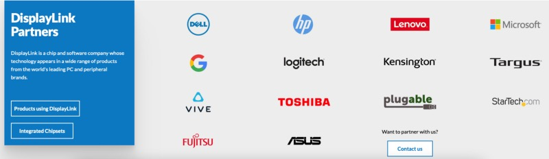

As the company claims it is constantly creating new ways to support other platforms and devices including Ultra HD 4K-displays, tablets, and wireless devices, I thought it was about time to check this solution and whether it could ease my only pain point or not. While researching the core of my problem (one dock to rule them all), a moderator named Soccer-dan answered to the common problem of many users in HP’s forum and pointing me towards a possible solution.

[**HP USB-C Dock G5 on New MacBook with M1 Chip - Minitor not working**](https://h30434.www3.hp.com/t5/Business-Notebooks/HP-USB-C-Dock-G5-on-New-MacBook-with-M1-Chip-Minitor-not/td-p/7860077/highlight/false)  
[_Hi. I'm using HP USB-C Dock G5 with my MacBooks. The capability of this dock with Macs were generally great. However…_h30434.www3.hp.com](https://h30434.www3.hp.com/t5/Business-Notebooks/HP-USB-C-Dock-G5-on-New-MacBook-with-M1-Chip-Minitor-not/td-p/7860077/highlight/false)

## Heading on

Before stumbling upon this approach, I downloaded the latest version of the DisplayLink Manager and was disappointed as the software didn’t recognize the external displays. Instead, macOS just extended the internal display of my MacBook Air to the first external display and mirrored the first with the second HP Z24n G2-display.

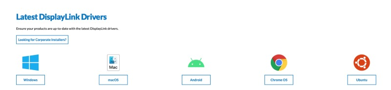

I must mention that I have daisy-chained both monitors via Display Port as HP supports this scenario by default so that just one Display Port-cable is used and attached to my [HP USB-C G5](https://amzn.to/3syuSct)\-dock. Of course I tried direct connections from both screens to the dock as well but the software didn’t recognize them here either.

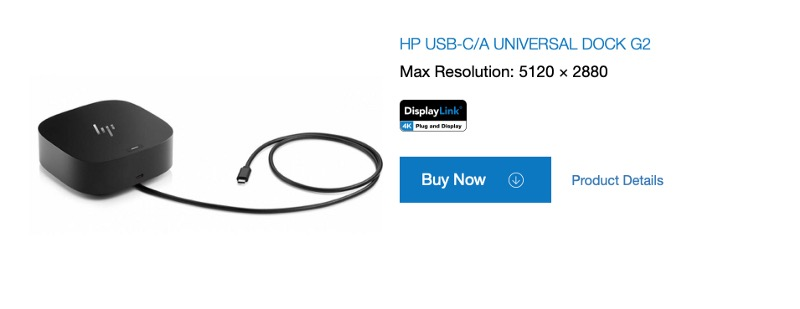

After browsing the web for a while I found the specific [forum post](https://h30434.www3.hp.com/t5/Business-Notebooks/HP-USB-C-Dock-G5-on-New-MacBook-with-M1-Chip-Minitor-not/td-p/7860077/highlight/false) maintained by the HP staff and users — and finally got the hint that the G5 dock isn’t supporting Display Link at all as it is a passthrough dock where the specific OS will load drivers for the components as needed.

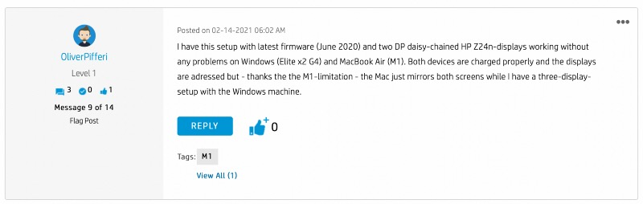

Instead, Soccer-dan recommended the [HP USB-C/A Universal Dock G2](https://amzn.to/37THUJZ) to me which DOES support Display Link-technology and, according to its [data sheet](https://www8.hp.com/h20195/v2/GetPDF.aspx/4AA7-5549ENW.pdf) macOS as well. As DisplayLink also shows it under the lineup of [supported devices](https://www.displaylink.com/products), I instantly made an Amazon-purchase as the key to success was at arm’s reach.

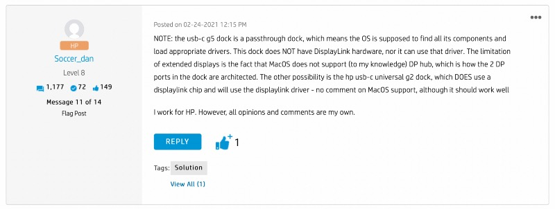

## A Gleam of Hope

Three days later, the adventure continued and after swapping the both HP-docks nearly instantly, I plugged the USB-C-cable into the MacBook Air and — et voilà — something happened within the DisplayLink manager:

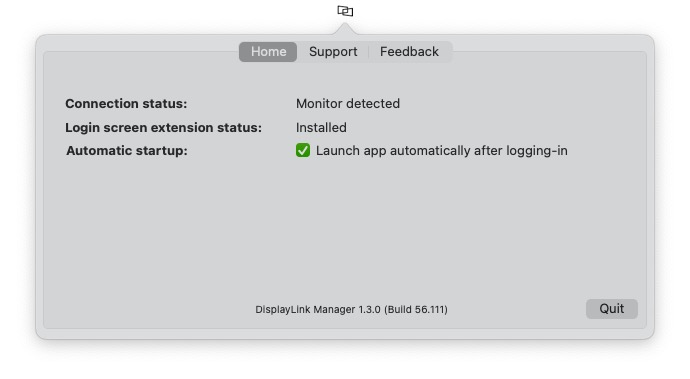

The software detected some kind of monitor(s) attached to it and after dealing with the screen recording permissions on macOS (DisplayLink Manager needs those), there was a light at the end of the tunnel:

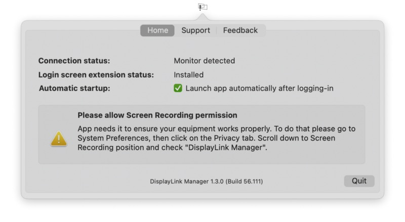

Both external displays were recognized and could be assigned and configured just like you would attach an Intel-based MacBook to them:

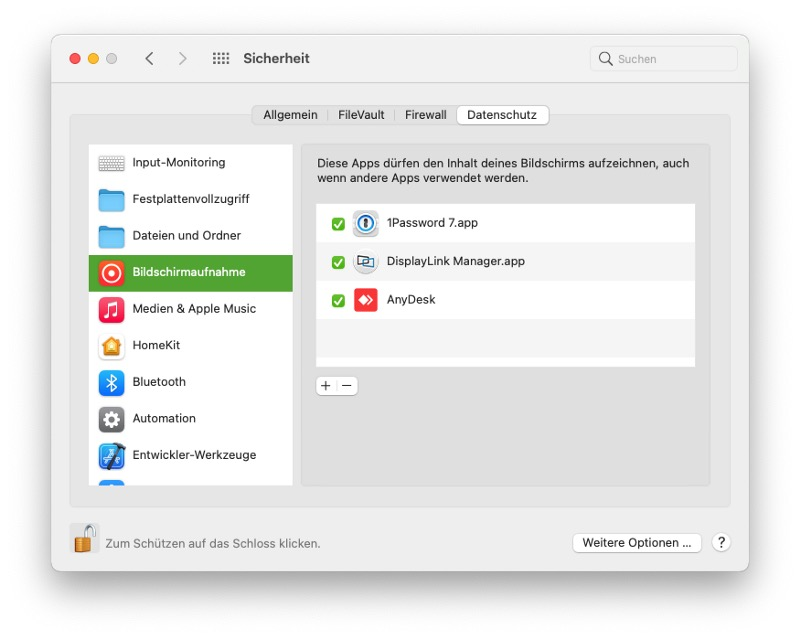

One single USB-C connector to rule them all, driving the both HP Z24n G2-displays with 1920x1200 WUXGA-resolution by 60 Hz each.

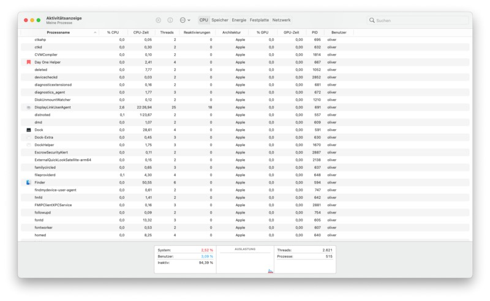

While this solution is told to be using some computing power by driving the displays through some kind of software-based approach, the CPU-percentage of Display Link Manager is quite to neglect if you ask me.

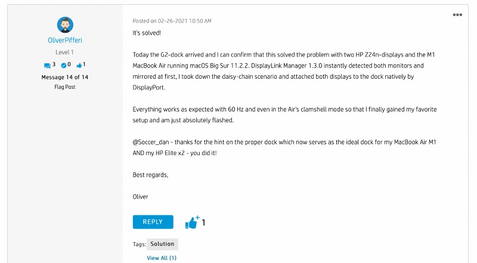

## Verdict

My frustrating journey on the lack of native support for more than one internal and one external display on Apple’s great, Apple Silicon-powered M1-SoCs has finally reached its end. It isn’t a solution be default from the vendor delivering hard- and software in persona, but an affordable approach how to achieve productivity at the desk once again. While I still don’t understand why my old 2017 MacBook Pro — which got ditched for the 2020 MacBook Air — managed to achieve this without any use of additional software, I don’t care anymore: The term of „DisplayLink“ and the just-in-time-release of the native M1-version of the DisplayLink Manager paired with the excellent HP-support (and therefore swapping my HP USB-C dock) finally delivered a stable and safe solution for my personal needs.

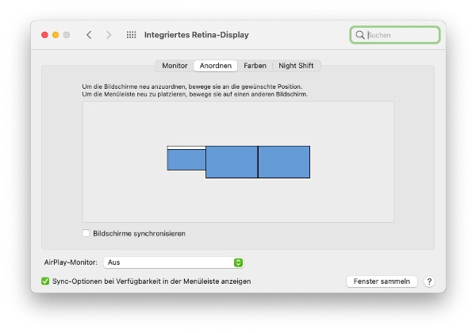

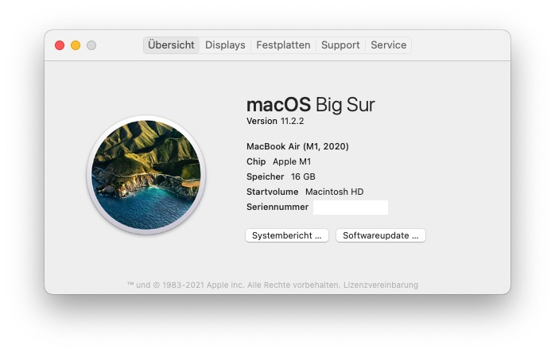

Not caring if you want to use three screens or just two, putting down the M1-device into „Clamshell“-mode with a closed lid: With the latest release of the M1-optimized DisplayLink Manager and a supported hardware, Apple’s limitations are gone for good in my specific use case.

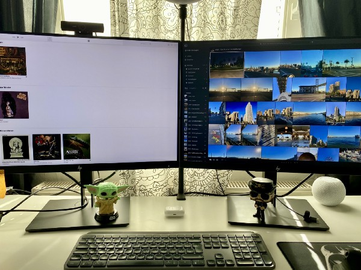

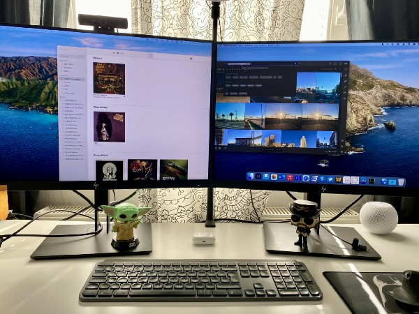

I haven’t checked external 4K-displays or other scenarios, but my basic approach of using my Windows 10-based HP Elite x2 AND my private MacBook Air M1 (2020) with two external displays performing simple office-work, video conferencing, blogging or even dealing with the Mac-versions of Adobe Lightroom or Affinity Photo is met by 100% now.

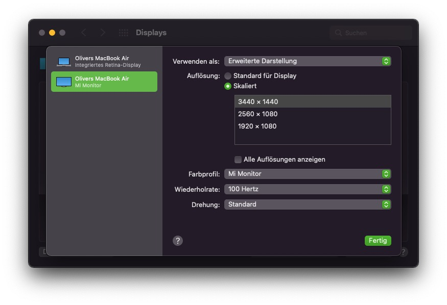

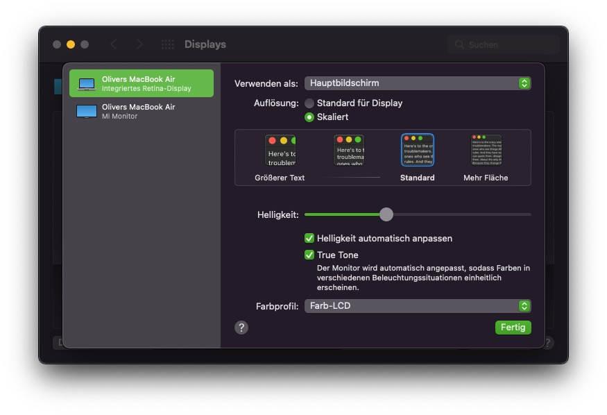

Therefore, DisplayLink was the — proverbial — „missing link“ of overcoming these boundaries of Apple Silicon and/or macOS’ addressing of external displays. I’m happy now!

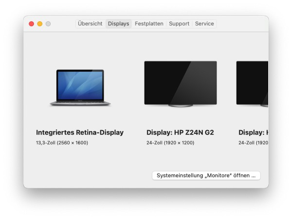

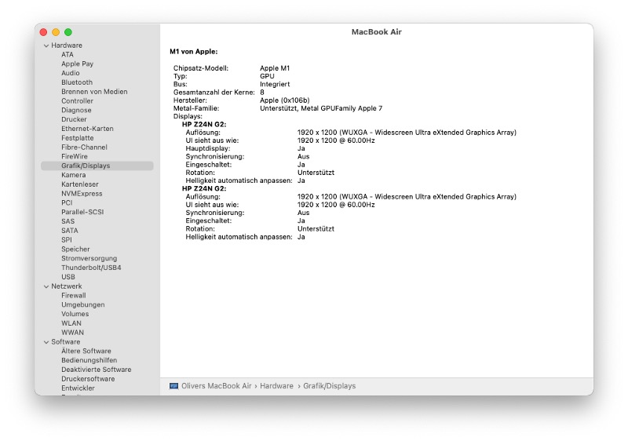

Still hard to believe, but wonderful nevertheless!