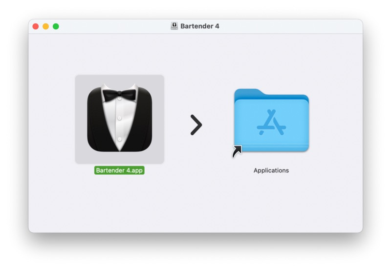
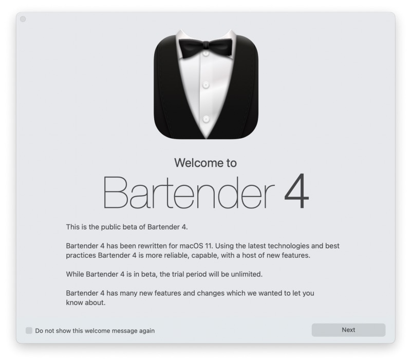
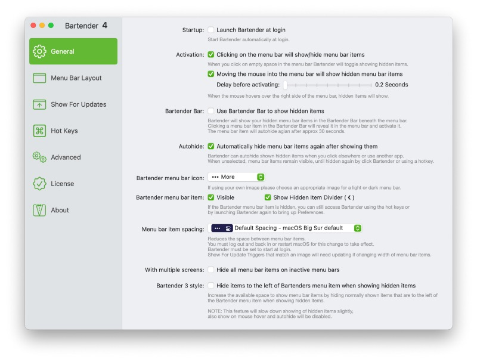
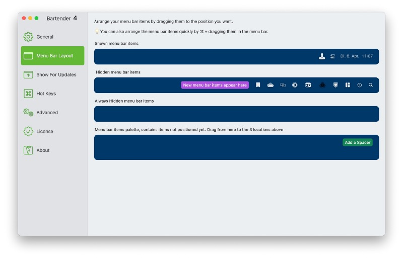
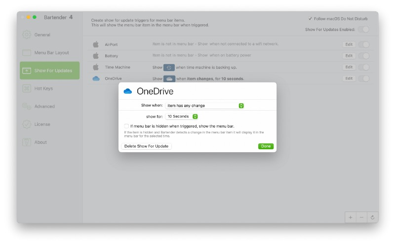
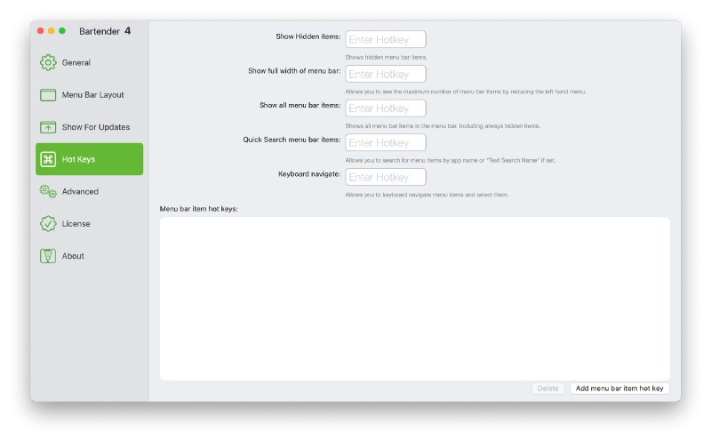
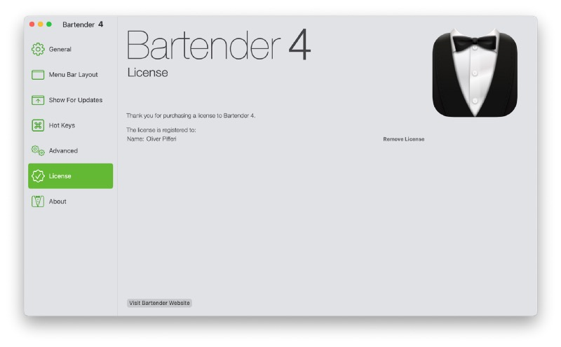

## As with each problem, there is a solution — before macOS Big Sur, this was Bartender in version 3 by developer surtees studios.

With Big Sur, we have to switch to Bartender 4 which is still in public beta but this beta is already optimized for Apple Silicon M1-based SoCs since the release of version 4.0.20 last November. Putting this version-thing aside, Bartender has just one special task: To minimize the amount of status icons in your menu bar — and it serves this task very, very well.

## How to start with Bartender 4, optimized for Apple Silicon

To start and make the first steps with Bartender 4 assuming you are running macOS Big Sur, just head to the [developer’s site](https://www.macbartender.com/?ref=pifferi.synology.me) and fetch the latest build which is 4.0.44 at the time of writing. To install, just open the .DMG-file and drag and drop the binary just you would do with every other software component using this install method. The software is currently not distributed via Apple’s App Store so the direct download is (yet) the only way of getting it.

In case you aren’t a user with administrative rights, an admin account is needed to verify the installation. Afterwards, just double-click to open the application for the first time and confirm the opening after (in my case) Apple has scanned the downloaded file for malware.

## To clean up and serve

Shortly afterwards, a welcome screen appears telling you that you are using the public beta of Bartender 4. So far, the trial period is unlimited so take all the time you need to get familiar with the software and explore its benefits. Once the beta will end, the trial will continue to work for four weeks and needs to be unlocked by purchasing a one-time-license. US$15 plus additional local taxes is a fair price if you plan to use this software on a daily basis.

Then, Bartender offers you to venture through its options and — simultaneously and without attracting too much attention — tidies up your menu bar to the maximum while three dots stand for Bartender 4 doing its job. Don’t worry, you may instantly change this symbol to better suit your needs (mine is a clerk) and even upload your own picture in case you want to.

## Configuration options

The general options harbor the elemental switches you may check first, for example if the tool should be started at boot time or not, how and with which possible delay it may be summoned, how the icon should look like or wether the menu item should be visible at all, making it possible to access it via hotkeys: Everything you may define here directly suits your needs.

Second, there is the menu bar layout — here you can define (and arrange) how symbols are shown or hidden within the menu bar. You may also define which symbols are always hidden and — once you need to juggle with many of them and arrange them in single blocks — add spacers to keep everything tidy.

Third, you can arrange the symbols that are shown when there is activity on the apps behind them, for example when doing a Time Machine-backup, being on battery power or showing when your Mac is not connected to a WiFi-network. These definitions can also follow macOS’ do-not-disturb-guidelines to match the times when you don’t want any interference from statuses.

In addition, Bartender’s options also provide options for defining hotkeys, doing update checks automatically or decrease show for update settings once you are running on battery power, keeping the energy usage for update notifications quite minimal. Last but not least you may instantly unlock your Bartender 4-trial by entering your name and the serial number you get once you buy the software.

Therefore — and summing everything up — Bartender is offering many options to perfectly configure the application to match your personal needs but doesn’t get lost in various minimal settings simultaneously: The amount of options and its impact on the app’s behavior is well-tailored and explained without limiting it in the one or other way — here the developers found an ideal balance between flexibility and usability; you don’t need to spend too much time to initially setup and configure the software!

## Verdict

Often you’ll encounter applications you may have never missed but begin to do so once you got familiar with them. Bartender is one of those apps that should usually be integrated into macOS straight from the scratch being a feature, not an add-on. Anyway, with more and more apps offering the option of putting its own symbol in the menu bar, this place may get messy while space is (always) limited.

Bartender 4 doesn’t wipe those icons away in general but helps to keep them under control once you need them or by showing them — for example — just in case of any activity. The menu bar begins to look like a cleaned up room very soon, therefore making it easier to focus on the contents of your screen instead of pointing your eyes to a bunch of — possibly — inactive symbols that always attract the user’s focus.

Finally, Bartender 4 is a bargain for each Mac-user striving for cleaning up macOS’ menu bar in an useful way. The business model as well as the pricing is absolutely fair and should not prevent you from a purchase once you fell in love with the app. Although I always missed Bartender’s features being integrated into macOS natively for quite some time now, this app is an ultimate no-brainer for me to extend my personal wellbeing on my Mac-systems — and it might do so with yours, so be sure to check it out!