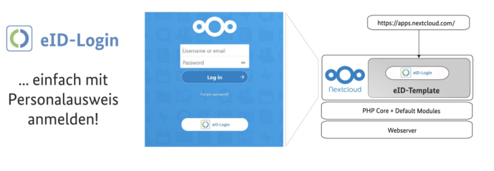

## Speaking of digital sovereignty, Nextcloud is often mentioned as the possible tool of choice helping to achieve that. Now, the shadow casted by Gaia-X will make it possible to use European identity card for access, serving the public demand and run by Nextcloud.

Today, the company behind the worlds’ most deployed on-premises content collaboration platform has announced that it is going to support the European e-ID identity card authentication. The e-ID was developed on behalf of the German Federal Office for Information Security, known to us Germans as „Bundesamt für Sicherheit in der Informationstechnik“ aka. „BSI“. Citizens are now able to log into the European digital sovereign communication and collaboration platform used by Gaia-X and many others once they make use of the system and the new kind of identity card („Personalausweis“).

## Cutting the dependencies

At the time of writing, organizations in Europe have largely relied on proprietary, foreign collaboration platforms due to a lack of viable alternatives — and still do! This fact finally leads to dependency and a quasi-monopoly position for mostly US and China-based software and service providers while also introducing data protection and privacy concerns. Nextcloud, as we know it, supports businesses, governments and individuals in data protection-compliant digitalization on its specific mission, providing a complete, scalable modern solution for communication and collaboration.

## Enter, Gaia-X!

The company and its software has been proven in tens of thousands of organizations with tens of millions of users across the globe. Nextcloud is widely adopted by businesses and government organizations across Europe after its start in 2016, created as a fork of well-known ownCloud. The German eID Card (“Personalausweis”), which has been certified at the highest possible level of assurance with the eIDAS-Regulation, can be used by all citizens for electronic identification (eID) and for strong pseudonymous authentication on the Internet. Until now, this has been used in a range of special applications mostly in the German government sector. Speaking of Gaia-X and the idea behind it, the digital transformation is driven forward while the digital sovereignty is placed in the focus of all ideas.

## Embracing the eID-Login
The support of the feature itself comes with the [“eID-Login”-app for Nextcloud developed by ecsec GmbH](https://apps.nextcloud.com/apps/eidlogin?ref=pifferi.synology.me) on behalf of the BSI which makes it now possible to use the German eID Card in Nextcloud for strong authentication. The technology is published under an Open Source license and available at no cost. This makes Nextcloud an even more viable platform for use in e-government or data protection critical use cases while maintaining control over the data and the underlying platform.

> It is great to see the German governments’ interest in supporting Nextcloud as the first popular collaboration and cloud solution with support for the German eID Card for strong authentication and identification. This enhances its strength as a platform already used by tens of millions of users in government, education, finance and health care for real-time collaboration in a secure, compliant and privacy-respecting manner.

(Frank Karlitschek, CEO and Founder of Nextcloud)  

The early and consequent consideration of relevant security aspects according to the „Security by Design“-principle and the publication of the “eID-Login“-app for Nextcloud as Open Source ensure that a very high level of trustworthiness is achieved. Thanks to the SkIDentity service, which is provided without fee for the project, the (German) eID card can now be used free of charge for strong authentication in Nextcloud. Finally, adopting the digital revolution by design on this sector should also drive paperless administrations forward and putting the processes there on a technical level which live up to the digital demands of the 21st century!