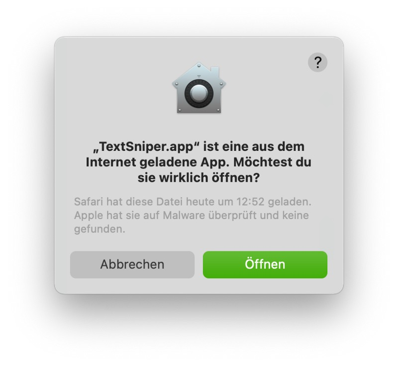

## There are apps you may have never missed before but once you got to know them, you can hardly live without them.

One of those apps is TextSniper by Latvian developer Valerijs Boguckis who pointed me to the tool I have never missed before. After his message got nearly lost in Twitters inbox, I finally answered and managed to read about the facts which define TextSniper as, literally, a missing link to the existing macOS-tools I already use day by day.

Yet another screenshot-app?
---------------------------

TextSniper is told to close the gap to classical OCR — Optical Character Recognition — which has its own history you may know from recognizing scanned content. Instead focusing on scans, TextSniper uses its own adopted interpretation of macOS’ screenshot-functions to recognize the text in, for example images. For example, you want to transcribe a statistic embedded in a graphic file or screenshot an error message which can then be sent your supporter in clear text: TextSniper wants to simplify OCR so let’s have a look on the tool and its features!

### Installation procedure

First of all, you’ve got — of course — to fetch your installation package once you meet the minimum requirements of macOS Catalina or Big Sur. This may be done via the official [website](https://www.textsniper.app/), the [AppStore](https://apps.apple.com/de/app/textsniper-ocr-simplified/id1528890965?mt=12%29) or via a trial-subscription to [Setapp](https://www.textsniper.app/#trial) which offers you many other apps for $9,99 a month. Mentioning the pricing, the download from TextSniper’s website comes $6,99 for one and $9,99 for three Macs while the AppStore-version may be purchased for a one-time-fee of $9,99 supporting family sharing: No subscription model here if you just need TextSniper which is quite fair being compared with the features the app offers!

In my case I used the direct download from the website which mirrors the usual installation way of many apps: Just drag and drop the universal (!) binary to your apps-folder.

Upon starting, you will be asked to trust the app after Apple scanned it for malware — the usual process for non-Store-apps.

Shortly afterwards, you may enter your license code once you went with the website-download and purchased the app via Gumroad.

Once you have entered it, you need to give TextSniper its explicit screen recording permissions, otherwise the tool won’t work.

After doing so, the app is ready to unfold its potential although it humbly hides in the menu bar.

## Targeting with TextSniper

You see, the installation is as straightforward as the options are but basically **Shift+Command+2** summons TextSniper in the same way you may already know from macOS’ integrated keyboard shortcuts. There is one difference — summoning TextSniper simply puts the contents of the selected screen area — either a protected PDF, an image or a video — into your clipboard which is acknowledged by a „Thumbs up!“-message. You may then paste the text into your preferred application and continue to work with it. Although this may sound quite simple, it is also as simple as that and you may even connect TextSniper with your iOS-device using its camera to snap pictures to recognize „remotely“.

Additionally, it’s quite impressive that TextSniper remains unnoticed until you summon it by the keyboard shortcut which may — of course — be customized to suit your personal needs. The app also features a Text-to-Speech-engine which may be enabled in the app’s options.

This feature I didn’t miss before either is worthy addition for foreign language learners or people who have trouble reading text on their screen. Once activated, macOS integrated engine will speak out what you just have „snipped“. Finally, every QR-code you may encounter may also be captured, extracted and converted to editable text.

## Verdict

Well, TextSniper has told me that there is definitely more than meets the eye: As I have stated up above, there are apps you surely won’t miss until you began to stumble upon them — TextSniper is one of those. Barely missed before, it apparently eases the pain of transferring image-based content into plain text for whatever reason. Giving it a deeper though (and closer look due to the app), I have this task on work and in private as well quite often — and mainly I used screenshots with a source given (never forget that it’s not fair to steal content!) to underline my opinion or a thesis regarding a specific topic.

The idea behind this app might be quite simple but, honestly, no one gave this idea the one or other thought before. Indeed I would go as far as to state that this piece of small and affordable software should be integrated into macOS straight from the scratch — why didn’t Apple forge this feature into its desktop Operating System so far? Good question, but this shows that Valerijs Boguckis found a sweet spot, a missing gap not to increase the amount of tools I additionally use on my Mac, but to increase productivity in my daily workflows.



Finally, it was great to discover TextSniper and learn that there **IS** still a place for innovative apps throughout the web. TextSnipper is a missing link to sharpen the productivity on macOS simply by closing a gap you may never have seen before. macOS is already an intuitive and well-structured Operating System and I especially use the keystroke **Shift+Command+4** for doing different kind of screenshots: Exchanging the „4“ against a „2“ (you will get used to it very fast, believe me!) will ease your daily routine for whatever purpose. TextSniper is a welcomed addition to macOS’ given capabilities and features so be sure to check it out and give this piece of great software a worthy try!