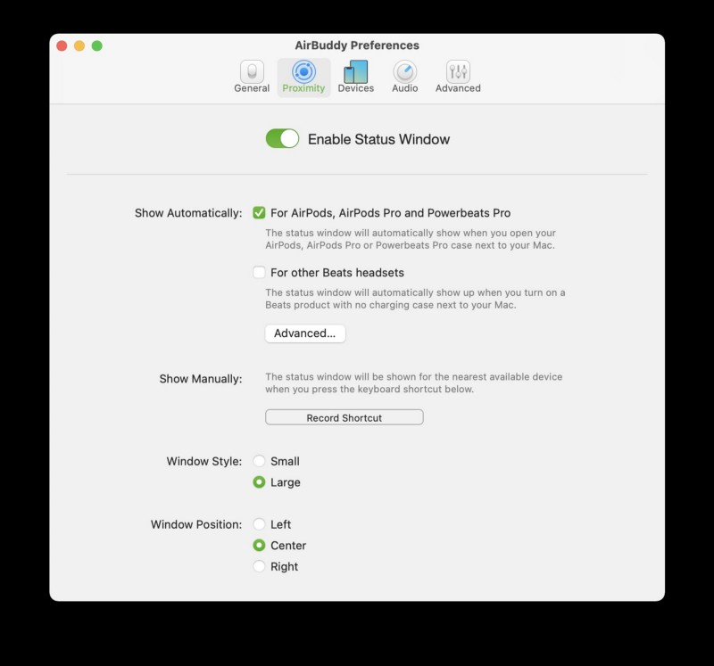
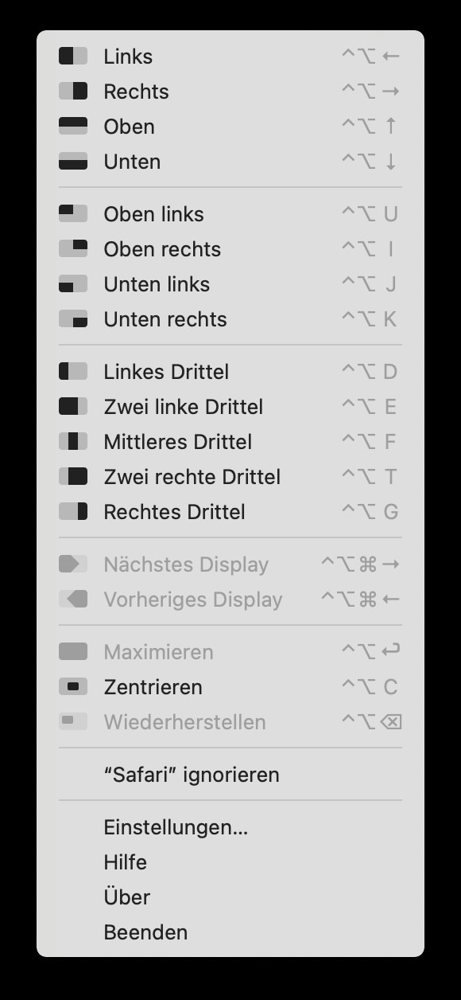
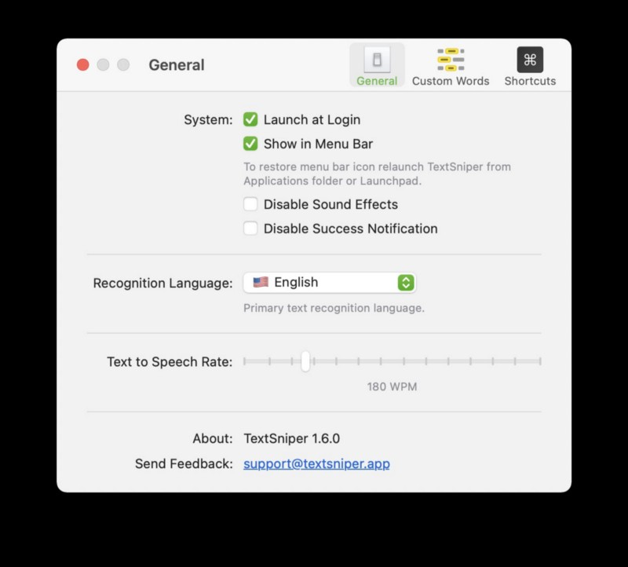
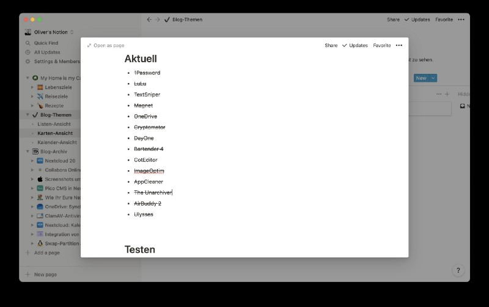
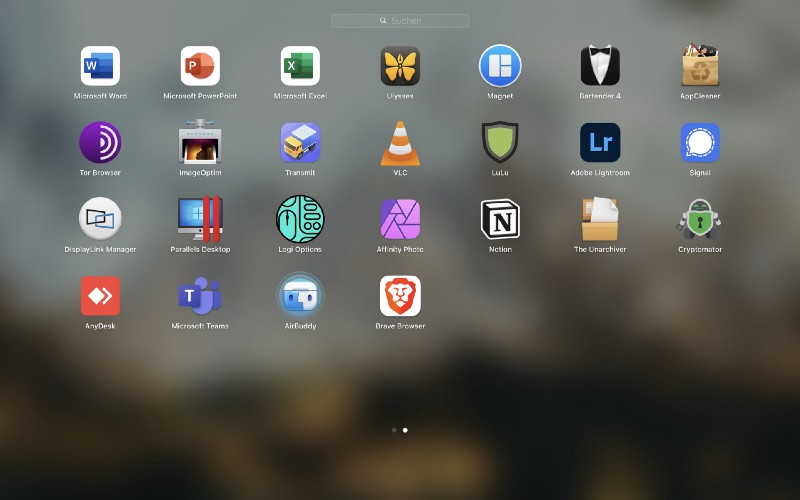

## While macOS always comes along with a bunch of productivity tools (and always was a synonym for being productive and creative!) there is always space for improvement. Besides, standard apps from the well-known giants like Microsoft 365, Microsoft Teams, Adobe Lightroom or Parallels Desktop do always find their way on my „Macintosh HD“.

Most users can switch on their new Mac and work with the preinstalled software straight from the scratch — but with personal and individual demands the need for additional software increases. While Apple covers a lot of areas from the very beginning, small (or even big) software elements, free and paid, can put an additional value to your working routine. A bunch of those are summed up here in alphabetical order — and I hope you find at least some as useful as I do!

Apps in Use
-----------

## [1Password](https://1password.com/)

The password manager that stands for one of the probably best of its kind. Hailing from the Mac, it also covers Windows and (even) the Linux-desktop. Subscription-based but worth every single cent and after I played around with some alternatives, I returned to the one and only 1Password some months ago as no other password manager is better integrated into your Mac and its browsers. Definitely one of the apps that changed my mind regarding subscription-based software!

## [AirBuddy 2](https://v2.airbuddy.app/)

With AirBuddy, you can simply open your AirPods case next to your Mac and see the current status right away, just like how it works on your iPhone or iPad. Connect your Mac instantly by a single click, change listening and input modes without accessing the System Preferences or Bluetooth-menu: You can live without AirBuddy, but it’s a nice addition for all your AirPods, PowerBeats Pro and other Beats-headsets — and in case you need some statistics, the AirBuddy will serve here for a one-timer of $9,99, too!

## [AppCleaner](https://freemacsoft.net/appcleaner/)

One of the free (!) applications I am using for some years and for which I would definitely also pay for. Instead of „deinstalling“ apps the Mac-way by dragging them into the trash bin, AppCleaner takes care of finding any file and .plist, cache folders etc. from each app you wife up with it: Simply drag the application onto the AppCleaner-logo or in the opened app and it collects all fitting pieces of information which you may delete afterwards selectively. There is more than meets the eye!

## [Bartender](https://www.macbartender.com/)

As fan of numerous useful tools that use to show in macOS’ menu bar, more amount of symbols don’t get along with keeping track of every status. Additionally, the menu bar just feels overcrowded. Bartender solves this problem for you and is very customizable while doing so — just keep every symbol cloaked until you summon the Bartender or when an app is doing any kind of activity. Quite low-priced and optimized for macOS Big Sur, the Bartender is your companion for cleaning up your menu bar.

## [Camo](https://reincubate.com/camo/)

While we are in the middle of 2021 already, COVID-19 and spending most of the working time in our home offices have shown that even pricey webcams lack a certain quality. Camo of Reincubate, hailing from London, closes this gap by attaching your iPhone’s camera to your Mac, providing the best camera experience for nearly every (conferencing) video tool you may imagine. While webcams were short (and over-priced!) in the middle of the pandemic one year ago, Camo turned out as an alternative that remained to stay, ditching even a Logitech Brio-webcam with a tool you already had: Your smartphone. Once again, a simple idea turned out to be a great solution and while Camo offers everything you may need for your video conferences, the most difficult task is the ideal mounting for your phone!

## [CotEditor](https://apps.apple.com/de/app/coteditor/id1024640650?mt=12&)

A basic and free text editor for many purposes — in my case it often replaces TextEdit whenever I want to write some code or analyze existing code. It also offers the chance of making contents of different kinds of file types like HTML, Markdown, Python, Perl clearly structured and visible. An additional command-line interface, iCloud-support and a seamless integration in macOS make CotEditor an additional app that feels like one being shipped with your Mac. There is a heavy competition with Visual Studio Code, BBEdit and others but CotEditor finds it small and fitting niche without giving the feeling of being overloaded for the standard user — and even power users should give this one a try!

## [Cryptomator](https://cryptomator.org/)

To make it simple: Cryptomator encrypts the contents of folders for use of any cloud-service instead of forcing you to put any sensitive data into the public cloud. As soon as you encrypt a folder by AES 256-technology, it’s definitely locked up and safe. Unlocking means that a virtual drive with the folder contents will be presented to you in a write- and readable version, just like you know from a standard file-system. There is a direct iCloud-integration for new folders but those can also be placed within your OneDrive, Google Drive, Dropbox and whatever-folders. Apps for iOS and Android round out the free solution that can be purchased as well, unlocking dark mode and supporting the good cause behind Cryptomator.

## [Day One](https://dayoneapp.com/)

During the last year and especially because of COVID-19, I searched for some way to bundle my thoughts and write them down. I searched for a specific kind of diary-/journal-based platform and found one with Day One. macOS, iOS, iPadOS — Day One is journaling in perfection with a seamless and safe integration into Apple’s ecosystem. The [premium plan](https://dayoneapp.com/pricing/) for $2,92 a month (yearly billing) offers real-time sync, cloud backup, unlimited photo and video-space and even the chance of audio recording. Additionally, an Instagram-importer sync all your Instagram-photos with the specific date, helping you to follow your journey through this Social Network. There may be other options, but Day One has everything you may wish from a modern and unlimited app — and even more. The slogan „Journal from here, there, everywhere.“ is not just the promise of some false prophets. No further words needed — if journaling on the Mac is yours, then this app must be yours, too!

## [Display Link Manager](https://www.displaylink.com/downloads)

I love my new MacBook Air with its M1 Apple Silicon-SoC. But being an early adopter often comes with frustration which showed up in the limited use of external displays. Together with my HP USB-C-dock (which is [certified](https://www.displaylink.com/products/find?br=5&) to work with Display Link) I am addressing two eternal displays via USB-C and Display Port although Apple never intended me to do so. Display Link and its free software, the Display Link Manager, are the key to zero frustration with Apples own SoC.

## [ImageOptim](https://imageoptim.com/mac)

Shrinking JPGs without putting the quality aside is quite a demanding task, also the possible removal of Metadata. If your scope meets one of those two requirements, the free ImageOptim will be your friend! Just drag the desired file on the apps’ logo and it will do its work despite of a missing Universal binary (version 1.8.8) yet. You may configure the grade of compression as well as various other options which are quite a lot for a „helper“ tool. For more and demanding tasks, there is a (paid) web API you can use, the Mac-app is Open Source’d.

## [LuLu](https://objective-see.com/products/lulu.html)

I used Little Snitch for many years until I stumbled upon LuLu of security researcher Patrick Wardle and his mates of Objective-See. While macOS’ firewall keeps everything out of your Mac after being activated, LuLu takes care of preventing apps from phoning home. Basically, you can allow all Apple-service or already installed apps or just start from the scratch, blocking everything, and allowing the communication of each software component step by step. LuLu tells you which process is phoning home to which port, which host and which IP: The app takes care of full network transparency and I bet you will be wondering how gabby your Mac is. LuLu is free of charge which doesn’t prevent you from donating something for the app’s sake — and — most impressive! — the full source code is [available](https://github.com/objective-see/LuLu) on GitHub.

## [Magnet](https://apps.apple.com/de/app/magnet/id441258766?mt=12&)

If you have ever searched for an app that organizes your workspace, puts your windows where you want them and does all this with a well-configurable hotkey-support, Magnet is your choice. Not free for $7,99, but worth every single penny as a one-time-payment. One of the first apps I install on a new Mac!

## [OneDrive](https://apps.apple.com/de/app/onedrive/id823766827?mt=12&)

Love it or hate it. Some prefer Dropbox, some iCloud Drive or Google Drive — and even numerous other cloud services. Being trapped between the Apple- and Microsoft-microcosm, I love OneDrive for offering me 1 TB of storage in my Microsoft 365 Business-plan and for being a foundation for each Microsoft Office-related app. Besides, my photos are also uploaded to the service which offers me maximal flexibility for all cloud storage-based workflows. While OneDrive for the individual starts with a free (and quite limited!) plan, buying a Microsoft 365 Home-, Family or Business-plan starting with „Basic“ equips you with 1 TB of cloud storage!

## [Textsniper](https://apps.apple.com/de/app/textsniper-ocr-simplified/id1528890965?mt=12&)

One of the apps you will never miss unless you stumbled upon them. TextSnipers does a screenshot of graphics, videos etc. and — with the help of Artificial Intelligence — does a great job in converting the graphic you have just snipped into a plain text to further work with. So to speak, TextSniper is aiming to put your images into words in case you need this scenario (and believe me, you need it more frequently than you may assume!) and fills a gap you may have never missed before.

## [The Unarchiver](https://apps.apple.com/de/app/the-unarchiver/id425424353?mt=12&)

Although macOS’ integrated Archive Utility works quite well, it can get even better: This free tool already available als Universal Binary uncompresses archives with the extensions .ZIP, .RAR (including v5), .7Z, .TAR, .GZIP and .BZIP2. It will also open many older formats, such as StuffIt, DiskDoubler, .LZH, .ARJ and .ARC and even some Windows-executable .EXE-archives as well as .ISO-files. Once you adopted it to open all of your archives, you won’t come back to Apple’s Archive Utility!

## [Ulysses](https://apps.apple.com/de/app/ulysses/id1225570693?mt=12&)

I used to write everything with Scrivener from the very beginning but somehow got rid of the fact that, for whatever reason, the app sticked to Dropbox for syncing — no iCloud, no OneDrive. After all the years I left Scrivener at version 3 and found myself somewhere between iA Writer (great if you just want to write without any distractions) and… well, Ulysses. While iA Writer was a one-time purchase, Ulysses is based upon a subscription model — and worth every cent as it combines the best from Scriver and iA Writer. A solid base for all writing projects, iCloud capable, supporting Markdown and direct publishing to Wordpress, Ghost or Medium integrated from the scratch: There is nothing that makes Ulysses not adorable which turned out to be the undoubted center of all my writing activities quite fast. Offering apps for the Mac, iPad and iPhone, you’re always ready-to-go within the Ulysses-universe while the syncing between all devices work flawlessly thanks to iCloud.

Questions? No? Good, as Ulysses ist a must-buy for a yearly subscription of $49,99 — quite pricey, but definitely worth the money!

Apps being observed
-------------------

## [Unsplash Wallpapers](https://apps.apple.com/de/app/unsplash-wallpapers/id1284863847?mt=12&)

A new app I am currently testing. I stumbled upon it after reading the list of favorite apps from this user and thought I may give it a try. I love the quality and versatility on Unsplash.com and the Universal binary takes care that there is a new background whenever I want it to appear: Different categories with the chance to add collections directly from Unsplash may be configured and the change of (all connected) backgrounds can be triggered manually or scheduled.

### [Notion](https://www.notion.so/)

Many, many words could be written about Notion here. Although I am quite OneNote-biased, Notion takes another approach and, by providing blocks, a better arrangement of contents than Microsoft’s OneNote does. While Notion strives for more and wanting to become an All-in-one workspace, you have lots of options for collecting your ideas, charts, Wikis and all relevant stuff. The learning curve is quite steep but once you altered the sample contents and adopted how the app works, Notion offers a lot even in the free plan although I would willingly like to pay the $4 for the Personal Pro-plan, but…

… there is no smoke without a fire: The service — even in the Desktop-app — is bound to the „online“-status. There is no offline-option of opening your workspace while you’re on the move and — even worse — security is something that needs to be fixed by all means: A missing Two-Factor-Authentication (2FA) and (especially) missing End-to-End-encryption (theoretically, your files are readable on the provider’s servers) are a no-go in 2021 seen from the security guy’s point of view. Summing it up, I like the way Notion works but am not sure if I will stay with the service unless basic security aspects aren’t forged into Notion. Until then, just take care of what you plan to upload into the S3-buckets Notion is formed upon.

Final Thoughts
--------------

Now you have ventured through the whole list of my used apps as of May 2021 and I hope to have successfully shared some useful additions to macOS with you. Please let me know your thoughts or own alternatives to the apps I wrote about and drop my a comment — I would be pleased to read your feedback!