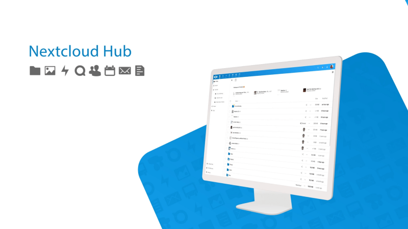
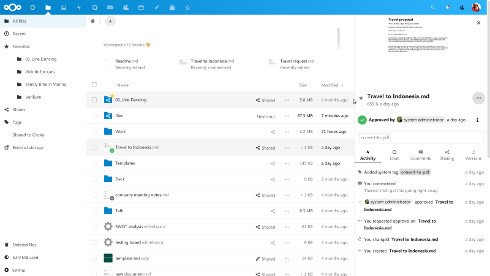
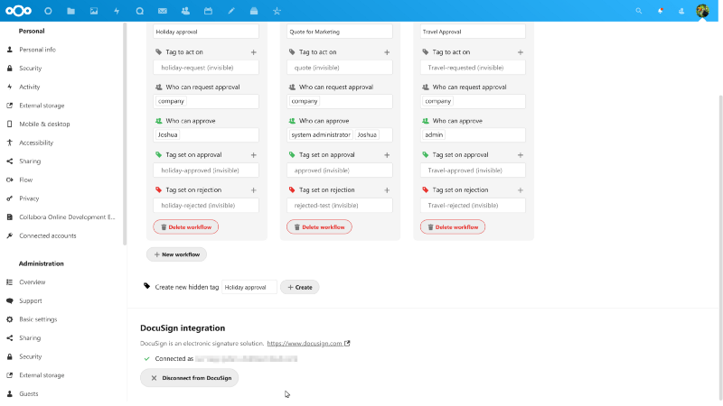
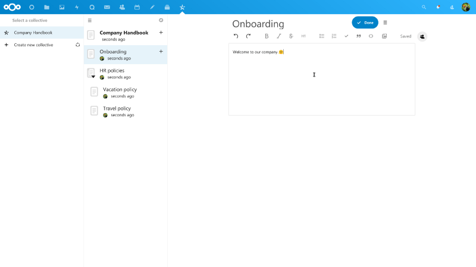
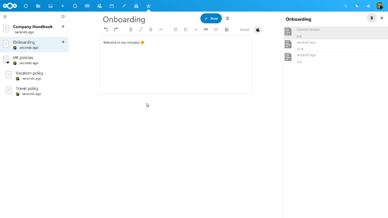
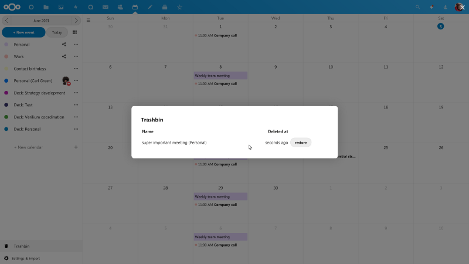
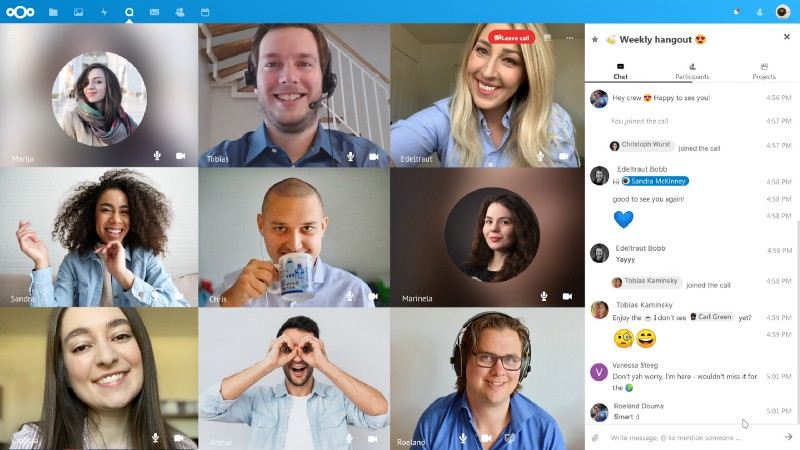

## Barely five months after the release of version 21, the latest Nextcloud Hub 22 enters the stage.

People who followed me over the years will know my nearness to Nextcloud which once raised out of some ashes to renew the private cloud and collaboration experience. It was a fast and steady trip so far and as the pandemic is facing its (temporary) end, using the time to deliver alternatives to the well-known public cloud products is definitely a great move. Nextcloud’s base is a solid rock while many puzzle pieces entered the big whole over the years — now we welcome Nextcloud Hub 22 which was introduced today in a — still — virtual event hailing from Stuttgart, Germany.

## The new office

Still aiming for the optimized modern and digital office, the release introduces user-defined groups, integrated chat and task management, an easy approval workflow and integrated PDF signing with DocuSign, EIDEasy and LibreSign. With Nextcloud Hub 22 also comes the introduction of an integrated knowledge management application named „Collectives“ — both features were already available to download in the Nextcloud’s App Store with version 21 already and especially „Collectives“ is a nice and data-protection-friendly way for people that like the appearance and style of, for example, Notion.

> „The last year has demanded an acceleration of digitalization in organizations and the market is moving towards more comprehensive digital collaboration solutions. Nextcloud has aligned its roadmap to the reality of new work in modern organizations, delivering the capabilities needed for the paperless office. With optimized workflows and more effective self-management for teams, Nextcloud Hub 22 will further facilitate remote work and global collaboration for teams.“

(Frank Karlitschek, founder and CEO of Nextcloud)

## More workflows, more complexity

It has been proven that, with COVID 19, remote working has forced organizations into more digital workflows, but this came with compliance, security and digital sovereignty challenges. Nextcloud is still aiming to uniquely addressing these challenges, dramatically simplifying legal compliance and improving online collaboration. Nextcloud Hub 22 now introduces a series of optimizations for common workflows in digital organizations and empowers teams to manage themselves: Modern organizations face a quickly changing, dynamic environment and internal structure has to reflect this in co-existence to the factor of security which shouldn’t be neglected by all means.

To relieve administrators from the burden of group management, Nextcloud Hub 22 introduces user-managed groups named ‘Circles’. Users can now form their own teams and manage memberships in a variety of ways directly from the scratch — existing Nextcloud-users may also recognize this app from the Store.

## Collaboration is still the focus

To facilitate the collaboration of teams, Nextcloud Hub 22 further addresses three different common workflows. First, this release integrates task management closer with chat, enabling the direct transformation of a chat message into a task, and sharing tasks into a chat room. Second, the common workflow of reviewing and approving a document is optimized with admin-defined approval flows which allow employees to request approval on a document and management to respond.

And third, requesting a formal signature on a PDF document like a contract or NDA (who doesn’t know them?) can now be done directly from within Nextcloud. Three different PDF signing tools are currently supported: The well-known DocuSign, the European EIDEasy, and the fully open source and on-premises LibreSign, addressing the personal biases of each user scope.

Easy access to common knowledge is key for modern collaboration and although I love the way solutions like, for example, Notion look and work, they often lack (End-to-End-encryption) security. Nextcloud Hub 22 addresses this issue by offering the „Collectives“-app, integrating Notion-like knowledge management in Nextcloud.

Collectives features pages and subpages to structure knowledge, and cross-document links to connect information. Access to knowledge is managed with user-defined groups through Circles and documents can be edited with others in real time. The Full-text-search makes finding information easy and data is fully portable, saved in Files and thus accessible from the mobile and desktop clients as markdown documents — closing the collaboration circle within Nextcloud.

## Upgrading and Improving

Further on, Nextcloud Groupware now introduces a trash bin in Calendar to enable users to recover deleted calendar items. The calendar also introduces resource booking to facilitate the handling of meeting rooms, cars or other resources in organizations. Nextcloud Mail now features improved threading, E-Mail tagging and support for Sieve-filtering.

The Nextcloud project management tool Deck offers an improved search, integration with Talk and support for directly attaching documents to a task from within Nextcloud Files. Additional improvements include notifications in the app navigation, a series of security hardenings, integrated zip file compression in the Files-interface and significant performance improvements to universal search according to the Nextcloud-team.

> „The reality for modern organizations has shifted towards online work, which comes with two main downsides. First, the security, vendor lock-in and compliance challenges that comes with using foreign SaaS cloud solutions. And second, the use of a mishmash of poorly integrated platforms is a recipe for lost documents, version mismatches and security breaches. Nextcloud develops the most comprehensive, on-premises digital office, uniquely solving both problems at once.“

(Andreas Rode, CCO at Nextcloud GmbH)

Nextcloud Hub 22 is available immediately so existing installations may be updated once your installation recognizes the update. As always, the new version is rolled out in waves so once you should not see the update in the backend, you may download the latest package and (S)FTP it to your installation, pushing the update this way. Like with every update be sure that you have an actual backup so that you may revert in case of problems!