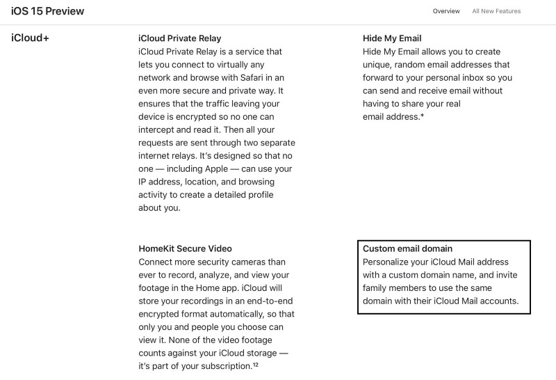
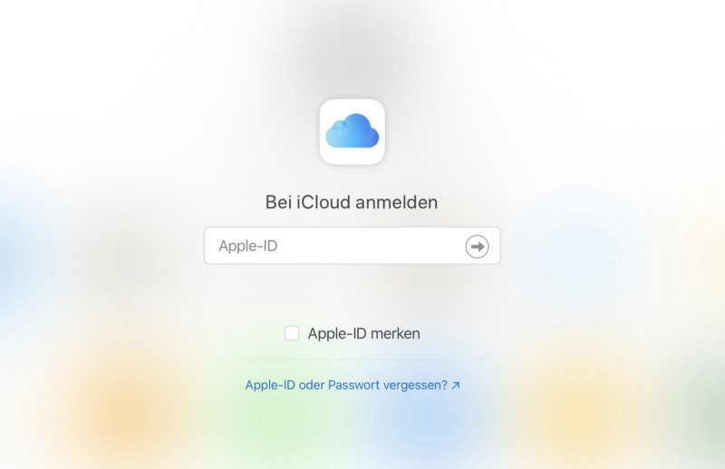

## I don’t know how long I expected this feature to reach iCloud, but in the backwash of all those great iOS 15-features, custom E-Mail domains silently creeped in.

As an Apple-user who once even paid for MobileMe, iCloud was always the center of my Apple-based activity — with one exception: The mail service which was focused on the Apple-related E-Mail-addresses ending with the Top-Level-Domains .mac.com, me.com or icloud.com. This time NOT competing with Microsoft or Google, Apples mail service was always something that reminded me of something which was left for good.

## Closing up to the competition?

Microsoft 365? Google Workspace? Years ahead. Last year, I did already write about some reasons why [Apple should strengthen and upgrade iCloud](https://medium.com/macoclock/why-apple-needs-to-strengthen-and-upgrade-icloud-6d775fa275d5?sk=8af13e875f1275033ed4d9b9f16eecd4&ref=pifferi.synology.me) and why, for example, [Apple One didn’t absolutely convince me](https://medium.com/macoclock/why-apple-one-hasnt-absolutely-convinced-me-yet-4b171fa028bf) at the time of writing (not mentioning that I subscribed anyway after some months of thinking): There were still some puzzle pieces missing that were needed to transform iCloud into a modern service, using some aspects that are just standard looking at the competition. Now, in June of 2021, an improvement seems to loom on the horizon and while this year’s WWDC of course focuses on iOS 15, there are some fixes and features regarding mail as well.

## A closer look

I don’t remember this feature being named besides the focus features like iCloud Private Relay, Hide My Email or HomeKit Secure Video but looking in feature list of the [iOS 15 preview](https://www.apple.com/ios/ios-15-preview/features/), my long-expected feature appeared quite silently:

> Custom email domain  
> Personalize your iCloud Mail address with a custom domain name, and invite family members to use the same domain with their iCloud Mail accounts.

Apparently, Apple has finally listened and I hope that this feature will have its solid place when the final version of iOS 15 is being released. I don’t have the illusion that the service is really intended to compete with business solutions and there will, of course, be a separation, but why not aiming at Microsoft’s Family-plans from the Apple-microcosm? Whatever Cupertino does, there must also be some refresh made in the visuals and the appearance of iCloud in general as especially Microsoft is, according to my opinion, years ahead with a very great web interface — in the private and business-sector.

## Thanks for Listening, Apple!

It appears that Apple has finally listened — at last. Critics would say Apple bended the market’s will but I think there will be reasons that this step was made that late. Whatever happens next, I hope that this feature will be made available very soon so that I can use it within our family. At least, I’d wish Apple releases some pieces of information how long the road to the custom E-Mail-domain will be, knowing that iOS 15 is scheduled for release sometimes this autumn!

Finally, let’s hope that custom E-Mail-domains, an absolute standard in modern mail-solutions, will integrate seamlessly in the existing Apple-infrastructure and devices and Apple made its homework — it needed some years to come to maturity!