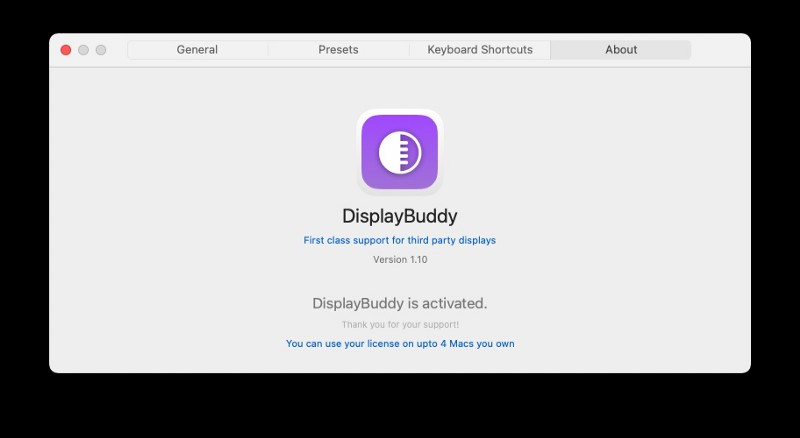
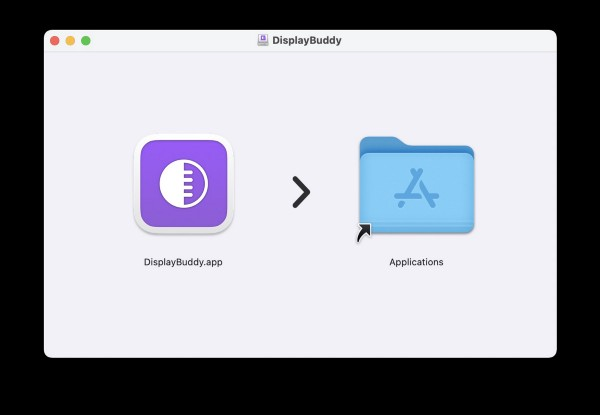
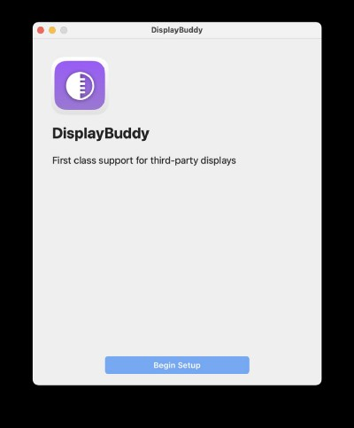
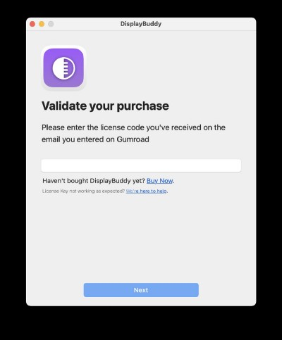
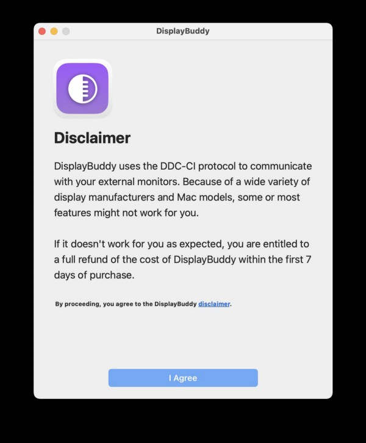
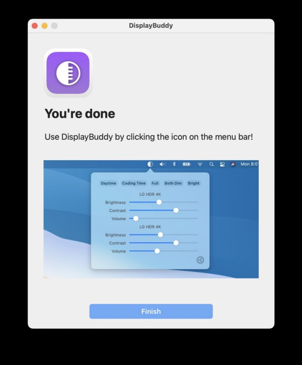
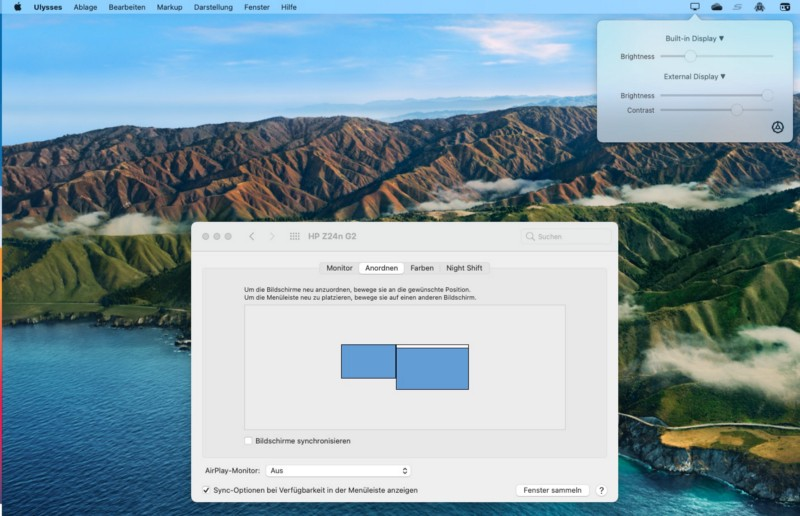
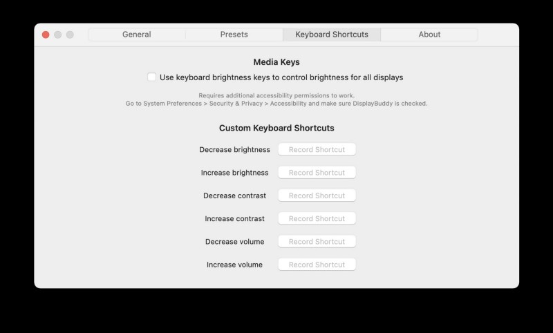
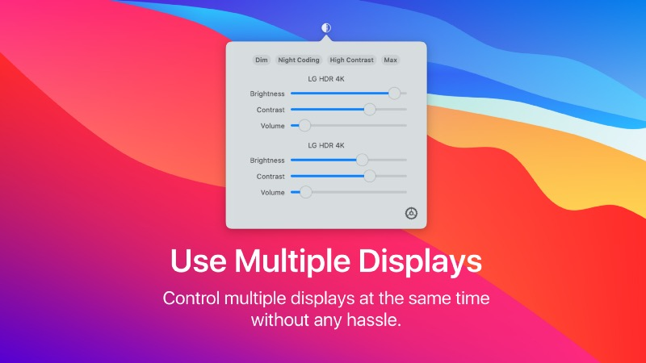

## While there are tons of additional useful Mac-tools out there, some shine out

One of those apps I recently discovered is [DisplayBuddy](https://displaybuddy.app) by developer Siddharth Gupta. With his app, he delivers a solution nearly everyone of us has — working with stationary monitors most of the day: Fiddling around with brightness and contrast during the day- or evening-hours is a nasty attachment to everyday’s work and — depending on the controls of your monitor — a quite demanding task. DisplayBuddy addresses exactly this issue, making it possible to control those settings from your Mac, orchestrated by a piece of software. LG Ultrafine-users may already know this feature because the integration of those displays in macOS but DisplayBuddy makes it available for many brands like LG, Dell, Samsung, Acer or BenQ.

## Installation

As simple this idea is, as simple is the footprint of DisplayBuddy. Just [get](https://gum.co/displaybuddy?ref=pifferi.synology.me) the universal app and drag it into your „Applications“-folder (depending on your permissions, you will need administrative credentials to put it there). Each monitor bought in the last five years should work as long as it contains the DCC-CI-protocol. After the first start, you will need to enter the license code purchased, agree to the disclaimer and you’re ready to go. The behavior of the app is quite straightforward and, with the chance of saving presets, the versatility of saving a day- and night-scenario is given, too. The options are straightforward as well and won’t confuse anyone. You may easily adjust brightness, contrasts and — if supported — even the volume while this option is NOT supported on M1 Macs, since direct control via DDC/CI is still not supported: „Apple M1’s GPU doesn’t expose the necessary interfaces required for that yet“, states the developer.

While my BenQ EL2870Q was connected via a Thunderbolt-to-DisplayPort-cable, I could play around with brightness and contrast while the changes apparently worked not instantly, but after closing the pane and clicking on DisplayBuddy’s icon in the menu bar. I don’t know if this was just a wrong assumption of mine or something that can be fixed by the developer, but, after all, the changes were directly sent to the external display once clicking on the app’s symbol. The same effect was noticed with one HP Z24n G2-display so — apart from being advertised on DisplayBuddy’s page — HP-monitors work well, too but without giving them their fitting name like the LG 4K-displays in the demo screens show. As I use two of the Z24n G2-displays in connection with my HP G2 USB-C-dock, I was also curious if DisplayBuddy would get along with the DisplayLink-drivers enabling my M1 MacBook Air to address two (!) external displays.

This test, unfortunately, failed although DisplayBuddy managed to recognize three (open lid) respectively two (closed MacBook Air) external displays. Recognition is here, but the values you change in the app won’t get sent to the displays so, if using a DisplayLink compatible dock, you may encounter the problem described here. Alas, this is nothing that is within DisplayBuddy’s powers as the app works well with a direct connection and who knows — maybe this is something that may change in the future? No grain of salt here, though!

## Verdict

DisplayBuddy comes $4.99 with a seven-days refund-option and may be used on four Macs which is a great bargain for those bucks. As I mentioned above, the app offers pure Ultrafine-feeling for non-LG monitors and some features far beyond I’d expected Apple to integrate from the scratch in macOS. I love those little helpers like DisplayBuddy and while always trying to stick with the features my OS gives me, there IS a certain need for useful little helpers like DisplayBuddy!

Check it out for yourself and I am sure once you used it for the first time, it’s one of the apps that will set a new standard for your work with macOS in connection with external displays!