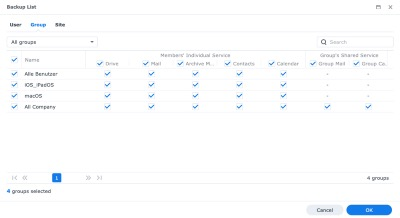

## While the adoption of cloud-services has evolved over the years and already set new standards, the question of the shared responsibility can’t be ignored: Your data, your responsiblity!

While we tend to outsource more and more services into the cloud (and as someone who embraced the cloud since the early days!), the danger of losing data is always present. We have changed the platform, from the on-premises into a Software-as-a-Service-based architecture, delivering the foundation for E-Mail-communication, Filesharing etc. while we don’t need to set up and maintain these platforms on the on-premises. Alas, with great power comes great responsibility and so we are in charge of backup up our data wherever it may roam — you’re only shifting away the risk of running a platform, not the security of the data you possess anyway!


## History

I began to follow the traces of Microsoft Online Services in 2011 or 2012 — the predecessor of the Microsoft 365 we know today. Over the years, the service(s) matured impressively and so we know Microsoft 365 Home/Family for the private use and the business-plans which often start with an Exchange Online-subscription or a Microsoft 365 Business Basic-version if you tend to use Teams and OneDrive. Anyway, as the Family-subscription supporting your own domain may only be used in connection with GoDaddy, I switched to a Microsoft 365 Business Premium-plan some months ago, trying to adopt as much of Microsoft’s offerings even at home. As Microsoft is — besides me being a loyal Apple-follower over all the years — part of my daily work as an IT consultant, I didn’t need to build any bridges to adopt the mindset of these solutions.

## Basic Thoughts

So now, I use Exchange Online. I use OneDrive for Business which is running on a SharePoint-backend. I am using Teams using SharePoint for file storage as well. All the data that resides in my Microsoft 365 Business-tenant is mine but it needs to be backed up somehow. In my work, also being the product manager for Veeam at our company, my choice would be Veeam Backup for Office 365 as especially Veeam points out the model of [shared responsibility](https://www.veeam.com/blog/office365-shared-responsibility-model.html) which shows what Microsoft does and what Microsoft does not. At home and even running a business tenant (I haven’t found a proper solution of backing up a private subscription like the Home- or Family-plans), I need to take care of my cloud-based data for many reasons: Data loss or a Ransomware-attack are just two aspects which could really hurt.

As my lab at home is just meant to be — well — a lab, I don’t want to maintain an on-premises-server to run my Veeam backup (which I would do if I had the proper use case!) so instead, I started gazing at my Synology DS-920+ NAS which is not only a classic place for all my on-premises-data, downloads, videos and photos but also a local backup instance which also syncs these backups to Wasabi S3-storage for archive purposes and so on. With all the flexibility Synology offers far away from „just“ being a NAS (it servers as a Docker-host and a local mail relay, too), the running OS DSM (DiskStation Manager) also offers a module entitled „[Active Backup for Microsoft 365](https://www.synology.com/en-us/dsm/feature/active_backup_office365)“.


You got it — this could be my chance of safely backing up my Microsoft-based cloud data without the need of a beloved Veeam-instance. Many of you will also own a Synology so maybe this package is a possible missing link to solve a logical backup problem in connection with any Microsoft 365-based business plan.

## Prerequisites

First of all you need to check wether your Synology is eligible for running this service or not: The packet’s [official page](https://www.synology.com/en-us/dsm/packages/ActiveBackup-Office365) shows which models are supported and once you’ll find yours here, you are ready to go! For dealing with the PowerShell commands of this tutorial, you’ll also need a Windows 10 or Windows Server 2016 (or better)-system as the script provided by Synology won’t run on other systems. Additionally, you should have access to a global Microsoft 365-account of your M365-tenant which enables you to create an Azure AD-application for Active Backup for Office 365.

## PowerShell-ing

First of all, there is the thing with Windows PowerShell: Search for the specific tool in the search bar, right-click the result (please mind not to start the x86-version!) and select „Run as Administrator“. Then you will need to [change the execution policy](https://docs.microsoft.com/en-us/powershell/module/microsoft.powershell.core/about/about_execution_policies?view=powershell-7) so that you will be able to run the script at all.


The command

```
`Set-ExecutionPolicy -ExecutionPolicy RemoteSigned -Scope Process`
```


will take care of this, please select „Y“ for „Yes“ afterwards.


Now you are ready to download the PowerShell-script straight from Synology’s server — so click on the [link](https://global.download.synology.com/download/Addons/ActiveBackup-Office365/AppGenerator.ps1) and save it to a specific folder on your system’s hard drive, in my case this was C:\\Synology.

Now navigate to this folder from within PowerShell and run the script by typing

```
.\AppGenerator.ps1
```


Enter „r“ to run the script and once your PowerShell is not up-to-date, you may need to install and import the NuGet-provider first: Enter „Y“ again to install the modules from „PSGallery“ at this point.


When prompted to enter a certificate password, enter a password as you wish and press „Enter“. Note that you will have to enter the password again during the task creation process in Active Backup for Microsoft 365 so be sure to keep a record of the password in your Notepad or Password Manager that you cannot forget it.

Heading on, a Microsoft 365 authorization windows will appear, giving you the chance to enter your administrative credentials which have the permission to create an Azure AD-application.


Once the script finishes running, you should be able to see the tenant ID, the application ID and the certificate file path in PowerShell. Copy those to your Notepad/Password Manager and don’t even dare to delete the certificate file! All these credentials will be used in the following steps and are mandatory for your Synology to connect to the freshly-created Azure AD-application!


## Azure Portal

Within the PowerShell-output, you will notice a specific URL displayed. Just copy it and paste it to your browser, then you will be lead to the API-permissions of the freshly-created application. Click „Grant admin consent for Name-of-your-Organization“ and select „Yes“ so the permission can be applied.


After this has been done, all prerequisites in terms of Azure AD and PowerShell-ing have been made and you may log off from your tenant and close the PowerShell-window.


Now let’s head on to the other side presented by the Administrator-interface of your Synology!


## Heading on to the Synology-backend

After making all necessary preparations, we may now head over to our Synology’s backend to fetch Active Backup for Microsoft 365 from the package center. I was running the beta of DSM 7.0 a the time of writing so your optics may differ in case you still run the stable 6.x-branch but this should not prevent us from going to the Package Center and download the desired package: Here, it can be found in the „Beta Packages“-category so we need to „Join Beta“ do download Active Backup for Microsoft 365.

Once done so, we are being welcomed after starting the app for the first time but need to activate the package or — to be specific — its license by using the credentials of our Synology-account. Additionally, the acknowledgment of Synology’s data protection EULA is necessary to get the package active in its whole. After doing this, we are ready to configure the backup of our tenant.


## Backup configuration

Now we can configure the first backup job in Synology’s Active Backup for Office 365. The first choice to be made is wether we want to create a new backup task or relink an existing one — in our case we just want a new one and, due to our preparations, we can instantly connect the new job with the Azure-app created in the step above.


You will need the correct Microsoft 365 Endpoint (regional/service provider-dependent here), the E-Mail of your administrative user you used to create the Azure app, the tentant and application ID you have created and — finally — the downloaded certificate and its password.


Once everything is correct (and it should!), you will be transferred to the next screen to give your job a fitting name and — probably — edit the job details. By default, Synology Backup for Office 365 will backup the whole tenant, but if you choose to go into detail, you may also exclude aspects and services to backup.


You may also in- or exclude specific groups or Sharepoint sites in case you think they aren’t worthy of being saved to another location but this is up to you!





After you made this choice, enabling the feature of „Enable Active Backup for Microsoft 365 Portal“ will help the specific Synology-users to access a self-service-portal so that they can restore data on their behalf instead of asking an administrative colleague to do so.


Heading on, you can configure the auto-discovery-options where backups for new users and the specific elements are configured. It’s good to opt all-in so that — in case you create a new user — their won’t be any disappointment if he/she loses his/her data and their is no backup. Apart from the users, the same counts for groups and Sharepoint-sites.


## Scheduling Time

The next step is the scheduling part where you may (or must!) choose the backup schedule for your job — either continuous, manual (don’t do it!) or as a classical schedule based upon fixed times. Additionally, you may play around with the retention policy which defines how long historical backup versions are preserved until deletion. In my scenario (still a private household here!), I went with a daily backup running every day at 2:30 am — your demands here may (and surely will!) be different, so just adjust this schedule to suit your personal needs.


In the end, a brief summary of the task will be presented so that you can check every choice you have made and with clicking on „Done“, it is set. Editing the job afterwards is, of course, always possible.


Your Synology will ask wether you want to start this job now or not and making the first backup is a good choice here.


In case something goes wrong, you can directly search for the reason and adjust the screws.


## Final verdict

Not caring if you’re a private household with a M365 business-plan or a smaller company with a fitting Synology ideal for backups without another software vendor in between: Active Backup for Microsoft 365 could be the tool of your choice! It’s easy to deploy once you managed to do the prerequisites from a Windows-machine via PowerShell and even more easy to handle from the web interface of your NAS once you managed to create the first backup-job.


This is just one option to backup your valuable Microsoft 365-data and fetch it „back home“ and while other solutions might be quite more versatile, they may come with other costs or need some kind of backup-server to start with. In our case, a Synology being eligible for hosting the software feature is enough to safely backup one of Microsoft 365’s business plans.