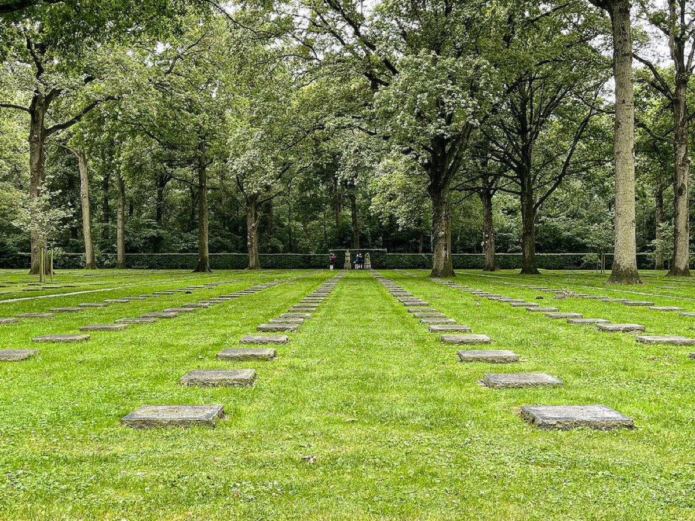
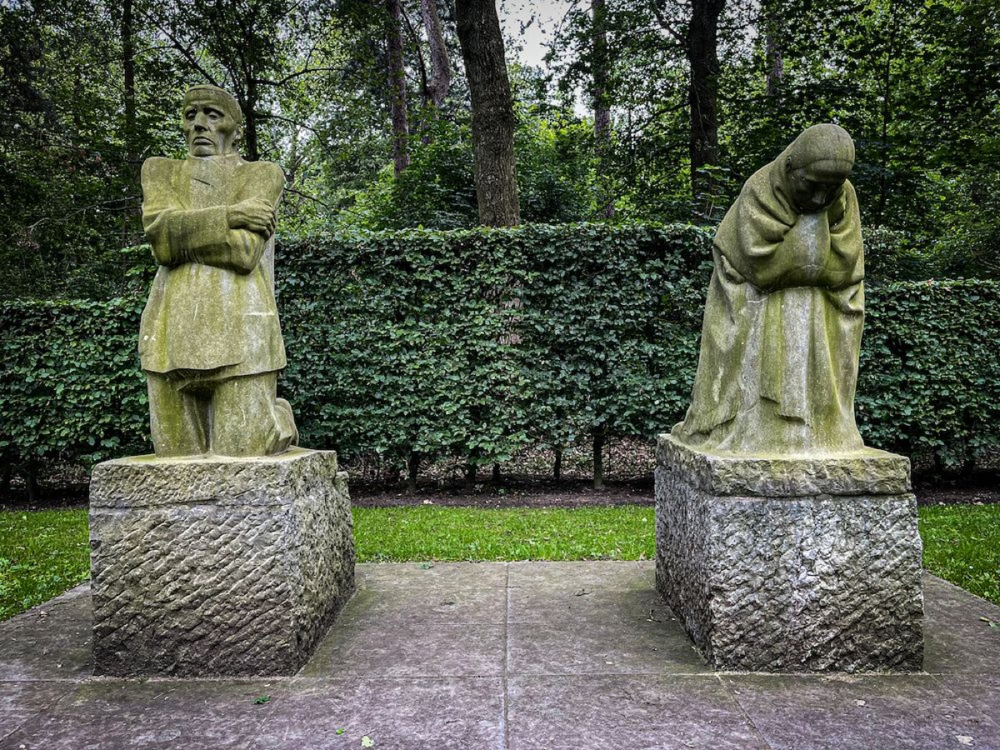
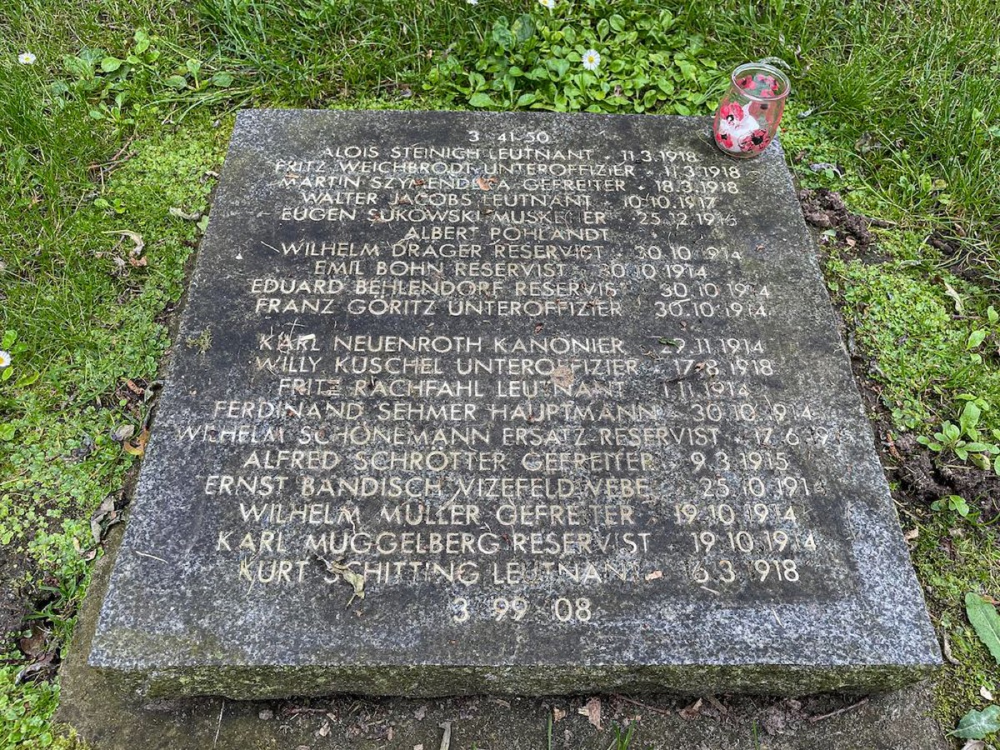

## Two years after my first two trips throughout Flanders Fields, I was able to return and continue my journey on the WW1-gravesites in Flanders.

This time, this report has a sad personal note that came by coincidence four days after venturing through [Vladslo German Military Cemetery][1] with was my first stop in my „Flanders Fields Pt. 3“-tour. Although this is yet another story to be told (I already mentioned it in this [article][2]), life is short and, usually, you should enjoy every second as we (mostly) have the choice to do so. Millions of people during The Great War had worse options - and many voted for the fight for the better cause, putting their previous lives and their future away for a meat-grinding process that depopulated Europe.

The cemetery with 25.645 fallen soldiers is located in a forest-surrounded area and once you aren’t aware of this special place, it’s quite easy to drive past. The path to the gravesite is equipped with information boards about the area and its history also covering the fate of family Kollwitz until you enter through a gate that opens a view on a wide and grassed area divided by two lanes and covered by numerous gravestones. Geometrically, this site is a quite clear and organized center within a woodland area and an inevitable focus on the head-based sculptures of two mourning parents.

Vladslo German Military Cemetery was the first chapter of my trip throughout Flanders Fields in the short summer holidays of July 2021. Learning that this cemetery is the proof how a father and a mother, here [Käthe Kollwitz][3], are mourning their child Peter (died on October 22th, 1914 at Dixmuiden, aged 18), this vision alone is sad enough but got a real-life connection these days in many ways. Children should never ever go before their parents and The Great War is just one senseless proof how many lives where thrown away for, mostly, the price of a mile.

Lest we forget!

[1]:	https://kriegsgraeberstaetten.volksbund.de/friedhof/vladslo
[2]:	https://pifferi.info/death-smiles-at-us-all---all-a-man-can-do-is-smile-back/
[3]:	https://www.kollwitz.de/biografie