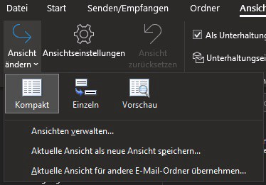
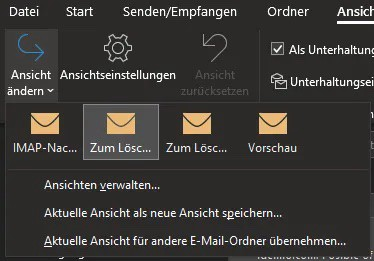
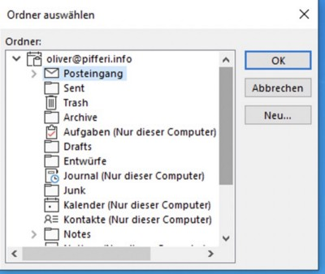
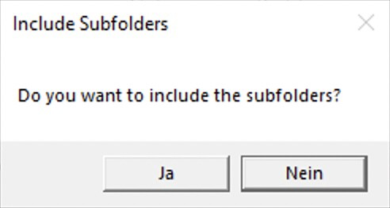
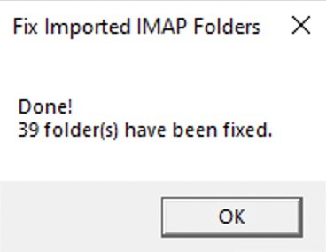

## Sometimes, only the PST-Import-/Export-trick helps you to move E-Mail-data safely from one service to another. But what if you encounter empty folders or no folders at all after import?

## Background

I recently had this issue when I took the rerouting with exporting- and importing via Outlook when I moved mails from an IMAP-server to an Outlook.com based, private E-Mail-account. As dragging and dropping from Apple Mail is, for example, not the best way if you want to keep date-/timestamps unmodified, I went through this case with a Windows-based Outlook and thought to do this well. Anyway, after importing all subfolders located under my Inbox weren’t just empty — they just didn’t exist, same with the „Sent“-mails, only the mails in the Inbox itself were readable. Checking if I missed something, Outlook told me that there WAS proper data in the mailbox — data I couldn’t see, neither in Outlook nor on my iPhone’s stock mail app!

## Troubleshooting

It took me some time to venture the web and to gather all the information I’ve found about this topic: Ranging from „use the Outlook-app on iOS“ (NO!) to „use some professional migration services“ (well, no!), there were many pieces of information that helped not that much. Finally, I stumbled on a [blog entry](http://www.howto-outlook.com/howto/fix-imported-imap-folders.htm) that covered exactly this problem with a — just to anticipate it — proper solution!


## Problem: Wrong folder-tagging

The background is quite odd and, personally, I never knew that I would once hit such an obstacle: The problem starts just when you try to import a PST file originally created with Outlook connected to an IMAP mail-system into an Outlook-connected Exchange (Online) mail-system. Surprisingly (and not reproducible for other than the folders mentioned above), only some of the imported subfolders were converted from an “IMAP folder” to an “Exchange folder”. Whatever kind of process or algorithm tagged some as IMAP and some as an Exchange folder will surely stay one of Microsoft’s secrets. The road to hell is paved with good intentions, but anyway — how can we fix this?

## Solving the issue

Looking at these screenshots, you can easily grasp and understand the problem — hopefully the German screenshot don’t confuse you too much: Open Outlook, select a subfolder an open the „View“ section. Now use the “Change View” menu for an „Exchange“-folder and you will discover that those folders are generally visible. “Change View” menu for an „IMAP“-folder and you run into the dead end that folders defined as such are invisible on iOS/Android mail-apps. Logical, isn’t it?





According to the blog and [Robert Sparnaaij](https://de.linkedin.com/in/rsparnaaij), a MVP for Office and maintainer of the blog, the solution is to change the “PR\_CONTAINER_\__CLASS”. The process above must be executed with each single folder unless you have a method to do everything via a bulk-method so he, fortunately, created a simple VBA script to fix the whole folder structure in one strike.

```
'This script fixes imported IMAP folders.
'It does this by modifying the value PR_CONTAINER_CLASS property;
'The value is schanged from IPF.Imap to IPF.Note.

'Original Script created by: Robert Sparnaaij
'For more information about this file see;
'http://www.howto-outlook.com/howto/fix-imported-imap-folders.htm

Dim i

Call FolderSelect()

Public Sub FolderSelect()
  Dim objOutlook
  Set objOutlook = CreateObject("Outlook.Application")

  Dim F, Folders
  Set F = objOutlook.Session.PickFolder

  If Not F Is Nothing Then
    Dim Result
    Result = MsgBox("Do you want to include the subfolders?", vbYesNo+vbDefaultButton2+vbApplicationModal, "Include Subfolders")

    i = 0
    FixIMAPFolder(F)

    If Result = 6 Then
      Set Folders = F.Folders
      LoopFolders Folders
    End If

    Result = MsgBox("Done!" & vbNewLine & i & " folder(s) have been fixed.", vbInfo, "Fix Imported IMAP Folders")
  
    Set F = Nothing
    Set Folders = Nothing
    Set objOutlook = Nothing
  End If
End Sub

Private Sub LoopFolders(Folders)
  Dim F
  
  For Each F In Folders
    FixIMAPFolder(F)
    LoopFolders F.Folders
  Next
End Sub

Private Sub FixIMAPFolder(F)
  Dim oPA, PropName, Value, FolderType

  PropName = "http://schemas.microsoft.com/mapi/proptag/0x3613001E"
  Value = "IPF.Note"

  On Error Resume Next
  Set oPA = F.PropertyAccessor
  FolderType = oPA.GetProperty(PropName)

  'MsgBox (F.Name & " - " & FolderType)

  If FolderType = "IPF.Imap" Then
    oPA.SetProperty PropName, Value
    i = i + 1
  End If

  Set oPA = Nothing
End Sub
```


## Using the magic

There are few steps we now must make and in case you stick to the order of those steps below, everything should turn out fine and your problem should be fixed in no time, depending of the size and contents of your mailbox of course — without the need of administrative rights!







Although you will still be curious (I was!), take a break and wait until Outlook synchronized the modifications with Exchange Online or Outlook.com (which is founded on Exchange Online anyway)! Having an impatient look on the mobile apps, you should see first results quite fast without needing to alter anything on the devices themselves!


## Happy?

I hope that this article has helped you in a rather uncommon scenario and, thanks to Robert Sparnaaij’s pioneer work, the script should have accelerated the time needed to solve this problem. Hopefully you have enjoyed this little howto — take care and feel free to leave me a comment once this hint here has helped you in any way!