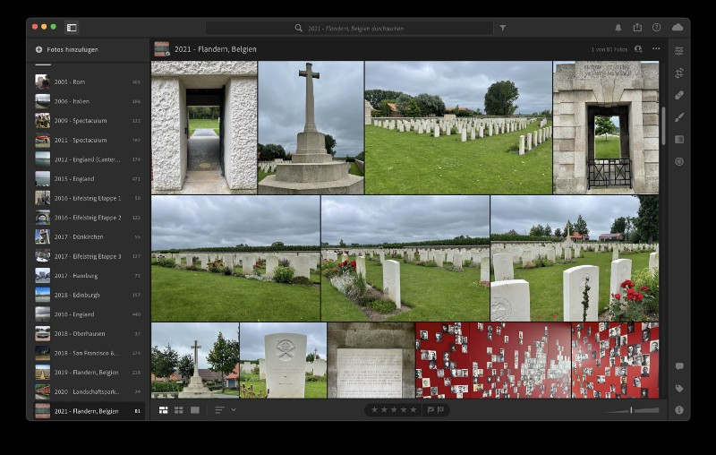
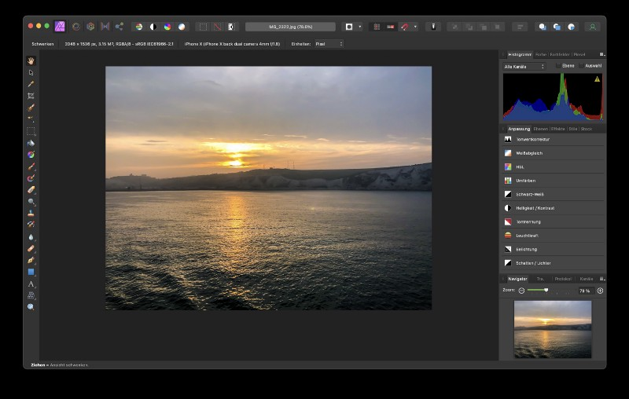
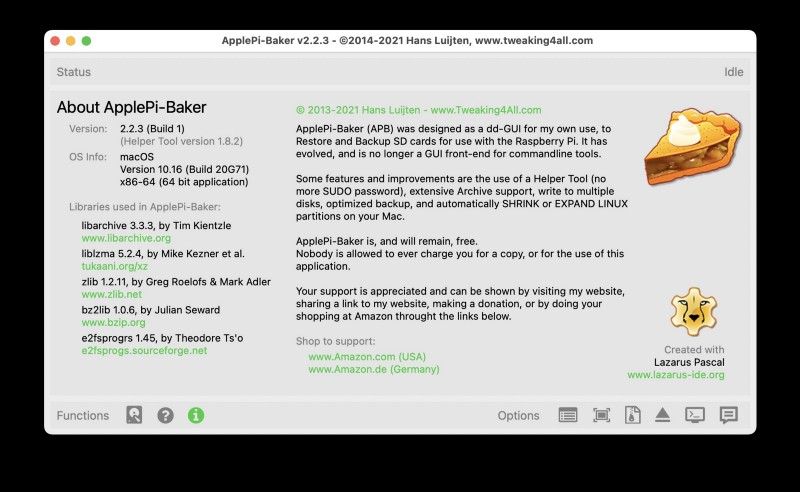
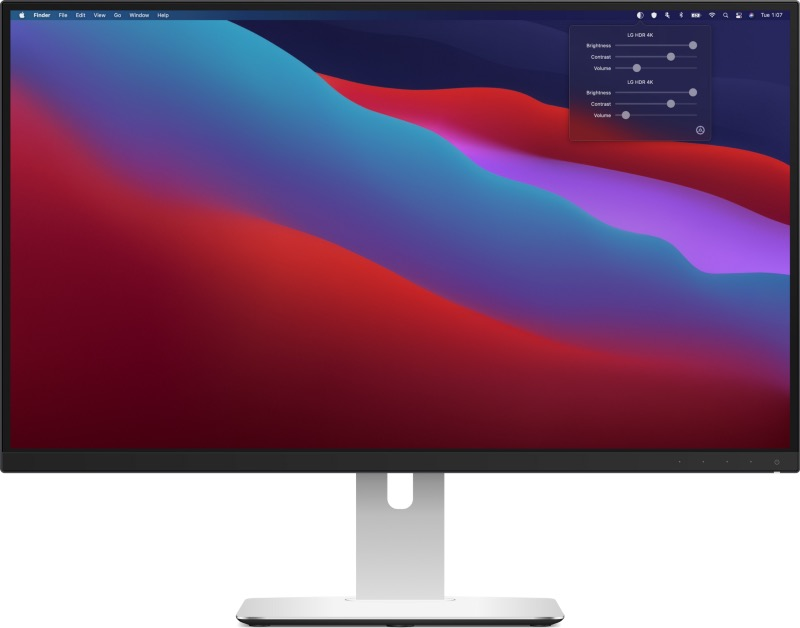
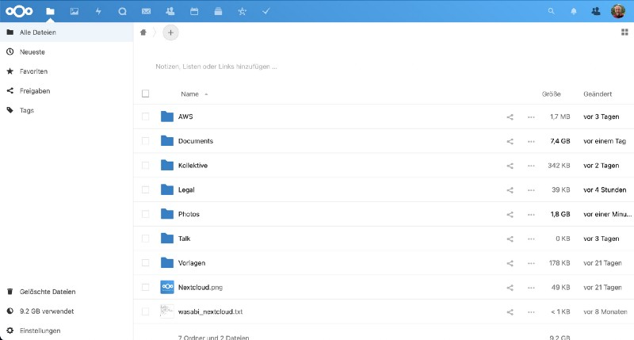
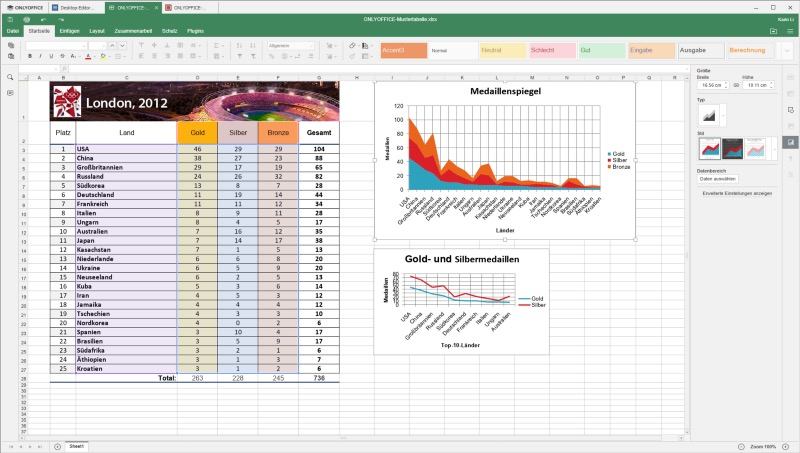
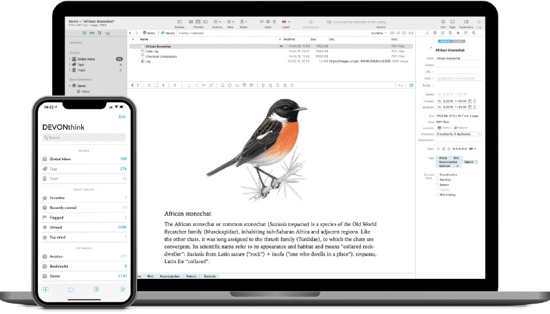
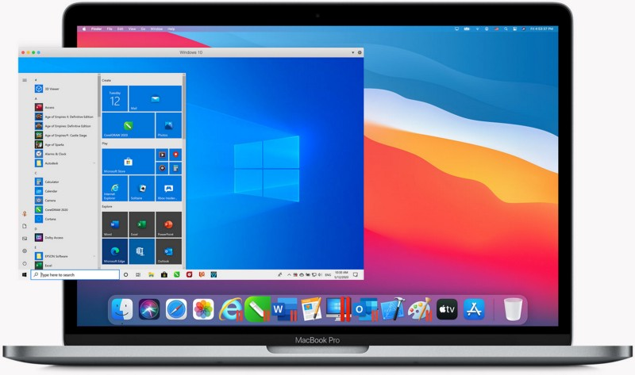
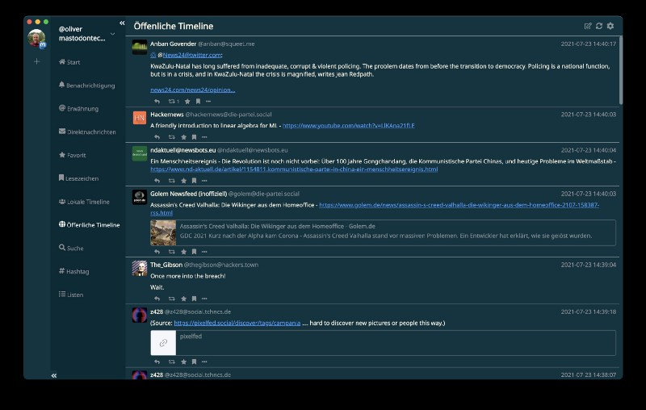
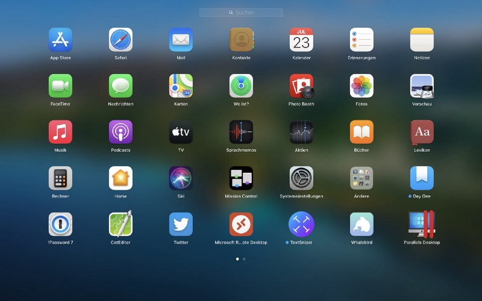

## While I wrote about the „Useful apps to enlighten your daily Mac-routine a while ago", I discovered that — humbled by the reader’s outstanding appreciation — this was one of my most-successful articles ever.

It took me some time to question myself why the feedback was that great here on Medium — far better than reviews of single software products, general news or thoughts of mine. Maybe I stroke a chord when telling you which Mac-apps afar from the standard ones could help you in fine-tuning your Mac-experience. Maybe it was the combination of many great apps I wrote about. Maybe it was just the amount of proper words at the right time, who knows?

Anyway, I took this as a chance to post a follow-up aka. a second part of additional apps that (for whatever reason) haven’t been mentioned in the first article or have been added in the meantime: Life is not constant and things are changing so let’s put the former bench players into the spotlight!

Apps in Use
-----------

## [Adobe Lightroom](https://apps.apple.com/de/app/adobe-lightroom/id1451544217?mt=12&)

As I am using Lightroom since the „classic“ days where you just could buy it as a one-timer and considered it to be far better than Apple’s deprecated „Aperture“ (Rest In Peace!), I wondered why it hadn’t made it to the first list. Maybe because I considered it to be a real commercial app from a big player or because I am mainly using it on my 2020 iPad Pro to take care of photos I make and optimize? Who knows — anyway and, while being subscription-based these days, Lightroom is my standard of pre-processing my images. Optimized for Apple Silicon’s M1-SoCs, Lightroom comes 11,99 EUR per month or 144,99 EUR a year — not cheap, but once you have the needs for the great features this Adobe-app offers, each Euro will be worth the subscription!

## [Affinity Photo](https://apps.apple.com/de/app/affinity-photo/id824183456?mt=12&)

While I love Adobe’s Lightroom and also used Photoshop over the years, I once discovered that the monthly investment of a Photoshop-subscription (even if bundled) stood in no relation to my use case scenario — doing some basic photo tricks don’t justify the use of Photoshop and so I found Affinity Photo. Not less powerful, it takes some time to get used to the software but like competitors like, for example, Pixelmator, Affinity has a certain learning curve but covers everything I once did with Photoshop. This must not count for everyone and, as always, depends on your demands, but an one-time-purchase of 54,99 EUR for the macOS- and even Windows-version (often accompanied by the iPad-edition of 21,99 EUR) justifies at least my orientation away from Photoshop while embracing Affinity Photo with open arms!

## [ApplePi-Baker](https://www.tweaking4all.com/hardware/raspberry-pi/applepi-baker-v2/)

This tool in version 1 was once my preferred gadget to equip MicroSD-cards with Raspbian as the whole Raspberry Pi-thing started. Over the time, I found many alternatives of tools helping you to create a, for example, bootable Linux from an ISO-file instead of burning the image to the good, old DVD.

With version 2, made available in 2019, the tool got even more versatile and with all its competitors, I didn’t find any alternative and suitable solution that makes it possible to create bootable media without administrative rights on macOS — although ApplePiBaker needs full disk access, of course! Nice feature: The tool now also supports shrinking and expanding of Linux partitions which is a little more than the typical use case of shifting an ISO-file to a bootable USB-device!

The tool is free for [download](https://www.tweaking4all.com/hardware/raspberry-pi/applepi-baker-v2/#DownloadApplePiBaker) but donations via PayPal or Patreon are welcome!

## [DisplayBuddy](https://displaybuddy.app/)

Many of you will share the challenge that, once working with external displays, fiddling around with brightness and contrast using the specific buttons can be somehow painful. DisplayBuddy closes exactly this gap and gives you the ability of changing these settings including the saving of presets straight from your macOS’ menu bar. Usually, a feature like this should be integrated straight from the scratch but not everyone owns an Ultrafine-display: DisplayBuddy is your missing link to the comfort of leaving your monitor control buttons untouched while making your display settings comfortable just with a small piece of software. For $8,99 (usable on four Macs), DisplayBuddy offers a lot with a small and basic idea which is realized in a great way!

## [Nextcloud](https://nextcloud.com/)

Fellow readers will know of my excitement for Nextcloud since it appeared on the stage in 2016 as CEO Frank Karlitschek forked it from his former company, ownCloud. Being a safe and reliable private cloud-solution on either on-premises and covering so much more besides being an OneDrive- or Dropbox-alternative, Nextcloud is taking care of contacts, calendars, tasks and even an IM-solution ([Talk](https://medium.com/geekculture/nextcloud-talk-takes-yet-another-approach-on-whatsapp-and-skype-for-business-390279a8a9bf?source=user_profile---------1----------------------------)). [Nextcloud Hub 22](https://medium.com/devtechtoday/nextcloud-releases-the-digital-office-optimized-for-the-post-pandemic-workplace-60b7e172f5b5?source=user_profile---------5----------------------------) wants to be the centre of your digital life while keeping the data and infrastructure within your control.

While you may use the whole things via your preferred web browser, I’m that old-fashioned to use specific clients to sync my data to my stationary and mobile devices. Additionally, the new feature „Collectives“ in Nextcloud Hub 22 helped me to dump Notion and the contents I put in there in my use case because, albeit I liked the Look and Feel of Notion, the missing End-to-End-Encryption (E2EE) was a no-go for me. Nextcloud closes even this gap, making E2EE-encryption possible (you need to activate it though!) and, with Collectives, keeps a basic Notion-like flair!

Nextcloud-desktop clients can be downloaded [here](https://nextcloud.com/install/#install-clients) while the mobile apps can be found in in Apple’s [App Store](https://apps.apple.com/us/app/nextcloud/id1125420102) or Google’s [PlayStore](https://play.google.com/store/apps/details?id=com.nextcloud.client&hl=en_US&gl=US&).

## [ONLYOFFICE](https://www.onlyoffice.com/)

ONLYOFFICE hails from Riga, Latvia and is created and maintained by Ascensio System SIA, once starting as an internal collaboration tool. Over the years, ONLYOFFICE got famous for its Document Server (ONLYOFFICE Docs) or the ONLYOFFICE Groups-groupware. Also the Workspace, a Cloud-service, puts the term of „Collaboration“ in the centre of each idea. As I rarely use a classic Office-suite, I once decided to switch to a web-based version which, based upon Docker in my use case, is perfectly integrated into my Nextcloud-environment as I simply get along better with ONLYOFFICE being compared with the other big solution, Collabora Online (although both can be integrated perfectly into Nextcloud).

While there is still a need for [Desktop editors](https://www.onlyoffice.com/de/desktop.aspx) in some cases, ONLYOFFICE offers these as well and my experience tells me that, especially while interoperating with Microsoft Office, ONLYOFFICE does a great job here. Well, and — you may have guessed it — there is also an ONLYOFFICE-app for [iOS](https://itunes.apple.com/us/app/onlyoffice-documents/id944896972) and Android ([Google Play Store](https://play.google.com/store/apps/details?id=com.onlyoffice.documents&) and [HUAWEI’s App Gallery](https://appgallery.huawei.com/#/app/C102942717))!

Apps being observed these days
------------------------------

## [DEVONthink](https://devontechnologies.com/de/apps/devonthink)

DEVONthink has been around for quite some time and it is quite difficult to describe what the application does in all of its extents. Basically, I would see it as an information hub with integrated database which enables you to store all kind of files therein. You can collect, organize, edit and annotate documents of any kind and have them automatically analyzed, connected, and filed. Synchronization is available between them on Mac, iPhone and iPad and helps you to handle the flood of information.

Currently I am testing DEVONthink and will publish a review once I have dug a little bit under the app’s surface!

## [Parallels Desktop](https://www.parallels.com/de/products/desktop/)

Over the years, I looked at the competition between VMware (which I know from my daily job in connection with server virtualization) and Parallels and always stayed with VMware. This changed a little bit when Parallels entered the stage with thew ability to virtualize on Apple’s M1, Apple Silicon powered SoC. Running Windows 10 ARM64 or different Linux-distributions away from the well-known x86/x64-scheme, Parallels surpassed VMware Fusion — my preferred solution so far — clearly — and at an early stage. While VMware is still doing its homework, Parallels deliver us Mac-users the fine chance to use Windows 10 on an ARM64-base which runs that smoothly I was really impressed.

At the moment I am preparing a review of Parallels 16 on my M1-powered Apple MacBook Air (2020) and will release it once I’m done with all the single aspects — stay tuned but, so far, Parallels is the current winner of this year-lasting competition between the both companies and solutions!

## [Whalebird](https://apps.apple.com/de/app/whalebird/id1378283354?mt=12&)

If you are experimenting aspects of the Fediverse-based Twitter-alternative [Mastodon](https://joinmastodon.org/), it needs a decent Desktop-client if you don’t want to rely on the web version only. There are plenty of Mastodon-clients on iOS and macOS and while „[Toot!](https://apps.apple.com/de/app/toot/id1229021451)“ is my preferred choice on the mobile, Whalebird does this job as a desktop-client nearly in perfection.

Despite its quality, it’s for free to download in the App Store and possibly the best Mastodon-experience you can get on macOS!

### That’s it — for this time!

Glad to see that you have now ventured through the second list of my used apps as of dying July 2021 and I hope to have successfully shared yet some additional and useful additions to macOS with you.