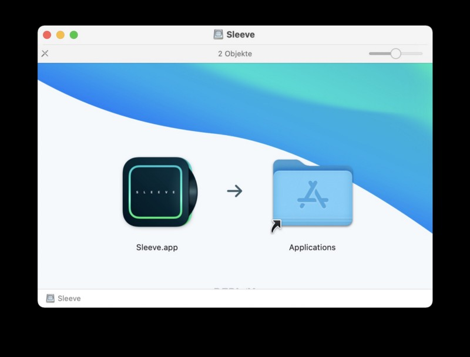
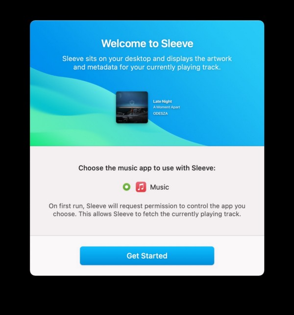
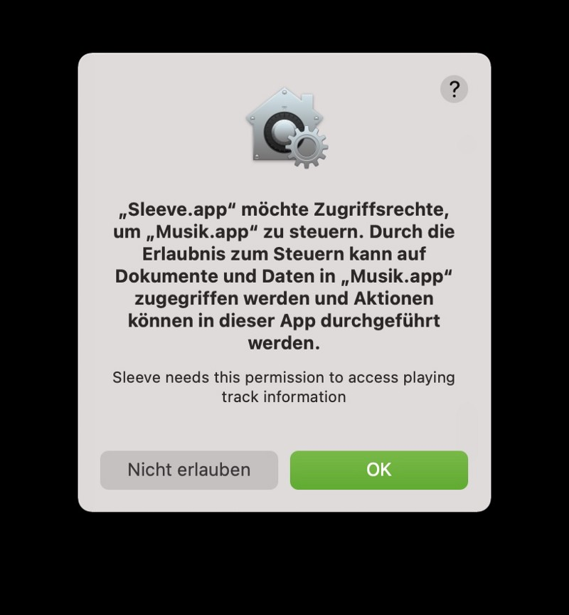
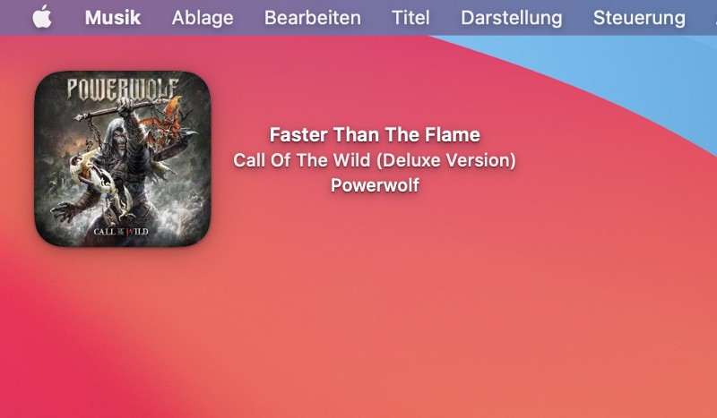
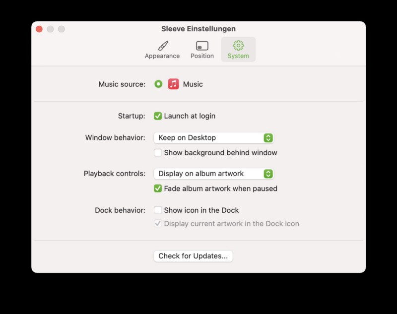
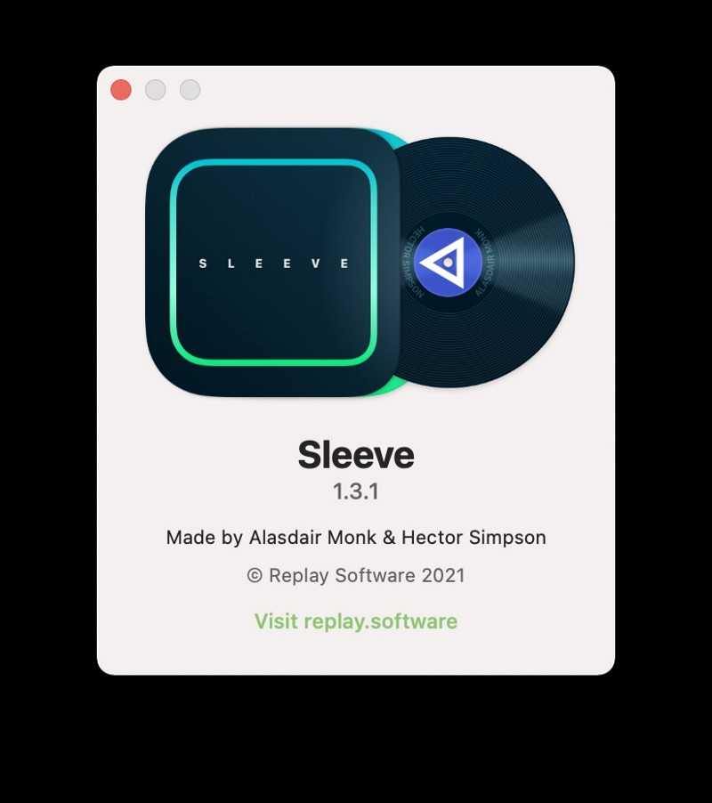
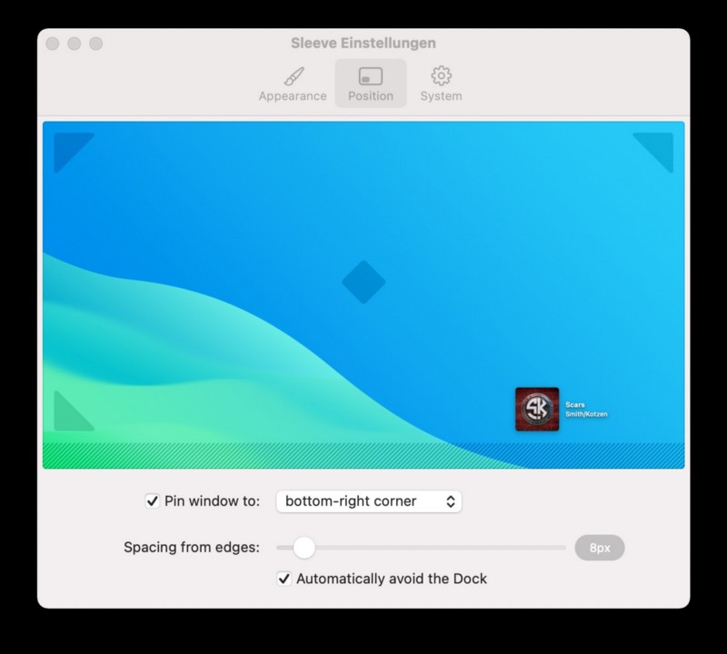
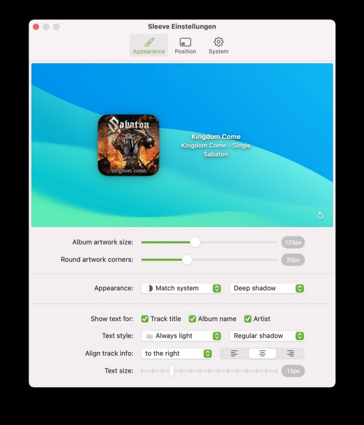

## As many tools, Sleeve (looking like the thing you put the old Vinyls into) is something you might have not missed until you discovered the cosmetic touch this app brings you.

 In fact, it is something that reminds be on SysInternals BGInfo on Windows-systems just with the fine difference of displaying cover, track and (optional) album-title on your macOS-desktop instead of simple text information. A the moment, the app works with Apple Music and Spotify and should — in this scenario — feature the two most-used music streaming services so far.

Sleeve is a software made by developers [Alasdair Monk](https://alasdairmonk.com/) and [Hector Simpson](https://hector.me) who, together, sail under the flag of [Replay Software](https://replay.software). Venturing through the single projects both made in the past I remembered that especially Hector Simpson attracted my attention for releasing [Aqueux](https://hector.me/aqueux), a collection of dynamic wallpapers, for desktop & mobile which orientate on the classical Mac OS X Wallpapers — but that’s yet another story (but you may check this collection anyway!). So far, so good — back to [Sleeve](https://replay.software/sleeve/): There is no trial so you have to invest $5 for the software which is ready to go after a direct download — no trial, no activation key, no phoning home.

## Installation

The prerequisite for running Sleeve is macOS 11.3 Big Sur where a recent update improved AppleScript-support especially in Apple Music. If you’re on an earlier macOS version, Sleeve may not be able to get the track details unless you are only playing local files — so in case you want to get the best out of the app, remind these minimum requirements! Once this is okay, just buy and download the app, open the 8,4 MB-sized .DMG-file, drag and drop Sleeve to your „Applications“-folder, start, assign the basic permissions, configure — and you are ready to go! While the installation process is pretty simple and straightforward, Sleeve bears various options under the hood, albeit it will run fine without any exotic settings!

## Configuration

After choosing our preferred music service (in my case, Apple Music is my preferred choice) Sleeve needs certain permissions granted so that the app can forward or pause your tracks.

Once this is done, you may directly dive into the configuration options to make Sleeve match your personal needs. For example, in my use case, I have pinned the windows to the top left corner, resized it a little bit and rounded the corners more than the standard settings offered.

Additionally, you can adjust the theme to match your system’s appearance (either day or dark mode), choose which informations you want to get displayed, deal with text styles and shadows or configure how playback controls should appear or wether the app should be launched at login or not.

Until Apple Music is doing its job, the freshly configured pane will rest on its place on the desktop and get filled with life once you play any track. There are enough options that allow a good level of customization but not too much that may confuse or frustrate you — the developers focused the essentials and solved this task with flying colors!

## Verdict

Sleeve is yet another positive surprise and bears, like many others apps I reviewed recently, features that I’d really expect to be integrated into macOS from the scratch. The app is easy to install, easy to configure and easy to work (and live!) with. The installation itself is (as said above) pretty straightforward and the result is a great addition to the modern desktop. Having a look at the price, I think $5 (payment processes via Stripe) is a real bargain for what Sleeve offers. An integrated update check ensures the app is always in fashion.

During my tests, Sleeve always took 3,5 to 4% of CPU resources and approximately 93 MB of RAM so even these factors shouldn’t prevent you from having a look at the app which definitely decorated my desktop in a positive way!

You may buy Sleeve directly from the developer’s website at [https://replay.software/sleeve](https://replay.software/sleeve). Once you liked this review (and even if not!), drop me your comment if this little app has — maybe — enriched your own personal desktop experience on macOS or not!