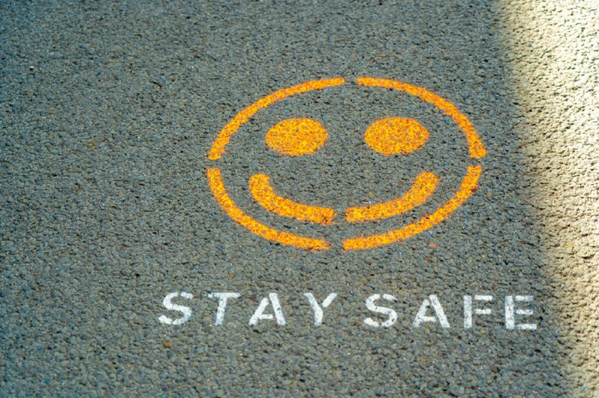

## With the pandemic, life has changed and so did the way we work and even the way we love.

I was always a friend of being at the office, exchanging with my colleagues face-to-face - and always sticked to this attitude until we were forced to work at home for fourteen weeks in-a-row during lockdown Number One. With the separation, the new kind of work found it’s way into our business life.

The task: Keeping up with a team of eight people, separated in Account Managers and Inside Sales, needing to organize everything through a (fortunately!) seamless experience by (here) Microsoft Teams. Eight hours a day weren’t enough to keep contact with customers unless those didn’t shut down because of the various reasons and challenges that accompanied a worldwide pandemic. The world was put on full stop while a virus spread all over the planet, defining our way of living in a complete new way - but even with this, working in an IT company meant that the show had to go on.

We organized, we talked, we discussed, we planned - as a consultant focusing more on sales than on my technical background I can’t remember that I talked that much over these fourteen weeks. The immense task of keeping customer’s environments alive or migrating them to the „new“ kind of work did not only spawn new challenges but did also need more flexibility than we had ever devoted before: Everything needed to be implemented fast while looking at the budget was still a criteria - besides, the human aspect and talks grew in a manner nobody of us had ever expected, enlarging the working days to double-digit working hours.

Besides the business, the enormous task was to handle your own family life while not getting mad: Four kids and a wife who juggled with bored kids and another new task of homeschooling (without proper educational digitalization here in Germany) demanded nearly everything from us. Three of four are required to attend school, each school pulled a new kind of digital teaching out of the hat! While we complained, we also realized that our kids are the bereaved as - in the Summer of 2021 - more than one year of childhood development just went down the tube: The consequences will be seen in the (more or less) distant future…

The (felt) reentry succeeded just before Delta began to take the world by storm. While vaccinations are going forward, the new kind of work will be here to stay, allowing us to better work from everywhere with more flexibility. While I as a team lead have learned that people can work together despite being in the office in persona (which was a steep learning curve), we should still try to keep the human touch that no technology can reflect or rescue. More important, keeping an eye on our family which has grown together even more in difficult times is a must!