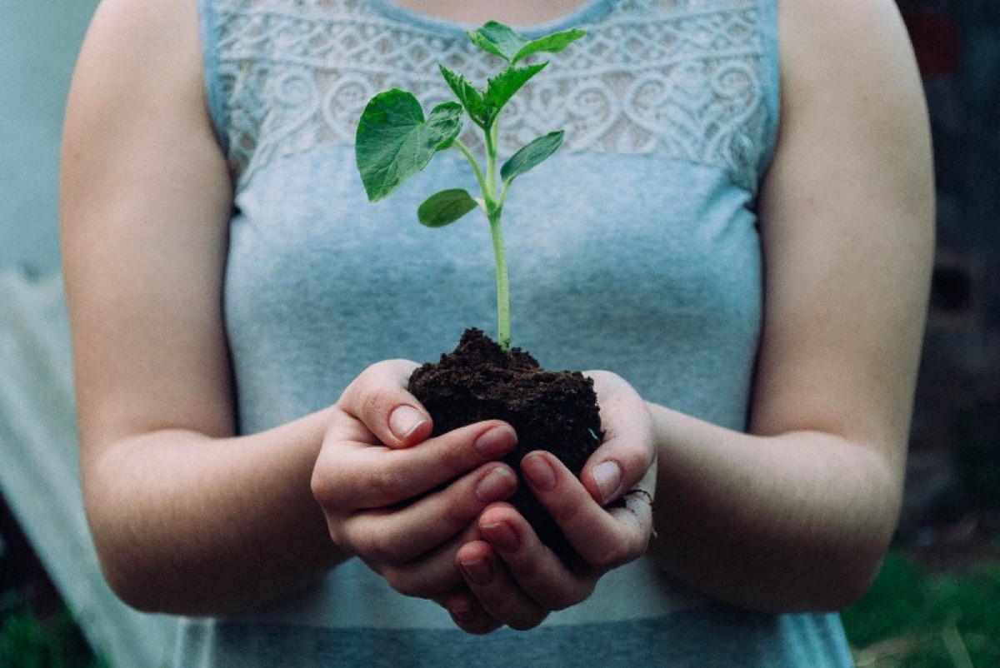
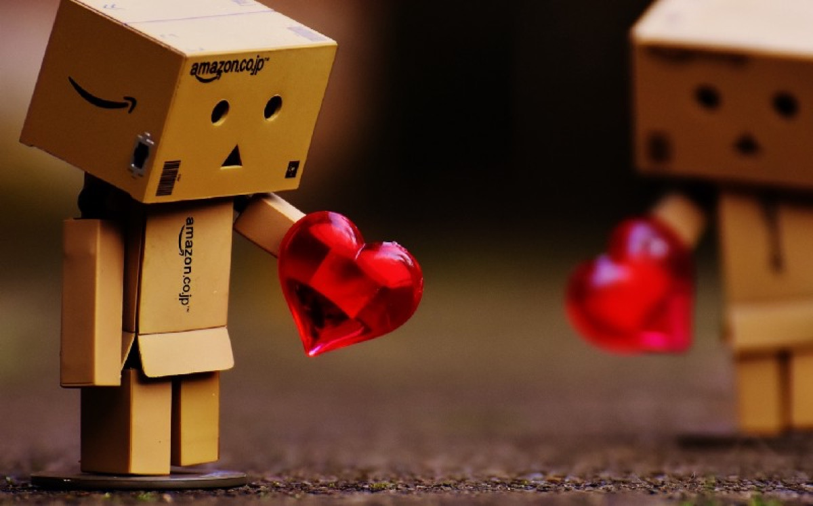

## „Space“ is a term that stands for many things but today, Marshall McLuhan’s statement is the best headline for reappointing our world of the 21st century.

A bit philosophical, maybe - and that is what McLuhan was. Today, Space stands not only for mankind’s striving for the stars (and Mars!) but also for the space between people, countries and cultures. Space that grew bigger in the last two years, „thanks“ to COVID-19 and space that increased between people’s opinions during this time, further separating us from each other. Focusing on the term of „space“ here, I still somehow connect everything in my mind regarding this term to the pandemic - guess why?

### Are there more dangers on Earth than in Space?

As someone who believes that the thing that came down in Roswell 1947 was NOT just a weather balloon (and hoping that there IS a galaxy far, far away where Jedi and lightsabers exist), I am questioning myself which dangers may lurk in space - and if our so-called „civilization“ may be of any interest for an alien race just in case they want to conquer our world. Looking back these two COVID-years, I think the best they could do when discovering how we still treat each other as the one „mankind“ is to turn back and head to another part of the galaxy, just for safety reasons - „Independence Day“ would be a completely different movie these days!

Apart from that, the last year has shown how Earth can recover when industry takes its (forced) rest, thanks to the pandemic. Pictures of the world recovering from the plague named man is one of the better pictures I saw in the last year and yet a sad proof how we manage to ruin the planet - this doesn’t need any interference from an Alien race, does it? Seeing it from this point of view it is also interesting that mankind is obviously just a nagging guest in the evolution of the planet - unfortunately one with an unhealthy impact on quite everything.

### One world, separated

While we strive for the stars (and Mars as a one-way-option), separation creating more and more space couldn’t be more imminent. Many nations, many religions, even more opinions and tendencies put borders between people and if you break it down on two terms, „COVID“ and „Afghanistan“ are the latest showing how we all are divided while being just a guest on this planet. People and cultures were always different, striving to battle each other, just to „rule them all“. These days, I see more stonewalls than gaps in the big wall that shows me we just can’t get along with each other in many aspects - and I fear the world my generation will once leave behind to our children.

### Space

A simple word can sum up many aspects of today’s world and I am surprised that „space“ covers that much. Do you agree here?