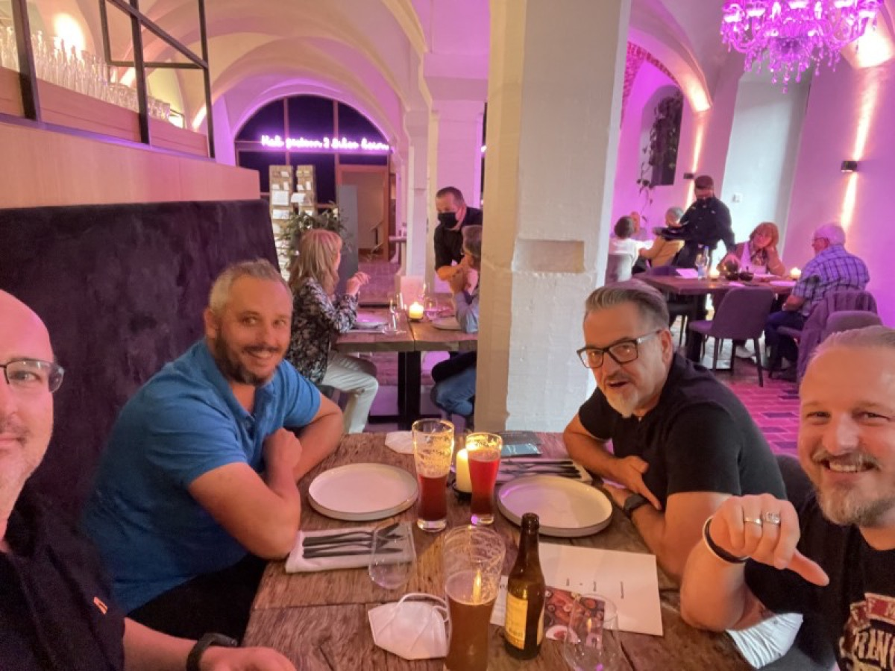

## „Work“ is something that always took care of earning an honest penny but it’s also a story with up and downs.

I am in the happy situation to state that I turned my life-long hobby into my profession. Starting with the age of six, I discovered the Commodore 64 and, eight years later, turned to my first PC. With 19 I became a trainee in a small computer company and so my path to IT and working life was always in the cards.

In earlier days, gaining knowledge and implementing something were my utter focus and while the prerequisites in the second company were rather basic, I‘ve learned a lot in the next job. The negative aspect - despite being hired for a certain region, I ventured throughout Germany. Gaining knowledge was great, but being utilized at the cost of my small family (our second daughter was just born) turned the adventure into a rather sad experience. Exchanging knowledge while sacrificing your own presence at home simply doesn‘t work - and shouldn‘t, by all means!

After five years, work was the one thing, dealing with other people / users from the perspective of a CIO yet another: I learned that the hard- and software could be handled but that people often act different from day to day. After four years, I felt exhausted and saw more obstacles than possibilities so it was time to change sides back, again - the first time in many years in a young and uprising company in the town I am living in!

This June marked my fifth year at my current employer and it was a though but - mostly - successful ride. Many things have changed but I found many people with the same spirit and attitude: Putting together the big whole in a growing and expanding company is fun, but also a demanding task requiring much energy.

Today, after COVID-19 changed our work life forever, I discovered that your individual work alone does not define your own efforts and your own achievements: A symbiosis of people who get along with each other in the business and in private is a powerful force. Inspiring and convincing customers, developing leads and winning deals altogether define a team that makes work worth working - even if odds are against you, the togetherness of a team with single characters united define a powerful workforce. You may work alone and get along, but working in a functional team is a great trip - and the results are completely satisfying!

In the end, works drives me forward - having the luck of turning your hobby into your profession is a precious! On the other hand, it always needs a certain dosage while you try to juggle between your job, your family and the quality time all in between: A though challenge while trying not to get lost in any of these factions, but with the right people at your side, you’ll be able to move mountains!