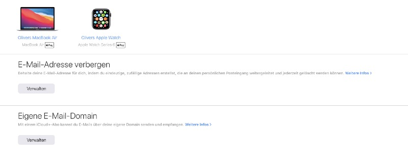
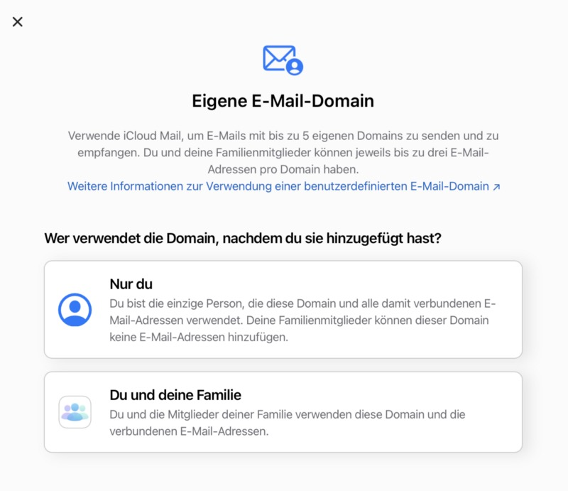
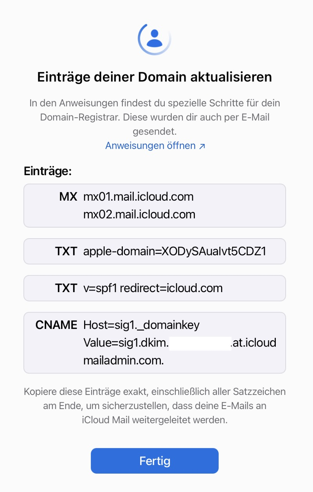
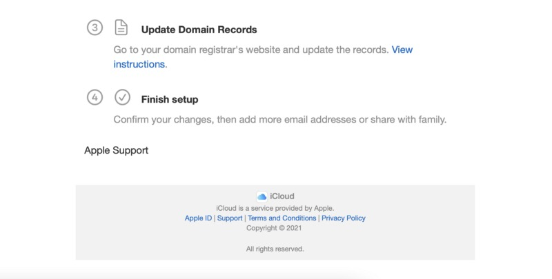
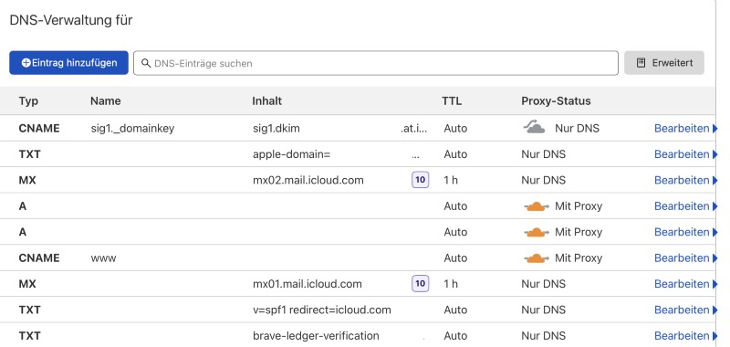
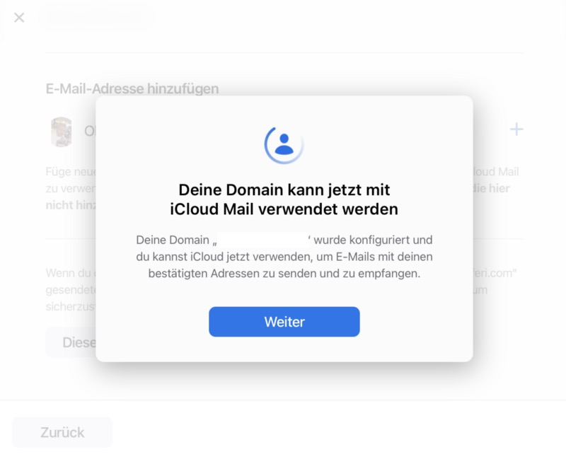
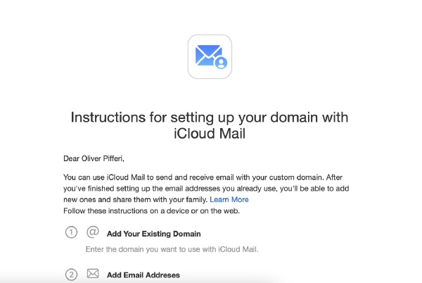
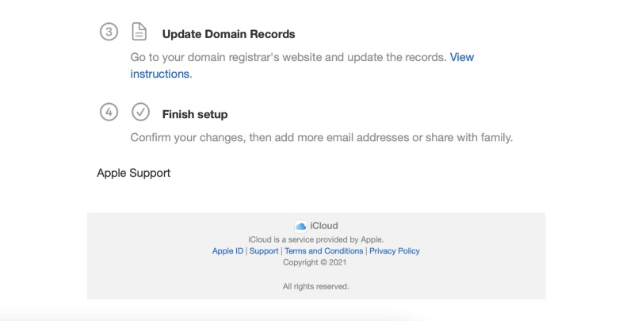
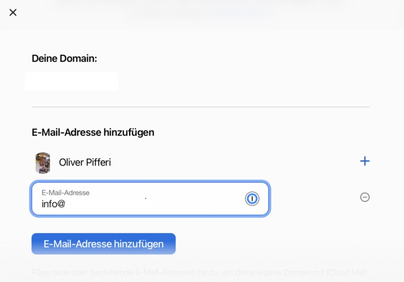

## Nearly two months after the feature of using custom E-Mail-domains in iCloud has been revealed, it can already be configured while Apple’s September-event is already casting its shadow!

It was one of my biggest points of criticism regarding the state of iCloud — while other services like GMail or Outlook.com (not mentioning all the features of Microsoft 365 for businesses) advanced over the time, [iCloud looked quite odd with seemingly basic features](https://medium.com/macoclock/why-apple-one-hasnt-absolutely-convinced-me-yet-4b171fa028bf). Technically and optically, iCloud’s development regarding contacts, calendars and mails seems to have been stuck and so was the feature of possibly using any kind of non-Apple-address with iCloud. [WWDC 2021](https://medium.com/macoclock/wwdc-2021-custom-e-mail-domains-are-coming-to-icloud-finally-5a6f57b18b88) saw a dawn of hope in this case and now, [beta.icloud.com](https://beta.icloud.com/) offers you the chance to connect custom domains ahead of the official iOS15-launch on the upcoming Apple-event.

### It’s finally here

iCloud doesn’t look revamped for now (which is also long overdue if you ask me) but heading to the account settings on the beta-page you will discover that now there is an option of — finally — connecting your self-hosted domain to your account. Apple doesn’t provide the chance of buying domains here so you’ll have to fetch your domain — unless you don’t already own one — from one of the well-known hosters like GoDaddy, 1&1, Netcup etc. ! Your provider should also meet the requirements to change DNS-entries like CNAME- or TXT- and — mostly important — the MX-option which finally routes all your mails through both iCloud-mail servers. In contrast to previous configurations, this is no mail forwarding but the simple exchange of your provider-based mail servers with mx01.mail.icloud.com and mx02.mail.icloud.com.

### Prerequisites & Configuration

Although the feature can only be found at [beta.icloud.com](https://beta.icloud.com/), it is already fully functional and, once configured, implemented within minutes. As a further prerequisite besides your own domain, you need iCloud+ which was already announced at the WWDC 2021. Apple puts some more values into iCloud here and once you use any paid iCloud-plan (for example the 50 GB-option), you are eligible to use the upcoming Private Relay-feature as well as HomeKit Secure Video Support, the „Hide-my-E-Mail-address“-feature and — well — customized E-Mail-domains!

After checking that you’re on a paid iCloud-subscription, first of all login and go to your account settings on beta.icloud.com. Under the list of your configured and activated devices, you will find the „Hide-my-E-Mail-address“-feature and — just below — the long-expected option for enabling custom E-Mail-domains. After clicking here, you have the option to wether configure the whole E-Mail-domain just for your own use (including all addresses) or if you want to share E-Mail-addresses with your family plan so that the members here may also benefit from the new iCloud-feature. In my case, I opted for the family. iCloud Mail supports up to five own domains with three addresses per domain on each family member which seems enough in my personal scenario here!

After entering your basic domain here, you may instantly add E-mail-addresses which are verified here through your current provider but in case this is not possible, just skip this procedure and head to the domain registrar settings. With a click, these are presented to you and can than be entered in your provider’s DNS-settings.

The values itself are quite lucid — two MX-, two TXT and one CNAME-entry is all you need to finally connect your iCloud-account with your custom-domain.

In my use case, my DNS-entries are hosted at Cloudflare so the final result should more or less look like the screenshot below:

### Finishing the configuration

After having entered the values requested, you may finish the configuration and commit the changes, confirming that all entries needed have been entered in the DNS-configuration of your domain

iCloud will then check wether everything is okay or not (changes may take some seconds) and present you the result shortly afterwards, ideally telling you (also per mail) that your domain can now be used with iCloud to send and receive E-Mails.

You may now — temporarily — set a standard „From:“-address but this value can be changed afterwards in your iCloud’s mail-settings anyway — I discovered that some aliases of the past years I deleted already may appear here, too — which may be a relict of the past or something connected to the Beta-state so don’t be surprised!

Then, you can add your desired E-Mail-address to your now-connected custom E-Mail-domain in iCloud and so the spell is cast: After years, Apple finally made this feature available, putting our own addresses into the spotlight. Your attached Apple-devices should now ask if the new address(es) should be added to FaceTime and Messages so that you can instantly use them for your communication over these platforms as well, knowing that they are distributed throughout the iCloud-microcosm.

### Verdict

Many users reached out for Apple to finally closes the lines with other competitors like Microsoft or Google and even if I consider iCloud to be still in an [urgent need for a visual overhaul](https://medium.com/macoclock/why-apple-needs-to-strengthen-and-upgrade-icloud-6d775fa275d5), I am celebrating the chance of using my custom E-Mail-domains on iCloud now. The bar isn’t set high here, the smallest iCloud storage-plan enables you to be an iCloud+ customer and with this you are eligible to use this long-expected feature. Let me know how custom E-Mail-domains on iCloud work for you and if you do like this feature as much as I am liking it! Enjoy your own-branded mail-addresses on iCloud… finally!