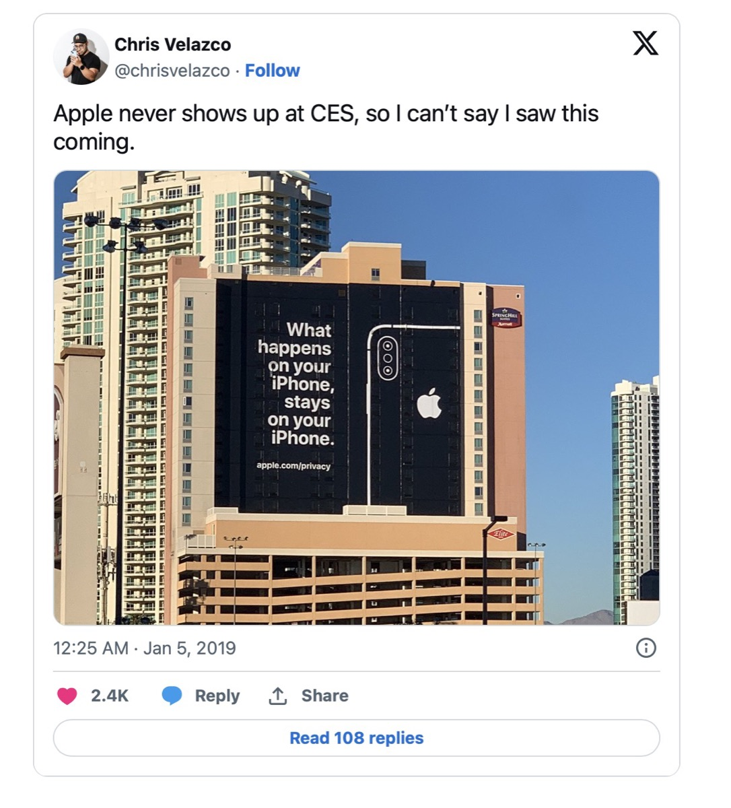
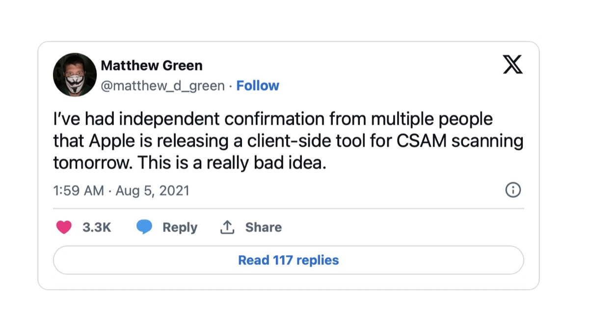
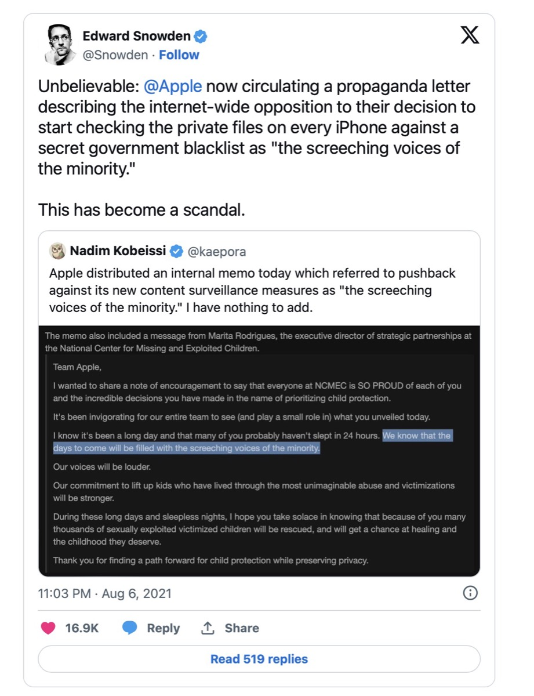
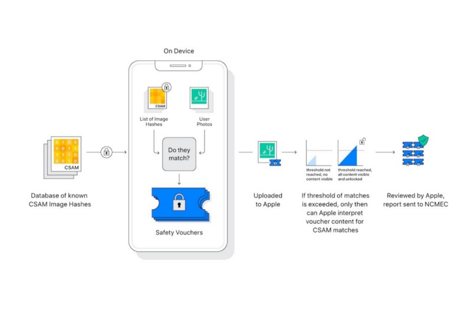
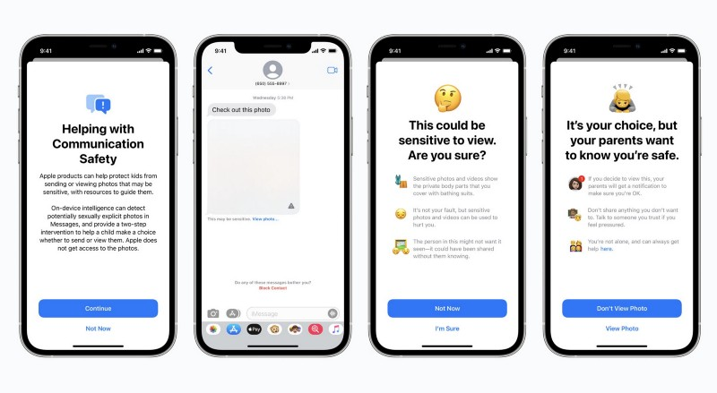
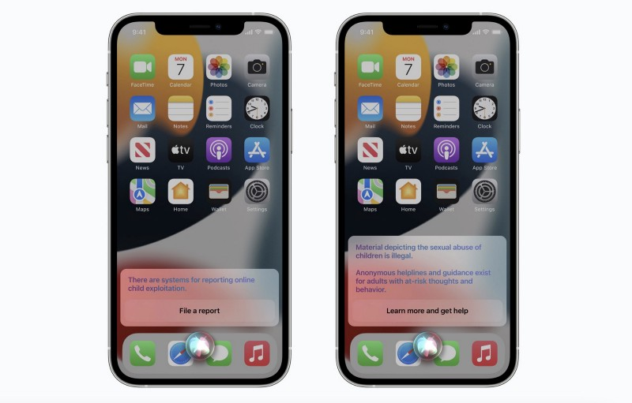

## Last Thursday, Apple announced details of upcoming features designed to detect CSAM - and the world reacted.

While the idea of protecting infants by flagging CSAM (Child Sexual Abuse Material) is basically a good and welcomed thought, Apple seems to have forgotten the ethical aspects that come along with each technical solution this time, especially when putting the terms of „privacy“ in capital letters. „[Privacy][1]“ is an elementary building block of the sum of reasons we use Apple-devices and Cupertino is founded upon. Putting FBI-hacks and Pegasus-news aside (worthy of yet some other discussions), this case could drastically destroy the user’s trust in Apple’s devices, making a mockery of the use of „Privacy“ related to Cupertino.

> „Privacy is a fundamental human right. At Apple, it’s also one of our core values. Your devices are important to so many parts of your life. What you share from those experiences, and who you share it with, should be up to you. We design Apple products to protect your privacy and give you control over your information. It’s not always easy. But that’s the kind of innovation we believe in.“

(Excerpt from [https://www.apple.com/privacy](https://www.apple.com/privacy/))



### My Apple-story so far

I have been an Apple-user for approximately twenty years now. Everything started with the first iMac and - later - the PowerMac G4 MDD. I loved the iPod once I could afford one in earlier days. I switched to a PowerMac G5 until the first transition from PowerPC to Intel began and possessed MacBooks of all kind, still love the design of the 27“ iMac and experienced a lot before the latest transition to the M1-SoC. The latter was surely on of the biggest changes in Apple’s lineup and with my iPhone over the years, I already adopted the first iPad and many things from Cupertino. Most were good, some were failures - but mainly, I learned to rely on Mac OS X and macOS, my solid foundation for all my work and hobbies. I consider myself to be an Apple-Fanboy but I also utter my criticism when I need to - and deciding which material on user’s devices is good or bad is surely one of the few predictive failures Apple may make.

Over the years, I often tried to work with Android but although I love the idea behind it, the lacking update support in earlier days and Google striving for even more user data repelled me. I jailbreaked the first Samsung Galaxy, stopped playing around with a Huawei P10 Pro and flashing custom roms, but in the background there was always iOS waiting as it came to mobile devices. After the years of fiddling around, I stopped switching phones half year, knowing that I’d be coming back to the iPhone anyway - at least for the privacy thing that was one of Apple’s biggest pro’s and seemed to even advance in iOS 15. Now, the die is cast and Apple is seemingly going to do something terribly wrong, harming not only its public image but also the reason I always preferred this so called „walled garden“: Apple may crush the term of „Privacy“.

### With great power comes great responsibility

I am a proud father of four wonderful girls and protecting them offline and online is - parents know this - the highest good and an enormous task. Two of them are old enough to use Apple-devices as their basic phones, supervised and equipped with [Jamf Now][3] as MDM-solution and with screen time enabled. The kids have many regulations regarding usage time, age-related content and app-time. While lots of the use case is built upon mutual trust, we agreed that carrying around a small and powerful computer which the ability of being a phone is also a heavy burden. We don’t read chats, we don’t have regular looks on the phone but we agreed that we may do this whenever we want in presence of the child.

For us, it is a good deal and the kids pay back this „advance money“ of trust by asking us whenever there is anything with the devices. Besides, we need to agree each App store-purchased anyway so we may also question the installation of certain apps. We talked about the „Cloud“ being a remote storage to save your files onto and the threats of dangers when it comes to creating accounts, acknowledging EULA’s without knowing what they may mean (hello, WhatsApp!) and storing personal data in places you finally cannot control. For now it works and the thin line between protection and harassment is always present, but basically they know their tech-savvy dad is trying to protect them as long as he can.

So far for the online world - the offline world looks similar but seems less complex: „Give a call when you’ve arrived at your friend’s location“, „don’t enter cars from foreign persons“ or „don’t talk to strangers“ are basics each parent will inculcate into his/her kid’s minds. It’s not easy but neither is raising a child and protecting it from all harm. While we had to do this offline years ago, the online world is clearly more sophisticated and needs a different approach - an approach that Apple is, fortunately or not, deciding to change for its users by baking some more Artificial Intelligence (AI) and hashes into iOS 15.

### What has happened?

You may call it „shitstorm“ and, to be honest, this phrase is the nicest way to describe what has happened during the last days.

In the latest announcement, Apple is told to develop a suite of features across its platforms aimed at protecting children online, including a system that can detect child abuse material in iCloud while seemingly preserving user-privacy.

When even Edward Snowden enqueued as well as the [Electronic Frontier Foundation][7], you can assume that there is imminent danger in this certain case and - to anticipate the issue - the news may change the way we think and work with Apple-devices. When people create an [Open Letter][8] against Apple's Privacy-Invasive Content Scanning Technology (which I have [signed][9], too), you can bet that the world is upset and ready to ground the institution with this certain idea.

While the basics behind Apple’s [announcement][10], delivering expanded protection for children, is - by no means - serving a good point, the possible realization is definitely alien to the subject in its whole and could fuel the fear that the big tech-companies define and control our digital connection to and in the future. Being a multi-pronged effort, Apple's system uses „classic“ on-device processing to detect and report CSAM-images uploaded to iCloud Photos, as well as protect children from sensitive images sent through Messages. The question is - who decides when to put a ceiling on this feature? Seemingly, it will be without the user’s control, built upon the result of hashes and databases far from the user’s reach.

### Bypassing E2EE?

After implementation, Apple's system will hash and match user photos against a hashed database of known CSAM. The process is told to be accomplished on-device before upload and only applies to images sent to iCloud. A second tool uses on-device machine learning to protect children under the age of 17 from viewing sexually explicit images in Messages. Parents can choose to be notified when children under 13 years old send or receive such content. What sounds like a reasonable idea in the beginning, gets tricky afterwards as, according to the letter, Apple's techniques creates an issue because they bypass end-to-end encryption.

"Because both checks are performed on the user's device, they have the potential to bypass any end-to-end encryption that would otherwise safeguard the user's privacy," the letter [argues][11]. Viewed from its own perspective, Apple has gone on record as saying the new safety protocols do not create a backdoor to its hardware and software privacy features - while the obvious shines through: We may get introduced into a technology that starts with CSAM-prevention but who can predict where it may stop? Being pessimistic, Apple’s realm of of privacy my crumble by making the decision for users which content is valid and which isn’t. A point of vantage for governments trying to spy on single persons or groups? Maybe.

The fact of scanning cloud-based files like images is indeed not new and happens automated (see a [OneDrive-case][12] reported by the BBC), but the extents Apple plans to implement go even further. Microsoft's terms and conditions for its US-users for example explicitly state that it has the right to deploy "automated technologies to detect child pornography or abusive behavior that might harm the system, our customers, or others". Besides theoretically ditching End-to-End-encryption (which is the failure by design), the misuse of the technology is in sight and no one can predict where this feature may lead us to!

The letter continues to include commentary and criticism from a range of experts including Matthew Green, a cryptography professor at Johns Hopkins University who was among the first to voice concern over the implications of Apple's measures. Green and Snowden are counted among the signatories, which currently lists approximately 34 organizations and 6203 individuals at the time of writing who digitally inked this letter via [GitHub][13]. Accompanying with a halt to implementation, the letter requests that Apple issues a statement "reaffirming their commitment to end-to-end encryption and to user privacy." So far, the world is waiting for this commitment and although I support the basic idea behind this move as a proud and caring father, the extents of implementing this technology may turn our mobile world into a horrible dystopia.

### Quo Vadis, Apple?

No matter what Apple plans and does with iOS 15, Apple should re-think this strategy which could advance to become a carte blanche to do everything with the user’s devices: Flagging CSAM may be the first step, but with implementing this feature, the door for mass surveillance in its worst extents will be opened just like Pandora’s box. This may not only change the way we interact with hard- and software but ruin all privacy-related efforts Apple ever preached - and the company’s public image for all time.

Should this be true, Apple’s statement in the famous „1984“-commercial could turn into a tragic 21st-century parody. A dangerous parody that may act as legalized government spyware with the hypothetical chance of being adopted to suit any other demand than to scan for CSAM. The empire of the clouds may be crumbling and so may Apple’s efforts in creating a secure and private environment for people who trusted Cupertino over all those years - including myself.

„And you'll see why 1984 won't be like 1984“…



Think about it, Cupertino - stakes are high and so is the risk of a completely ruined reputation!

[1]:	https://www.apple.com/privacy/
[2]:	https://youtu.be/8w4qPUSG17Y
[3]:	https://www.jamf.com/products/jamf-now/
[4]:	https://twitter.com/chrisvelazco/status/1081330848262062080
[5]:	https://twitter.com/matthew_d_green/status/1423071186616000513
[6]:	https://twitter.com/Snowden/status/1423751484081070081
[7]:	https://www.eff.org/deeplinks/2021/08/apples-plan-think-different-about-encryption-opens-backdoor-your-private-life
[8]:	https://appleprivacyletter.com
[9]:	https://github.com/nadimkobeissi/appleprivacyletter/issues/new?assignees=nadimkobeissi&labels=signature&template=sign-letter.yml&title=%5BSIGN%5D+Your+Name+Here
[10]:	https://www.apple.com/child-safety/
[11]:	https://appleprivacyletter.com/
[12]:	https://www.bbc.com/news/technology-28682686
[13]:	https://github.com/nadimkobeissi/appleprivacyletter/issues/new?assignees=nadimkobeissi&labels=signature&template=sign-letter.yml&title=%5BSIGN%5D+Your+Name+Here
[14]:	https://www.youtube.com/watch?v=VtvjbmoDx-I "1984 Apple's Macintosh Commercial (HD)"
