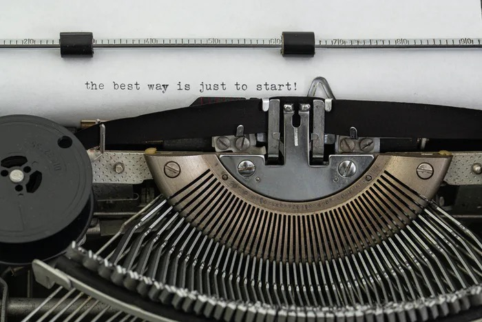
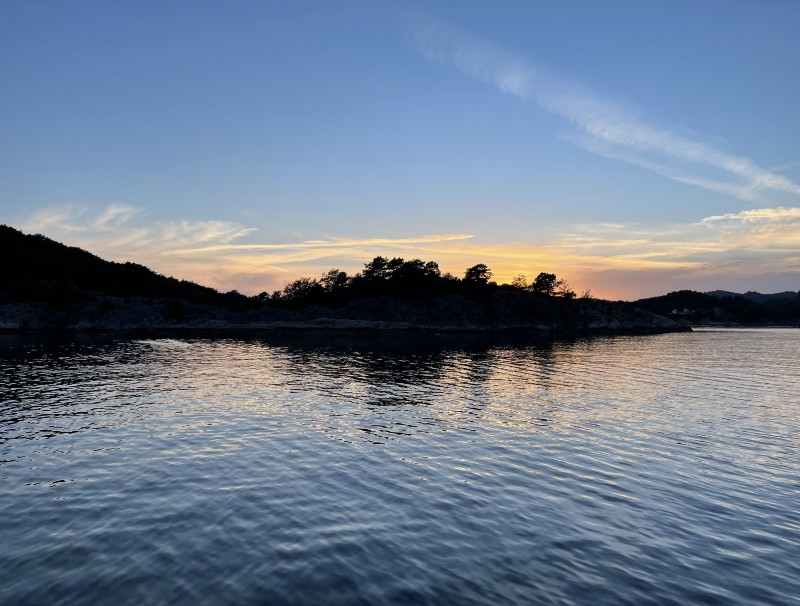

## After a week off in Norway, I still haven’t found my writing routine again. What has changed?

This week in September was a journey of three guys making a break from everyday life, the work schedule, the family and the common world in general - call it a road trip! Fishing, hiking, talking, relaxing - seven wonderful days that definitely need a repeat but also a severe break of my writing habits.

I didn’t write a single word during this week. My mind was overwhelmed by Norse beauty and a lovely country which is less populated than one can imagine but everyone we met was just friendly. The nature, the freedom, the silence were things I was striving for in my daily routine at home and I inhaled every single element of this divine scenery. There were surely many things I could have made a post of, but still today - nearly one month after the trip - I am still sorting my mind trying to capture the big whole. And I am probably stuck in something you might call a writer’s block.

### Have I been blocked?

It’s a myth, some people say. It’s something that each writer suffers from, other say: The inability of putting words into sentences, sentences into paragraphs and - finally - paragraphs into stories. After weeks and -month of quite successful writing in my mind here on Medium, I somehow lost the guiding thread and, together with this, the proper connection to write despite my focus on rather IT-related topics. Even those turned out to be stuck somewhere as I haven’t posted some of them either.

Catching up this status quo, I discovered that the visual freedom I’ve encountered in the North was surely one aspect that fully distracted me from my classic blogging process. Besides I had to admit that I somehow lost the focus on the topics I usually write about, something that also happened during a few times over the last years. Remembering the reasons, I didn’t find any answer but to admit that the last focus I really had was the experience of participating in Medium’s latest [Writers Challenge](https://blog.medium.com/introducing-the-medium-writers-challenge-f8a95f6d17f).

### The Medium Writers Challenge

To make it short: I didn’t win in any of the four categories and never had the faith and intention to do so. Anyway, the four expressions „[Reentry](https://medium.com/readers-digests/is-our-post-covid-working-life-here-to-stay-b431e627cd5)“, „[Death](https://medium.com/readers-digests/death-smiles-at-us-all-all-a-man-can-do-is-smile-back-974d73267d3b)“, „[Work](https://medium.com/readers-digests/you-are-not-your-resume-you-are-your-work-aead82052b00)“ and „[Space](https://medium.com/readers-digests/there-are-no-passengers-on-spaceship-earth-we-are-all-crew-bd3dd2b73bcf)“ helped me to really focus on those topics and, paired with a limit of 500 words, to put all writing essence into these reflective articles. They took more time to write than any other publication as the focus for me was immense and the limit of 500 words really challenging. Summing um everything exactly at the last words, closing with a final thought and a very personal publication was quite a steep learning curve for me but I had lots of fun. Fun that now somehow got lost for whatever reason.

### Searching for the focus

I learned that I perform better in my personal writing when I am focused. When I don’t write a big journey around the big whole but when I focus of - here - just a single word that can stand for everything. I also discovered that I got more sensitive to noise over the years which is hard to prevent as a father-of-four. With noise comes the distraction and I’ve learned that the writing environment is also something that affects my motivation.

The wanderlust still nearly kills me, the next Norway-trip is already in the planning but apart from that, I discovered that I need to change some aspects around me to focus on topics I can really contribute to. The silence and grace my eyes saw up North are still my company and this doesn’t match with the environment and provincial life in this Western part of Germany. I never imagined that the place I am writing at could affect my writing in any way but fact is: It does.

### What next?

That’s quite a good question. While actively searching for the reason to write and the topics to write about, Autumn has appeared on the stage. With the change to the darker seasons, I am hoping for new inspirations fueled by many walks despite the weather conditions. Inspirations by the cold, by images of nature preserved in stillness, by the seasons where elements die just to be reborn in next Spring. Inspirations of inhaling the outside world that recharges my batteries as a contrast to daily life. My writer’s block might have been a classic one, maybe even paired with the Silly Season and new experiences in life but, hopefully, it will be a temporary one.

Re-discovering my focus and maybe challenging myself with certain topics to write about could be a first approach. What about you? Did you encounter a similar situation before where you didn’t bring any piece of writing to the (virtual) paper? Let me know your comments!