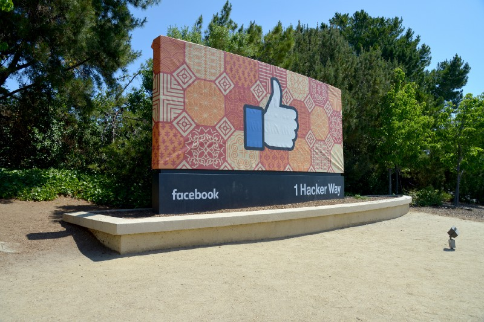
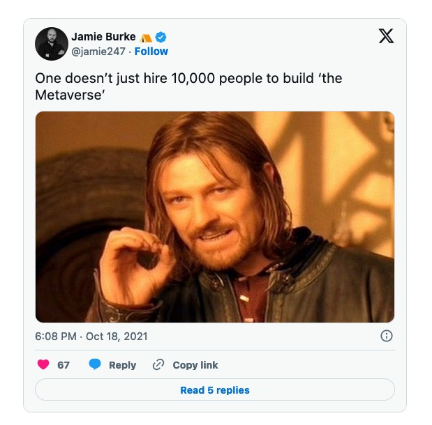
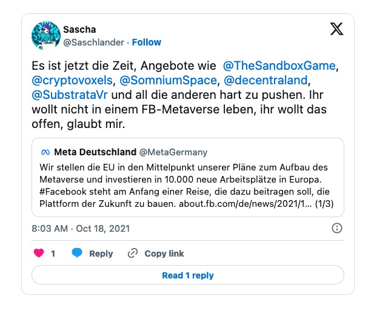
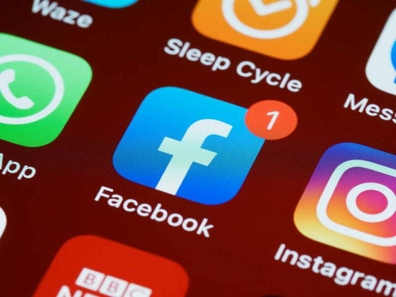

## According to a report from [The Verge][1], Facebook is reportedly planning to rename the company to better underline its focus on „The Metaverse“.

We all know that the Emperor‘s new clothes rarely work well and while there already IS a real Metaverse, it may be questioned whether a new coat of paint solves the problem Facebook has become over the years. Anyway, this change could come quite soon as Mark Zuckerberg is going to speak on the company‘s connect conference on October 28th.

### A long time ago, Facebook was cool

Once upon time, Facebook was „hip“ and I also remember posting stuff there for over a decade. Over the last years, I personally reduced my usage more and more, disgusted by ads, silly friend suggestions, sexual-based friend requests which, after reporting, were never „violating Facebooks‘s policies and - maybe - a certain personal progress. Today, I got quite rid of the platform and mostly use it as a platform to check in when I am traveling. Many fellows feel the same and while being on Facebook was quite mandatory years ago, I am always thinking of just doing the big wipe. Looking back on the memories the platforms shows day by day, I am horrified to see what kind of senseless stuff I used to post, for example, in 2011.

While still using Instagram, which was - unfortunately - swallowed by Facebook years ago, I got rid of WhatsApp at the beginning of the year. Although people even asked how to contact me now, there were alternatives like Signal or Threema but this is yet another topic. Besides, people still ask why I don‘t answer them a long time after my WhatsApp-account should have been deleted (I went through the whole process). Anyway, life goes on without a target-based advertising-focused platform under the „Facebook“-moniker. Instagram could be next and although I like the many posts I really want to see, I am deterred by spam requests, sexual bots and - you will expect it - the inability of the platform to get rid of those obviously faked accounts.

Not mentioning the pollution by advertising that poisons this service as well, I once tried [Pixelfed][2] which is a Fediverse-adaption of Instagram. Although the platform and self-hosting option is great, it - unfortunately - hasn‘t reached the masses yet. No ads, no tracking and a clean timeline provide what Instagram was years ago but this is yet another story to be told!

### Facebook is stuck in a dead end

Anyway, Facebook doesn‘t provide the services for the good cause, it‘s a company with the goal each company has: Making money and gaining profits. While the idea of the original Facebook still sounds appealing to me, nothing is left of this construction these days. Mark Zuckerberg is untouchable and unteachable and common laws appear not to count for the whole Facebook-construct. Reporting obvious fake accounts, sexual harassment, hate speech often goes unnoticed and while there are even people using Facebook as a modern news stand, the topic of „fake news“ must be mentioned here as well. Having this in mind (and the brave approach that 10.000 developers are enough to build „The Metaverse“) let me ask you the question if you could image to be part of a Facebook-run Metaverse?

Having a look on the real Metaverse, I am just a beginner and my old blog colleague Sascha told me some basic stuff about this. If you are capable of the German language, I recommend his blog [webdrei.info][4] where he writes about the open and real Web 3.0, asking the question if we would really like to have a Facebook-ruled Metaverse:

To sum it up, there is more than meets the eye and while we got used to see Facebook as a source for (des-) information, the mere focus is basically on placing targeted ads together with AI- and algorithm-based pieces of information tailored to the specific user. The usual focus on being a showcase for your person is gone and while the services are free, many people have realized they are the product together with each single snippet of information they have uploaded to the platform.

### Facebook going the Google-way?

Similar to the way that Alphabet is the parent company of Google, YouTube and other known services, this change may see Facebook, the original „Social Network“, be but one of many products under a parent company of a new name that includes Instagram, WhatsApp and Oculus. “FACEBOOK,” written in capital letters, is currently the overall parent company, while Facebook is „just“ the social network we all know. This change is meant to help people see it more as an overall company in the Metaverse-space rather than being a social network only. Besides this focus and after acquiring Oculus, the Facebook-microcosm also include augmented reality, virtual reality, smart glasses and venture capitalism.

According to The Verge, the new name is a well-kept secret while the publication states:

> „A possible name could have something to do with Horizon, the name of the still-unreleased VR version of Facebook-meets-Roblox that the company has been developing for the past few years. The name of that app was recently tweaked to Horizon Worlds shortly after Facebook demoed a version for workplace collaboration called Horizon Workrooms.“

### Grabbing for The Fediverse

Over the time, people began to realize that Facebook isn’t the friendly new startup anymore. It has grown to a world-embracing network with dependencies that, as we realized some weeks before, could bring down any connected service in case of just one failing. Breaking this construct into pieces, making the services independent from each other without the fear of pulling the plug for all services in case of a failure has already been discussed in the past and is now more present than ever before. Facebook is misusing its power just for the sake of pure profit while we as users are just the inevitable evil needed to gain cash for the platform.

Having that in mind, the idea of The Metaverse vanishes just like the idea behind the original Facebook has already vanished. You want to have an open Metaverse, do you? You want to use services like Cryptovoxels, [The Sandbox Game][6] or Substrata - you don’t want to put the Web 3.0 into the hands of an enterprise which best conditions are already a relict of the past, do you? You don’t want Mark Zuckerberg and folks shaping the Web 3.0 according to their needs and algorithms. The Metaverse is a free and open space and should not be controlled by any corporation acting in the ways Facebook does - this would be a contrast to the term of being an „open“ platform.

### Facebook, no!

Facebook had its appearance and is desperately trying not to head for the gutter. It is by far not „cool“ anymore. We’re already locked in the Web 2.0 as a product instead of individuals so the Web 3.0 should a free place - something it will never be while Facebook tries to define its boundaries by implementing its own obvious values to the services. The Metaverse is more than Facebook’s upcoming definition - no matter how the group rebuilds itself under a new label.

Think about it before losing the chance of turning the Metaverse into a user- and not a corporate-defined space for everyone without discrimination, harassment and hate speech. Without algorithms that are just trying to suckle as much information as possible out of your profile and your digital appearance, without ads that are targeted to trigger  and generate revenue out of you. The Web 3.0 should not be built upon the fragile and crumbling foundation that Facebook is these days!

[1]:	https://www.theverge.com/2021/10/19/22735612/facebook-change-company-name-metaverse
[2]:	https://pixelfed.org
[3]:	https://twitter.com/jamie247/status/1450131600302387200
[4]:	https://webdrei.info
[5]:	https://twitter.com/Saschlander/status/1449979489698582530
[6]:	https://www.sandbox.game/login/?r=CENxxnh7i-6258hHgQbOgH