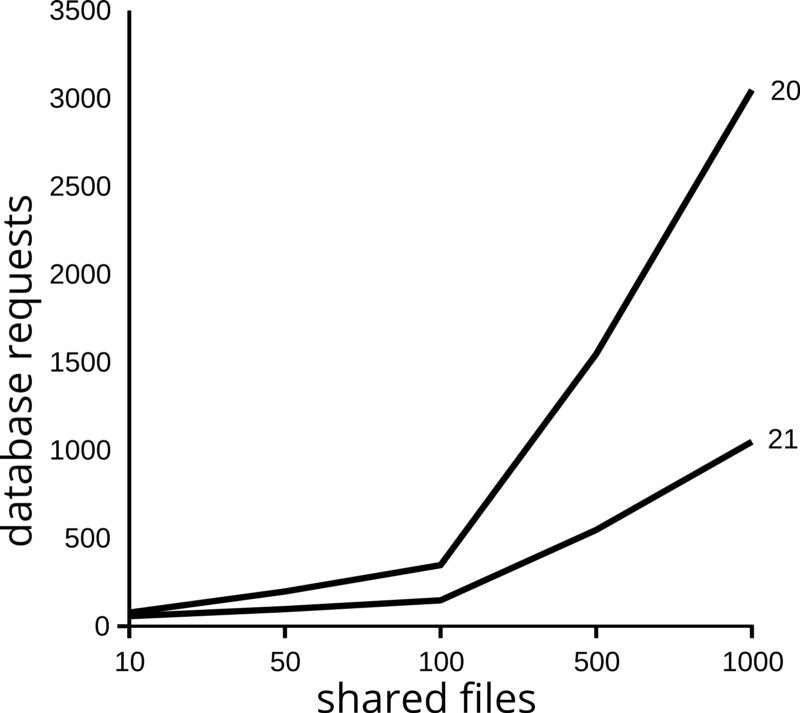
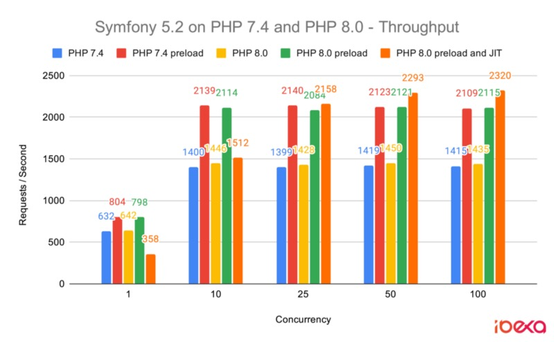
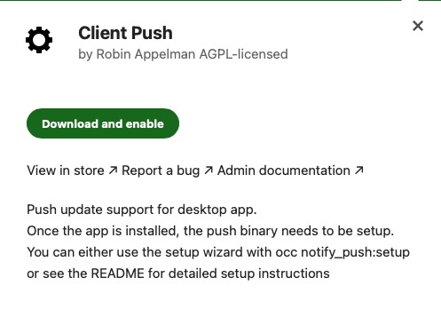
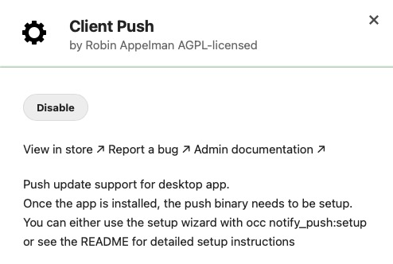
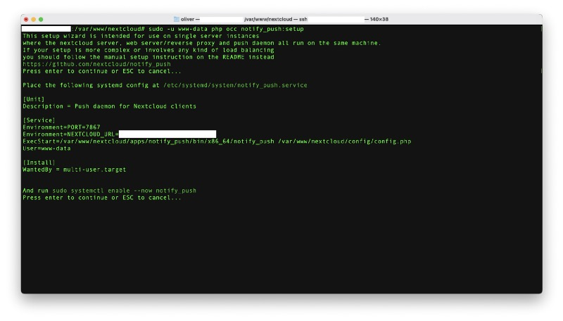
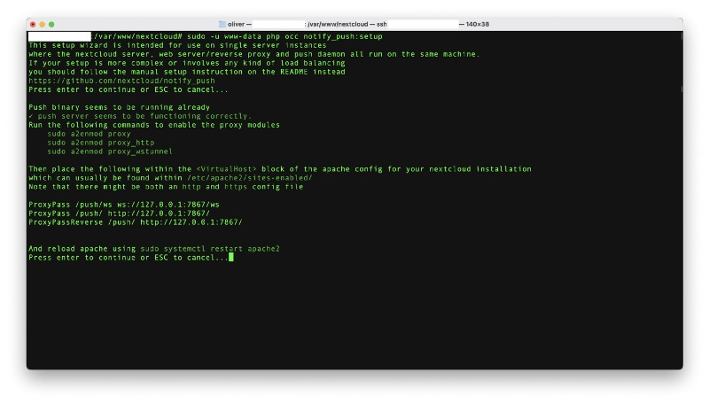
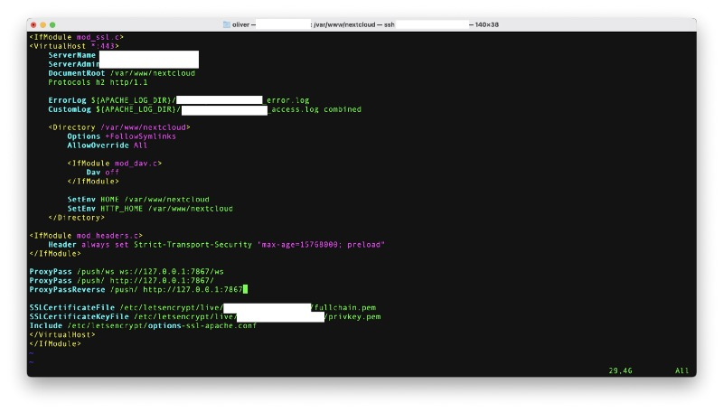
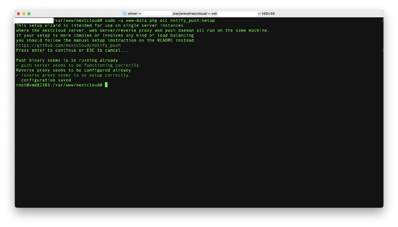

## Nextcloud 21 [introduced](https://nextcloud.com/blog/nextcloud-faster-than-ever-introducing-files-high-performance-back-end/) the „High Performance Backend“ earlier this February. If you’re interested in optimizing the file handling performance in your instance, this tutorial might be the key you’ve been searching for!

Since it first appeared on the stage in 2016, [Nextcloud](https://nextcloud.com/) has evolved in many, many ways. While the „High Performance Backend“ was already a feature that supported larger installations for Nextcloud Talk, this eponymous role now takes care of aiming at larger installations and file handling in general. While it is already on board from the scratch since February, it still needs to be activated via Nextcloud’s App Store and the command line-interface.

The [High Performance Backend](https://www.bacancytechnology.com/blog/laravel-ucovered-hidden-things) isn’t told to have massive effects on installations smaller than ten users, but can improve the number of requests on larger installations and more than 25 to 30 users by 30 to 35% once being implemented. Nextcloud speaks from 90% less load from polling so the impact on the instance is immense!



> With the COVID crisis continuing to force employees to work from home, Nextcloud server administrators need to keep adding capacity. Nextcloud 21 will reduce the load on servers, enabling more employees to work without requiring additional hardware. At the same time, the new collaboration features improve the day to day productivity and support team members in getting more work done in less time.

(Frank Karlitschek, CEO and founder of Nextcloud GmbH)  



### Working with the magic

According to Nextcloud itself and, especially in combination with PHP 8.0, these performance improvements should impact nearly every server, giving a better user experience and enabling system administrators to grow the user base without having to add more hardware. Without the feature enabled, the client checks every 30 seconds to see if there have been changes on the server. With the open connection, the server notifies the client of any changes and it can begin downloading new files right away. This does not only impact file syncing, however but nearly every component you have added to your Nextcloud-instance, for example new file shares, an incoming Talk-call or a file being commented by a colleague. Web and desktop-clients don’t check whether there is a change or not all the time but get a decent signal from the specific app once this is the case.

### Configuration

To activate the High Performance Backend, all you need to do is install the mentioned „[Client Push](https://apps.nextcloud.com/apps/notify_push)“-app from the App Store and run „occ notifypush:setup“ — that are the mere basics but there is still some more work to do to, for example, get the feature working for you in your specific environment. First of all, you should already have a Nextcloud-instance > 21 running and — in my case — an Apache2-webserver fueled by PHP 8.0.





After downloading and activating the app in our Nextcloud’s backend, there isn’t more to do on this site so we head to the shell and try to activate the High Performance Backend by typing

```
cd /var/www/nextcloud
sudo -u www-data php occ notify_push:setup
```


The script will run and check whether all prerequisites are met or not. If you haven’t touched anything before (and this is a step-by-step tutorial), let’s discover what is missing to get this feature running. A stroke of the „Enter“-key will start the check and discover that there isn’t any kind of push-service running on this Linux-machine, hence we need to create the service first.



### Creating the service

By typing

```
vi /etc/systemd/system/notify_push.service
```


a new file is being created where the following contents should be inserted:

```
[Unit]
Description = Push daemon for Nextcloud clients

[Service]
Environment=PORT=7867
Environment=NEXTCLOUD_URL=https://cloud.domain.tld
ExecStart=/var/www/nextcloud/apps/notify_push/bin/x86_64/notify_push /var/www/nextcloud/config/config.php
User=www-data

[Install]
WantedBy = multi-user.target
```


Don’t forget to change the term [https://cloud.domain.tld](https://cloud.domain.tld/) to match your Nextcloud’s URL and save the file afterwards. This script also assumes that your standard Nextcloud-installation is located in the /var/www/nextcloud standard-folder — if you have placed your instance in a different place, you should alter the specific lines as well!

Once this is done, enable the service by typing

```
systemctl enable notify_push.service --now
```


at your system’s shell. No re-start the installation script:

```
sudo -u www-data php occ notify_push:setup
```




### Dealing with the Webserver

We slowly advance and while using the supported Apache2-webserver (and without altering our config files and enabling the modules needed) we still can’t proceed. Therefore, first enable the necessary modules

```
sudo a2enmod proxy
sudo a2enmod proxy_http
sudo a2enmod proxy_wstunnel
```


and put the following lines in your Nextcloud-related Apache2-configuration file which is, in my case, located at **/etc/apache2/sites-available** and named **000-default-le-ssl.conf**.

```
ProxyPass /push/ws ws://127.0.0.1:7867/ws
ProxyPass /push/ http://127.0.0.1:7867/
ProxyPassReverse /push/ http://127.0.0.1:7867/
```


The file should look similar to the following screenshot after your modification.



After restarting Apache by with

```
sudo systemctl restart apache2
```


we can also re-start the installation script once again by typing

```
sudo -u www-data php occ notify_push:setup
```


The script will now proceed and finally do the magic it was made for, presenting us the successful implementation of Nextcloud’s High Performance Backend!



As the last step, we should check whether Nextcloud’s config-file to see which trusted proxies are allowed to serve our instance. Have a look at the file located at **/var/www/nextcloud/config/config.php** in my case and look if there is a **“trusted\_proxies“**\-entry at the end of the file. Otherwise add the following string and change the first string with the fixed IP of your Nextcloud-server.

```
'trusted_proxies' =>
  array (
    0 => 'your.fixed.ip'
    1 => '::1',
    2 => '127.0.0.1',
  ),
```


Once you don’t have a fixed IP like many servers at home have paired with a dynamic DNS-service, you can try setting the **„NEXTCLOUD\_URL“** to the internal ip of the server and alter the hosts-file on your machine. Further information on that topic can be found at the official [GitHub](https://github.com/nextcloud/notify_push)\-page!

### Handling Cloudflare

Should you use Cloudflare to protect your private cloud from attacks and use the service’s CDN, you might encounter an error while trying to test the client push-feature. In this case, you must additionally add all [Cloudflare IP-addresses](https://www.cloudflare.com/ips-v4) as trusted proxies. These might change so it’s just valid to check them after a while. For now, adding the following entries to the “trusted\_proxies“-variable should work well:

```
'trusted_proxies' =>
  array (
    0 => 'your.fixed.ip',
    1 => '::1',
    2 => '127.0.0.1',
    3 => '173.245.48.0/20',
    4 => '103.21.244.0/22',
    5 => '103.22.200.0/22',
    6 => '103.31.4.0/22',
    7 => '141.101.64.0/18',
    8 => '108.162.192.0/18',
    9 => '190.93.240.0/20',
    10 => '188.114.96.0/20',
    11 => '197.234.240.0/22',
    12 => '198.41.128.0/17',
    13 => '162.158.0.0/15',
    14 => '104.16.0.0/12',
    15 => '172.64.0.0/13',
    16 => '131.0.72.0/22',
  ),
```


### Verdict

Within approximately 15 minutes, we managed to implement the High Performance Backend on our existing Nextcloud-installation. While, as I said above, this won’t have the biggest impact on smaller instances, it can really speed up your private Cloud when serving more users. By all means, tweaking and fine tuning your instance to get as much speed as possible is always a tricky thing but this one is implemented straight from the scratch so you won’t risk anything by activating this neat feature!