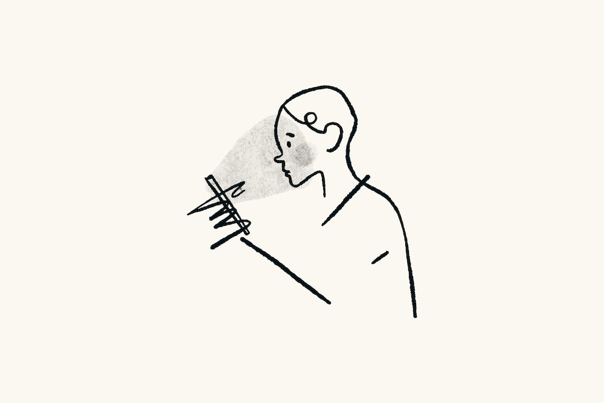
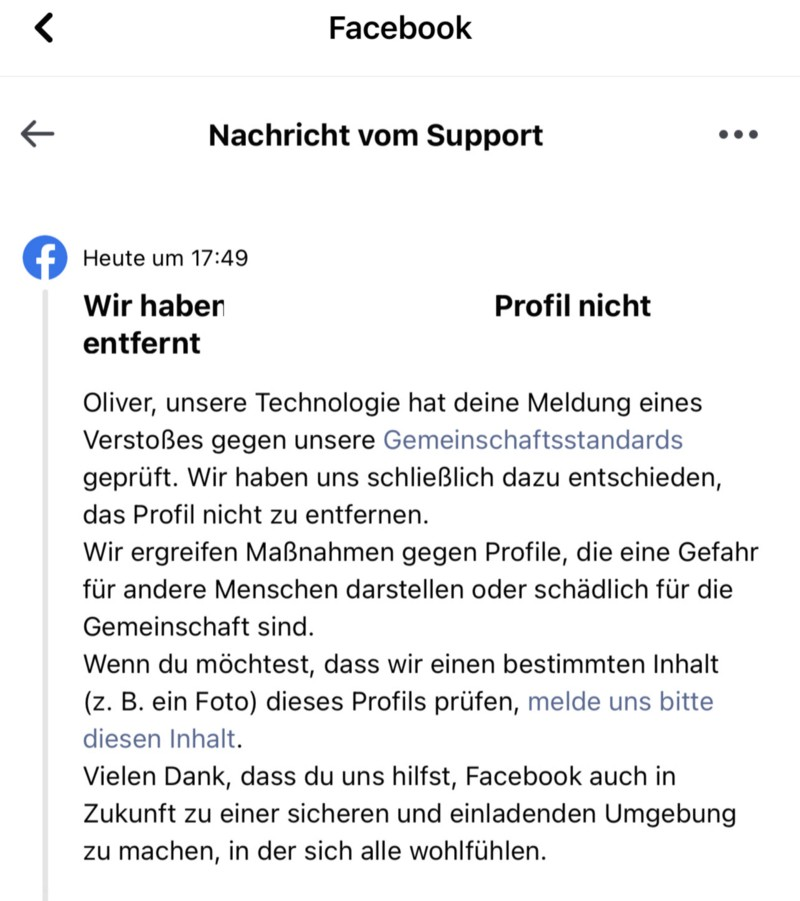
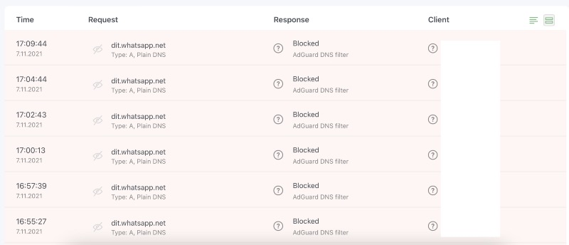
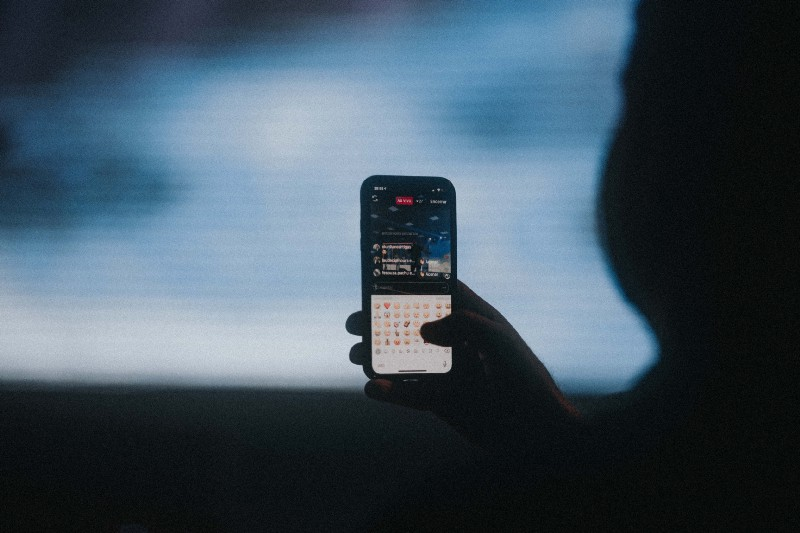

## Some days ago, I [had my thoughts][1] on why Facebook won’t be „The Metaverse“. Now I made the break with the service after 17 years.

Within 17 years, a lot changes in your life and while exposing everything at an early stage was nearly a must, life progresses and so do we as humans - usually. During the last years, Facebook was mainly a travel book for me, serving as a platform to set my landmark wherever I have travelled. Putting private photos there? Nope. Using it for information? Never. Linking colleagues on funny pictures flushed into my timeline by Artificial Intelligence? Definitely.

## Thinking back

Maybe it was the sum of all things that came together during the last two years. Maybe it was an insight that I am spending too much time on some platforms for whatever reason. Maybe I am tired of the juggernauts Social Networks became these days. When everything started, Facebook was cool and fancy - the idea behind it was simply to connect to people you personally know or whose interests you share. Follow your local band, get all the news and build your own hub of information tailored to suit your needs. It could have been that easy - and it even was quite some time ago.

Add some conspiracy theories, false information and foreign intervention during elections, hatespeech, a tailored news feed just to keep you reading and all for the sake of profit and you’ll have the ingredients of Facebook as of 2021. The latest [whistleblower-affair][2] revealed what’s really inside the construct of „The Social Network“ that once was planned to be a „safe and positive place“. Some years ahead, exactly this architecture is crumbling and people begin to turn their back on Facebook and asking why they still use this platform - and I am one of them.

## Enough is enough

Times have changed and so has our demand regarding social networks. Looking at my 14-years old daughter, I see that Facebook is - by far - no focus anymore. It’s not cool, it’s outdated - used by „older people“ as she says. Instead, platforms like Snapchat or TikTok rule the world of today’s kids, paired with Instagram (the showcase-effect) and - unfortunately - WhatsApp. Mentioning the last one, this is simply too widespread to use any of the alternatives like Signal, Threema and other messengers. Here, it is a matter of comfort as other don’t buy the Threema-app or use Signal „just because everyone has WhatsApp“.

Facebook’s mission to interlock different platforms to an own, company-controlled universe (NOT „metaverse“!) has been sprouted and leaving this fenced garden is nearly a physical impossibility. After dropping WhatsApp this January, my aunt asked my how I can now be reached (!) and, even half a year after my account and phone number there should been deleted, people still complain that I don’t answer on this platform. Mentioning this, data governance and the GDPR doesn’t work well here - and Facebook is aware of that, not caring at all.

People got used to the services and were saturated over all the time because „it’s just that easy and everyone has it“. Just try to coordinate a parent-to-parent communication platform in school - more than 95% will instantly suggest to create a „WhatsApp“-group because „everyone used it“. Alternatives focused on data protection? Inconvenient, alien, possibly costing some cents: Facebook’s bad seed has sprouted and, I think, the same will happen once people will embrace „The Metaverse“ thinking Facebook has created it.

Of course everyone needs to go his own digital way with the digital tools of one’s choice but as it it so obvious that all services aren’t just provided for reasons of generosity - is anything going to change anyway? Currently I fear that nothing will happen and I am the alien pulling the plug from this Zuckerberg-controlled world. On the other side, looking at the requests my internal [AdGuard Home][3]-instance is blocking, I think that I may be right - knowing that people I regularly communicate with use other tools in the meantime just to stay in contact, unfortunately leaving my aunt and WhatsApp behind…

## Conclusion

What is left? Well, three services got reduced to one and although I really hate the algorithms that pollute Instagram, this service is really hard to abandon. Missing alternatives, lacking distribution and less people using those is still something that prevents me from closing the third door do recently-painted Meta. At the moment, I am playing around with [Pixelfed][4] which also enables the Instagram-like user experience paired with a free and ethical, self-hosted photo sharing platform that also supports the ActivityPub-protocol. The con here: In case you thirst for likes and followers, the start here could  be quite difficult as there aren’t millions of users on the several, yet available instances.

Times have changed and so have we. Once you have realized that Facebook’s aka. Meta’s whole business model is built upon handcuffing the users to its different services while flooding them with targeted ads, the path to walk should appear just before your eyes. It took me a long time to come unstuck - starting with WhatsApp in January while NOT acknowledging the new terms of use, Facebook was next but took half a year.

Instagram is still there but I am considering the complete cut as of today, finishing my long-time liaison with Zuck and his mates. My personal goal: Gaining more free time instead of endlessly swiping through feeds that have just one goal: Keeping my on the platform. And, with this, focusing on the real news out there that aren’t curated, polluted or enriched with fake contents.

I made my move on this tough journey, but the journey is - often - the destination!

[1]:	https://medium.com/geekculture/even-with-a-new-name-facebook-won-t-be-the-metaverse-ccb8c0a1fd77
[2]:	https://www.cnbc.com/2021/10/04/facebook-whistleblower-reveals-identity-ahead-of-60-minutes-interview.html "Facebook whistleblower reveals identity ahead of '60 ..."
[3]:	https://adguard.com/en/adguard-home/overview.html "AdGuard Home | Network-wide software for any OS: Windows ..."
[4]:	https://pixelfed.org